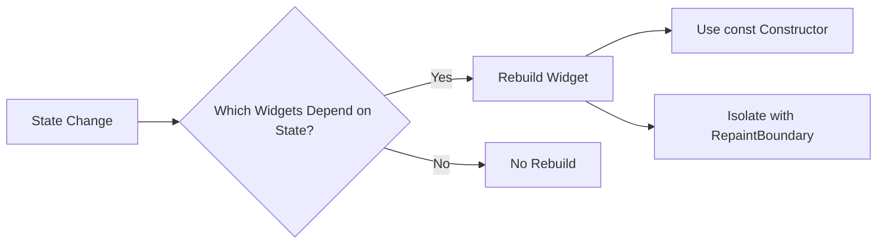

---

linkTitle: "11.2.1 Avoiding Rebuilds"
title: "Optimizing Flutter Performance: Avoiding Unnecessary Widget Rebuilds"
description: "Learn how to optimize Flutter app performance by minimizing unnecessary widget rebuilds through effective use of const constructors, RepaintBoundary, and state management techniques."
categories:
- Flutter Development
- Mobile App Optimization
- Performance Tuning
tags:
- Flutter
- Widget Rebuilds
- Performance Optimization
- State Management
- RepaintBoundary
date: 2024-10-25
type: docs
nav_weight: 1131000
---

## 11.2.1 Avoiding Rebuilds

In the world of Flutter development, achieving optimal performance is crucial for delivering smooth and responsive applications. One of the key aspects of performance optimization is minimizing unnecessary widget rebuilds. In this section, we will explore how widget rebuilds occur, strategies to prevent them, and best practices to ensure your Flutter applications run efficiently.

### Understanding Widget Rebuilds

Widget rebuilds in Flutter are a fundamental concept that directly impacts the performance of your application. Rebuilds occur when the framework needs to update the UI in response to changes in the application state or when parent widgets are updated. It's essential to distinguish between rebuilding widget configurations and re-rendering UI elements:

- **Widget Configuration Rebuilds:** This involves the creation of new widget instances due to changes in the widget tree. It doesn't necessarily mean the UI is re-rendered on the screen.
- **UI Element Re-rendering:** This is the actual process of painting pixels on the screen, which happens when the visual representation of a widget needs to change.

Rebuilds are not inherently bad, but excessive or unnecessary rebuilds can lead to performance bottlenecks, especially in complex applications with deep widget trees.

### Strategies to Minimize Unnecessary Rebuilds

To optimize your Flutter app's performance, it's crucial to employ strategies that minimize unnecessary widget rebuilds. Here are some effective techniques:

#### Use of `const` Constructors

Defining widgets as `const` is one of the simplest yet most effective ways to prevent unnecessary rebuilds. `const` widgets are immutable and can be reused by the framework, reducing the need for repeated widget creation.

**Code Example:**

```dart
Widget build(BuildContext context) {
  return const Text('Hello, Flutter!');
}
```

In this example, the `Text` widget is defined as `const`, ensuring that it doesn't rebuild unnecessarily.

#### Leveraging `RepaintBoundary`

`RepaintBoundary` is a powerful widget that isolates parts of the widget tree, preventing them from rebuilding when other widgets update. This is particularly useful for expensive widgets that don't need to change frequently.

**Code Example:**

```dart
import 'package:flutter/material.dart';

class RepaintBoundaryExample extends StatelessWidget {
  @override
  Widget build(BuildContext context) {
    return Column(
      children: [
        RepaintBoundary(
          child: ExpensiveWidget(),
        ),
        Text('Static Text'),
      ],
    );
  }
}
```

**Explanation:**

Wrapping `ExpensiveWidget` with `RepaintBoundary` ensures it doesn't rebuild when the `Column` updates its children. This isolation can significantly improve performance by reducing unnecessary rebuilds.

#### Optimal State Management

Effective state management is crucial for minimizing rebuilds. By using scoped state management, you can ensure that only the widgets that depend on specific state updates are rebuilt. Popular state management solutions like `Provider` or `Bloc` allow for granular control over state changes.

**Example:** Using `Provider` to manage state at granular levels ensures that only the necessary widgets rebuild when the state changes.

#### Memoization Techniques

Memoization involves caching computed values or widget instances to avoid repeated calculations. This technique can be particularly beneficial for expensive operations that don't need to be recalculated on every rebuild.

#### Isolate Widgets from Frequent Updates

Designing widgets to be as independent as possible helps avoid dependencies on frequently changing parent widgets. This isolation reduces the likelihood of unnecessary rebuilds cascading through the widget tree.

### Mermaid.js Diagrams

To better understand the flow of widget rebuilds and strategies to prevent them, let's look at a visual representation using Mermaid.js.

```markdown

```

This flowchart illustrates the decision-making process for widget rebuilds and highlights strategies to prevent unnecessary rebuilds.

### Best Practices

- **Use `const` Keywords:** Whenever possible, define widgets as `const` to leverage widget reuse and immutability.
- **Isolate State:** Manage state in such a way that only necessary widgets rebuild, using state management solutions that support this.
- **Simplify Widget Trees:** Keep widget trees shallow and avoid unnecessary nesting to reduce rebuild overhead.

### Common Pitfalls

- **Overusing Keys:** Improper use of keys can lead to unexpected rebuild behaviors. Keys should be used judiciously to maintain widget identity.
- **Ignoring Immutable Widgets:** Failing to use immutable widgets where applicable can result in excessive rebuilds.

### Implementation Guidance

To effectively avoid unnecessary rebuilds, developers should:

- Analyze their widget trees and identify sections that can benefit from immutability and isolation.
- Regularly profile their applications to monitor rebuild patterns and optimize accordingly.

### Conclusion

By understanding and implementing these strategies, you can significantly enhance the performance of your Flutter applications. Minimizing unnecessary rebuilds not only improves responsiveness but also leads to a smoother user experience. As you continue your Flutter journey, keep these best practices in mind and apply them to your projects for optimal performance.

## Quiz Time!



### What triggers a widget rebuild in Flutter?

- [x] State changes or parent widget updates
- [ ] Only when the app is restarted
- [ ] When the device orientation changes
- [ ] When the app is minimized

> **Explanation:** Widget rebuilds occur when there are state changes or updates in parent widgets, requiring the UI to be refreshed.

### How does using `const` constructors help in avoiding rebuilds?

- [x] `const` widgets are immutable and can be reused
- [ ] `const` widgets are faster to render
- [ ] `const` widgets automatically update themselves
- [ ] `const` widgets do not require a build method

> **Explanation:** `const` widgets are immutable, allowing the framework to reuse them without rebuilding, thus optimizing performance.

### What is the purpose of `RepaintBoundary` in Flutter?

- [x] To isolate parts of the widget tree and prevent unnecessary rebuilds
- [ ] To increase the rendering speed of widgets
- [ ] To automatically update widget states
- [ ] To handle user interactions

> **Explanation:** `RepaintBoundary` isolates parts of the widget tree, ensuring that they do not rebuild unnecessarily when other widgets update.

### Which state management solution allows for granular control over state changes?

- [x] Provider
- [ ] setState
- [ ] StatefulWidget
- [ ] StatelessWidget

> **Explanation:** Provider allows for scoped state management, ensuring that only necessary widgets rebuild when the state changes.

### What is memoization in the context of Flutter?

- [x] Caching computed values or widget instances to avoid repeated calculations
- [ ] Automatically updating widget states
- [ ] Rendering widgets faster
- [ ] Handling user interactions

> **Explanation:** Memoization involves caching values or widget instances to reduce the need for repeated calculations, optimizing performance.

### How can you isolate widgets from frequent updates?

- [x] Design widgets to be independent of frequently changing parent widgets
- [ ] Use StatefulWidget for all widgets
- [ ] Avoid using const constructors
- [ ] Use setState frequently

> **Explanation:** Designing widgets to be independent of frequently changing parent widgets helps reduce unnecessary rebuilds.

### What is a common pitfall when using keys in Flutter?

- [x] Overusing keys can lead to unexpected rebuild behaviors
- [ ] Keys make widgets slower to render
- [ ] Keys are not necessary for StatelessWidgets
- [ ] Keys should be used for all widgets

> **Explanation:** Overusing keys can lead to unexpected rebuild behaviors, so they should be used judiciously to maintain widget identity.

### What is the benefit of simplifying widget trees?

- [x] Reduces rebuild overhead and improves performance
- [ ] Makes the app look better
- [ ] Increases the number of widgets on the screen
- [ ] Automatically updates widget states

> **Explanation:** Simplifying widget trees reduces rebuild overhead, leading to improved performance and responsiveness.

### How can developers monitor rebuild patterns in their Flutter applications?

- [x] By regularly profiling their applications
- [ ] By using more StatefulWidgets
- [ ] By avoiding the use of const constructors
- [ ] By minimizing the number of widgets

> **Explanation:** Regular profiling helps developers monitor rebuild patterns and optimize their applications accordingly.

### True or False: Using `const` constructors is a best practice for optimizing Flutter performance.

- [x] True
- [ ] False

> **Explanation:** Using `const` constructors is a best practice as it allows for widget reuse and immutability, optimizing performance.


