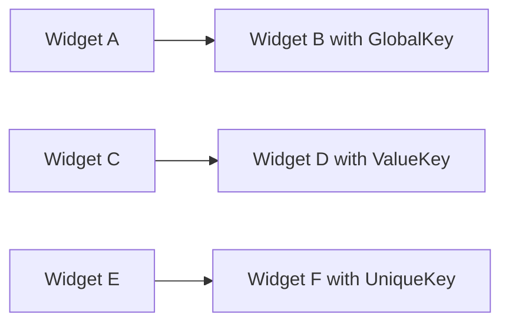

## 11.2.2 Keys in Flutter

In the world of Flutter development, keys play a crucial role in optimizing widget builds and maintaining the integrity of widget states. Understanding how to effectively use keys can significantly enhance the performance of your Flutter applications, especially when dealing with dynamic and complex user interfaces. This section delves into the concept of keys in Flutter, exploring their types, use cases, and best practices to ensure efficient widget builds.

### Understanding Keys

Keys in Flutter serve as unique identifiers assigned to widgets, elements, or semantic nodes. They are instrumental in preserving the state of widgets and optimizing the updates within the widget tree. When the widget tree undergoes changes, keys help Flutter determine which widgets have changed, moved, or been removed, allowing it to efficiently update only the necessary parts of the UI.

#### The Role of Keys

- **State Preservation:** Keys ensure that the state of a widget is preserved when its position in the widget tree changes. This is particularly important in scenarios where widgets are reordered or swapped.
- **Optimized Widget Tree Updates:** By identifying widgets uniquely, keys help Flutter minimize unnecessary rebuilds and re-renders, thus improving the performance of the application.

### Types of Keys

Flutter provides several types of keys, each serving different purposes and use cases. Understanding these types is essential for choosing the right key for your specific scenario.

#### GlobalKey

**Definition:** A `GlobalKey` is unique across the entire widget tree. It allows access to a widget's state from anywhere in the application, making it a powerful tool for scenarios that require direct interaction with widget states.

**Use Cases:**

- **Form Validation:** Accessing and validating form states across different parts of the application.
- **Direct State Access:** Retrieving and manipulating the state of a widget directly.
- **Complex Animations:** Coordinating animations involving multiple widgets.

**Code Example:**

```dart
import 'package:flutter/material.dart';

final GlobalKey<FormState> _formKey = GlobalKey<FormState>();

class FormExample extends StatelessWidget {
  @override
  Widget build(BuildContext context) {
    return Form(
      key: _formKey,
      child: Column(
        children: [
          TextFormField(
            validator: (value) {
              if (value == null || value.isEmpty) {
                return 'Please enter some text';
              }
              return null;
            },
          ),
          ElevatedButton(
            onPressed: () {
              if (_formKey.currentState!.validate()) {
                // Process data
              }
            },
            child: Text('Submit'),
          ),
        ],
      ),
    );
  }
}
```

In this example, a `GlobalKey` is used to manage the state of a form, allowing for validation and data processing.

#### LocalKey

**Definition:** A `LocalKey` is unique within a specific part of the widget tree. It is used to identify widgets within a localized scope, making it ideal for scenarios where widgets are dynamically reordered or swapped.

**Subtypes:**

- **ValueKey:** Identifies widgets based on a specific value.
- **ObjectKey:** Identifies widgets based on a specific object.
- **UniqueKey:** Generates a unique identifier each time it's instantiated.

**Use Cases:**

- **Reordering Widgets:** Maintaining widget states when their positions change within lists.
- **Swapping Widgets:** Ensuring smooth transitions when widgets swap positions.

**Code Example with ValueKey:**

```dart
import 'package:flutter/material.dart';

class ReorderableListExample extends StatefulWidget {
  @override
  _ReorderableListExampleState createState() => _ReorderableListExampleState();
}

class _ReorderableListExampleState extends State<ReorderableListExample> {
  final List<String> items = ['Apple', 'Banana', 'Cherry', 'Date'];

  @override
  Widget build(BuildContext context) {
    return Scaffold(
      appBar: AppBar(title: Text('Reorderable List Example')),
      body: ReorderableListView(
        children: [
          for (final item in items)
            ListTile(
              key: ValueKey(item),
              title: Text(item),
            ),
        ],
        onReorder: (oldIndex, newIndex) {
          setState(() {
            if (newIndex > oldIndex) {
              newIndex -= 1;
            }
            final movedItem = items.removeAt(oldIndex);
            items.insert(newIndex, movedItem);
          });
        },
      ),
    );
  }
}
```

**Explanation:** This example demonstrates the use of `ValueKey` to uniquely identify list items in a `ReorderableListView`. The `ValueKey` ensures that the state of each list item is preserved during reordering, allowing for a seamless user experience.

### Mermaid.js Diagrams

To better understand how different types of keys affect the widget tree and state preservation, consider the following diagram:

```markdown

```

This diagram illustrates the hierarchical relationship between widgets and how keys are used to uniquely identify and manage their states.

### Best Practices

- **Use Keys Sparingly:** Only use keys when necessary to avoid unnecessary complexity in your widget tree.
- **Prefer LocalKeys Over GlobalKeys:** Opt for `LocalKey` variants unless a `GlobalKey` is explicitly required for your use case.
- **Maintain Unique Identifiers:** Ensure that keys are unique within their appropriate scope to prevent unexpected widget behavior and state management issues.

### Common Pitfalls

- **Overusing GlobalKeys:** Excessive use of `GlobalKey` can lead to performance overhead and complicate widget relationships. Use them judiciously and only when necessary.
- **Duplicated Keys:** Assigning the same key to multiple widgets within the same scope can cause Flutter to mismanage widget states, leading to unexpected behavior.

### Implementation Guidance

To effectively use keys in your Flutter applications, consider the following guidelines:

- **Understand When to Use Each Type of Key:** Familiarize yourself with the different types of keys and their use cases to make informed decisions about which key to use in specific scenarios.
- **Review Key Usage in Complex Widget Trees:** Regularly review your widget tree to ensure that keys are used appropriately and efficiently, especially in complex and dynamic UIs.

By understanding and implementing keys effectively, you can optimize the performance of your Flutter applications, ensuring smooth and efficient widget builds and state management.

## Quiz Time!



### What is the primary role of keys in Flutter?

- [x] Preserving widget states and optimizing widget tree updates
- [ ] Enhancing the visual appearance of widgets
- [ ] Managing network requests
- [ ] Improving the security of the application

> **Explanation:** Keys in Flutter are used to preserve widget states and optimize widget tree updates, ensuring efficient performance.

### Which type of key is unique across the entire widget tree?

- [x] GlobalKey
- [ ] LocalKey
- [ ] ValueKey
- [ ] UniqueKey

> **Explanation:** GlobalKey is unique across the entire widget tree, allowing access to a widget's state from anywhere.

### What is a common use case for GlobalKey?

- [x] Form validation
- [ ] Reordering list items
- [ ] Styling widgets
- [ ] Managing network requests

> **Explanation:** GlobalKey is commonly used for form validation, allowing access to the form's state from anywhere in the application.

### Which subtype of LocalKey identifies widgets based on a specific value?

- [x] ValueKey
- [ ] ObjectKey
- [ ] UniqueKey
- [ ] GlobalKey

> **Explanation:** ValueKey identifies widgets based on a specific value, making it ideal for scenarios where widgets are reordered or swapped.

### What is a potential pitfall of overusing GlobalKeys?

- [x] Performance overhead and complicated widget relationships
- [ ] Improved security
- [ ] Enhanced visual appearance
- [ ] Simplified code structure

> **Explanation:** Overusing GlobalKeys can lead to performance overhead and complicate widget relationships, so they should be used judiciously.

### Which key subtype generates a unique identifier each time it's instantiated?

- [x] UniqueKey
- [ ] ValueKey
- [ ] ObjectKey
- [ ] GlobalKey

> **Explanation:** UniqueKey generates a unique identifier each time it's instantiated, ensuring uniqueness within the widget tree.

### Why should keys be used sparingly?

- [x] To avoid unnecessary complexity in the widget tree
- [ ] To enhance the visual appearance of widgets
- [ ] To improve network performance
- [ ] To increase application security

> **Explanation:** Keys should be used sparingly to avoid unnecessary complexity in the widget tree, ensuring efficient performance.

### What is the recommended practice when choosing between GlobalKey and LocalKey?

- [x] Prefer LocalKeys over GlobalKeys unless a GlobalKey is explicitly required
- [ ] Always use GlobalKeys for better performance
- [ ] Use LocalKeys only for styling purposes
- [ ] Avoid using keys altogether

> **Explanation:** It is recommended to prefer LocalKeys over GlobalKeys unless a GlobalKey is explicitly required for the use case.

### What can happen if the same key is assigned to multiple widgets within the same scope?

- [x] Flutter may mismanage widget states, leading to unexpected behavior
- [ ] The application will run faster
- [ ] The visual appearance of widgets will improve
- [ ] Network requests will be optimized

> **Explanation:** Assigning the same key to multiple widgets within the same scope can cause Flutter to mismanage widget states, leading to unexpected behavior.

### True or False: Keys are only necessary for complex widget trees.

- [x] False
- [ ] True

> **Explanation:** Keys are not only necessary for complex widget trees; they can be useful in various scenarios to preserve widget states and optimize performance.


