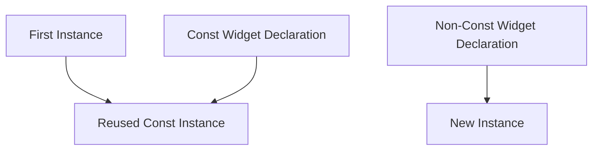

## 11.2.3 The `const` Keyword

In the world of Flutter development, performance optimization is a critical aspect that can significantly impact the user experience. One of the most powerful yet often underutilized tools in a Flutter developer's arsenal is the `const` keyword. Understanding and effectively using `const` can lead to more efficient widget builds, reduced memory usage, and smoother app performance. This section delves into the intricacies of the `const` keyword, its benefits, and how to leverage it for optimal performance in your Flutter applications.

### Understanding `const` in Flutter

The `const` keyword in Dart is used to define compile-time constants. When a widget is marked as `const`, it becomes immutable, meaning its state cannot change once it is created. This immutability allows Flutter to optimize the widget's lifecycle, as `const` widgets can be reused without being rebuilt.

#### Key Characteristics of `const`:

- **Compile-Time Constant:** A `const` object is evaluated at compile time, which means its value is determined before the app runs.
- **Immutability:** Once created, the state of a `const` widget cannot be altered, ensuring consistency and reliability.
- **Reusability:** `const` widgets are instantiated once and can be reused across the widget tree, reducing the need for repeated instantiation and rebuilding.

### Benefits of Using `const`

Leveraging the `const` keyword offers several advantages that contribute to the overall performance and reliability of a Flutter application.

#### Performance Optimization

- **Reduced Memory Usage:** Since `const` widgets are instantiated only once, they consume less memory compared to non-const widgets that are rebuilt every time the widget tree is updated.
- **Lower CPU Overhead:** By minimizing the number of widget rebuilds, `const` reduces the computational load on the CPU, leading to faster and more efficient rendering.

#### Compile-Time Safety

- **Ensures Immutability:** By enforcing immutability, `const` prevents unintended modifications to widget properties, reducing the risk of bugs and inconsistencies.
- **Early Error Detection:** Compile-time evaluation allows for early detection of errors, ensuring that only valid constant expressions are used.

#### Improved Widget Recycling

- **Efficient Management:** Flutter can efficiently manage and recycle `const` widgets, leading to smoother UI updates and transitions.
- **Consistent Behavior:** The immutable nature of `const` widgets ensures consistent behavior across different parts of the application.

### Code Example

Let's explore a simple example that demonstrates the use of `const` in a Flutter widget.

```dart
import 'package:flutter/material.dart';

class ConstExample extends StatelessWidget {
  @override
  Widget build(BuildContext context) {
    return Scaffold(
      appBar: const AppBar(title: Text('Const Example')),
      body: const Center(
        child: Text('This text widget is const.'),
      ),
    );
  }
}
```

#### Explanation:

- **AppBar and Text Widgets:** In the example above, both the `AppBar` and `Text` widgets are defined as `const`. This allows Flutter to optimize their instantiation and reuse, as these widgets do not change dynamically.
- **Immutable Structure:** By marking these widgets as `const`, we ensure that they remain unchanged throughout the app's lifecycle, enhancing performance and reliability.

### Using `const` Constructors

To fully leverage the benefits of `const`, it's important to use `const` constructors wherever possible. This involves defining widgets and other objects with `const` constructors, ensuring that they are evaluated at compile time.

#### Code Example:

```dart
const SizedBox(height: 20);
```

- **SizedBox Widget:** The `SizedBox` widget in this example is defined using a `const` constructor. This ensures that the widget is instantiated only once and can be reused efficiently.

### Mermaid.js Diagrams

To better understand how `const` widgets are instantiated and reused within the widget tree, let's visualize the process using a Mermaid.js diagram.

```markdown

```

#### Diagram Explanation:

- **First Instance:** Represents the initial instantiation of a `const` widget.
- **Reused Const Instance:** Shows how the same instance is reused across the widget tree.
- **Const Widget Declaration:** Highlights the declaration of a `const` widget.
- **Non-Const Widget Declaration:** Illustrates the creation of a new instance for non-const widgets, emphasizing the performance benefits of using `const`.

### Best Practices

To maximize the benefits of `const`, consider the following best practices:

- **Maximize `const` Usage:** Use `const` wherever possible, especially for widgets that do not change dynamically. This includes static text, icons, and layout elements.
- **Immutable Objects:** Prefer immutable objects and `const` constructors to enhance widget recycling and reduce rebuilds.
- **Refactor for `const`:** Regularly review and refactor widget declarations to include `const` where applicable, ensuring optimal performance.

### Common Pitfalls

While `const` offers significant advantages, there are common pitfalls to be aware of:

- **Forgetting `const`:** Missing out on the `const` keyword can lead to unnecessary widget rebuilds and reduced performance. Always check if a widget can be made `const`.
- **`const` Misuse:** Attempting to make mutable widgets `const` can cause compile-time errors. Ensure that only truly immutable widgets are marked as `const`.

### Implementation Guidance

To effectively implement `const` in your Flutter applications, consider the following guidance:

- **Adopt a Habit:** Encourage developers to adopt a habit of prefixing widgets with `const` when their parameters are also `const`. This practice can significantly enhance performance.
- **IDE Features:** Recommend using IDE features or plugins that highlight opportunities to convert widgets to `const`. These tools can automate the process and ensure consistent usage across the codebase.

### Conclusion

The `const` keyword is a powerful tool in Flutter that can significantly enhance the performance and reliability of your applications. By understanding and effectively using `const`, you can reduce widget rebuilds, optimize memory usage, and ensure consistent behavior across your app. Remember to regularly review your code for opportunities to use `const`, and leverage IDE tools to automate the process. With these practices in place, you'll be well on your way to building efficient and responsive Flutter applications.

## Quiz Time!



### What is the primary benefit of using the `const` keyword in Flutter?

- [x] Reduces widget rebuilds and optimizes performance
- [ ] Allows widgets to be mutable
- [ ] Increases memory usage
- [ ] Enables dynamic widget updates

> **Explanation:** The `const` keyword reduces widget rebuilds by making widgets immutable and reusable, thus optimizing performance.

### How does the `const` keyword enhance compile-time safety?

- [x] By ensuring immutability and preventing unintended modifications
- [ ] By allowing runtime changes to widget properties
- [ ] By increasing the complexity of widget builds
- [ ] By enabling dynamic state changes

> **Explanation:** `const` ensures immutability, preventing unintended modifications and allowing for compile-time error detection.

### What happens when a widget is marked as `const`?

- [x] It is instantiated once and can be reused
- [ ] It becomes mutable and can change over time
- [ ] It requires more memory for each instance
- [ ] It cannot be used in the widget tree

> **Explanation:** A `const` widget is instantiated once and reused, reducing memory usage and improving performance.

### Which of the following is a common pitfall when using `const`?

- [x] Forgetting to use `const` where applicable
- [ ] Using `const` for mutable widgets
- [ ] Increasing widget rebuilds
- [ ] Reducing compile-time safety

> **Explanation:** Forgetting to use `const` can lead to unnecessary widget rebuilds and reduced performance.

### What is the role of `const` constructors in Flutter?

- [x] To ensure widgets are evaluated at compile time
- [ ] To allow widgets to be mutable
- [ ] To increase runtime errors
- [ ] To enable dynamic state changes

> **Explanation:** `const` constructors ensure widgets are evaluated at compile time, enhancing performance and immutability.

### How can developers identify opportunities to use `const` in their code?

- [x] By using IDE features or plugins that highlight `const` opportunities
- [ ] By manually checking each widget
- [ ] By avoiding `const` usage
- [ ] By using runtime analysis tools

> **Explanation:** IDE features or plugins can automate the process of identifying `const` opportunities, ensuring consistent usage.

### What is a key characteristic of a `const` widget?

- [x] Immutability
- [ ] Mutability
- [ ] Dynamic state changes
- [ ] Increased memory usage

> **Explanation:** A `const` widget is immutable, meaning its state cannot change once created.

### How does `const` contribute to improved widget recycling?

- [x] By allowing widgets to be reused without rebuilding
- [ ] By increasing the number of widget instances
- [ ] By enabling dynamic state changes
- [ ] By reducing compile-time safety

> **Explanation:** `const` allows widgets to be reused without rebuilding, leading to improved widget recycling and performance.

### What is a benefit of using `const` in terms of memory usage?

- [x] Reduces memory usage by reusing widget instances
- [ ] Increases memory usage by creating new instances
- [ ] Allows for dynamic memory allocation
- [ ] Requires more memory for each widget

> **Explanation:** `const` reduces memory usage by reusing widget instances, minimizing the need for repeated instantiation.

### True or False: `const` widgets can be modified at runtime.

- [ ] True
- [x] False

> **Explanation:** `const` widgets are immutable and cannot be modified at runtime, ensuring consistent behavior.


