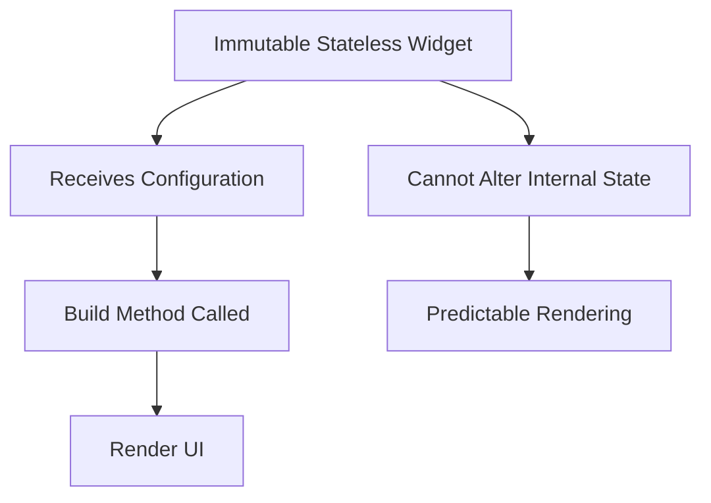

## 11.2.4 Immutability and Stateless Widgets

In the world of Flutter development, creating efficient and performant applications is paramount. One of the key strategies to achieve this is through the use of immutability and stateless widgets. This section delves into the concept of immutability, its role in Flutter, and how stateless widgets inherently embody this principle to optimize performance.

### Role of Immutability

Immutability refers to the practice of creating objects that cannot be modified after they are created. In programming, immutable objects are those whose state cannot change once they have been instantiated. This concept is fundamental in functional programming paradigms and has significant implications for building efficient and predictable applications.

#### Benefits of Immutability

- **Predictability:** Immutable objects ensure that once data is set, it remains constant throughout the lifecycle of the application. This predictability simplifies debugging and testing.
- **Concurrency Safety:** Since immutable objects cannot be altered, they are inherently thread-safe. This reduces the complexity of managing state in multi-threaded environments.
- **Performance Optimization:** Immutable objects can be easily cached and reused, reducing the need for redundant computations and enhancing performance.

In Flutter, immutability plays a crucial role in widget rendering. By ensuring that widgets are immutable, Flutter can efficiently determine when a widget needs to be rebuilt, thus optimizing the rendering pipeline.

### Stateless Widgets and Immutability

Stateless widgets in Flutter are a perfect embodiment of immutability. These widgets do not manage any internal state and rely solely on their configuration to render the UI. This makes them ideal candidates for scenarios where the UI does not change in response to user interactions or other events.

#### Code Example: ImmutableCard

Consider the following example of a stateless widget:

```dart
import 'package:flutter/material.dart';

class ImmutableCard extends StatelessWidget {
  final String title;
  final String subtitle;

  const ImmutableCard({Key? key, required this.title, required this.subtitle}) : super(key: key);

  @override
  Widget build(BuildContext context) {
    return Card(
      child: ListTile(
        title: Text(title),
        subtitle: Text(subtitle),
      ),
    );
  }
}
```

##### Explanation

- **Stateless Nature:** The `ImmutableCard` widget is stateless, meaning it does not hold any internal state. It simply takes `title` and `subtitle` as inputs and renders them.
- **Immutability:** The `title` and `subtitle` are declared as `final`, reinforcing the immutability of the widget's configuration. Once set, these values cannot be changed, ensuring consistent rendering.

### Benefits of Immutability in Stateless Widgets

#### Performance Gains

- **Reduced Rebuilds:** Immutable widgets can be easily compared and reused, minimizing the need for unnecessary widget rebuilds. This results in faster UI updates and smoother animations.
- **Efficient Caching:** Since immutable objects do not change, they can be cached effectively, reducing the overhead of repeated computations.

#### Thread Safety

Immutable objects are inherently thread-safe, which means they can be shared across different parts of the application without the risk of data races or concurrency issues. This is particularly beneficial in Flutter, where asynchronous operations are common.

#### Ease of Reasoning

Immutability simplifies understanding the flow of data and widget interactions within the app. Developers can reason about the application's behavior more easily, as they do not have to account for unexpected changes in state.

### Mermaid.js Diagrams: Immutability Flowchart

To visualize how stateless widgets leverage immutability, consider the following flowchart:



#### Diagram Explanation

- **Immutable Stateless Widget:** Represents a widget that does not manage internal state.
- **Receives Configuration:** The widget receives its configuration through constructor parameters.
- **Build Method Called:** The `build` method is invoked to render the UI based on the configuration.
- **Cannot Alter Internal State:** The widget cannot change its state, ensuring consistency.
- **Predictable Rendering:** The immutability guarantees predictable rendering, as the widget's output is solely determined by its input.

### Best Practices

#### Use Stateless Widgets When Possible

Favor stateless widgets over stateful ones when the widget does not need to manage internal state. This reduces complexity and improves performance.

#### Promote Data Immutability

Pass immutable data structures to widgets to maintain consistency and prevent unintended side effects. This ensures that widgets render predictably and efficiently.

#### Leverage `const` Keywords

Combine immutability with `const` constructors for optimal performance. Using `const` ensures that widgets are instantiated only once and reused, further enhancing performance.

### Common Pitfalls

#### Overusing Stateless Widgets

While stateless widgets are beneficial, over-reliance on them can lead to convoluted state management. It's important to assess whether a widget should be stateless or stateful based on its need to manage state.

#### Mutable Data Structures

Passing mutable objects to stateless widgets can undermine the benefits of immutability and lead to unpredictable UI behaviors. Always strive to use immutable data structures.

### Implementation Guidance

When designing widgets, consider the following:

- **Assess State Management Needs:** Determine whether a widget should be stateless or stateful based on its interaction with the application's state.
- **Design with Immutability in Mind:** Ensure that widgets are purely functions of their inputs, avoiding side effects and mutable state.

By embracing immutability and leveraging stateless widgets, developers can create Flutter applications that are not only efficient and performant but also easier to maintain and reason about.

### Conclusion

Immutability and stateless widgets are powerful tools in the Flutter developer's arsenal. By understanding and applying these concepts, you can optimize your application's performance, improve its reliability, and simplify its architecture. As you continue your Flutter journey, consider how immutability can enhance your development process and lead to more robust applications.

## Quiz Time!



### What is immutability in the context of programming?

- [x] The practice of creating objects that cannot be modified after they are created.
- [ ] The ability to change object properties at runtime.
- [ ] A method of optimizing code for performance.
- [ ] A design pattern for managing state.

> **Explanation:** Immutability refers to creating objects that cannot be modified after creation, ensuring predictable and efficient behavior.

### How do stateless widgets embody immutability?

- [x] They do not manage any internal state and rely solely on their configuration to render UI.
- [ ] They can change their internal state based on user interactions.
- [ ] They store mutable data that can be altered.
- [ ] They use complex algorithms to manage state.

> **Explanation:** Stateless widgets do not manage internal state, making them inherently immutable and reliant on their configuration.

### What is a key benefit of using immutable objects in Flutter?

- [x] They are inherently thread-safe, reducing concurrency issues.
- [ ] They allow for dynamic UI changes without rebuilding.
- [ ] They require more memory, enhancing performance.
- [ ] They complicate the debugging process.

> **Explanation:** Immutable objects are thread-safe, which simplifies concurrency management and reduces potential issues.

### In the provided code example, what ensures the immutability of the `ImmutableCard` widget?

- [x] The `title` and `subtitle` are declared as `final`.
- [ ] The widget uses a `StatefulWidget` class.
- [ ] The widget rebuilds on every state change.
- [ ] The widget uses mutable data structures.

> **Explanation:** Declaring `title` and `subtitle` as `final` ensures they cannot be changed after being set, maintaining immutability.

### Why is it beneficial to use `const` constructors in Flutter?

- [x] They ensure widgets are instantiated only once and reused.
- [ ] They allow for mutable state management.
- [ ] They increase the complexity of the widget tree.
- [ ] They prevent widgets from being cached.

> **Explanation:** `const` constructors enable widgets to be instantiated once and reused, optimizing performance.

### What is a potential pitfall of overusing stateless widgets?

- [x] It can lead to convoluted state management.
- [ ] It simplifies the application's architecture.
- [ ] It increases the need for mutable data structures.
- [ ] It enhances the widget's ability to manage state.

> **Explanation:** Overusing stateless widgets can complicate state management when stateful behavior is necessary.

### How can mutable data structures affect stateless widgets?

- [x] They can undermine the benefits of immutability and lead to unpredictable UI behaviors.
- [ ] They enhance the performance of the widget.
- [ ] They simplify the widget's configuration.
- [ ] They ensure the widget remains thread-safe.

> **Explanation:** Mutable data structures can lead to unpredictable behaviors, negating the benefits of immutability.

### What should developers assess when designing widgets?

- [x] Whether a widget should be stateless or stateful based on its need to manage state.
- [ ] The number of animations the widget can handle.
- [ ] The complexity of the widget's build method.
- [ ] The widget's ability to store mutable data.

> **Explanation:** Developers should determine if a widget needs to manage state to decide between stateless and stateful.

### What is a key advantage of immutability in widget rendering?

- [x] It ensures consistent and predictable rendering.
- [ ] It allows for dynamic state changes.
- [ ] It increases the complexity of the widget tree.
- [ ] It requires more memory for caching.

> **Explanation:** Immutability ensures that widgets render consistently and predictably, as their output is determined by their input.

### True or False: Stateless widgets can change their internal state based on user interactions.

- [x] False
- [ ] True

> **Explanation:** Stateless widgets cannot change their internal state; they rely on their configuration to render UI.


