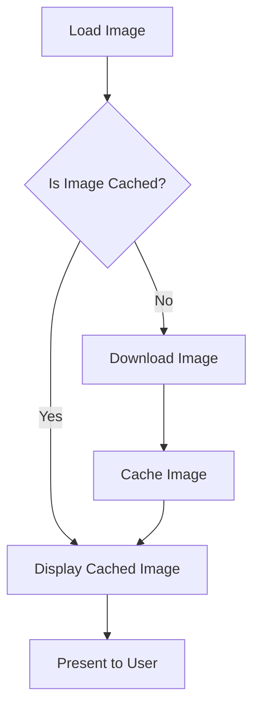

## 11.3.1 Managing Images and Assets

In the realm of mobile app development, managing images and assets efficiently is crucial for optimizing performance and ensuring a seamless user experience. Flutter, with its rich set of tools and libraries, provides developers with the means to handle images and assets effectively. This section delves into best practices for optimizing image loading, caching, and compression, alongside strategies for organizing and managing assets in Flutter applications.

### Optimizing Image Loading

Efficient image loading is foundational to creating responsive and performant applications. By choosing the right image formats and leveraging caching mechanisms, developers can significantly enhance app performance.

#### Choosing the Right Image Format

Understanding the differences between raster and vector images is essential for selecting the appropriate format for your application.

- **Raster Images (e.g., PNG, JPEG):** These are pixel-based images, suitable for complex images like photographs. However, they can be large in file size, especially at higher resolutions.
- **Vector Images (e.g., SVG):** These are resolution-independent and scalable, making them ideal for icons and simple illustrations. They maintain quality at any size but are not suitable for detailed images like photos.

**Best Practices:**

- Use **vector images** like SVG for scalable graphics and simple illustrations. This ensures that images remain crisp on all screen sizes and resolutions.
- Use **compressed raster formats** like WebP for photos to balance quality and file size. WebP offers superior compression, reducing file size without significant loss of quality.

#### Using Image Caching

Caching images is a powerful technique to improve load times and reduce network requests. The `cached_network_image` package in Flutter simplifies this process.

**Installation:**

Add the package to your `pubspec.yaml` file:

```yaml
dependencies:
  cached_network_image: ^3.2.3
```

**Code Example:**

```dart
import 'package:flutter/material.dart';
import 'package:cached_network_image/cached_network_image.dart';

class CachedImageExample extends StatelessWidget {
  final String imageUrl = 'https://example.com/image.jpg';

  @override
  Widget build(BuildContext context) {
    return Scaffold(
      appBar: AppBar(title: Text('Cached Network Image')),
      body: Center(
        child: CachedNetworkImage(
          imageUrl: imageUrl,
          placeholder: (context, url) => CircularProgressIndicator(),
          errorWidget: (context, url, error) => Icon(Icons.error),
        ),
      ),
    );
  }
}
```

**Explanation:**

- The `CachedNetworkImage` widget loads and caches images from the network. It displays a placeholder while the image is loading and an error icon if the image fails to load.

#### Lazy Loading Images

Lazy loading defers the loading of images until they are about to appear in the viewport. This technique saves bandwidth and improves initial load times.

**Code Example:**

Using `ListView.builder` with `CachedNetworkImage` inherently supports lazy loading by loading images as they are built:

```dart
ListView.builder(
  itemCount: imageUrls.length,
  itemBuilder: (context, index) {
    return CachedNetworkImage(
      imageUrl: imageUrls[index],
      placeholder: (context, url) => CircularProgressIndicator(),
      errorWidget: (context, url, error) => Icon(Icons.error),
    );
  },
)
```

#### Performance Optimization

Optimizing images for performance involves several strategies:

- **Image Compression:** Use tools like [tinyjpg.com](https://tinyjpg.com/) or [ImageOptim](https://imageoptim.com/) to compress images before including them in the app. This reduces file size without compromising quality.
- **Resize Images Appropriately:** Ensure that images are sized correctly for their display contexts to prevent unnecessary scaling and memory usage.
- **Use `flutter_image_compress` for On-the-Fly Compression:**

**Installation:**

Add the package to your `pubspec.yaml` file:

```yaml
dependencies:
  flutter_image_compress: ^1.1.0
```

**Code Example:**

```dart
import 'package:flutter_image_compress/flutter_image_compress.dart';

Future<List<int>?> compressImage(List<int> imageBytes) async {
  var result = await FlutterImageCompress.compressWithList(
    imageBytes,
    minWidth: 800,
    minHeight: 600,
    quality: 80,
  );
  return result;
}
```

**Explanation:**

- This code demonstrates how to compress image data dynamically to reduce memory usage and improve performance.

### Asset Management Flowchart

To illustrate the process of loading, caching, and displaying images efficiently in a Flutter app, consider the following flowchart:



### Best Practices

- **Use `const` and `final`:** Define image assets as `const` or `final` to prevent unnecessary rebuilds, which can improve performance.
- **Avoid Excessive Asset Sizes:** Keep asset sizes as small as possible without compromising quality to reduce app size and memory usage.
- **Organize Assets Logically:** Structure asset directories in a logical manner (e.g., by feature or usage) to facilitate easy management and retrieval.

### Common Pitfalls

- **Large Image Files:** Including high-resolution images without optimization can lead to increased app size and sluggish performance.
- **Overlapping Images:** Multiple layers of images can cause excessive overdraw, impacting rendering performance.

### Implementation Guidance

Encourage the use of image optimization tools and techniques to balance quality and performance. Regularly review asset usage and optimize images centrally to maintain consistency. By following these guidelines, developers can create Flutter applications that are both performant and visually appealing.

### Conclusion

Managing images and assets effectively is a critical aspect of Flutter development. By optimizing image formats, leveraging caching, and employing lazy loading techniques, developers can significantly enhance the performance of their applications. Remember to regularly review and optimize your assets to ensure a seamless user experience.

## Quiz Time!



### What is the primary advantage of using vector images like SVG in Flutter applications?

- [x] They are resolution-independent and scalable.
- [ ] They are better for complex images like photographs.
- [ ] They load faster than raster images.
- [ ] They are always smaller in file size than raster images.

> **Explanation:** Vector images are resolution-independent, meaning they can scale to any size without losing quality, making them ideal for icons and simple illustrations.

### Which package is recommended for caching network images in Flutter?

- [x] cached_network_image
- [ ] flutter_image_compress
- [ ] image_picker
- [ ] path_provider

> **Explanation:** The `cached_network_image` package is specifically designed for caching images downloaded from the network, improving load times and reducing network requests.

### What is lazy loading in the context of image management?

- [x] Deferring the loading of images until they are about to appear in the viewport.
- [ ] Loading all images at once to improve performance.
- [ ] Using low-resolution images initially and replacing them with high-resolution versions.
- [ ] Caching images locally to reduce network requests.

> **Explanation:** Lazy loading defers the loading of images until they are about to appear in the viewport, saving bandwidth and improving initial load times.

### Which tool can be used to compress images before including them in a Flutter app?

- [x] tinyjpg.com
- [ ] flutter_image_compress
- [ ] cached_network_image
- [ ] image_picker

> **Explanation:** Tools like [tinyjpg.com](https://tinyjpg.com/) are used to compress images before including them in an app, reducing file size without compromising quality.

### What is the purpose of using the `flutter_image_compress` package?

- [x] To compress image data dynamically to reduce memory usage and improve performance.
- [ ] To cache images downloaded from the network.
- [ ] To pick images from the device's gallery.
- [ ] To provide a placeholder for images while they are loading.

> **Explanation:** The `flutter_image_compress` package is used to compress image data dynamically, which helps reduce memory usage and improve performance.

### What is a common pitfall when managing images in Flutter applications?

- [x] Including high-resolution images without optimization.
- [ ] Using vector images for simple illustrations.
- [ ] Caching images locally.
- [ ] Organizing assets logically.

> **Explanation:** Including high-resolution images without optimization can lead to increased app size and sluggish performance.

### How can you prevent unnecessary rebuilds in Flutter when managing image assets?

- [x] Define image assets as `const` or `final`.
- [ ] Use high-resolution images.
- [ ] Avoid caching images.
- [ ] Load all images at once.

> **Explanation:** Defining image assets as `const` or `final` helps prevent unnecessary rebuilds, improving performance.

### What is the benefit of organizing asset directories logically in a Flutter project?

- [x] It facilitates easy management and retrieval of assets.
- [ ] It reduces the overall app size.
- [ ] It improves the visual quality of images.
- [ ] It automatically compresses images.

> **Explanation:** Organizing asset directories logically makes it easier to manage and retrieve assets, which is beneficial for maintaining a clean and efficient project structure.

### Which image format is recommended for photos to balance quality and file size?

- [x] WebP
- [ ] SVG
- [ ] PNG
- [ ] BMP

> **Explanation:** WebP offers superior compression for photos, reducing file size without significant loss of quality, making it a good choice for balancing quality and file size.

### True or False: Vector images are suitable for detailed images like photographs.

- [ ] True
- [x] False

> **Explanation:** Vector images are not suitable for detailed images like photographs because they are resolution-independent and best suited for icons and simple illustrations.


