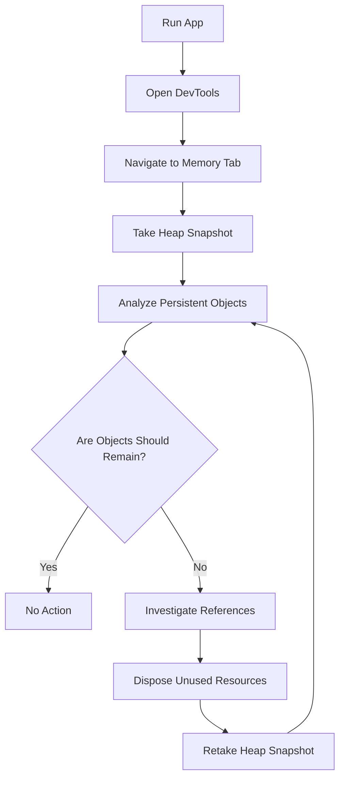

## 11.3.2 Memory Leak Detection

In the realm of mobile app development, efficient memory management is crucial for ensuring smooth performance and preventing application crashes. Memory leaks, which occur when allocated memory is not released after it is no longer needed, can lead to increased memory consumption and potential app crashes. In this section, we will delve into the intricacies of memory leak detection in Flutter, exploring common causes, identification techniques, and best practices for resolution.

### Understanding Memory Leaks in Flutter

Memory leaks in Flutter can be particularly insidious, as they often occur silently and gradually degrade application performance. A memory leak happens when an application retains references to objects that are no longer needed, preventing the memory from being reclaimed by the garbage collector. This can result in increased memory usage and, eventually, application crashes if the system runs out of memory.

#### Common Causes of Memory Leaks in Flutter

- **Unclosed Streams and Stream Subscriptions:** Streams are a powerful tool in Flutter for handling asynchronous data. However, if a stream subscription is not properly canceled, it can lead to memory leaks as the stream continues to hold references to the listener.
  
- **Retaining References to Disposed Objects:** When objects such as controllers or listeners are not disposed of correctly, they can linger in memory, causing leaks. This is especially common with `AnimationController` and `TextEditingController`.

- **Improper Disposal of Controllers and Listeners:** Failing to dispose of controllers and listeners in the `dispose` method of a widget can lead to memory leaks, as these objects may continue to hold onto resources.

### Identifying Memory Leaks

Detecting memory leaks requires careful monitoring and analysis of your application's memory usage. Flutter provides powerful tools such as Flutter DevTools to help developers identify and resolve memory leaks.

#### Using Flutter DevTools

Flutter DevTools is a suite of performance and debugging tools that can be used to monitor memory usage, track object allocations, and identify objects that persist unexpectedly.

- **Memory Tab:** This tab allows you to monitor memory usage over time, track object allocations, and identify objects that are not being released as expected.

- **Heap Snapshot:** By capturing a snapshot of the heap, you can analyze memory allocations and detect leaks by identifying objects that persist longer than necessary.

##### Code Example: Retaining a Stream Subscription

Let's explore a common scenario where a memory leak occurs due to an unclosed stream subscription:

```dart
import 'package:flutter/material.dart';

class MemoryLeakExample extends StatefulWidget {
  @override
  _MemoryLeakExampleState createState() => _MemoryLeakExampleState();
}

class _MemoryLeakExampleState extends State<MemoryLeakExample> {
  late Stream<int> _stream;
  late StreamSubscription<int> _subscription;

  @override
  void initState() {
    super.initState();
    _stream = Stream.periodic(Duration(seconds: 1), (count) => count);
    _subscription = _stream.listen((value) {
      print('Stream value: $value');
    });
    // Missing _subscription.cancel() in dispose leads to memory leak
  }

  @override
  void dispose() {
    // Uncommenting the following line fixes the leak
    // _subscription.cancel();
    super.dispose();
  }

  @override
  Widget build(BuildContext context) {
    return Scaffold(
      appBar: AppBar(title: Text('Memory Leak Example')),
      body: Center(child: Text('Check memory usage in DevTools')),
    );
  }
}
```

**Explanation:**
- This example demonstrates a stateful widget that listens to a stream but fails to cancel the subscription in the `dispose` method, leading to a memory leak. The stream continues to emit values, and the subscription holds onto resources that should be released.

#### Mermaid.js Diagram: Memory Leak Detection Workflow

To better understand the process of identifying and resolving memory leaks, let's visualize the workflow using a Mermaid.js diagram.



### Best Practices for Preventing Memory Leaks

To prevent memory leaks in your Flutter applications, consider the following best practices:

- **Always Dispose Controllers and Listeners:** Ensure that controllers (e.g., `AnimationController`, `TextEditingController`) are properly disposed of in the `dispose` method to release resources.

- **Manage Stream Subscriptions:** Cancel stream subscriptions in `dispose` to prevent lingering references and ensure that resources are released.

- **Use `AutomaticKeepAliveClientMixin` Wisely:** While useful for preserving widget states, misuse can lead to memory leaks by retaining widget instances unnecessarily.

- **Avoid Retaining Unnecessary References:** Be cautious of holding onto references of widget states or large objects beyond their lifecycle to prevent memory leaks.

### Common Pitfalls and Challenges

- **Forgetting to Cancel Subscriptions:** Unclosed streams and subscriptions can prevent memory from being reclaimed, leading to memory leaks.

- **Leaking Context References:** Holding references to `BuildContext` or other objects that outlive the widget can cause leaks, as these references may prevent the garbage collector from reclaiming memory.

### Implementation Guidance

To effectively manage resources and prevent memory leaks, consider the following implementation guidance:

- **Adopt Code Review Practices:** Encourage code reviews focused on resource management to identify potential memory leaks and ensure best practices are followed.

- **Use Automated Tools and Linters:** Leverage automated tools or linters that can detect potential memory leaks in the codebase, providing an additional layer of protection.

### Conclusion

Memory leak detection and resolution are critical components of performance optimization in Flutter applications. By understanding common causes, utilizing tools like Flutter DevTools, and adhering to best practices, you can effectively manage resources and ensure your applications run smoothly. Remember to regularly monitor memory usage, dispose of resources properly, and remain vigilant for potential leaks to maintain optimal performance.

## Quiz Time!



### What is a memory leak in Flutter?

- [x] A situation where allocated memory is not released after it is no longer needed.
- [ ] A bug that causes the app to crash immediately.
- [ ] A feature that improves app performance.
- [ ] A method for optimizing CPU usage.

> **Explanation:** A memory leak occurs when allocated memory is not released after it is no longer needed, leading to increased memory consumption and potential app crashes.

### Which of the following is a common cause of memory leaks in Flutter?

- [x] Unclosed streams and stream subscriptions.
- [ ] Using too many widgets.
- [ ] Overusing setState().
- [ ] Excessive use of animations.

> **Explanation:** Unclosed streams and stream subscriptions can lead to memory leaks as they retain references to listeners that are no longer needed.

### How can you identify memory leaks using Flutter DevTools?

- [x] By monitoring memory usage and capturing heap snapshots.
- [ ] By analyzing CPU usage.
- [ ] By checking network requests.
- [ ] By reviewing app logs.

> **Explanation:** Flutter DevTools provides tools to monitor memory usage and capture heap snapshots, which can help identify memory leaks.

### What is the purpose of the `dispose` method in Flutter?

- [x] To release resources and cancel subscriptions.
- [ ] To initialize state variables.
- [ ] To build the widget tree.
- [ ] To handle user interactions.

> **Explanation:** The `dispose` method is used to release resources and cancel subscriptions, preventing memory leaks.

### In the provided code example, what causes the memory leak?

- [x] The stream subscription is not canceled in the `dispose` method.
- [ ] The stream is not initialized.
- [ ] The widget does not have a build method.
- [ ] The app bar title is incorrect.

> **Explanation:** The memory leak occurs because the stream subscription is not canceled in the `dispose` method, leading to lingering references.

### What is the role of `AutomaticKeepAliveClientMixin` in Flutter?

- [x] To preserve widget states across rebuilds.
- [ ] To optimize network requests.
- [ ] To manage animations.
- [ ] To handle user input.

> **Explanation:** `AutomaticKeepAliveClientMixin` is used to preserve widget states across rebuilds, but misuse can lead to memory leaks.

### Why is it important to dispose of controllers and listeners?

- [x] To prevent memory leaks by releasing resources.
- [ ] To improve app aesthetics.
- [ ] To enhance user experience.
- [ ] To increase app size.

> **Explanation:** Disposing of controllers and listeners is crucial to prevent memory leaks by releasing resources that are no longer needed.

### What can happen if you hold references to `BuildContext` beyond the widget's lifecycle?

- [x] It can cause memory leaks.
- [ ] It improves app performance.
- [ ] It enhances UI responsiveness.
- [ ] It reduces app size.

> **Explanation:** Holding references to `BuildContext` beyond the widget's lifecycle can cause memory leaks as it prevents memory from being reclaimed.

### How can automated tools and linters help in memory leak detection?

- [x] By detecting potential memory leaks in the codebase.
- [ ] By optimizing network requests.
- [ ] By improving UI design.
- [ ] By handling user input.

> **Explanation:** Automated tools and linters can detect potential memory leaks in the codebase, providing an additional layer of protection.

### True or False: Memory leaks only occur in Flutter applications.

- [ ] True
- [x] False

> **Explanation:** Memory leaks can occur in any application, not just Flutter applications. They are a common issue in software development.


