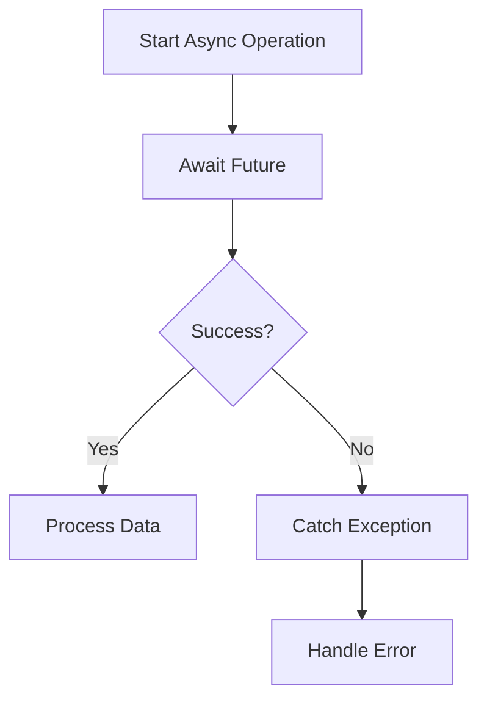

## 11.3.3 Async Programming Best Practices

Asynchronous programming is a cornerstone of modern app development, especially in Flutter, where maintaining a responsive user interface is paramount. By leveraging asynchronous operations, developers can ensure that their applications remain smooth and efficient, even when performing complex tasks. This section delves into the best practices for asynchronous programming in Flutter, focusing on the use of `async`, `await`, `Future`, and `Stream`.

### Importance of Asynchronous Programming

In Flutter, asynchronous programming is crucial for handling tasks that might otherwise block the main UI thread, such as network requests, file I/O, or intensive computations. By using asynchronous techniques, Flutter apps can perform these operations without freezing the UI, thus enhancing the user experience.

#### Key Concepts

- **`async` and `await`:** These keywords simplify asynchronous code by allowing developers to write code that looks synchronous but runs asynchronously. The `async` keyword is used to declare a function as asynchronous, while `await` pauses the execution until a `Future` completes.
  
- **`Future`:** Represents a potential value or error that will be available at some time in the future. It is a core component in Dart's asynchronous programming model.
  
- **`Stream`:** Provides a sequence of asynchronous events. Streams are useful for handling multiple asynchronous values over time, such as user inputs or data from a network.

### Best Practices for Asynchronous Programming

#### Use `async` and `await` Appropriately

The `async` and `await` keywords are powerful tools that make asynchronous code easier to read and maintain. They allow you to write code that appears synchronous but executes asynchronously, thus avoiding the complexities of callback-based programming.

**Code Example:**

```dart
Future<void> fetchData() async {
  try {
    final response = await http.get(Uri.parse('https://api.example.com/data'));
    if (response.statusCode == 200) {
      // Process data
    } else {
      throw Exception('Failed to load data');
    }
  } catch (e) {
    // Handle errors
    print('Error: $e');
  }
}
```

**Explanation:**

- The `fetchData` function is marked as `async`, indicating it will perform asynchronous operations.
- The `await` keyword is used to pause the execution until the HTTP request completes, ensuring that the subsequent code only runs after the data is fetched.

#### Avoid Blocking the UI Thread

To maintain a responsive UI, it's essential to offload heavy computations to separate isolates or use asynchronous methods.

**Code Example:**

```dart
import 'dart:async';
import 'dart:isolate';

Future<void> performHeavyComputation() async {
  final result = await compute(simulateHeavyTask, 1000000);
  print('Computation Result: $result');
}

int simulateHeavyTask(int value) {
  // Simulated heavy computation
  int sum = 0;
  for (int i = 0; i < value; i++) {
    sum += i;
  }
  return sum;
}
```

**Explanation:**

- The `compute` function is used to run `simulateHeavyTask` in a separate isolate, which prevents the main UI thread from being blocked by the heavy computation.

#### Handle Exceptions Gracefully

Robust error handling is crucial in asynchronous code to manage network failures, data parsing errors, and other exceptions effectively.

- Use try-catch blocks to capture and handle exceptions.
- Provide meaningful error messages or fallback mechanisms to enhance user experience.

#### Use Stream Transformers Wisely

When working with streams, transformers can be applied to process data efficiently. This includes operations like filtering, mapping, or buffering data.

- **Example:** Use `StreamTransformer` to filter out unwanted data before it reaches the listener.

#### Manage Stream Subscriptions Carefully

Active stream subscriptions should be tracked and canceled when no longer needed to prevent memory leaks.

**Code Example:**

```dart
class StreamSubscriptionExample extends StatefulWidget {
  @override
  _StreamSubscriptionExampleState createState() => _StreamSubscriptionExampleState();
}

class _StreamSubscriptionExampleState extends State<StreamSubscriptionExample> {
  late StreamSubscription<int> _subscription;
  int _counter = 0;

  @override
  void initState() {
    super.initState();
    _subscription = Stream.periodic(Duration(seconds: 1), (count) => count).listen((count) {
      setState(() {
        _counter = count;
      });
    });
  }

  @override
  void dispose() {
    _subscription.cancel();
    super.dispose();
  }

  @override
  Widget build(BuildContext context) {
    return Scaffold(
      appBar: AppBar(title: Text('Stream Subscription Example')),
      body: Center(child: Text('Counter: $_counter')),
    );
  }
}
```

**Explanation:**

- The stream subscription is canceled in the `dispose` method to prevent memory leaks, ensuring that resources are freed when the widget is no longer in use.

### Mermaid.js Diagrams

To visualize the flow of asynchronous operations, consider the following flowchart:

```markdown

```

**Description:**

- This flowchart illustrates how asynchronous operations are managed using `async` and `await`, and how exceptions are handled.

### Best Practices

- **Simplify Asynchronous Code:** Use `async` and `await` to write readable and maintainable asynchronous code.
- **Isolate Heavy Tasks:** Offload intensive computations to isolates or use asynchronous methods to maintain UI responsiveness.
- **Consistent Error Handling:** Implement uniform exception handling strategies across all asynchronous operations.
- **Avoid Nested `then()` Calls:** Favor `async` and `await` over chaining `then()` calls to prevent callback hell.

### Common Pitfalls

- **Forgetting to `await`:** Neglecting to use `await` can lead to unexpected behaviors as code execution continues before asynchronous operations complete.
- **Unmanaged Stream Subscriptions:** Failing to cancel stream subscriptions can cause memory leaks and unintended data processing.
- **Blocking the UI Thread:** Performing synchronous operations within asynchronous functions can negate the benefits of async programming.

### Implementation Guidance

- **Naming Conventions:** Adopt consistent naming conventions for asynchronous methods, such as suffixing with `Async`.
- **Thorough Testing:** Test asynchronous operations thoroughly to ensure they handle all possible states and exceptions gracefully.

### Conclusion

Asynchronous programming is a powerful paradigm that, when used correctly, can significantly enhance the performance and responsiveness of Flutter applications. By following the best practices outlined in this section, developers can write efficient, maintainable, and robust asynchronous code that keeps their apps running smoothly.

## Quiz Time!



### What is the primary benefit of using asynchronous programming in Flutter?

- [x] To keep the UI responsive during intensive operations
- [ ] To make the code run faster
- [ ] To simplify the codebase
- [ ] To reduce the app size

> **Explanation:** Asynchronous programming allows Flutter apps to perform non-blocking operations, maintaining a responsive UI even during intensive tasks.

### Which keywords are used to simplify asynchronous code in Dart?

- [x] async and await
- [ ] try and catch
- [ ] Future and Stream
- [ ] if and else

> **Explanation:** The `async` and `await` keywords simplify asynchronous code by allowing developers to write code that looks synchronous but runs asynchronously.

### What is the purpose of the `compute` function in Dart?

- [x] To run heavy computations in a separate isolate
- [ ] To perform mathematical calculations
- [ ] To optimize network requests
- [ ] To manage state

> **Explanation:** The `compute` function is used to run heavy computations in a separate isolate, preventing the main UI thread from being blocked.

### Why is it important to cancel stream subscriptions?

- [x] To prevent memory leaks
- [ ] To increase app performance
- [ ] To simplify code
- [ ] To reduce network usage

> **Explanation:** Canceling stream subscriptions when they are no longer needed prevents memory leaks and ensures efficient resource management.

### What should you do to handle exceptions in asynchronous code?

- [x] Use try-catch blocks
- [ ] Ignore them
- [ ] Use print statements
- [ ] Rely on the operating system

> **Explanation:** Using try-catch blocks allows you to capture and handle exceptions effectively, providing meaningful error messages or fallback mechanisms.

### Which of the following is a common pitfall in asynchronous programming?

- [x] Forgetting to use await
- [ ] Using too many streams
- [ ] Overusing print statements
- [ ] Writing too much documentation

> **Explanation:** Forgetting to use `await` can lead to unexpected behaviors as code execution continues before asynchronous operations complete.

### How can you simplify asynchronous code?

- [x] Use async and await
- [ ] Use nested then() calls
- [ ] Avoid error handling
- [ ] Use synchronous methods

> **Explanation:** Using `async` and `await` simplifies asynchronous code, making it more readable and maintainable.

### What is a Stream in Dart used for?

- [x] Handling multiple asynchronous values over time
- [ ] Performing synchronous operations
- [ ] Managing state
- [ ] Optimizing performance

> **Explanation:** A Stream provides a sequence of asynchronous events, useful for handling multiple asynchronous values over time.

### What is a best practice for naming asynchronous methods?

- [x] Suffixing with Async
- [ ] Prefixing with Sync
- [ ] Using all caps
- [ ] Avoiding underscores

> **Explanation:** Suffixing asynchronous methods with `Async` is a best practice for consistent naming conventions.

### True or False: Performing synchronous operations within asynchronous functions can negate the benefits of async programming.

- [x] True
- [ ] False

> **Explanation:** Performing synchronous operations within asynchronous functions can block the UI thread, negating the benefits of async programming.


