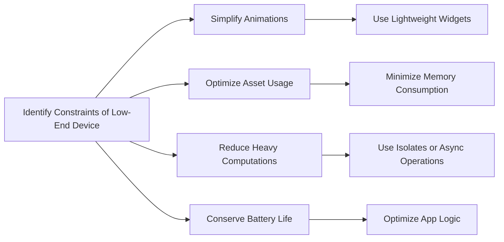

## 11.4.1 Handling Low-End Devices

In the ever-evolving landscape of mobile technology, ensuring that applications run smoothly across a wide range of devices is paramount. Low-end devices, characterized by limited processing power, memory, and storage, present unique challenges for developers. This section delves into strategies and techniques to optimize Flutter applications for such devices, ensuring a seamless user experience without compromising on functionality.

### Challenges of Low-End Devices

Low-end devices often come with several constraints that can impact the performance and usability of mobile applications. Understanding these challenges is the first step toward optimizing your app for these devices:

- **Limited Processing Power:** Low-end devices typically have slower CPUs, which can lead to performance bottlenecks, especially when handling complex animations or heavy computations.
  
- **Memory and Storage Constraints:** With less RAM and storage, these devices can struggle with memory-intensive operations and large asset files.
  
- **Battery Life Limitations:** Efficient resource usage is crucial as these devices may have smaller batteries, necessitating careful management of background processes and power consumption.
  
- **Variable Screen Resolutions and Sizes:** Ensuring that your UI scales appropriately across different screen sizes and resolutions is essential for maintaining a consistent user experience.

### Techniques to Optimize for Low-End Devices

To address these challenges, developers can employ several techniques to optimize their Flutter applications for low-end devices:

#### Simplify Animations

Animations can significantly enhance user experience, but they can also be resource-intensive. Simplifying animations can help reduce CPU and GPU load:

- **Use Simple Transitions:** Opt for basic animations like fade transitions instead of complex, resource-heavy animations.

  ```dart
  // Use simple fade transitions instead of elaborate animations
  FadeTransition(
    opacity: animation,
    child: child,
  );
  ```

- **Limit Animation Duration and Complexity:** Shorten animation durations and avoid chaining multiple animations that can overwhelm the device's processing capabilities.

#### Optimize Asset Usage

Efficient asset management is crucial for minimizing memory consumption and ensuring smooth performance:

- **Use Lower-Resolution Images:** Consider using lower-resolution images or vector graphics that scale well without consuming excessive memory.

- **Conditional Asset Loading:** Implement logic to load assets conditionally based on device capabilities, ensuring that high-resolution assets are only used when necessary.

#### Minimize Heavy Computations

Heavy computations can cause UI jank and degrade performance on low-end devices. Offloading these tasks can help maintain a smooth user experience:

- **Offload to Isolates:** Use Dart's isolate feature to perform heavy computations in a separate thread, preventing them from blocking the main UI thread.

  ```dart
  import 'dart:async';
  import 'dart:isolate';

  Future<int> performComputation(int value) async {
    return await compute(expensiveCalculation, value);
  }

  int expensiveCalculation(int value) {
    // Simulated heavy computation
    int result = 0;
    for (int i = 0; i < value; i++) {
      result += i;
    }
    return result;
  }
  ```

  **Explanation:** This code demonstrates how to perform heavy computations in a separate isolate, preventing UI jank by keeping the main thread free for rendering.

- **Asynchronous Operations:** Use asynchronous programming to handle tasks that can run in the background, freeing up the main thread for UI updates.

#### Efficient Widget Usage

Flutter's widget-based architecture allows for flexible UI design, but inefficient widget usage can lead to performance issues:

- **Use Lightweight Widgets:** Opt for lightweight widgets and avoid deep widget trees that can slow down rendering.

- **Leverage `const` Constructors:** Use `const` constructors to create immutable widgets that can be reused without rebuilding, reducing the load on the rendering engine.

#### Battery Optimization

Conserving battery life is crucial for low-end devices, which may have limited power reserves:

- **Reduce Background Processes:** Limit the number of background processes and optimize app logic to minimize power consumption.

- **Efficient Algorithms:** Implement efficient algorithms and reduce the frequency of resource-intensive operations to conserve battery life.

### Best Practices for Optimizing Low-End Devices

- **Profile Regularly:** Use performance profiling tools to identify and address bottlenecks specific to low-end devices. Regular profiling helps ensure that your app remains efficient as it evolves.

- **Conditional Rendering:** Tailor UI elements and features based on device capabilities using adaptive design principles. This approach allows you to provide a consistent experience across a range of devices.

- **Efficient Coding Practices:** Write clean, optimized code that minimizes resource usage without sacrificing functionality. This includes avoiding unnecessary computations and using efficient data structures.

### Common Pitfalls

- **Ignoring Device Constraints:** Failing to account for the limitations of low-end devices can lead to poor user experiences, such as slow performance and app crashes.

- **Overloading with Features:** Including too many features can strain limited resources, making the app sluggish or unresponsive. Prioritize essential features and consider offering additional functionality as optional.

### Implementation Guidance

- **Test on Low-End Devices:** Encourage developers to test their applications on low-end devices or emulators to identify performance issues and optimize accordingly. This hands-on testing provides valuable insights into real-world performance.

- **Use Conditional Logic:** Implement conditional logic to enable or disable features based on device performance metrics. This approach allows you to maintain a balance between functionality and performance.

### Low-End Optimization Flowchart

To visually represent the strategies for optimizing apps on low-end devices, consider the following Mermaid.js flowchart:

```markdown

```

This flowchart outlines the key strategies for enhancing app performance on low-end devices, emphasizing resource conservation and efficiency.

### Conclusion

Optimizing Flutter applications for low-end devices requires a thoughtful approach that balances performance, resource management, and user experience. By understanding the unique challenges of these devices and implementing targeted optimization techniques, developers can ensure their apps run smoothly across a wide range of hardware configurations. Regular testing and profiling, combined with efficient coding practices, will help maintain app performance and provide a seamless experience for all users.

## Quiz Time!



### What is a common challenge when optimizing apps for low-end devices?

- [x] Limited processing power
- [ ] High-resolution displays
- [ ] Abundant storage
- [ ] Unlimited battery life

> **Explanation:** Low-end devices often have limited processing power, which can lead to performance bottlenecks.

### Which technique can help reduce CPU and GPU load in animations?

- [x] Simplifying animations
- [ ] Increasing animation duration
- [ ] Using complex transitions
- [ ] Adding more animation layers

> **Explanation:** Simplifying animations helps reduce CPU and GPU load, making them more suitable for low-end devices.

### How can you minimize memory consumption with assets?

- [x] Use lower-resolution images
- [ ] Load all assets at startup
- [ ] Use only high-resolution images
- [ ] Avoid vector graphics

> **Explanation:** Using lower-resolution images helps minimize memory consumption, which is crucial for low-end devices.

### What is the purpose of using Dart's isolate feature?

- [x] Offloading heavy computations
- [ ] Increasing UI complexity
- [ ] Reducing app size
- [ ] Enhancing animation speed

> **Explanation:** Dart's isolate feature allows heavy computations to be offloaded to a separate thread, preventing UI jank.

### Which widget usage practice can improve performance on low-end devices?

- [x] Using lightweight widgets
- [ ] Creating deep widget trees
- [ ] Avoiding const constructors
- [ ] Using only stateful widgets

> **Explanation:** Using lightweight widgets and avoiding deep widget trees can improve performance on low-end devices.

### What is a common pitfall when developing for low-end devices?

- [x] Ignoring device constraints
- [ ] Using conditional rendering
- [ ] Profiling regularly
- [ ] Writing efficient code

> **Explanation:** Ignoring device constraints can lead to poor user experiences on low-end devices.

### How can battery life be conserved on low-end devices?

- [x] Reducing background processes
- [ ] Increasing resource-intensive operations
- [ ] Using inefficient algorithms
- [ ] Ignoring power consumption

> **Explanation:** Reducing background processes and optimizing app logic can help conserve battery life on low-end devices.

### What is a benefit of using const constructors in Flutter?

- [x] Reusing widgets without rebuilding
- [ ] Increasing widget complexity
- [ ] Enhancing animation speed
- [ ] Reducing app size

> **Explanation:** Const constructors allow widgets to be reused without rebuilding, improving performance.

### Why is it important to test apps on low-end devices?

- [x] To identify performance issues
- [ ] To increase app size
- [ ] To enhance animation complexity
- [ ] To avoid conditional logic

> **Explanation:** Testing on low-end devices helps identify performance issues and optimize the app accordingly.

### True or False: Overloading an app with features can strain limited resources on low-end devices.

- [x] True
- [ ] False

> **Explanation:** Overloading an app with features can strain limited resources, making it sluggish or unresponsive on low-end devices.


