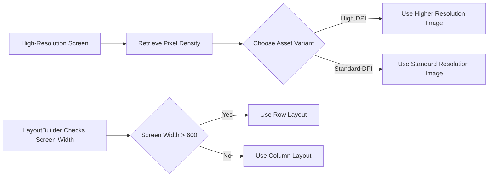

## 11.4.2 Responsiveness on High-Resolution Screens

As mobile devices continue to evolve, high-resolution screens have become the norm rather than the exception. These screens offer stunning visuals and detailed graphics, but they also present unique challenges for developers. Ensuring that your Flutter applications are responsive and perform well on high-resolution screens is crucial for delivering a seamless user experience. This section delves into the challenges and techniques for optimizing Flutter apps for high-resolution screens, providing practical insights and code examples to guide you through the process.

### Challenges with High-Resolution Screens

High-resolution screens, characterized by increased pixel density and larger screen real estate, require careful consideration to maintain visual clarity and optimize content layout. Here are some of the primary challenges developers face:

- **Handling Increased Pixel Density:** High-resolution screens have more pixels per inch (PPI), which can lead to blurry images and text if not handled correctly. Ensuring that UI elements scale appropriately is essential for maintaining clarity.
  
- **Managing Larger Screen Real Estate:** With more screen space available, it's important to optimize the layout to make effective use of the space without causing clutter or leaving excessive white space.

- **Cooling Effective Memory Usage:** High-resolution graphics can demand more memory, potentially impacting performance. Efficient memory management is crucial to ensure smooth operation.

### Techniques to Ensure Responsiveness

To address these challenges, several techniques can be employed to ensure that your Flutter applications remain responsive and visually appealing on high-resolution screens.

#### Use of `MediaQuery`

`MediaQuery` is a powerful tool in Flutter that allows you to retrieve information about the device's screen dimensions and pixel density. This information can be used to dynamically adjust UI elements, ensuring they are appropriately sized and positioned.

**Code Example:**

```dart
Widget build(BuildContext context) {
  var mediaQuery = MediaQuery.of(context);
  var screenWidth = mediaQuery.size.width;
  var textSize = screenWidth * 0.05; // 5% of screen width

  return Text(
    'Responsive Text',
    style: TextStyle(fontSize: textSize),
  );
}
```

**Explanation:**

- This example demonstrates how to adjust text size based on the screen width, ensuring readability across different resolutions. By calculating the font size as a percentage of the screen width, the text remains proportionate and legible on any device.

#### Scaling UI Elements

Flutter provides several responsive design widgets, such as `LayoutBuilder`, `Flexible`, and `Expanded`, which can be used to create adaptable layouts that respond to changes in screen size and orientation.

**Code Example:**

```dart
import 'package:flutter/material.dart';

class ResponsiveLayout extends StatelessWidget {
  @override
  Widget build(BuildContext context) {
    return LayoutBuilder(
      builder: (context, constraints) {
        if (constraints.maxWidth > 600) {
          // Tablet or desktop layout
          return Row(
            children: [
              Expanded(child: Sidebar()),
              Expanded(child: Content()),
            ],
          );
        } else {
          // Mobile layout
          return Column(
            children: [
              Content(),
              Sidebar(),
            ],
          );
        }
      },
    );
  }
}
```

**Explanation:**

- This example uses `LayoutBuilder` to switch between row-based and column-based layouts based on the screen width. This approach optimizes content presentation by adapting the layout to the available screen space, ensuring a consistent user experience across devices.

#### High-DPI Asset Management

To maintain visual quality on high-resolution screens, it's important to provide multiple resolutions of images and leverage Flutter's asset resolution capabilities. This ensures that the appropriate asset is served based on the device's pixel density.

**Code Example:**

```yaml
flutter:
  assets:
    - assets/images/logo.png
    - assets/images/2.0x/logo.png
    - assets/images/3.0x/logo.png
```

**Explanation:**

- Flutter automatically selects the correct asset variant based on the device's pixel density, ensuring that images appear crisp and clear on all screens. By providing assets at different resolutions, you can optimize visual quality without sacrificing performance.

#### Utilizing Vector Graphics

Vector graphics, such as SVGs, are inherently scalable and resolution-independent, making them an excellent choice for high-resolution screens. The `flutter_svg` package allows you to easily integrate SVG images into your Flutter applications.

**Package Installation:**

```yaml
dependencies:
  flutter_svg: ^1.1.6
```

**Code Example:**

```dart
import 'package:flutter/material.dart';
import 'package:flutter_svg/flutter_svg.dart';

class VectorImageExample extends StatelessWidget {
  @override
  Widget build(BuildContext context) {
    return Scaffold(
      appBar: AppBar(title: Text('Vector Image Example')),
      body: Center(
        child: SvgPicture.asset(
          'assets/images/logo.svg',
          width: 200,
          height: 200,
        ),
      ),
    );
  }
}
```

**Explanation:**

- This example demonstrates how to embed a scalable SVG image using the `flutter_svg` package. SVG images maintain clarity across high-resolution screens, ensuring that graphics are sharp and visually appealing.

### Mermaid.js Diagrams

To further illustrate how responsive design principles can be applied to high-resolution screens, let's explore a Mermaid.js diagram that visualizes the flow of adapting UI elements based on screen size and resolution.

**Responsive UI Flowchart:**

```markdown

```

**Description:**

- This flowchart illustrates the decision-making process for selecting the appropriate asset variant based on pixel density and adapting the layout based on screen width. By following this flow, developers can ensure that their applications remain responsive and visually consistent across different devices.

### Best Practices

To optimize your Flutter applications for high-resolution screens, consider the following best practices:

- **Responsive Typography:** Adjust font sizes relative to screen dimensions to ensure readability. Avoid hardcoding font sizes, and instead use dynamic calculations based on screen size.

- **Adaptive Layouts:** Design layouts that utilize available screen space effectively, avoiding clutter and excessive white space. Use responsive design widgets to create flexible and adaptable UIs.

- **Efficient Resource Usage:** Optimize images and assets to reduce memory consumption while maintaining visual quality. Provide multiple resolutions of assets and use vector graphics where possible.

### Common Pitfalls

When developing for high-resolution screens, be mindful of the following common pitfalls:

- **Hardcoding Sizes:** Avoid hardcoding widget sizes, as this can lead to poor scaling on different screen resolutions. Instead, use responsive design techniques to ensure that UI elements adapt to the screen size.

- **Ignoring Orientation Changes:** Ensure that the UI adapts correctly when the device orientation changes between portrait and landscape. Use `MediaQuery` and `LayoutBuilder` to handle orientation changes dynamically.

### Implementation Guidance

To effectively implement responsiveness on high-resolution screens, consider the following guidance:

- **Responsive Design Principles:** Encourage the use of responsive design principles and Flutter's layout widgets to create adaptable and scalable UIs. Regularly test your applications on various device emulators and real devices to ensure consistent responsiveness.

- **Hands-On Practice:** Encourage hands-on practice and experimentation with the provided code examples. Consider extending the examples to explore alternative implementations and further enhance your understanding of responsive design.

- **Continuous Learning:** Stay updated with the latest developments in Flutter and responsive design. Explore additional resources, such as official documentation, open-source projects, and online courses, to deepen your knowledge and skills.

By following these techniques and best practices, you can ensure that your Flutter applications are optimized for high-resolution screens, providing a seamless and visually appealing experience for users across all devices.

## Quiz Time!



### What is a primary challenge when developing for high-resolution screens?

- [x] Handling increased pixel density to maintain visual clarity.
- [ ] Reducing the number of UI elements.
- [ ] Simplifying the color palette.
- [ ] Limiting the use of animations.

> **Explanation:** High-resolution screens have more pixels per inch, which can lead to blurry images and text if not handled correctly. Ensuring that UI elements scale appropriately is essential for maintaining clarity.

### How can `MediaQuery` be used in Flutter applications?

- [x] To retrieve screen dimensions and pixel density.
- [ ] To manage application state.
- [ ] To handle network requests.
- [ ] To store local data.

> **Explanation:** `MediaQuery` allows you to retrieve information about the device's screen dimensions and pixel density, which can be used to dynamically adjust UI elements.

### Which widget is used to create adaptable layouts based on screen size?

- [ ] ListView
- [ ] GridView
- [x] LayoutBuilder
- [ ] Stack

> **Explanation:** `LayoutBuilder` is used to create adaptable layouts by providing constraints that can be used to adjust the layout based on the available screen size.

### What is the benefit of using vector graphics in Flutter applications?

- [x] They are scalable and resolution-independent.
- [ ] They reduce the application's code size.
- [ ] They improve network performance.
- [ ] They simplify state management.

> **Explanation:** Vector graphics, such as SVGs, are inherently scalable and resolution-independent, making them an excellent choice for high-resolution screens.

### How does Flutter handle high-DPI asset management?

- [x] By selecting the correct asset variant based on the device's pixel density.
- [ ] By compressing all assets to a standard size.
- [ ] By using only vector graphics.
- [ ] By caching assets in memory.

> **Explanation:** Flutter automatically selects the correct asset variant based on the device's pixel density, ensuring that images appear crisp and clear on all screens.

### What is a common pitfall when designing for high-resolution screens?

- [x] Hardcoding widget sizes.
- [ ] Using too many colors.
- [ ] Avoiding animations.
- [ ] Ignoring text alignment.

> **Explanation:** Hardcoding widget sizes can lead to poor scaling on different screen resolutions. Instead, use responsive design techniques to ensure that UI elements adapt to the screen size.

### Why is it important to test applications on various devices?

- [x] To ensure consistent responsiveness across different devices.
- [ ] To reduce development time.
- [ ] To simplify the codebase.
- [ ] To improve network performance.

> **Explanation:** Regular testing on various device emulators and real devices ensures that your applications remain responsive and visually consistent across different devices.

### What is the purpose of the `flutter_svg` package?

- [x] To integrate SVG images into Flutter applications.
- [ ] To manage application state.
- [ ] To handle network requests.
- [ ] To store local data.

> **Explanation:** The `flutter_svg` package allows you to easily integrate SVG images into your Flutter applications, providing scalable and resolution-independent graphics.

### How can responsive typography be achieved in Flutter?

- [x] By adjusting font sizes relative to screen dimensions.
- [ ] By using only bold fonts.
- [ ] By limiting the number of fonts used.
- [ ] By hardcoding font sizes.

> **Explanation:** Responsive typography can be achieved by adjusting font sizes relative to screen dimensions, ensuring readability across different devices.

### True or False: Ignoring orientation changes is a common pitfall in responsive design.

- [x] True
- [ ] False

> **Explanation:** Ignoring orientation changes can lead to a poor user experience. It's important to ensure that the UI adapts correctly when the device orientation changes between portrait and landscape.


