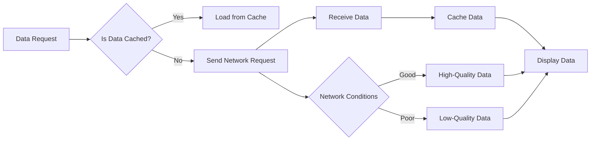

## 11.4.3 Network Optimization

In the realm of mobile app development, network optimization is a critical component that directly impacts the user experience. As apps become more data-intensive, ensuring efficient network interactions is essential for maintaining performance, especially in environments with limited connectivity. This section delves into the importance of network optimization, techniques to achieve it, and practical implementations in Flutter applications.

### Importance of Network Optimization

Network optimization is vital for several reasons:

- **Faster Data Retrieval:** Optimized network interactions lead to quicker data access, enhancing the overall user experience.
- **Reduced Data Usage:** By minimizing unnecessary data transfers, apps can be more efficient, which is crucial for users on limited data plans.
- **Improved User Experience:** In environments with limited connectivity, optimized network strategies ensure that apps remain responsive and functional.
- **Impact of Network Latency and Bandwidth Constraints:** High latency and limited bandwidth can severely degrade app performance, leading to delays and a frustrating user experience.

### Techniques for Network Optimization

#### Minimize Network Requests

Reducing the number of network requests is a fundamental step in optimizing network interactions.

- **Batch Requests:** Combine multiple requests into a single payload to reduce overhead. This technique is particularly useful when dealing with APIs that support batch processing.
  
- **Caching Responses:** Implement caching strategies to store and reuse previously fetched data. This reduces the need for repeated network requests and improves load times.

- **Use GraphQL:** Leverage GraphQL's ability to fetch only the required data, reducing payload sizes. GraphQL allows clients to specify exactly what data they need, minimizing overfetching.

##### Code Example with `http` and Caching

```dart
import 'dart:convert';
import 'package:http/http.dart' as http;
import 'package:shared_preferences/shared_preferences.dart';

Future<Map<String, dynamic>> fetchDataWithCache(String url) async {
  final prefs = await SharedPreferences.getInstance();
  final cachedData = prefs.getString(url);

  if (cachedData != null) {
    return json.decode(cachedData);
  } else {
    final response = await http.get(Uri.parse(url));
    if (response.statusCode == 200) {
      await prefs.setString(url, response.body);
      return json.decode(response.body);
    } else {
      throw Exception('Failed to load data');
    }
  }
}
```

**Explanation:**
- This code snippet demonstrates a basic caching mechanism using `SharedPreferences` to store and retrieve data, minimizing redundant network requests. If data is already cached, it is loaded from the cache; otherwise, a network request is made.

#### Efficient Data Transfer

Efficient data transfer is crucial for reducing bandwidth usage and improving app performance.

- **Use Compression:** Compress data payloads using algorithms like GZIP to reduce data sizes. This is particularly effective for large data transfers.

##### Code Example

```dart
import 'dart:convert';
import 'package:http/http.dart' as http;
import 'package:http/http.dart';

Future<Response> fetchCompressedData(String url) async {
  final response = await http.get(
    Uri.parse(url),
    headers: {'Accept-Encoding': 'gzip'},
  );
  if (response.statusCode == 200) {
    // Decompress if necessary
    return response;
  } else {
    throw Exception('Failed to load data');
  }
}
```

**Explanation:**
- This example requests compressed data from the server to reduce bandwidth usage. The server is expected to return a GZIP-compressed response, which the client can decompress if necessary.

#### Adaptive Streaming

Adaptive streaming serves content at different quality levels based on network conditions, using protocols like HLS or DASH.

##### Code Example with `video_player`

```dart
import 'package:flutter/material.dart';
import 'package:video_player/video_player.dart';

class AdaptiveStreamingExample extends StatefulWidget {
  @override
  _AdaptiveStreamingExampleState createState() => _AdaptiveStreamingExampleState();
}

class _AdaptiveStreamingExampleState extends State<AdaptiveStreamingExample> {
  late VideoPlayerController _controller;

  @override
  void initState() {
    super.initState();
    _controller = VideoPlayerController.network(
      'https://example.com/stream.m3u8', // HLS stream URL
    )..initialize().then((_) {
        setState(() {});
      });
  }

  @override
  void dispose() {
    _controller.dispose();
    super.dispose();
  }

  @override
  Widget build(BuildContext context) {
    return Scaffold(
      appBar: AppBar(title: Text('Adaptive Streaming Example')),
      body: Center(
        child: _controller.value.isInitialized
            ? AspectRatio(
                aspectRatio: _controller.value.aspectRatio,
                child: VideoPlayer(_controller),
              )
            : CircularProgressIndicator(),
      ),
      floatingActionButton: FloatingActionButton(
        onPressed: () {
          setState(() {
            _controller.value.isPlaying ? _controller.pause() : _controller.play();
          });
        },
        child: Icon(
          _controller.value.isPlaying ? Icons.pause : Icons.play_arrow,
        ),
      ),
    );
  }
}
```

**Explanation:**
- This code uses the `video_player` package to stream content using the HLS protocol, enabling adaptive quality based on network conditions. The video player adjusts the quality of the stream dynamically, ensuring smooth playback even on fluctuating network conditions.

#### Optimizing Network Code

Optimizing the network code itself can lead to significant performance improvements.

- **Reuse HttpClient Instances:** Avoid creating multiple instances of `HttpClient` to reduce resource consumption. Reusing instances can lead to better connection reuse and reduced latency.

- **Timeouts and Retries:** Implement appropriate timeouts and retry mechanisms for network requests to handle transient failures. This ensures that the app remains responsive even when network conditions are suboptimal.

##### Code Example with Retry Logic

```dart
import 'dart:convert';
import 'package:http/http.dart' as http;
import 'package:retry/retry.dart';

Future<Map<String, dynamic>> fetchDataWithRetry(String url) async {
  final r = RetryOptions(maxAttempts: 3);

  try {
    final response = await r.retry(
      () => http.get(Uri.parse(url)).timeout(Duration(seconds: 5)),
      retryIf: (e) => e is http.ClientException || e is TimeoutException,
    );

    if (response.statusCode == 200) {
      return json.decode(response.body);
    } else {
      throw Exception('Failed to load data');
    }
  } catch (e) {
    throw Exception('Network error: $e');
  }
}
```

**Explanation:**
- This example demonstrates using the `retry` package to attempt multiple fetches in case of network failures or timeouts. The `RetryOptions` class is used to specify the number of attempts and conditions under which retries should occur.

### Mermaid.js Diagrams

To better understand the strategies for network optimization, consider the following flowchart:

```markdown

```

**Description:**
- This flowchart outlines strategies for minimizing network requests, enhancing data transfer efficiency, and implementing adaptive streaming. It illustrates the decision-making process involved in handling data requests, caching, and adapting content quality based on network conditions.

### Best Practices

- **Implement Caching:** Use caching mechanisms to store frequently accessed data, reducing the need for repeated network requests.
- **Optimize Data Formats:** Choose efficient data formats (e.g., JSON with selective fields) to minimize payload sizes.
- **Monitor Network Usage:** Keep track of data usage, especially for users on limited data plans, to enhance app reliability and user satisfaction.

### Common Pitfalls

- **Overfetching Data:** Requesting more data than necessary can lead to increased bandwidth usage and slower response times.
- **Ignoring Offline Scenarios:** Failing to handle cases where the user has limited or no internet connectivity can lead to app failures or poor user experiences.

### Implementation Guidance

- **Early Integration:** Integrate network optimization strategies early in the development process to set a foundation for high-performance data interactions.
- **Continuous Monitoring:** Use continuous monitoring and analytics to track and refine network usage patterns over time. This helps in identifying areas for improvement and ensuring that the app remains efficient and responsive.

By implementing these network optimization strategies, developers can significantly enhance the performance and user experience of their Flutter applications. Optimized network interactions not only improve app responsiveness but also contribute to a more sustainable and user-friendly application, particularly in environments with limited connectivity.

## Quiz Time!



### Why is network optimization important in mobile app development?

- [x] It leads to faster data retrieval and improved user experiences.
- [ ] It increases the complexity of the app.
- [ ] It is only important for apps with large user bases.
- [ ] It reduces the need for testing.

> **Explanation:** Network optimization is crucial because it enhances data retrieval speed, reduces data usage, and improves user experiences, especially in environments with limited connectivity.

### What is one technique to minimize network requests?

- [x] Caching responses
- [ ] Increasing request frequency
- [ ] Using larger payloads
- [ ] Ignoring network errors

> **Explanation:** Caching responses helps minimize network requests by storing and reusing previously fetched data, reducing the need for repeated requests.

### How does GraphQL help in network optimization?

- [x] It allows fetching only the required data, reducing payload sizes.
- [ ] It increases the number of network requests.
- [ ] It requires more bandwidth than REST APIs.
- [ ] It is incompatible with mobile networks.

> **Explanation:** GraphQL allows clients to specify exactly what data they need, minimizing overfetching and reducing payload sizes, thus optimizing network usage.

### What is the purpose of using compression in data transfer?

- [x] To reduce data sizes and bandwidth usage
- [ ] To increase data security
- [ ] To slow down data transfer
- [ ] To make data unreadable

> **Explanation:** Compression reduces data sizes, which in turn decreases bandwidth usage and speeds up data transfer, optimizing network performance.

### Which protocol is commonly used for adaptive streaming?

- [x] HLS
- [ ] FTP
- [ ] SMTP
- [ ] POP3

> **Explanation:** HLS (HTTP Live Streaming) is commonly used for adaptive streaming, allowing content to be served at different quality levels based on network conditions.

### What is a benefit of reusing HttpClient instances?

- [x] It reduces resource consumption and improves connection reuse.
- [ ] It increases memory usage.
- [ ] It complicates the codebase.
- [ ] It decreases app performance.

> **Explanation:** Reusing HttpClient instances reduces resource consumption and improves connection reuse, leading to better performance and reduced latency.

### Why should timeouts and retries be implemented in network requests?

- [x] To handle transient failures and ensure app responsiveness
- [ ] To increase the number of failed requests
- [ ] To complicate error handling
- [ ] To slow down the app

> **Explanation:** Implementing timeouts and retries helps handle transient failures, ensuring that the app remains responsive even when network conditions are suboptimal.

### What is a common pitfall in network optimization?

- [x] Overfetching data
- [ ] Using adaptive streaming
- [ ] Implementing caching
- [ ] Monitoring network usage

> **Explanation:** Overfetching data can lead to increased bandwidth usage and slower response times, making it a common pitfall in network optimization.

### What should be done to handle offline scenarios effectively?

- [x] Implement caching and offline data storage
- [ ] Ignore network errors
- [ ] Increase data fetch frequency
- [ ] Use only online data sources

> **Explanation:** Implementing caching and offline data storage helps handle offline scenarios effectively, ensuring the app remains functional even without internet connectivity.

### True or False: Network optimization should be considered only after app deployment.

- [ ] True
- [x] False

> **Explanation:** Network optimization should be integrated early in the development process to ensure high-performance data interactions from the start.


