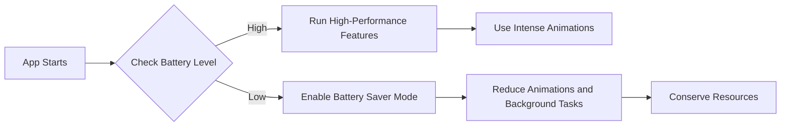

## 11.4.4 Battery and Resource Consumption

In the realm of mobile application development, optimizing battery and resource consumption is paramount. Users expect apps to be responsive, feature-rich, and efficient without draining their device's battery or hogging resources. In this section, we delve into how Flutter developers can achieve these goals, ensuring that their applications are both powerful and efficient.

### Understanding Battery and Resource Consumption

Mobile applications consume battery power and device resources in various ways. Understanding these mechanisms is crucial for optimizing performance:

- **CPU and GPU Usage:** Intensive computations and graphics rendering can significantly impact battery life. Apps that frequently update the UI or perform heavy calculations can strain the CPU and GPU.
  
- **Memory Consumption:** Inefficient memory usage can lead to increased battery drain as the system works harder to manage resources. Memory leaks or excessive memory allocation can exacerbate this issue.

- **Background Processes:** Apps running tasks in the background, such as fetching data or processing information, can consume resources even when not actively used.

- **Network Activity:** Frequent network calls, especially those involving large data transfers, can quickly deplete battery life due to the energy required for data transmission.

- **Animations and Visual Effects:** While animations enhance user experience, complex or frequent animations can be resource-intensive, impacting both battery and performance.

### Techniques to Optimize Battery and Resource Usage

#### Efficient Background Processes

Managing background tasks efficiently is crucial for conserving resources:

- **Minimize Background Tasks:** Limit the number and frequency of background operations to reduce CPU usage. Use background services judiciously and consider deferring non-critical tasks.

- **Use Isolates Wisely:** Offload heavy computations to isolates to prevent blocking the main thread. This approach allows the app to remain responsive while performing intensive tasks.

  ```dart
  import 'dart:async';
  import 'dart:isolate';

  Future<void> performBackgroundTask() async {
    await compute(backgroundComputation, 1000000);
  }

  int backgroundComputation(int num) {
    // Simulated heavy computation
    return num * 2;
  }
  ```

#### Optimize Animations

Animations can enhance user experience but should be used judiciously:

- **Use Simple Animations:** Favor less resource-intensive animations to conserve battery. Simple transitions can often achieve the desired effect without excessive resource use.

- **Control Animation Frequency:** Avoid unnecessary or overly frequent animations that can drain battery life. Consider reducing animation duration or frequency when the device is in low-power mode.

#### Efficient Network Usage

Network activity is a significant contributor to battery consumption:

- **Reduce Data Transfers:** Minimize the amount of data sent and received to lower energy consumption tied to network activities. Use data compression and caching strategies to reduce network load.

- **Implement Push Notifications:** Use push-based data updates instead of polling to reduce background network usage. This approach ensures that data is only fetched when necessary, conserving resources.

#### Power-Aware Coding Practices

Respecting user settings and device capabilities is essential:

- **Respect User Settings:** Adjust app behavior based on device power settings or battery levels. For instance, reduce animations or disable non-essential features when the battery is low.

- **Optimize Wake Locks:** Ensure that the app does not hold wake locks unnecessarily, preventing the device from sleeping. Use wake locks sparingly and release them as soon as they are no longer needed.

#### Resource Profiling

Regular profiling helps identify and address inefficiencies:

- **Use DevTools Memory and CPU Profilers:** Regularly profile the app’s resource usage to identify and address inefficiencies. These tools can highlight areas where optimization is needed.

  ```dart
  import 'package:flutter/material.dart';
  import 'package:battery_plus/battery_plus.dart';

  class BatteryAwareWidget extends StatefulWidget {
    @override
    _BatteryAwareWidgetState createState() => _BatteryAwareWidgetState();
  }

  class _BatteryAwareWidgetState extends State<BatteryAwareWidget> {
    final Battery _battery = Battery();
    BatteryState _batteryState = BatteryState.full;

    @override
    void initState() {
      super.initState();
      _battery.onBatteryStateChanged.listen((BatteryState state) {
        setState(() {
          _batteryState = state;
        });
      });
    }

    @override
    Widget build(BuildContext context) {
      return Scaffold(
        appBar: AppBar(title: Text('Battery Aware Example')),
        body: Center(
          child: _batteryState == BatteryState.full
              ? Text('High Performance Mode')
              : Text('Battery Saver Mode: Reducing Animations'),
        ),
      );
    }
  }
  ```

  **Explanation:** This code demonstrates how to adjust the UI based on the device’s battery state, conserving energy when necessary.

#### Mermaid.js Diagrams

Visualizing strategies for battery optimization can clarify the process:

```markdown

```

### Best Practices

- **Optimize App Activity Lifecycle:** Manage app states (foreground, background) effectively to minimize unnecessary resource usage. Pause or stop non-essential processes when the app is not in use.

- **Avoid Unnecessary Polling:** Replace polling mechanisms with event-driven data fetching to reduce CPU and network usage. Use listeners or callbacks to update data only when changes occur.

- **Profile and Monitor Resource Usage:** Continuously monitor resource consumption using profiling tools to identify and address inefficiencies. Regular profiling helps maintain optimal performance.

### Common Pitfalls

- **Heavy Background Tasks:** Running intensive tasks in the background without necessity can drain battery and degrade performance. Evaluate the necessity of background tasks and optimize them.

- **Neglecting User Preferences:** Ignoring user settings related to power and performance can lead to dissatisfaction and increased battery consumption. Ensure your app respects user preferences and adapts accordingly.

### Implementation Guidance

Encourage developers to design feature-rich apps that remain efficient and battery-friendly by default. Incorporate resource usage monitoring and adaptive features to align with device capabilities and user expectations. By following these guidelines, developers can create applications that deliver excellent performance while minimizing their impact on device resources.

---

## Quiz Time!



### How do mobile applications primarily consume battery power?

- [x] Through CPU, GPU, and memory usage
- [ ] By utilizing only the device's screen brightness
- [ ] Solely through network activities
- [ ] By running in the background without any active tasks

> **Explanation:** Mobile applications consume battery power primarily through CPU, GPU, and memory usage, along with network activities and background processes.

### What is a recommended practice for handling heavy computations in Flutter?

- [x] Use isolates to offload heavy computations
- [ ] Perform all computations on the main thread
- [ ] Avoid using isolates for any tasks
- [ ] Use synchronous operations for better performance

> **Explanation:** Using isolates allows heavy computations to be offloaded from the main thread, preventing UI blocking and improving app responsiveness.

### Which technique can help reduce network-related battery consumption?

- [x] Implement push-based data updates
- [ ] Increase the frequency of polling
- [ ] Use larger data packets for efficiency
- [ ] Disable network activities entirely

> **Explanation:** Implementing push-based data updates reduces the need for frequent polling, conserving battery by minimizing unnecessary network activity.

### How can animations be optimized to conserve battery life?

- [x] Use simple animations and control their frequency
- [ ] Increase the complexity of animations
- [ ] Run animations continuously without interruption
- [ ] Disable all animations for battery conservation

> **Explanation:** Simple animations and controlled frequency help conserve battery life by reducing the computational load on the device.

### What is a power-aware coding practice?

- [x] Adjust app behavior based on device power settings
- [ ] Ignore device battery levels
- [x] Optimize wake locks to prevent unnecessary usage
- [ ] Use maximum resources at all times for performance

> **Explanation:** Power-aware coding practices involve adjusting app behavior based on device power settings and optimizing wake locks to prevent unnecessary resource usage.

### What tool can be used to profile an app's resource usage?

- [x] DevTools Memory and CPU Profilers
- [ ] Only print statements for debugging
- [ ] Manual observation of app performance
- [ ] Disabling all background tasks

> **Explanation:** DevTools Memory and CPU Profilers are used to profile an app's resource usage, helping identify and address inefficiencies.

### Which practice should be avoided to conserve battery?

- [x] Running intensive background tasks without necessity
- [ ] Using event-driven data fetching
- [x] Ignoring user settings related to power
- [ ] Profiling resource consumption regularly

> **Explanation:** Running intensive background tasks without necessity and ignoring user settings related to power should be avoided to conserve battery.

### What is the benefit of using event-driven data fetching?

- [x] Reduces CPU and network usage
- [ ] Increases the frequency of data updates
- [ ] Requires constant polling
- [ ] Decreases app responsiveness

> **Explanation:** Event-driven data fetching reduces CPU and network usage by updating data only when changes occur, rather than through constant polling.

### How can an app adapt to low battery conditions?

- [x] Reduce animations and background tasks
- [ ] Increase the frequency of network calls
- [ ] Enable all high-performance features
- [ ] Ignore battery levels and continue normal operation

> **Explanation:** Reducing animations and background tasks helps adapt to low battery conditions by conserving resources.

### True or False: Profiling tools are unnecessary for optimizing resource usage.

- [ ] True
- [x] False

> **Explanation:** Profiling tools are essential for optimizing resource usage as they help identify inefficiencies and areas for improvement.


