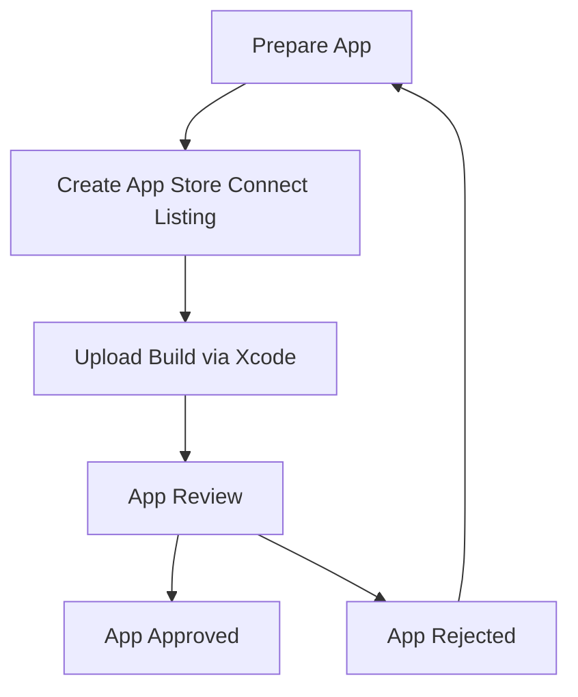
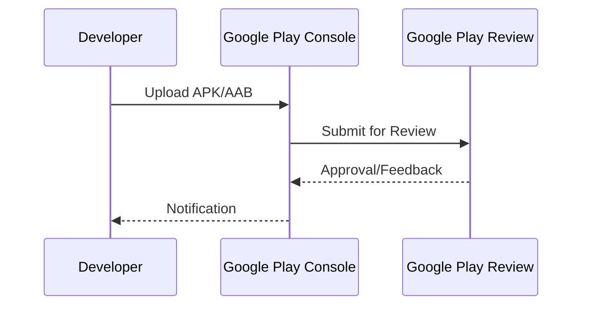

## 12.1.1 App Store Requirements

In the world of mobile app development, deploying your application to the app stores is a crucial step that requires careful attention to detail. Understanding and meeting the app store requirements is essential for a successful deployment, ensuring that your app reaches your audience without unnecessary delays or rejections. This section will guide you through the requirements for both the iOS App Store and the Google Play Store, providing insights, code examples, and diagrams to help you navigate the submission process effectively.

### Overview

Launching an app on the iOS App Store or Google Play Store is not just about having a great app; it's about ensuring that your app complies with the stringent guidelines set by these platforms. Each store has its own set of requirements, ranging from app metadata and design guidelines to privacy policies and technical specifications. Failing to adhere to these requirements can result in your app being rejected, delaying your launch and potentially impacting your business goals.

Understanding these requirements is not only about compliance but also about delivering a consistent and high-quality user experience. Both Apple and Google have established guidelines to ensure that apps are safe, reliable, and provide a seamless experience to users. By aligning your app with these guidelines, you enhance its chances of approval and success in the competitive app market.

### iOS App Store Requirements

Apple's App Store is known for its rigorous review process and high standards for app quality. To successfully submit your app to the iOS App Store, you need to adhere to several key requirements:

#### App Metadata and Review Process

- **App Metadata:** This includes your app's name, description, keywords, support URL, and marketing URL. Ensure that your metadata is accurate and compelling, as it plays a crucial role in how users discover your app.
- **App Review Process:** Apple reviews each app submission to ensure compliance with their guidelines. This process can take anywhere from a few days to a week. It's important to be patient and responsive to any feedback from the review team.

#### Specific Requirements

- **App Icons and Screenshots:** Your app must include high-resolution icons and screenshots that accurately represent the app's functionality and user interface. These assets should comply with Apple's specifications regarding size and format.
- **Privacy Policies:** If your app collects user data, you must provide a privacy policy that clearly explains how the data is used and protected.
- **Human Interface Guidelines (HIG):** Adhering to Apple's HIG is crucial for creating a consistent and intuitive user experience. This includes using standard UI components and ensuring that your app's design is aligned with iOS conventions.

#### Configuring `Info.plist`

To meet Apple's requirements, you may need to configure your app's `Info.plist` file to request necessary permissions and set app-specific settings. Here's an example:

```xml
<plist version="1.0">
<dict>
    <key>CFBundleDisplayName</key>
    <string>YourAppName</string>
    <key>NSCameraUsageDescription</key>
    <string>This app requires access to the camera to take photos.</string>
    <key>NSLocationWhenInUseUsageDescription</key>
    <string>This app requires access to your location to provide location-based services.</string>
</dict>
</plist>
```

This configuration requests permission to access the camera and location services, with descriptions explaining why these permissions are needed.

#### Apple App Store Submission Process

The submission process for the Apple App Store involves several steps, which can be visualized in the following flowchart:



### Google Play Store Requirements

The Google Play Store is the largest app distribution platform for Android apps. To successfully publish your app on Google Play, you need to comply with Google's policies and guidelines:

#### Content Guidelines and Review Process

- **Content Guidelines:** Google requires that apps comply with their content policies, which include restrictions on inappropriate content, user-generated content, and intellectual property rights.
- **App Categorization:** Properly categorizing your app helps users find it more easily. Choose the most appropriate category and subcategory for your app.
- **Review Process:** Similar to Apple, Google reviews apps to ensure compliance with their guidelines. The review process can vary in length, but Google aims to complete reviews within a few days.

#### Required Assets

- **App Icons and Feature Graphics:** Your app must include a high-resolution icon and a feature graphic that appears on the app's Play Store listing. These assets should meet Google's size and format specifications.
- **Privacy Policies:** If your app handles sensitive user data, you must provide a privacy policy that explains how the data is used and protected.

#### Configuring `build.gradle`

To meet Google Play's requirements, you may need to configure your app's `build.gradle` file. Here's an example:

```groovy
android {
    compileSdkVersion 33
    defaultConfig {
        applicationId "com.example.yourapp"
        minSdkVersion 21
        targetSdkVersion 33
        versionCode 1
        versionName "1.0"
    }
    buildTypes {
        release {
            minifyEnabled false
            proguardFiles getDefaultProguardFile('proguard-android-optimize.txt'), 'proguard-rules.pro'
        }
    }
}
```

This configuration specifies the SDK versions and other settings required for building your app for the Google Play Store.

#### Google Play Store Submission Workflow

The submission process for the Google Play Store can be illustrated with the following sequence diagram:



### Common Requirements

While the iOS App Store and Google Play Store have distinct requirements, there are commonalities that developers should be aware of:

- **Thorough Documentation:** Both platforms require detailed documentation of your app's functionality and data usage. This includes privacy policies and terms of service.
- **Consistent User Experience:** Ensuring a consistent and intuitive user experience is crucial for both platforms. Adhering to design guidelines and using standard UI components can help achieve this.
- **Regular Updates:** Both Apple and Google frequently update their guidelines and policies. Staying informed about these changes is essential to ensure ongoing compliance and avoid app suspension.

By understanding and adhering to these requirements, you can streamline the submission process and increase the likelihood of your app being approved. It's important to thoroughly read and understand the latest guidelines from both Apple and Google, as they frequently update their policies.

### Conclusion

Successfully deploying your app to the iOS App Store and Google Play Store requires careful preparation and adherence to each platform's guidelines. By understanding the requirements and following best practices, you can ensure a smooth submission process and deliver a high-quality app experience to your users.

For further exploration, consider reviewing the official documentation for the [Apple App Store](https://developer.apple.com/app-store/review/guidelines/) and [Google Play Store](https://play.google.com/about/developer-content-policy/). These resources provide detailed information on the latest guidelines and best practices for app submission.

## Quiz Time!



### What is the primary purpose of adhering to app store requirements?

- [x] To ensure the app is compliant and can be successfully published
- [ ] To increase the app's download speed
- [ ] To enhance the app's graphics
- [ ] To improve the app's battery efficiency

> **Explanation:** Adhering to app store requirements ensures that the app complies with platform guidelines, allowing it to be successfully published and reach users.

### Which file is configured to request necessary permissions for an iOS app?

- [x] Info.plist
- [ ] AndroidManifest.xml
- [ ] build.gradle
- [ ] settings.gradle

> **Explanation:** The `Info.plist` file is used in iOS apps to request necessary permissions and configure app settings.

### What is a key component of the Google Play Store submission process?

- [x] Uploading APK/AAB via Google Play Console
- [ ] Submitting a physical copy of the app
- [ ] Sending the app via email
- [ ] Uploading the app to a third-party website

> **Explanation:** The Google Play Store submission process involves uploading the APK/AAB file via the Google Play Console.

### What is the purpose of the Human Interface Guidelines (HIG) for iOS apps?

- [x] To ensure a consistent user experience
- [ ] To improve app performance
- [ ] To enhance app security
- [ ] To increase app download speed

> **Explanation:** The Human Interface Guidelines (HIG) help ensure a consistent and intuitive user experience for iOS apps.

### Which diagram type is used to illustrate the Apple App Store submission process?

- [x] Flowchart
- [ ] Sequence Diagram
- [ ] Pie Chart
- [ ] Bar Graph

> **Explanation:** A flowchart is used to illustrate the steps in the Apple App Store submission process.

### What is a common requirement for both the iOS App Store and Google Play Store?

- [x] Providing a privacy policy
- [ ] Using only custom UI components
- [ ] Implementing a specific payment gateway
- [ ] Using a specific programming language

> **Explanation:** Both the iOS App Store and Google Play Store require apps to provide a privacy policy if they collect user data.

### What is the role of the `build.gradle` file in Android app development?

- [x] To configure build settings and dependencies
- [ ] To define app icons and screenshots
- [ ] To specify app metadata
- [ ] To manage user accounts

> **Explanation:** The `build.gradle` file is used to configure build settings and dependencies for Android apps.

### What should developers do to stay compliant with app store guidelines?

- [x] Regularly review and understand the latest guidelines
- [ ] Only focus on app design
- [ ] Ignore app store updates
- [ ] Rely solely on third-party tools

> **Explanation:** Developers should regularly review and understand the latest guidelines to ensure ongoing compliance with app store requirements.

### What is a feature graphic in the context of the Google Play Store?

- [x] A visual asset that appears on the app's Play Store listing
- [ ] A graphic used in the app's user interface
- [ ] A promotional banner on social media
- [ ] A logo used in app advertisements

> **Explanation:** A feature graphic is a visual asset that appears on the app's Play Store listing, helping to attract users.

### True or False: Apple's App Store and Google Play Store have identical submission processes.

- [ ] True
- [x] False

> **Explanation:** Apple's App Store and Google Play Store have distinct submission processes, each with its own set of guidelines and requirements.


