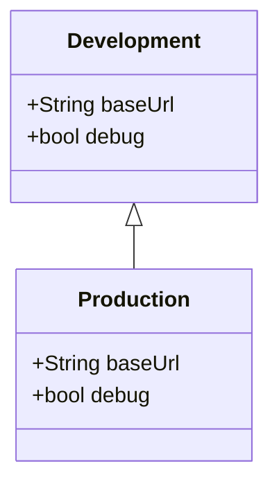

## 12.1.3 Build Flavors and Configurations

In the world of mobile app development, managing different environments such as development, staging, and production is crucial for ensuring that your application behaves correctly under various conditions. Flutter, with its robust build system, allows developers to define build flavors, which streamline the process of managing these environments. This section will guide you through the process of setting up and managing build flavors in Flutter, providing you with the tools to efficiently handle multiple configurations.

### Introduction to Build Flavors

Build flavors are a powerful feature in Flutter that allow developers to create multiple versions of an app from a single codebase. Each flavor can have its own configuration, such as different API endpoints, feature flags, or even different app icons. This is particularly useful for:

- **Development:** Testing new features or debugging without affecting the production environment.
- **Staging:** A pre-production environment where the app can be tested with real data.
- **Production:** The live version of the app available to end-users.

By using build flavors, you can easily switch between these environments, ensuring that each version of your app is tailored to its specific use case.

### Setting Up Build Flavors in Flutter

Setting up build flavors in Flutter involves configuring both your `pubspec.yaml` file and platform-specific files for Android and iOS.

#### Configuring Build Flavors in Android

To set up build flavors for Android, you'll need to modify the `android/app/build.gradle` file. Here's a step-by-step guide:

1. **Open the `build.gradle` file** located in the `android/app` directory.
2. **Define flavor dimensions** and product flavors within the `android` block.

   ```groovy
   android {
       ...
       flavorDimensions "env"
       productFlavors {
           development {
               dimension "env"
               applicationIdSuffix ".dev"
               versionNameSuffix "-dev"
           }
           production {
               dimension "env"
           }
       }
   }
   ```

   - **flavorDimensions:** This is used to categorize flavors. In this example, we use "env" to represent different environments.
   - **productFlavors:** Here, we define the actual flavors. Each flavor can have its own `applicationIdSuffix` and `versionNameSuffix` to distinguish between versions.

3. **Sync your project** to apply the changes.

#### iOS Configuration

For iOS, build flavors are managed through Xcode using schemes and configurations:

1. **Open your project in Xcode.**
2. **Navigate to the project settings** and select the "Info" tab.
3. **Duplicate the existing configuration** (e.g., Debug and Release) for each flavor you want to create (e.g., Development, Production).
4. **Create new schemes** for each flavor:
   - Go to "Product" > "Scheme" > "Manage Schemes..."
   - Duplicate an existing scheme and rename it according to your flavor.
5. **Assign configurations** to each scheme:
   - Select the scheme and click "Edit Scheme..."
   - Under the "Build" section, assign the appropriate configuration for each build action (e.g., Run, Test).

### Managing Dependencies for Flavors

Different build flavors might require different dependencies or configurations. Flutter allows you to handle this through conditional imports.

#### Conditional Imports

You can conditionally import different configuration files based on the build flavor. Here's how you can do it:

```dart
import 'config_development.dart' as config;
// or
import 'config_production.dart' as config;
```

This approach allows you to maintain separate configuration files for each flavor, ensuring that each environment uses the correct settings.

### Using Environment Variables

Environment variables are essential for managing sensitive data and configurations that should not be hardcoded into your app. The `flutter_dotenv` package is a popular choice for loading environment variables in Flutter.

#### Setting Up `flutter_dotenv`

1. **Add the package to your `pubspec.yaml`:**

   ```yaml
   dependencies:
     flutter_dotenv: ^5.0.2
   ```

2. **Create a `.env` file** in the root of your project and define your environment variables:

   ```
   API_URL=https://api.example.com
   API_KEY=your_api_key
   ```

3. **Load the environment variables** in your `main.dart`:

   ```dart
   import 'package:flutter_dotenv/flutter_dotenv.dart';

   Future<void> main() async {
     await dotenv.load(fileName: ".env");
     runApp(MyApp());
   }
   ```

This setup allows you to manage sensitive information securely and switch between different configurations effortlessly.

### Diagram: Build Flavors and Configurations

To visualize the relationship between different build flavors and their configurations, consider the following Mermaid.js class diagram:



This diagram illustrates how different build flavors can inherit common properties while maintaining their unique configurations.

### Best Practices and Common Pitfalls

- **Consistent Naming:** Use a consistent naming convention for your flavors and configurations to avoid confusion.
- **Environment-Specific Resources:** Ensure that resources like icons and strings are appropriately configured for each flavor.
- **Testing:** Regularly test each flavor to ensure that configurations are correctly applied and that there are no unexpected behaviors.

### Conclusion

By setting up build flavors and configurations, you can streamline your development process and ensure that your app is ready for deployment across various environments. This approach not only enhances your workflow but also improves the reliability and maintainability of your application.

For further exploration, consider delving into the official Flutter documentation and experimenting with more advanced configurations. Understanding and implementing build flavors will significantly enhance your ability to manage complex projects effectively.

## Quiz Time!



### What is the primary purpose of build flavors in Flutter?

- [x] To manage different environments like development, staging, and production.
- [ ] To improve the performance of the app.
- [ ] To reduce the size of the app.
- [ ] To enhance the security of the app.

> **Explanation:** Build flavors allow developers to create multiple versions of an app from a single codebase, each tailored for specific environments such as development, staging, and production.

### How do you define flavor dimensions in the `build.gradle` file for Android?

- [x] Using the `flavorDimensions` keyword.
- [ ] Using the `productDimensions` keyword.
- [ ] Using the `buildDimensions` keyword.
- [ ] Using the `configDimensions` keyword.

> **Explanation:** The `flavorDimensions` keyword is used in the `build.gradle` file to categorize flavors.

### In iOS, how are build flavors managed?

- [x] Through schemes and configurations in Xcode.
- [ ] Through the `build.gradle` file.
- [ ] Through the `pubspec.yaml` file.
- [ ] Through environment variables.

> **Explanation:** In iOS, build flavors are managed through schemes and configurations in Xcode.

### What is the purpose of the `applicationIdSuffix` in Android build flavors?

- [x] To distinguish between different versions of the app.
- [ ] To improve app performance.
- [ ] To enhance app security.
- [ ] To reduce app size.

> **Explanation:** The `applicationIdSuffix` is used to distinguish between different versions of the app, such as development and production.

### How can you manage different dependencies for each build flavor in Flutter?

- [x] By using conditional imports.
- [ ] By using different `pubspec.yaml` files.
- [ ] By using different `build.gradle` files.
- [ ] By using different environment variables.

> **Explanation:** Conditional imports allow you to manage different dependencies or configurations for each build flavor.

### Which package is commonly used in Flutter to manage environment variables?

- [x] `flutter_dotenv`
- [ ] `flutter_env`
- [ ] `flutter_config`
- [ ] `flutter_secrets`

> **Explanation:** The `flutter_dotenv` package is commonly used to manage environment variables in Flutter.

### What is a key benefit of using environment variables in Flutter?

- [x] To securely manage sensitive data and configurations.
- [ ] To improve app performance.
- [ ] To reduce app size.
- [ ] To enhance app security.

> **Explanation:** Environment variables allow you to securely manage sensitive data and configurations without hardcoding them into your app.

### In the provided Mermaid.js diagram, what do the `Development` and `Production` classes represent?

- [x] Different build flavors with unique configurations.
- [ ] Different app modules.
- [ ] Different user roles.
- [ ] Different data models.

> **Explanation:** The `Development` and `Production` classes represent different build flavors with unique configurations.

### Why is it important to test each build flavor regularly?

- [x] To ensure configurations are correctly applied and there are no unexpected behaviors.
- [ ] To improve app performance.
- [ ] To reduce app size.
- [ ] To enhance app security.

> **Explanation:** Regular testing ensures that configurations are correctly applied and that there are no unexpected behaviors in each build flavor.

### True or False: Build flavors can help in managing different app icons for each environment.

- [x] True
- [ ] False

> **Explanation:** Build flavors can be configured to use different resources, such as app icons, for each environment.


