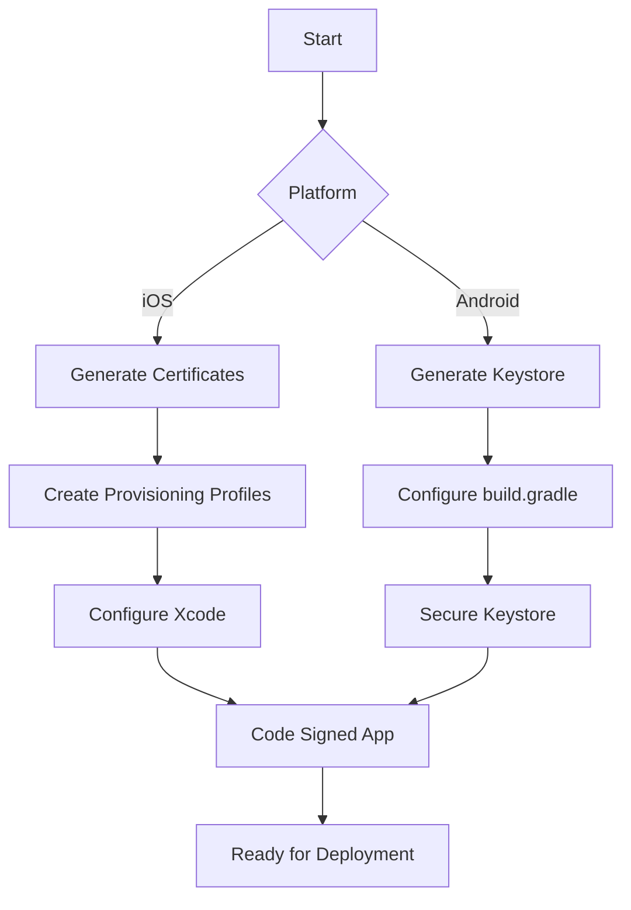

## 12.1.4 Code Signing and Provisioning

In the world of mobile app development, ensuring the security and integrity of your application is paramount. Code signing and provisioning are critical steps in this process, serving as a gatekeeper to verify the authenticity of your app before it reaches users. This section will delve into the intricacies of code signing for both iOS and Android platforms, providing a comprehensive guide to navigating this essential aspect of app deployment.

### Understanding Code Signing

Code signing is a security measure that involves digitally signing an application to confirm its origin and integrity. This process ensures that the app has not been tampered with since it was signed and that it comes from a trusted source. For users, it provides assurance that the app is safe to install and use. For developers, it is a mandatory requirement for distributing apps through official app stores like Apple's App Store and Google Play Store.

Code signing involves the use of cryptographic keys and certificates to create a digital signature. This signature is then used to verify the app's authenticity and integrity during installation. The process varies slightly between iOS and Android, reflecting the different ecosystems and security protocols of each platform.

### Code Signing for iOS

#### Creating and Managing Certificates and Provisioning Profiles

For iOS, code signing is managed through the Apple Developer portal, where developers create and manage certificates and provisioning profiles. These elements are crucial for building and distributing iOS apps.

##### Step-by-Step Guide

1. **Generate Certificates:**
   - Log in to your Apple Developer account.
   - Navigate to the Certificates, Identifiers & Profiles section.
   - Select "Certificates" and click the "+" button to create a new certificate.
   - Choose "Apple Distribution" and follow the instructions to generate a Certificate Signing Request (CSR) using Keychain Access on your Mac.
   - Upload the CSR to the Apple Developer portal to generate your distribution certificate.
   - Download and install the certificate on your Mac.

2. **Create Provisioning Profiles:**
   - Go back to the Certificates, Identifiers & Profiles section.
   - Select "Profiles" and click the "+" button to create a new provisioning profile.
   - Choose "App Store" under Distribution.
   - Select your app's App ID and the distribution certificate you just created.
   - Choose the devices you want to include (for development profiles).
   - Name the profile and download it to your Mac.

3. **Configuring Xcode:**
   - Open your project in Xcode.
   - Go to the "Signing & Capabilities" tab.
   - Select your team and ensure the "Automatically manage signing" option is checked, or manually select the provisioning profile and certificate.
   - Xcode will handle the rest, linking the profile and certificate to your app.

##### Best Practices

- **Security:** Keep your certificates and provisioning profiles secure. Store them in a safe location and restrict access to authorized personnel only.
- **Renewal:** Certificates and provisioning profiles have expiration dates. Set reminders to renew them before they expire to avoid disruptions in app deployment.
- **Backup:** Regularly back up your certificates and profiles to prevent data loss.

### Code Signing for Android

#### Generating a Keystore File and Configuring `build.gradle`

For Android, code signing involves generating a Keystore file, which contains the private key used to sign your app. This Keystore is referenced in your project's `build.gradle` file to automate the signing process during builds.

##### Step-by-Step Guide

1. **Generate a Keystore:**
   Use the `keytool` command to create a new Keystore file. This command will prompt you for information such as your name, organization, and location, which will be embedded in the certificate.

   ```bash
   keytool -genkey -v -keystore ~/my-release-key.jks -keyalg RSA -keysize 2048 -validity 10000 -alias my-key-alias
   ```

   - `-keystore`: Specifies the path to the Keystore file.
   - `-keyalg`: Specifies the algorithm to use (RSA is recommended).
   - `-keysize`: Sets the key size (2048 is standard).
   - `-validity`: Sets the validity period of the certificate in days.
   - `-alias`: Names the key within the Keystore.

2. **Configuring `build.gradle`:**
   Add the signing configuration to your `build.gradle` file to automate the signing process during builds.

   ```groovy
   android {
       ...
       signingConfigs {
           release {
               keyAlias 'my-key-alias'
               keyPassword 'my-key-password'
               storeFile file('/path/to/my-release-key.jks')
               storePassword 'my-store-password'
           }
       }
       buildTypes {
           release {
               signingConfig signingConfigs.release
               ...
           }
       }
   }
   ```

   - `keyAlias`: The alias for the key in the Keystore.
   - `keyPassword`: The password for the key.
   - `storeFile`: The path to the Keystore file.
   - `storePassword`: The password for the Keystore.

##### Best Practices

- **Secure Storage:** Store your Keystore file in a secure location and restrict access to it. Avoid storing it in version control systems like Git.
- **Avoid Hardcoding:** Do not hardcode sensitive information like passwords in your `build.gradle` file. Use environment variables or secure vaults to manage them.

### Automating Code Signing

To streamline the code signing and deployment process, consider using automation tools like Fastlane. Fastlane can automate repetitive tasks, such as building and deploying apps, capturing screenshots, and managing certificates.

#### Fastlane Setup for iOS and Android

Fastlane provides a unified interface for automating tasks across both iOS and Android platforms. Here's a basic setup for deploying apps to the App Store and Play Store.

```ruby
platform :ios do
  desc "Deploy to App Store"
  lane :release do
    capture_screenshots
    build_app
    upload_to_app_store
  end
end

platform :android do
  desc "Deploy to Play Store"
  lane :release do
    gradle(task: "assemble", build_type: "Release")
    upload_to_play_store
  end
end
```

- **iOS Lane:**
  - `capture_screenshots`: Automates capturing screenshots for the App Store.
  - `build_app`: Builds the app using the specified configuration.
  - `upload_to_app_store`: Uploads the app to the App Store.

- **Android Lane:**
  - `gradle`: Executes the Gradle build task for the release build type.
  - `upload_to_play_store`: Uploads the app to the Play Store.

### Diagram: Code Signing Process

To visualize the code signing process for both iOS and Android, consider the following Mermaid.js flowchart:



This flowchart illustrates the parallel processes for iOS and Android, highlighting the key steps involved in preparing a code-signed app for deployment.

### Conclusion

Code signing and provisioning are crucial steps in the app deployment process, ensuring that your application is secure and trusted by users. By following the detailed instructions and best practices outlined in this section, you can confidently navigate the complexities of code signing for both iOS and Android platforms. Additionally, leveraging automation tools like Fastlane can significantly streamline your workflow, allowing you to focus more on building great apps and less on repetitive tasks.

### Additional Resources

- [Apple Developer Documentation](https://developer.apple.com/documentation/)
- [Android Developer Documentation](https://developer.android.com/docs)
- [Fastlane Documentation](https://docs.fastlane.tools/)
- [Keytool Documentation](https://docs.oracle.com/javase/8/docs/technotes/tools/unix/keytool.html)

By mastering code signing and provisioning, you ensure that your Flutter applications are not only ready for deployment but also secure and reliable for your users. Embrace these practices to enhance your app's credibility and user trust.

---

## Quiz Time!



### What is the primary purpose of code signing in mobile app development?

- [x] To verify the authenticity and integrity of the app
- [ ] To enhance the app's performance
- [ ] To improve the app's user interface
- [ ] To increase the app's download speed

> **Explanation:** Code signing ensures that the app is from a trusted source and has not been tampered with, providing security and authenticity.

### What tool is used to generate a Keystore file for Android code signing?

- [x] keytool
- [ ] Xcode
- [ ] Fastlane
- [ ] Gradle

> **Explanation:** The `keytool` command is used to generate a Keystore file, which is essential for signing Android apps.

### In iOS code signing, what is the purpose of a provisioning profile?

- [x] To link the app to a specific set of devices and a distribution certificate
- [ ] To improve app performance
- [ ] To enhance app graphics
- [ ] To increase app storage

> **Explanation:** A provisioning profile links the app to a specific set of devices and a distribution certificate, allowing it to be installed on those devices.

### Which of the following is a best practice for managing Keystore files?

- [x] Store them securely and restrict access
- [ ] Share them publicly for collaboration
- [ ] Hardcode passwords in the `build.gradle` file
- [ ] Upload them to version control systems

> **Explanation:** Keystore files should be stored securely, and access should be restricted to prevent unauthorized use.

### What is the role of Fastlane in the app deployment process?

- [x] To automate repetitive tasks like building and deploying apps
- [ ] To design app user interfaces
- [ ] To enhance app security
- [ ] To increase app download speed

> **Explanation:** Fastlane automates tasks such as building and deploying apps, capturing screenshots, and managing certificates.

### Which command is used to create a Certificate Signing Request (CSR) on a Mac?

- [x] Keychain Access
- [ ] keytool
- [ ] Xcode
- [ ] Fastlane

> **Explanation:** Keychain Access is used on a Mac to create a Certificate Signing Request (CSR) for generating iOS certificates.

### What should you do if your iOS certificates are about to expire?

- [x] Renew them before expiration
- [ ] Ignore them
- [ ] Share them with others
- [ ] Delete them

> **Explanation:** Renewing certificates before they expire is crucial to avoid disruptions in app deployment.

### How can you avoid hardcoding sensitive information in the `build.gradle` file?

- [x] Use environment variables or secure vaults
- [ ] Ignore security concerns
- [ ] Share passwords with the team
- [ ] Store passwords in plain text

> **Explanation:** Using environment variables or secure vaults helps manage sensitive information securely without hardcoding it.

### What is the significance of the `keyAlias` in the `build.gradle` file?

- [x] It specifies the alias for the key in the Keystore
- [ ] It improves app performance
- [ ] It enhances app graphics
- [ ] It increases app storage

> **Explanation:** The `keyAlias` specifies the alias for the key in the Keystore, which is used during the signing process.

### True or False: Code signing is optional for deploying apps to the App Store and Play Store.

- [ ] True
- [x] False

> **Explanation:** Code signing is mandatory for deploying apps to both the App Store and Play Store to ensure security and authenticity.


