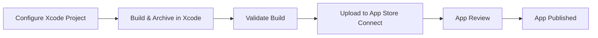

## 12.2.1 Building for iOS

Deploying a Flutter application on iOS involves several steps that require careful attention to detail, especially given the unique requirements of Apple's ecosystem. This guide will walk you through the entire process, from setting up your development environment on a Mac to configuring your project in Xcode, building your app, and finally deploying it to the App Store. By the end of this section, you will have a solid understanding of how to efficiently build and deploy your Flutter app for iOS.

### Prerequisites

Before you begin, ensure you have the following prerequisites in place:

- **A Mac with Xcode Installed:** Developing iOS applications requires a Mac computer with Xcode, Apple's integrated development environment for macOS. Xcode includes all the necessary tools to build, test, and deploy iOS apps.

- **Apple Developer Account:** To distribute your app on the App Store or test it on physical devices, you need an Apple Developer account. This account provides access to essential services such as App Store Connect and TestFlight.

### Configuring the iOS Project

Once you have your prerequisites set up, the next step is to configure your iOS project within Xcode. This involves setting the deployment target, bundle identifier, and other project-specific settings.

#### Navigating to the iOS Project in Xcode

1. Open your Flutter project in your preferred IDE.
2. Navigate to the `ios` directory and open `Runner.xcodeproj` in Xcode.

#### Setting the Deployment Target and Bundle Identifier

The deployment target specifies the minimum iOS version your app supports. The bundle identifier uniquely identifies your app in the Apple ecosystem.

- **Deployment Target:** Set this to the minimum iOS version you want to support. This is done in Xcode under the "General" tab of your project settings.

  ```swift
  // In Xcode: General -> Deployment Info
  Deployment Target: 12.0
  ```

- **Bundle Identifier:** Ensure your bundle identifier matches the one registered in your Apple Developer account. This is crucial for code signing and app distribution.

### Building the iOS App

Building your iOS app can be done using Xcode's graphical interface or via the command line. Both methods have their advantages, and you can choose based on your preference or workflow requirements.

#### Using Xcode

Xcode provides a user-friendly interface to build and archive your app for distribution.

**Step-by-Step Guide:**

1. **Select Target Device:** Choose `Generic iOS Device` from the device list. This option is necessary for archiving the app.

2. **Archive the App:**
   - Navigate to `Product` > `Archive`. This process compiles your app and prepares it for distribution.

3. **Validate and Upload:**
   - Once the archive is complete, Xcode's Organizer will open. Use this tool to validate your build and upload it to App Store Connect.

#### Using Command Line

For those who prefer automation or need to integrate with CI/CD pipelines, the command line offers a powerful alternative.

**Code Example:**

```bash
xcodebuild -workspace ios/Runner.xcworkspace -scheme Runner -configuration Release archive -archivePath build/Runner.xcarchive
xcodebuild -exportArchive -archivePath build/Runner.xcarchive -exportOptionsPlist exportOptions.plist -exportPath build/
```

- **Explanation:**
  - The first command archives the app using the specified workspace and scheme.
  - The second command exports the archive using options defined in `exportOptions.plist`.

### Testing on Physical Devices

Testing your app on physical devices is crucial to ensure it behaves as expected in real-world scenarios.

- **Connect Your Device:** Use a USB cable to connect your iOS device to your Mac.
- **Deploy the App:** Use the following command to install and run your app on the connected device.

  ```bash
  flutter run --release
  ```

This command builds the app in release mode and installs it on the device, providing a more accurate representation of the app's performance in production.

### Handling iOS-Specific Issues

Deploying on iOS can present unique challenges. Here are some common issues and tips to resolve them:

- **Code Signing Errors:** Ensure your certificates and provisioning profiles are correctly set up in Xcode. This often involves managing your profiles in the Apple Developer portal and ensuring they match your project's settings.

- **Missing Permissions:** iOS requires explicit permissions for accessing certain device features. Ensure your `Info.plist` includes the necessary keys for permissions like camera, location, etc.

- **Dependency Conflicts:** Flutter plugins may have native dependencies that conflict with your project settings. Check the plugin documentation and ensure compatibility with your iOS deployment target.

### Diagram: iOS Build and Deployment Process

To visualize the iOS build and deployment process, refer to the following Mermaid.js diagram:



### Conclusion

Building and deploying Flutter apps for iOS involves several steps that require careful configuration and testing. By following the guidelines outlined in this section, you can streamline the process and ensure your app is ready for distribution on the App Store. Remember to regularly consult Apple's official documentation and the Flutter community for updates and best practices.

## Quiz Time!



### What is the minimum requirement for developing iOS apps using Flutter?

- [x] A Mac with Xcode installed
- [ ] A Windows PC with Android Studio
- [ ] An Android device
- [ ] A Linux machine

> **Explanation:** Developing iOS apps requires a Mac with Xcode, as Xcode is necessary for building and deploying iOS applications.

### Why is an Apple Developer account necessary for iOS app deployment?

- [x] To distribute apps on the App Store and test on physical devices
- [ ] To access Android development tools
- [ ] To use Flutter's hot reload feature
- [ ] To write Swift code

> **Explanation:** An Apple Developer account is required to distribute apps on the App Store and to test apps on physical iOS devices.

### Where do you set the deployment target in Xcode?

- [x] General -> Deployment Info
- [ ] Build Settings -> Deployment Target
- [ ] Info.plist
- [ ] Runner.xcodeproj

> **Explanation:** The deployment target is set in Xcode under the "General" tab in the "Deployment Info" section.

### Which command is used to archive an iOS app using the command line?

- [x] `xcodebuild -workspace ios/Runner.xcworkspace -scheme Runner -configuration Release archive -archivePath build/Runner.xcarchive`
- [ ] `flutter build ios`
- [ ] `xcodebuild -build`
- [ ] `flutter run`

> **Explanation:** The `xcodebuild` command with the specified options is used to archive an iOS app from the command line.

### How can you test a Flutter app on a physical iOS device?

- [x] Connect the device and use `flutter run --release`
- [ ] Use an Android emulator
- [ ] Deploy directly from the App Store
- [ ] Use `flutter test`

> **Explanation:** To test on a physical iOS device, connect the device to your Mac and use the `flutter run --release` command.

### What is a common issue when deploying iOS apps?

- [x] Code signing errors
- [ ] Missing Android SDK
- [ ] Incorrect Java version
- [ ] Incompatible Windows drivers

> **Explanation:** Code signing errors are a common issue when deploying iOS apps, often due to misconfigured certificates or provisioning profiles.

### What file is used to specify export options when using `xcodebuild`?

- [x] exportOptions.plist
- [ ] Info.plist
- [ ] Podfile
- [ ] Runner.xcodeproj

> **Explanation:** The `exportOptions.plist` file is used to specify export options when using `xcodebuild` to export an archive.

### What is the purpose of the `flutter run --release` command?

- [x] To build and install the app on a connected device in release mode
- [ ] To start the Flutter development server
- [ ] To run unit tests
- [ ] To deploy the app to the App Store

> **Explanation:** The `flutter run --release` command builds and installs the app on a connected device in release mode, providing a production-like environment.

### What should you do if you encounter dependency conflicts in your iOS project?

- [x] Check plugin documentation and ensure compatibility with your iOS deployment target
- [ ] Ignore the conflicts and proceed
- [ ] Switch to Android development
- [ ] Use an older version of Flutter

> **Explanation:** If you encounter dependency conflicts, check the plugin documentation and ensure compatibility with your iOS deployment target.

### True or False: You can develop iOS apps using Flutter on a Windows machine.

- [ ] True
- [x] False

> **Explanation:** Developing iOS apps requires a Mac with Xcode, as Xcode is necessary for building and deploying iOS applications.


