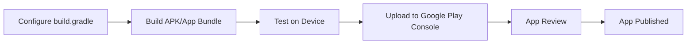

## 12.2.2 Building for Android

Building and deploying your Flutter application for Android involves several steps, from setting up your development environment to configuring your project for release. This guide will walk you through the process, ensuring that your app is ready for distribution on the Google Play Store.

### Prerequisites

Before you begin building your Flutter app for Android, ensure that you have the following prerequisites in place:

- **Android Studio Installation:** Android Studio is the official integrated development environment (IDE) for Android app development. It provides the tools necessary to build, test, and debug Android applications. Make sure Android Studio is installed and properly configured on your machine. You can download it from the [official Android Studio website](https://developer.android.com/studio).

- **Google Play Developer Account:** To distribute your app on the Google Play Store, you need a Google Play Developer account. This account allows you to upload your app, manage its distribution, and access analytics. You can sign up for an account at the [Google Play Console](https://play.google.com/console).

### Configuring the Android Project

Once your development environment is set up, the next step is to configure your Android project for release. This involves setting up the `android/app/build.gradle` file with appropriate signing configurations.

#### Setting Up `build.gradle`

The `build.gradle` file is crucial for defining how your app is built and packaged. It includes configurations for signing your app, enabling or disabling code minification, and specifying ProGuard rules.

Here's an example snippet for configuring a release build in `build.gradle`:

```groovy
android {
    compileSdkVersion 33
    defaultConfig {
        applicationId "com.example.myapp"
        minSdkVersion 21
        targetSdkVersion 33
        versionCode 1
        versionName "1.0"
    }
    buildTypes {
        release {
            signingConfig signingConfigs.release
            minifyEnabled false
            shrinkResources false
            proguardFiles getDefaultProguardFile('proguard-android-optimize.txt'), 'proguard-rules.pro'
        }
    }
}
```

**Key Points:**
- **Signing Configurations:** Ensure you have a `signingConfig` set up for release builds. This involves creating a keystore and configuring the `signingConfigs` block.
- **Minification and Resource Shrinking:** By default, these are disabled (`minifyEnabled false` and `shrinkResources false`) to simplify the build process, but you can enable them for production to reduce the app size.

### Building the APK or App Bundle

Flutter provides multiple ways to build your Android app, either as an APK or an App Bundle. An APK is a single file that contains all the resources and code for your app, while an App Bundle is a more efficient packaging format that allows Google Play to generate optimized APKs for different device configurations.

#### Using Flutter CLI

The Flutter command-line interface (CLI) offers straightforward commands to build your app:

- **Building a Release APK:**

  ```bash
  flutter build apk --release
  ```

  This command generates a release APK that you can distribute directly or upload to the Play Store.

- **Building a Release App Bundle:**

  ```bash
  flutter build appbundle --release
  ```

  App Bundles are recommended for publishing on the Play Store as they allow for optimized APK delivery.

#### Using Android Studio

Android Studio provides a graphical interface to build your app:

1. Open your Flutter project in Android Studio.
2. Navigate to `Build > Generate Signed Bundle / APK`.
3. Follow the wizard to select either APK or App Bundle, configure signing, and complete the build process.

### Testing on Physical Devices

Testing your app on a physical device is crucial to ensure it performs well in real-world conditions. Here's how you can deploy your app for testing:

- **Connecting an Android Device:**
  - Enable Developer Options and USB Debugging on your device.
  - Connect your device to your computer via USB.

- **Deploying the App:**

  Use the following command to install the app directly on your device:

  ```bash
  flutter run --release
  ```

  This command builds and installs the app on the connected device, allowing you to test its performance and functionality.

### Handling Android-Specific Issues

Building for Android can sometimes present challenges such as Gradle build errors, missing permissions, or dependency conflicts. Here are some common issues and troubleshooting tips:

- **Gradle Build Errors:** Ensure that your Gradle version is compatible with your Android SDK and Flutter version. Update dependencies and check for any deprecated configurations.

- **Missing Permissions:** Verify that all necessary permissions are declared in `AndroidManifest.xml`. For example, if your app requires internet access, include `<uses-permission android:name="android.permission.INTERNET"/>`.

- **Dependency Conflicts:** Use the `./gradlew app:dependencies` command to inspect dependency versions and resolve conflicts by aligning versions or excluding transitive dependencies.

### Diagram: Android Build and Deployment Process

Below is a flowchart illustrating the Android build and deployment process:



### Conclusion

Building a Flutter app for Android involves configuring your project, building the app, testing it on devices, and handling any platform-specific issues. By following these steps, you can ensure a smooth deployment process and prepare your app for distribution on the Google Play Store.

For further reading and resources, consider exploring the [Flutter documentation](https://flutter.dev/docs/deployment/android) and the [Android Developer Guide](https://developer.android.com/guide).

## Quiz Time!



### What is the purpose of the `build.gradle` file in an Android project?

- [x] To define how the app is built and packaged
- [ ] To store app resources like images and strings
- [ ] To manage user interface layouts
- [ ] To handle user authentication

> **Explanation:** The `build.gradle` file is used to configure the build process, including signing, minification, and ProGuard rules.

### Which command is used to build a release APK using the Flutter CLI?

- [x] `flutter build apk --release`
- [ ] `flutter build appbundle --release`
- [ ] `flutter run --release`
- [ ] `flutter deploy apk --release`

> **Explanation:** The `flutter build apk --release` command generates a release APK for distribution.

### What is the advantage of using an App Bundle over an APK for distribution on the Play Store?

- [x] It allows Google Play to generate optimized APKs for different device configurations.
- [ ] It reduces the app's memory usage.
- [ ] It simplifies the app's codebase.
- [ ] It enhances the app's graphics performance.

> **Explanation:** App Bundles enable Google Play to deliver optimized APKs tailored to specific device configurations, improving efficiency.

### How can you test your Flutter app on a physical Android device?

- [x] Connect the device via USB and use `flutter run --release`
- [ ] Use the Android Emulator in Android Studio
- [ ] Deploy the app to the Google Play Store
- [ ] Use a third-party testing service

> **Explanation:** Connecting a device via USB and using `flutter run --release` installs the app directly for testing.

### What should you do if you encounter a Gradle build error?

- [x] Ensure compatibility between Gradle, Android SDK, and Flutter versions
- [ ] Restart your computer
- [ ] Reinstall Android Studio
- [ ] Ignore the error and proceed with the build

> **Explanation:** Gradle build errors often arise from version incompatibilities, which can be resolved by ensuring compatibility.

### Which file should you modify to declare necessary permissions for your app?

- [x] `AndroidManifest.xml`
- [ ] `build.gradle`
- [ ] `pubspec.yaml`
- [ ] `MainActivity.java`

> **Explanation:** Permissions are declared in `AndroidManifest.xml` to ensure the app has the necessary access.

### What is the primary role of a Google Play Developer account?

- [x] To upload and manage app distribution on the Google Play Store
- [ ] To provide cloud storage for app data
- [ ] To offer customer support for app users
- [ ] To develop Android apps using Flutter

> **Explanation:** A Google Play Developer account is required to upload and manage apps on the Play Store.

### How can you resolve dependency conflicts in an Android project?

- [x] Align versions or exclude transitive dependencies
- [ ] Remove all dependencies from the project
- [ ] Use only default Android libraries
- [ ] Reinstall the Flutter SDK

> **Explanation:** Aligning versions or excluding transitive dependencies helps resolve conflicts between libraries.

### What is the recommended way to distribute an app on the Google Play Store?

- [x] Use an App Bundle for optimized delivery
- [ ] Use a debug APK for faster deployment
- [ ] Use a signed APK for direct installation
- [ ] Use a ZIP file containing the app's source code

> **Explanation:** App Bundles are recommended for Play Store distribution due to their optimized delivery capabilities.

### True or False: Minification and resource shrinking are always enabled by default in release builds.

- [ ] True
- [x] False

> **Explanation:** Minification and resource shrinking are not enabled by default; they must be configured explicitly.


