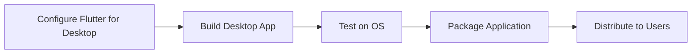

## 12.2.4 Desktop Application Deployment

Flutter's capability to build applications for desktop platforms such as Windows, macOS, and Linux opens up a world of possibilities for developers seeking to create cross-platform applications. This section will guide you through the process of deploying your Flutter applications on desktop environments, ensuring a smooth transition from mobile to desktop.

### Prerequisites

Before diving into desktop application deployment, ensure that your Flutter environment is configured to support desktop development. This involves enabling desktop support for your target platforms.

#### Enabling Desktop Support

To enable desktop support in Flutter, you need to configure your Flutter environment for each target platform. Run the following commands in your terminal to enable desktop support:

```bash
flutter config --enable-windows-desktop
flutter config --enable-macos-desktop
flutter config --enable-linux-desktop
```

These commands configure Flutter to include desktop-specific components and libraries necessary for building applications on Windows, macOS, and Linux.

### Configuring the Desktop Project

Once desktop support is enabled, it's essential to understand the directory structure and platform-specific configurations required for desktop targets. This section will cover how to set up your project for desktop deployment, including necessary dependencies and permissions.

#### Directory Structure and Configuration

Flutter projects targeting desktop platforms have a specific directory structure that includes platform-specific folders. Here's a brief overview:

- **Windows**: The `windows` directory contains platform-specific code and resources.
- **macOS**: The `macos` directory holds macOS-specific files and configurations.
- **Linux**: The `linux` directory is where Linux-specific code resides.

Each of these directories includes a `CMakeLists.txt` file, which is used to configure the build process for the respective platform. You may need to adjust these files to include additional libraries or dependencies specific to your application.

#### Setting Up Dependencies

In your `pubspec.yaml` file, you can specify platform-specific dependencies. Here's an example configuration for a Windows plugin:

```yaml
flutter:
  plugins:
    windows:
      pluginClass: MyPlugin
```

This configuration tells Flutter to use a specific plugin class for Windows, allowing you to integrate platform-specific functionality.

### Building the Desktop Application

Building your Flutter application for desktop platforms can be done using the Flutter CLI or through an Integrated Development Environment (IDE) like Visual Studio Code or Android Studio.

#### Using Flutter CLI

The Flutter CLI provides commands to build your application for each desktop platform. Here are the commands for building your app:

- **Building for Windows**:
  ```bash
  flutter build windows --release
  ```

- **Building for macOS**:
  ```bash
  flutter build macos --release
  ```

- **Building for Linux**:
  ```bash
  flutter build linux --release
  ```

These commands compile your Flutter application into a native desktop application, ready for testing and distribution.

#### Using IDEs

Building your application using an IDE can provide a more visual and integrated experience. Here's how you can build and run your desktop application using Visual Studio Code or Android Studio:

- **Visual Studio Code**:
  - Open your project in VS Code.
  - Use the terminal to run the build commands or use the built-in debug tools to run your application.

- **Android Studio**:
  - Open your project in Android Studio.
  - Configure the run configurations for desktop targets and use the Run button to build and execute your application.

### Packaging and Distribution

Once your application is built, the next step is packaging it for distribution. This involves creating installers or packages suitable for each platform.

#### Creating Installers

For each platform, you can use different tools to package your application:

- **Windows**: Use tools like Inno Setup or NSIS to create installers.
- **macOS**: Create DMG files using tools like `create-dmg`.
- **Linux**: Use AppImage, DEB, or RPM packages for distribution.

If you're integrating with Electron for additional features, you can use `electron-builder` to package your application. Here's an example configuration:

```json
{
  "build": {
    "appId": "com.example.flutterapp",
    "mac": {
      "category": "public.app-category.productivity"
    },
    "win": {
      "target": "nsis"
    },
    "linux": {
      "target": "AppImage"
    }
  }
}
```

This configuration specifies the packaging targets for each platform, allowing you to create installers that users can easily download and install.

### Testing on Different Desktop Environments

Testing your application across various desktop environments and screen resolutions is crucial to ensure a consistent user experience. Consider the following testing strategies:

- **Cross-Platform Testing**: Test your application on Windows, macOS, and Linux to identify platform-specific issues.
- **Resolution Testing**: Test your application on different screen resolutions to ensure your UI adapts correctly.
- **Performance Testing**: Evaluate the performance of your application on different hardware configurations to identify potential bottlenecks.

### Handling Desktop-Specific Issues

Deploying applications on desktop platforms introduces unique challenges, such as window management, keyboard and mouse interactions, and platform-specific APIs. Here are some common issues and tips for addressing them:

- **Window Management**: Ensure your application handles window resizing and full-screen modes correctly.
- **Input Handling**: Test keyboard shortcuts and mouse interactions to ensure they work as expected.
- **Platform APIs**: Use platform-specific APIs judiciously, and provide fallbacks for unsupported features.

#### Troubleshooting Tips

- **Debugging**: Use the Flutter DevTools to inspect and debug your application.
- **Logging**: Implement logging to capture errors and unexpected behavior.
- **Community Support**: Engage with the Flutter community for support and advice on platform-specific challenges.

### Diagram: Desktop Deployment Process

Below is a Mermaid.js flowchart depicting the desktop deployment process across different operating systems:



This flowchart illustrates the sequential steps involved in deploying a Flutter application on desktop platforms, from configuration to distribution.

### Conclusion

Deploying Flutter applications on desktop platforms is a powerful way to reach a broader audience and leverage the capabilities of different operating systems. By following the steps outlined in this guide, you can ensure a smooth deployment process and deliver a high-quality user experience across Windows, macOS, and Linux.

Remember to test thoroughly, handle platform-specific issues, and engage with the community for support and best practices. With these skills, you're well-equipped to expand your Flutter applications beyond mobile devices and into the desktop realm.

## Quiz Time!



### What command enables Flutter for Windows desktop development?

- [x] `flutter config --enable-windows-desktop`
- [ ] `flutter enable windows`
- [ ] `flutter setup windows-desktop`
- [ ] `flutter desktop --enable-windows`

> **Explanation:** The correct command to enable Flutter for Windows desktop development is `flutter config --enable-windows-desktop`.

### Which file in a Flutter project contains platform-specific configurations for desktop targets?

- [x] `CMakeLists.txt`
- [ ] `pubspec.yaml`
- [ ] `main.dart`
- [ ] `flutter.yaml`

> **Explanation:** The `CMakeLists.txt` file contains platform-specific configurations for desktop targets.

### What tool can be used to create a Windows installer for a Flutter desktop application?

- [x] NSIS
- [ ] DMG Creator
- [ ] AppImage
- [ ] RPM Builder

> **Explanation:** NSIS is a tool that can be used to create a Windows installer for a Flutter desktop application.

### What is the purpose of the `electron-builder` configuration in the context of Flutter desktop deployment?

- [x] To package the application for distribution on various platforms
- [ ] To build the application for mobile devices
- [ ] To enable desktop support in Flutter
- [ ] To configure the application's UI

> **Explanation:** The `electron-builder` configuration is used to package the application for distribution on various platforms.

### Which of the following is a common challenge when deploying Flutter applications on desktop platforms?

- [x] Window management
- [ ] Network connectivity
- [ ] Battery optimization
- [ ] GPS integration

> **Explanation:** Window management is a common challenge when deploying Flutter applications on desktop platforms.

### What command is used to build a Flutter application for macOS?

- [x] `flutter build macos --release`
- [ ] `flutter build macos`
- [ ] `flutter deploy macos`
- [ ] `flutter run macos`

> **Explanation:** The command `flutter build macos --release` is used to build a Flutter application for macOS.

### Why is it important to test a Flutter desktop application on different screen resolutions?

- [x] To ensure the UI adapts correctly
- [ ] To check network performance
- [ ] To verify battery usage
- [ ] To test GPS functionality

> **Explanation:** Testing on different screen resolutions is important to ensure the UI adapts correctly.

### What is the role of the `pubspec.yaml` file in a Flutter project?

- [x] It specifies dependencies and configuration for the project
- [ ] It contains the main application logic
- [ ] It defines the UI layout
- [ ] It manages the application's state

> **Explanation:** The `pubspec.yaml` file specifies dependencies and configuration for the project.

### Which tool can be used to create a DMG file for a macOS Flutter application?

- [x] `create-dmg`
- [ ] NSIS
- [ ] AppImage
- [ ] RPM Builder

> **Explanation:** The `create-dmg` tool can be used to create a DMG file for a macOS Flutter application.

### True or False: The `flutter build linux --release` command is used to build a Flutter application for Linux.

- [x] True
- [ ] False

> **Explanation:** The statement is true. The `flutter build linux --release` command is used to build a Flutter application for Linux.


