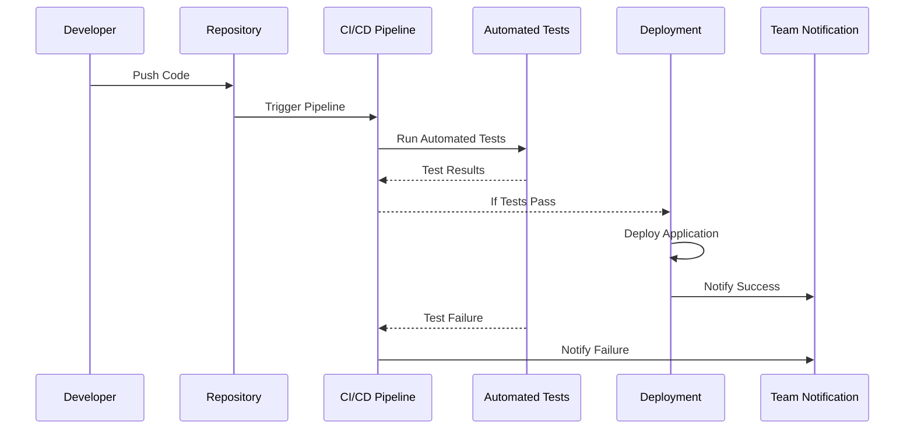

## 12.3.3 Automated Testing and Deployment

In the fast-paced world of software development, ensuring the quality and reliability of your Flutter applications is paramount. Automated testing and deployment play a crucial role in achieving these goals by streamlining the development process, reducing manual effort, and catching bugs early. This section delves into the importance of automated testing, the types of tests you can implement, and how to integrate these tests into a Continuous Integration/Continuous Deployment (CI/CD) pipeline. We will also explore how to automate the deployment process and handle notifications to keep your team informed.

### Importance of Automated Testing

Automated testing is a cornerstone of modern software development practices. It offers several benefits that enhance the overall quality and efficiency of your development process:

- **Ensures Code Quality:** Automated tests help maintain code quality by verifying that new changes do not break existing functionality. This is especially important in large codebases where manual testing can be error-prone and time-consuming.
- **Reduces Manual Effort:** By automating repetitive testing tasks, developers can focus on writing code and implementing new features rather than spending time on manual testing.
- **Catches Bugs Early:** Automated tests can be run frequently, allowing developers to catch and fix bugs early in the development cycle, reducing the cost and effort required to address issues later.
- **Facilitates Continuous Integration:** Automated testing is integral to CI/CD pipelines, enabling continuous integration of code changes and ensuring that the application remains stable and functional.

### Types of Automated Tests

Automated testing in Flutter can be categorized into several types, each serving a specific purpose in the testing hierarchy:

#### Unit Tests

Unit tests focus on testing individual functions and classes in isolation. They are the foundation of automated testing and provide the fastest feedback.

- **Purpose:** Verify the correctness of individual units of code.
- **Example:** Testing a utility function that calculates the sum of two numbers.

```dart
import 'package:test/test.dart';
import 'package:my_app/utils/calculator.dart';

void main() {
  test('Calculator adds two numbers', () {
    expect(add(2, 3), 5);
  });
}
```

#### Widget Tests

Widget tests are used to test UI components in isolation. They ensure that widgets render correctly and respond to user interactions as expected.

- **Purpose:** Validate the behavior and appearance of UI components.
- **Example:** Testing a custom button widget.

```dart
import 'package:flutter_test/flutter_test.dart';
import 'package:my_app/widgets/custom_button.dart';

void main() {
  testWidgets('CustomButton displays correct label', (WidgetTester tester) async {
    await tester.pumpWidget(CustomButton(label: 'Press Me'));

    expect(find.text('Press Me'), findsOneWidget);
  });
}
```

#### Integration Tests

Integration tests evaluate the complete app or large parts of it, simulating user interactions across multiple widgets and screens.

- **Purpose:** Test the interaction between different parts of the application.
- **Example:** Testing a login flow.

```dart
import 'package:flutter_test/flutter_test.dart';
import 'package:my_app/main.dart';

void main() {
  testWidgets('Login flow test', (WidgetTester tester) async {
    await tester.pumpWidget(MyApp());

    // Simulate user input and interactions
    await tester.enterText(find.byKey(Key('username')), 'testuser');
    await tester.enterText(find.byKey(Key('password')), 'password123');
    await tester.tap(find.byKey(Key('loginButton')));
    await tester.pumpAndSettle();

    // Verify navigation to the home screen
    expect(find.text('Welcome, testuser!'), findsOneWidget);
  });
}
```

#### End-to-End Tests

End-to-end tests simulate real user interactions across the entire application, from start to finish. They are the most comprehensive type of test but also the slowest to execute.

- **Purpose:** Validate the entire application flow from the user's perspective.
- **Example:** Testing the complete checkout process in an e-commerce app.

### Integrating Tests into CI/CD Pipelines

Integrating automated tests into a CI/CD pipeline ensures that tests are run automatically whenever code changes are made, providing immediate feedback to developers. This integration is crucial for maintaining a high level of code quality and application stability.

#### Incorporating Tests into the Workflow

To incorporate different types of tests into your CI/CD workflow, you can use tools like GitHub Actions, which provide a flexible and powerful platform for automating testing and deployment processes.

**Example: Extending GitHub Actions Workflow to Include Integration Tests**

```yaml
name: Flutter CI

on: [push, pull_request]

jobs:
  build:
    runs-on: ubuntu-latest

    steps:
    - uses: actions/checkout@v2

    - name: Set up Flutter
      uses: subosito/flutter-action@v1
      with:
        flutter-version: '2.5.0'

    - name: Install dependencies
      run: flutter pub get

    - name: Run Unit Tests
      run: flutter test

    - name: Run Widget Tests
      run: flutter test --coverage

    - name: Run Integration Tests
      run: flutter drive --target=test_driver/app.dart
```

### Automated Deployment

Automating the deployment process is the next step in a CI/CD pipeline. Once tests pass successfully, the application can be automatically deployed to app stores or hosting platforms, reducing the time and effort required for manual deployment.

#### Automating Deployment to Firebase Hosting

**Example: Adding Deployment Steps to GitHub Actions**

```yaml
- name: Deploy to Firebase Hosting
  uses: FirebaseExtended/action-hosting-deploy@v0
  with:
    repoToken: '${{ secrets.GITHUB_TOKEN }}'
    firebaseServiceAccount: '${{ secrets.FIREBASE_SERVICE_ACCOUNT }}'
    channelId: live
```

This step uses the Firebase Hosting GitHub Action to deploy your application to Firebase Hosting. Ensure you have the necessary secrets configured in your GitHub repository for authentication.

### Handling Deployment Notifications

Keeping your team informed about the status of builds and deployments is essential for effective collaboration. Automated notifications can be set up to alert the team about the success or failure of builds and deployments.

#### Sending Notifications to Slack

**Example: Sending a Slack Notification Using GitHub Actions**

```yaml
- name: Notify Slack
  uses: joelwmale/slack-action@v1
  with:
    slack_message: "Build and Deployment Successful!"
    slack_webhook_url: ${{ secrets.SLACK_WEBHOOK_URL }}
```

This step sends a notification to a Slack channel using a webhook URL. Ensure that the `SLACK_WEBHOOK_URL` secret is configured in your GitHub repository.

### Diagram: Automated Testing and Deployment Process

The following Mermaid.js sequence diagram illustrates the automated testing and deployment process, highlighting the interactions between different components:



### Best Practices and Common Pitfalls

- **Best Practices:**
  - Ensure comprehensive test coverage by writing unit, widget, integration, and end-to-end tests.
  - Regularly update and maintain your CI/CD pipeline to accommodate changes in your application and testing requirements.
  - Use environment variables and secrets to manage sensitive information securely in your CI/CD workflows.

- **Common Pitfalls:**
  - Overlooking the importance of test maintenance, leading to outdated or irrelevant tests.
  - Neglecting to monitor and review CI/CD pipeline logs, which can help identify issues early.
  - Failing to configure notifications, resulting in a lack of awareness about build and deployment statuses.

### Additional Resources

- [Flutter Testing Documentation](https://flutter.dev/docs/testing)
- [GitHub Actions Documentation](https://docs.github.com/en/actions)
- [Firebase Hosting Documentation](https://firebase.google.com/docs/hosting)
- [Slack API Documentation](https://api.slack.com/messaging/webhooks)

### Conclusion

Automated testing and deployment are essential components of a modern Flutter development workflow. By integrating these processes into your CI/CD pipeline, you can ensure that your applications are of high quality, delivered efficiently, and remain stable as they evolve. Embrace these practices to enhance your development process and deliver exceptional user experiences.

## Quiz Time!



### What is the primary benefit of automated testing in software development?

- [x] Ensures code quality and catches bugs early
- [ ] Reduces the need for documentation
- [ ] Increases the complexity of the codebase
- [ ] Eliminates the need for manual testing entirely

> **Explanation:** Automated testing ensures code quality by catching bugs early and reducing manual effort, but it does not eliminate the need for all manual testing or increase code complexity.

### Which type of test focuses on testing individual functions and classes in isolation?

- [x] Unit Tests
- [ ] Widget Tests
- [ ] Integration Tests
- [ ] End-to-End Tests

> **Explanation:** Unit tests are designed to test individual functions and classes in isolation, ensuring their correctness.

### What is the purpose of widget tests in Flutter?

- [x] Validate the behavior and appearance of UI components
- [ ] Test the entire application flow
- [ ] Simulate real user interactions across multiple screens
- [ ] Test the interaction between different parts of the application

> **Explanation:** Widget tests validate the behavior and appearance of UI components in isolation.

### How can you automate the deployment process in a CI/CD pipeline?

- [x] By adding deployment steps to the CI/CD workflow
- [ ] By manually uploading the app to app stores
- [ ] By writing additional unit tests
- [ ] By using a different programming language

> **Explanation:** Automating deployment involves adding deployment steps to the CI/CD workflow, allowing the application to be deployed automatically once tests pass.

### What is the role of integration tests in a testing hierarchy?

- [x] Test the interaction between different parts of the application
- [ ] Test individual functions and classes
- [ ] Validate the behavior and appearance of UI components
- [ ] Simulate real user interactions across multiple screens

> **Explanation:** Integration tests evaluate the interaction between different parts of the application, ensuring they work together as expected.

### Which tool can be used to send notifications to a Slack channel in a CI/CD pipeline?

- [x] joelwmale/slack-action@v1
- [ ] FirebaseExtended/action-hosting-deploy@v0
- [ ] actions/checkout@v2
- [ ] subosito/flutter-action@v1

> **Explanation:** The `joelwmale/slack-action@v1` tool can be used to send notifications to a Slack channel in a CI/CD pipeline.

### What is a common pitfall when implementing automated testing and deployment?

- [x] Overlooking the importance of test maintenance
- [ ] Writing too many unit tests
- [ ] Using environment variables
- [ ] Regularly updating the CI/CD pipeline

> **Explanation:** A common pitfall is overlooking the importance of test maintenance, which can lead to outdated or irrelevant tests.

### What should you do if automated tests fail in a CI/CD pipeline?

- [x] Notify the team and investigate the failure
- [ ] Ignore the failure and proceed with deployment
- [ ] Manually rerun the tests without changes
- [ ] Disable the failing tests

> **Explanation:** If automated tests fail, it's important to notify the team and investigate the failure to address any issues before proceeding with deployment.

### What is the benefit of using environment variables in a CI/CD workflow?

- [x] Securely manage sensitive information
- [ ] Increase the complexity of the workflow
- [ ] Eliminate the need for secrets
- [ ] Simplify the codebase

> **Explanation:** Environment variables help securely manage sensitive information, such as API keys and tokens, in a CI/CD workflow.

### True or False: Automated testing eliminates the need for all manual testing.

- [ ] True
- [x] False

> **Explanation:** While automated testing reduces the need for manual testing, it does not eliminate it entirely. Some manual testing is still necessary for exploratory testing and scenarios that are difficult to automate.


