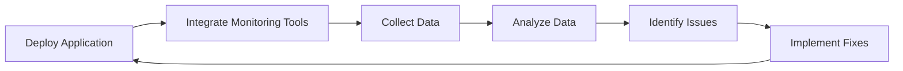

## 12.3.4 Monitoring After Deployment

Deploying a Flutter application is a significant milestone, but the journey doesn't end there. Post-deployment monitoring is crucial for maintaining app performance, identifying issues, and continuously improving the user experience. In this section, we'll explore the importance of monitoring, how to set up essential tools, and strategies for analyzing and acting on the data collected.

### Importance of Post-Deployment Monitoring

Monitoring your application after deployment is vital for several reasons:

- **Maintaining Performance:** Continuous monitoring helps ensure that your app performs well under various conditions and on different devices. It allows you to detect and address performance bottlenecks promptly.
  
- **Identifying Issues:** Real-time monitoring tools can alert you to crashes, errors, and other issues as they occur, enabling you to respond quickly and minimize user impact.
  
- **Improving User Experience:** By analyzing user interactions and behavior, you can gain insights into how users engage with your app and identify areas for improvement.

- **Informed Decision-Making:** Data collected from monitoring tools can guide your development priorities, helping you focus on the most critical issues and enhancements.

### Setting Up Monitoring Tools

To effectively monitor your Flutter application, you'll need to integrate various tools that provide insights into crashes, errors, performance, and user behavior.

#### Firebase Crashlytics

Firebase Crashlytics is a powerful tool for real-time crash reporting. It helps you understand why your app crashes and provides detailed reports to aid in debugging.

**Integration Steps:**

1. **Add Firebase Crashlytics to `pubspec.yaml`:**

   ```yaml
   dependencies:
     firebase_crashlytics: ^2.5.0
   ```

2. **Initialize Crashlytics in Your App:**

   ```dart
   import 'package:firebase_crashlytics/firebase_crashlytics.dart';

   void main() {
     FlutterError.onError = FirebaseCrashlytics.instance.recordFlutterError;
     runApp(MyApp());
   }
   ```

This setup ensures that any uncaught errors in your Flutter app are automatically reported to Firebase Crashlytics.

#### Sentry

Sentry is another popular tool for error tracking and performance monitoring. It provides detailed insights into errors and helps you understand the context in which they occur.

**Integration Steps:**

1. **Initialize Sentry in Flutter:**

   ```dart
   import 'package:sentry_flutter/sentry_flutter.dart';

   Future<void> main() async {
     await SentryFlutter.init(
       (options) {
         options.dsn = 'your_dsn_here';
       },
       appRunner: () => runApp(MyApp()),
     );
   }
   ```

Replace `'your_dsn_here'` with your Sentry Data Source Name (DSN) to start capturing errors and performance data.

#### Analytics Tools

Analytics tools like Firebase Analytics and Mixpanel help you track user interactions and app usage, providing valuable insights into user behavior.

**Integration Steps for Firebase Analytics:**

1. **Add Firebase Analytics to `pubspec.yaml`:**

   ```yaml
   dependencies:
     firebase_analytics: ^9.1.0
   ```

2. **Set Up Firebase Analytics:**

   ```dart
   import 'package:firebase_analytics/firebase_analytics.dart';

   final FirebaseAnalytics analytics = FirebaseAnalytics();

   // Usage example
   analytics.logEvent(
     name: 'button_press',
     parameters: {'button_name': 'start'},
   );
   ```

This setup allows you to log custom events and analyze user engagement.

### Performance Monitoring

Performance monitoring tools like Firebase Performance Monitoring provide insights into your app's performance metrics, such as network requests and rendering times.

**Integration Steps:**

1. **Add Firebase Performance Monitoring to `pubspec.yaml`:**

   ```yaml
   dependencies:
     firebase_performance: ^0.8.0
   ```

2. **Enable Performance Monitoring:**

   ```dart
   import 'package:firebase_performance/firebase_performance.dart';

   final Performance monitoring = FirebasePerformance.instance;

   // Example of a custom trace
   Trace myTrace = monitoring.newTrace("test_trace");
   myTrace.start();
   // ... code to trace ...
   myTrace.stop();
   ```

Custom traces help you measure the performance of specific parts of your app.

### Setting Up Alerts and Notifications

Configuring alerts for critical issues or performance degradations ensures that you're notified promptly when problems arise. Tools like Sentry and Firebase provide options for setting up alerts based on specific conditions.

**Example: Configuring Sentry Alerts**

Refer to the Sentry documentation for detailed steps on setting up alerts based on error frequency, severity, or other criteria. Alerts can be sent via email, Slack, or other integrations to keep your team informed.

### Analyzing and Acting on Data

Once you've collected data from your monitoring tools, the next step is to analyze it and make informed decisions about app improvements.

- **Interpreting Data:** Look for patterns in crash reports, error logs, and performance metrics to identify common issues and areas for optimization.

- **Prioritizing Fixes:** Use the insights gained to prioritize bug fixes and performance enhancements. Focus on high-impact issues that affect the most users.

- **Continuous Improvement:** Regularly review your monitoring data to identify new opportunities for improvement and ensure your app remains stable and performant.

### Diagram: Post-Deployment Monitoring Workflow

To visualize the post-deployment monitoring process, consider the following Mermaid.js flowchart:



This flowchart illustrates the cyclical nature of monitoring, analysis, and improvement, emphasizing the importance of ongoing attention to app performance and user experience.

### Conclusion

Monitoring after deployment is a critical aspect of maintaining a successful Flutter application. By integrating tools like Firebase Crashlytics, Sentry, and performance monitoring solutions, you can gain valuable insights into your app's behavior and make data-driven decisions to enhance user satisfaction. Remember, the goal is not just to fix issues but to continuously improve and adapt your application to meet the evolving needs of your users.

For further exploration, consider diving into the official documentation of these tools and experimenting with different configurations to find the best setup for your app.

## Quiz Time!



### Why is post-deployment monitoring important?

- [x] It helps maintain app performance and identify issues.
- [ ] It is only necessary for large applications.
- [ ] It is primarily used for marketing purposes.
- [ ] It is optional and not recommended for most apps.

> **Explanation:** Post-deployment monitoring is crucial for maintaining app performance, identifying issues, and improving user experience.

### Which tool is used for real-time crash reporting in Flutter?

- [x] Firebase Crashlytics
- [ ] Google Analytics
- [ ] Mixpanel
- [ ] Sentry

> **Explanation:** Firebase Crashlytics is used for real-time crash reporting in Flutter applications.

### How do you initialize Firebase Crashlytics in a Flutter app?

- [x] By setting `FlutterError.onError` to `FirebaseCrashlytics.instance.recordFlutterError`
- [ ] By importing `firebase_core`
- [ ] By adding `firebase_crashlytics` to `pubspec.yaml` only
- [ ] By calling `Firebase.initializeApp()`

> **Explanation:** Initializing Firebase Crashlytics involves setting `FlutterError.onError` to `FirebaseCrashlytics.instance.recordFlutterError`.

### What is the purpose of Sentry in Flutter apps?

- [x] Error tracking and performance monitoring
- [ ] User authentication
- [ ] Database management
- [ ] UI testing

> **Explanation:** Sentry is used for error tracking and performance monitoring in Flutter applications.

### How can you track user interactions in a Flutter app?

- [x] Using Firebase Analytics
- [ ] Using Firebase Crashlytics
- [ ] Using Firebase Performance Monitoring
- [ ] Using Sentry

> **Explanation:** Firebase Analytics is used to track user interactions and app usage.

### What is the role of Firebase Performance Monitoring?

- [x] Tracking app performance metrics
- [ ] Logging user interactions
- [ ] Managing app configurations
- [ ] Providing authentication services

> **Explanation:** Firebase Performance Monitoring tracks app performance metrics like network requests and rendering times.

### Which tool provides options for setting up alerts based on specific conditions?

- [x] Sentry
- [ ] Firebase Analytics
- [ ] Mixpanel
- [ ] Firebase Crashlytics

> **Explanation:** Sentry provides options for setting up alerts based on error frequency, severity, or other criteria.

### What should you do after collecting data from monitoring tools?

- [x] Analyze the data to make informed decisions about app improvements.
- [ ] Ignore the data unless a major issue arises.
- [ ] Use the data solely for marketing purposes.
- [ ] Delete the data to save storage space.

> **Explanation:** After collecting data, you should analyze it to make informed decisions about app improvements.

### What is the first step in the post-deployment monitoring workflow?

- [x] Deploy Application
- [ ] Collect Data
- [ ] Analyze Data
- [ ] Implement Fixes

> **Explanation:** The first step in the post-deployment monitoring workflow is to deploy the application.

### True or False: Monitoring is a one-time process that ends after deployment.

- [ ] True
- [x] False

> **Explanation:** Monitoring is an ongoing process that continues after deployment to ensure app performance and stability.


