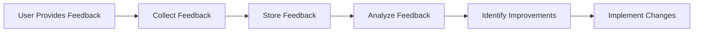

## 12.4.1 Collecting User Feedback

In the fast-paced world of mobile app development, user feedback is a cornerstone for continuous improvement. It provides invaluable insights into how users interact with your application, highlighting areas for enhancement and innovation. In this section, we will explore various strategies for collecting user feedback, from in-app mechanisms to external channels, and discuss how to analyze this feedback to drive meaningful improvements in your Flutter applications.

### Importance of User Feedback

User feedback serves as a direct line to your audience, offering a window into their experiences, preferences, and pain points. By actively seeking and analyzing feedback, developers can:

- **Enhance Usability:** Identify and rectify usability issues that may not be apparent during development.
- **Prioritize Features:** Understand which features are most valued by users and prioritize development accordingly.
- **Improve User Satisfaction:** Address user concerns and suggestions to boost satisfaction and retention.
- **Drive Innovation:** Uncover new ideas and opportunities for future updates and features.

### In-App Feedback Mechanisms

Integrating feedback mechanisms directly into your app ensures that users can easily share their thoughts and experiences without leaving the application. Here are some effective in-app feedback strategies:

#### Feedback Forms

Feedback forms are a straightforward way to gather user input. They can be embedded within the app, allowing users to provide detailed feedback at their convenience. Here's a simple implementation using Flutter widgets:

```dart
class FeedbackForm extends StatefulWidget {
  @override
  _FeedbackFormState createState() => _FeedbackFormState();
}

class _FeedbackFormState extends State<FeedbackForm> {
  final _formKey = GlobalKey<FormState>();
  String _feedback = '';

  @override
  Widget build(BuildContext context) {
    return Form(
      key: _formKey,
      child: Column(
        children: [
          TextFormField(
            decoration: InputDecoration(labelText: 'Your Feedback'),
            onSaved: (value) => _feedback = value ?? '',
            validator: (value) {
              if (value == null || value.isEmpty) {
                return 'Please enter some feedback';
              }
              return null;
            },
          ),
          ElevatedButton(
            onPressed: () {
              if (_formKey.currentState!.validate()) {
                _formKey.currentState!.save();
                // Handle feedback submission
                print('Feedback submitted: $_feedback');
              }
            },
            child: Text('Submit'),
          ),
        ],
      ),
    );
  }
}
```

**Explanation:**
- **Form Validation:** Ensures that users cannot submit empty feedback.
- **State Management:** Uses a simple state management approach to handle form data.
- **Feedback Handling:** Placeholder for integrating feedback submission logic, such as sending data to a server or storing locally.

#### Ratings and Reviews

Implementing a rating system allows users to quickly express their satisfaction level. The `flutter_rating_bar` package is a popular choice for adding star ratings:

```dart
RatingBar.builder(
  initialRating: 3,
  minRating: 1,
  direction: Axis.horizontal,
  allowHalfRating: true,
  itemCount: 5,
  itemBuilder: (context, _) => Icon(
    Icons.star,
    color: Colors.amber,
  ),
  onRatingUpdate: (rating) {
    print('User rating: $rating');
    // Handle rating submission
  },
)
```

**Explanation:**
- **Star Rating:** Provides a visual and intuitive way for users to rate the app.
- **Customization:** Allows for half-star ratings and customization of the number of stars.
- **Rating Handling:** Placeholder for integrating rating submission logic.

### External Feedback Channels

While in-app feedback is convenient, external channels can provide additional insights and reach a broader audience.

- **App Store Reviews:** Encourage users to leave reviews on app stores. Provide direct links within the app to facilitate this process.
- **Feedback Platforms:** Integrate with platforms like UserVoice or Zendesk for structured feedback collection and management.

### Surveys and Questionnaires

Surveys can gather detailed insights on specific aspects of your app. Tools like SurveyMonkey or Google Forms allow you to create comprehensive surveys that can be embedded in the app or distributed via email.

- **Survey Links:** Include links to surveys within the app, prompting users to participate.
- **Email Campaigns:** Send surveys to users via email, targeting specific user segments for more focused feedback.

### Analyzing Feedback

Once feedback is collected, it's crucial to analyze it effectively to extract actionable insights.

- **Categorization:** Organize feedback into categories (e.g., usability, features, bugs) to identify trends and prioritize issues.
- **Sentiment Analysis:** Use sentiment analysis tools to gauge user satisfaction and identify areas of concern.

### Diagram: User Feedback Collection and Analysis Process

Below is a flowchart illustrating the process of collecting and analyzing user feedback:



**Explanation:**
- **Feedback Collection:** The initial step where user feedback is gathered through various channels.
- **Storage and Analysis:** Feedback is stored and analyzed to identify key insights and areas for improvement.
- **Implementation:** Based on analysis, improvements are identified and implemented in future app updates.

### Best Practices and Challenges

- **Encourage Honest Feedback:** Create a welcoming environment for users to share their thoughts without fear of negative repercussions.
- **Act on Feedback:** Demonstrate to users that their feedback is valued by implementing changes and communicating updates.
- **Balance Feedback:** Not all feedback will be actionable or align with your app's vision. Prioritize feedback that aligns with your goals and user needs.

### Additional Resources

- **Official Documentation:** Explore Flutter's [official documentation](https://flutter.dev/docs) for more on integrating feedback mechanisms.
- **Open-Source Projects:** Check out open-source projects on platforms like GitHub for inspiration and implementation examples.
- **Further Reading:** Books like "The Lean Startup" by Eric Ries provide insights into iterative development and feedback loops.

### Conclusion

Collecting user feedback is an ongoing process that requires careful planning and execution. By integrating effective feedback mechanisms and analyzing the data collected, you can continuously improve your Flutter applications, ensuring they meet user needs and expectations. Remember, the ultimate goal is to create a seamless and satisfying user experience that keeps users engaged and satisfied.

## Quiz Time!



### Why is user feedback important for app development?

- [x] It helps improve app features and usability.
- [ ] It increases app download size.
- [ ] It reduces the need for testing.
- [ ] It guarantees app success.

> **Explanation:** User feedback provides insights into user experiences, helping developers enhance app features and usability.

### What is a simple way to collect feedback within a Flutter app?

- [x] Using a feedback form with Flutter widgets.
- [ ] Sending emails to users.
- [ ] Posting on social media.
- [ ] Using push notifications.

> **Explanation:** A feedback form embedded within the app allows users to provide feedback directly and conveniently.

### Which package can be used to implement star ratings in a Flutter app?

- [x] flutter_rating_bar
- [ ] flutter_star_widget
- [ ] rating_flutter
- [ ] star_rating_flutter

> **Explanation:** The `flutter_rating_bar` package is commonly used to implement star ratings in Flutter apps.

### How can external feedback channels be beneficial?

- [x] They provide structured feedback and reach a broader audience.
- [ ] They replace the need for in-app feedback.
- [ ] They reduce app development costs.
- [ ] They automate feedback collection.

> **Explanation:** External channels like app store reviews and feedback platforms offer additional insights and can reach more users.

### What tools can be used to create detailed surveys?

- [x] SurveyMonkey and Google Forms
- [ ] Microsoft Word and Excel
- [ ] Photoshop and Illustrator
- [ ] Slack and Discord

> **Explanation:** SurveyMonkey and Google Forms are tools designed for creating and distributing surveys.

### What is the purpose of sentiment analysis in feedback?

- [x] To gauge user satisfaction and identify areas of concern.
- [ ] To increase app download speed.
- [ ] To automate app updates.
- [ ] To reduce app size.

> **Explanation:** Sentiment analysis helps understand user emotions and satisfaction levels, guiding improvements.

### What should be done after analyzing user feedback?

- [x] Identify improvements and implement changes.
- [ ] Delete all feedback data.
- [ ] Ignore negative feedback.
- [ ] Increase app prices.

> **Explanation:** After analysis, developers should identify actionable improvements and implement them in future updates.

### How can you encourage users to leave app store reviews?

- [x] Provide direct links within the app.
- [ ] Send daily reminders.
- [ ] Offer monetary rewards.
- [ ] Disable app features.

> **Explanation:** Direct links within the app make it easy for users to leave reviews, encouraging participation.

### What is a common challenge in collecting user feedback?

- [x] Balancing feedback with app vision and goals.
- [ ] Collecting too much positive feedback.
- [ ] Avoiding feedback collection.
- [ ] Automating feedback responses.

> **Explanation:** Not all feedback will align with the app's vision, so it's important to balance user input with development goals.

### True or False: User feedback guarantees app success.

- [ ] True
- [x] False

> **Explanation:** While user feedback is crucial for improvement, it does not guarantee success. Other factors like market demand and competition also play a role.


