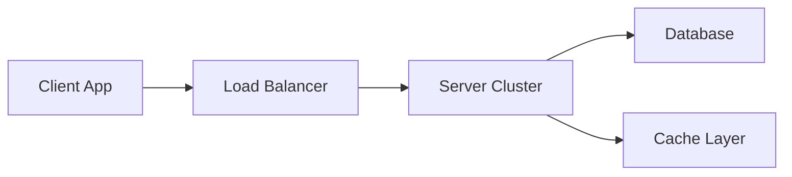

## 12.4.3 Scaling Your App

In the rapidly evolving world of mobile and web applications, scalability is a critical factor that determines the success and longevity of an app. As your user base grows, your app must be able to handle increased loads without compromising performance or user experience. This section delves into the key aspects of scaling your Flutter app, covering both backend and frontend strategies, database optimization, caching, asynchronous programming, load testing, and infrastructure monitoring.

### Understanding Scalability

Scalability refers to an application's ability to handle growth in terms of user load, data volume, and complexity. In the context of mobile and web applications, scalability ensures that your app can accommodate more users, process more transactions, and manage larger datasets without degradation in performance.

- **Importance of Scalability:**
  - **User Experience:** A scalable app maintains a smooth user experience even during peak usage times.
  - **Cost Efficiency:** Efficient scalability can reduce costs by optimizing resource usage.
  - **Future-Proofing:** Designing with scalability in mind prepares your app for future growth and technological advancements.

### Backend Scalability

The backend is the backbone of any application, responsible for data processing, storage, and business logic. A scalable backend can efficiently manage increased loads and provide a seamless experience for users.

- **Scalable Backend Architectures:**
  - **Microservices:** Break down your application into smaller, independent services that can be scaled individually.
  - **Load Balancing:** Distribute incoming network traffic across multiple servers to ensure no single server is overwhelmed.
  - **Database Sharding:** Split your database into smaller, more manageable pieces to improve performance and scalability.

- **Using Firebase for Scalability:**
  Firebase offers a suite of tools that can help scale your backend effortlessly. For instance, Firestore is a NoSQL database that scales automatically.

  **Code Example: Configuring Firebase Firestore for Scalability**

  ```dart
  FirebaseFirestore.instance
      .collection('users')
      .where('active', isEqualTo: true)
      .snapshots();
  ```

  This code snippet demonstrates how to efficiently query active users in a scalable manner using Firebase Firestore.

### Frontend Scalability

While the backend handles data and logic, the frontend is responsible for presenting this data to users. A scalable frontend ensures that your app performs well across various devices and screen sizes.

- **Responsive and Adaptive UIs:**
  Design your app to be responsive and adaptive, ensuring it looks and functions well on all devices.

- **Optimizing Flutter Widgets:**
  Minimize unnecessary widget rebuilds to improve performance. Use tools like `const` constructors and `Keys` to manage widget states efficiently.

### Database Optimization

Efficient database management is crucial for scalability. As your data grows, so does the complexity of managing it.

- **Efficient Querying and Indexing:**
  Use indexes to speed up database queries and reduce load times. Ensure your queries are optimized to fetch only necessary data.

- **Pagination and Lazy Loading:**
  Load data in chunks rather than all at once to improve performance and reduce memory usage.

  **Code Example: Implementing Pagination with `ListView.builder`**

  ```dart
  ListView.builder(
    controller: _scrollController,
    itemCount: _items.length + 1,
    itemBuilder: (context, index) {
      if (index == _items.length) {
        return _isLoading ? CircularProgressIndicator() : SizedBox.shrink();
      }
      return ListTile(title: Text(_items[index]));
    },
  );
  ```

  This example shows how to implement pagination in a Flutter app, loading more items as the user scrolls.

### Caching Strategies

Caching is a powerful technique to reduce server load and improve app responsiveness by storing frequently accessed data locally.

- **Local Caching:**
  Use packages like `hive` or `shared_preferences` to cache data on the device, reducing the need for repeated network requests.

- **Implementing Caching:**
  Cache data that doesn't change often or is expensive to fetch, such as user settings or static content.

### Asynchronous Programming

Asynchronous programming allows your app to perform long-running tasks without blocking the UI, enhancing responsiveness and user experience.

- **Using `FutureBuilder`:**
  Handle asynchronous data fetching and display loading indicators while waiting for data.

  **Code Example: Using `FutureBuilder` for Asynchronous Data Fetching**

  ```dart
  FutureBuilder<Data>(
    future: fetchData(),
    builder: (context, snapshot) {
      if (snapshot.connectionState == ConnectionState.waiting) {
        return CircularProgressIndicator();
      } else if (snapshot.hasError) {
        return Text('Error: ${snapshot.error}');
      } else {
        return Text('Data: ${snapshot.data}');
      }
    },
  )
  ```

  This snippet demonstrates how to use `FutureBuilder` to fetch data asynchronously and update the UI accordingly.

### Load Testing

Load testing evaluates how your app performs under high user traffic, helping identify bottlenecks and areas for improvement.

- **Conducting Load Tests:**
  Use tools like Apache JMeter or BlazeMeter to simulate user load and measure app performance.

- **Analyzing Results:**
  Identify performance bottlenecks and optimize your app based on test results.

### Monitoring and Scaling Infrastructure

Continuous monitoring and scaling of your infrastructure are essential to maintain app performance as user loads fluctuate.

- **Monitoring Tools:**
  Use monitoring tools to track server performance, user activity, and system health.

- **Auto-Scaling Policies:**
  Implement auto-scaling to automatically adjust resources based on current demand, ensuring optimal performance.

**Diagram: Scalable App Infrastructure**



This diagram illustrates a scalable app infrastructure, highlighting the flow from client apps through a load balancer to a server cluster, with connections to a database and cache layer.

### Conclusion

Scaling your Flutter app involves a holistic approach, addressing both backend and frontend challenges. By implementing scalable architectures, optimizing databases, utilizing caching, and conducting thorough load testing, you can ensure your app is prepared to handle growth efficiently. Continuous monitoring and adaptive scaling strategies will help maintain performance and user satisfaction as your app evolves.

## Quiz Time!



### What is scalability in the context of mobile and web applications?

- [x] The ability of an app to handle increased user loads and data volumes.
- [ ] The speed at which an app can be developed.
- [ ] The aesthetic design of an app.
- [ ] The number of features an app has.

> **Explanation:** Scalability refers to an application's ability to manage growth in user load and data volume without compromising performance.

### Which of the following is a scalable backend architecture?

- [x] Microservices
- [ ] Monolithic architecture
- [ ] Single-threaded processing
- [ ] Hard-coded configurations

> **Explanation:** Microservices architecture allows for independent scaling of different services, making it a scalable solution.

### What is the purpose of load balancing in a scalable backend?

- [x] To distribute incoming network traffic across multiple servers.
- [ ] To increase the speed of a single server.
- [ ] To store data more efficiently.
- [ ] To reduce the number of servers needed.

> **Explanation:** Load balancing helps distribute traffic evenly across servers, preventing any single server from becoming overwhelmed.

### How does pagination help in database optimization?

- [x] By loading data in chunks rather than all at once.
- [ ] By storing data in a single table.
- [ ] By duplicating data across multiple servers.
- [ ] By using complex queries to fetch data.

> **Explanation:** Pagination helps manage data loads by fetching data in smaller, manageable chunks, improving performance.

### Which package can be used for local caching in Flutter?

- [x] hive
- [ ] redux
- [x] shared_preferences
- [ ] bloc

> **Explanation:** Both `hive` and `shared_preferences` are used for local caching in Flutter applications.

### What is the role of `FutureBuilder` in asynchronous programming?

- [x] To handle asynchronous data fetching and update the UI.
- [ ] To create synchronous operations.
- [ ] To design UI layouts.
- [ ] To manage database connections.

> **Explanation:** `FutureBuilder` is used to manage asynchronous operations and update the UI based on the data fetched.

### Which tool can be used for load testing an app?

- [x] Apache JMeter
- [ ] Visual Studio Code
- [x] BlazeMeter
- [ ] Dart Analyzer

> **Explanation:** Both Apache JMeter and BlazeMeter are tools used for conducting load tests to evaluate app performance.

### What is the benefit of auto-scaling policies?

- [x] They automatically adjust resources based on demand.
- [ ] They increase the number of servers permanently.
- [ ] They reduce the need for monitoring.
- [ ] They eliminate the need for load testing.

> **Explanation:** Auto-scaling policies help maintain optimal performance by adjusting resources according to current demand.

### What does the `const` keyword help with in Flutter?

- [x] Minimizing unnecessary widget rebuilds.
- [ ] Increasing the size of the app.
- [ ] Making widgets mutable.
- [ ] Slowing down the app.

> **Explanation:** The `const` keyword helps in minimizing unnecessary widget rebuilds, improving performance.

### True or False: Caching can reduce server load and improve app responsiveness.

- [x] True
- [ ] False

> **Explanation:** Caching stores frequently accessed data locally, reducing the need for repeated server requests and improving responsiveness.


