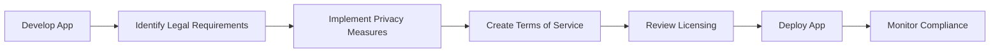

## 12.4.4 Legal and Compliance Considerations

Deploying a Flutter application involves more than just technical considerations; it requires a thorough understanding of legal and compliance issues that can significantly impact your app's success and longevity. This section explores the critical legal considerations for app deployment, focusing on data privacy, intellectual property, user agreements, and more. By understanding these aspects, you can ensure that your app not only meets user expectations but also adheres to legal standards.

### Understanding Legal Requirements

When deploying an app, developers must navigate a complex landscape of legal requirements. These include data privacy laws, intellectual property rights, user agreements, accessibility standards, and export regulations. Each of these areas has specific implications for how you design, develop, and deploy your application.

- **Data Privacy:** Protecting user data is paramount, and regulations like GDPR (General Data Protection Regulation) and CCPA (California Consumer Privacy Act) set strict guidelines on how personal data should be handled.
- **Intellectual Property:** Ensuring that all content within your app, such as images, fonts, and third-party libraries, complies with licensing agreements is crucial to avoid legal disputes.
- **User Agreements:** Clear Terms of Service and Privacy Policy documents are essential to define the legal relationship between you and your users.
- **Accessibility:** Making your app accessible to users with disabilities is not only a legal requirement in many jurisdictions but also a best practice for reaching a wider audience.
- **Export Regulations:** Apps that include encryption or other regulated technologies may be subject to export controls, requiring careful consideration of international laws.

### Data Privacy and Protection

Data privacy is a critical concern for app developers, especially with the increasing number of regulations aimed at protecting user information. Understanding and implementing these regulations is essential to avoid legal penalties and build trust with your users.

#### Key Regulations

- **GDPR:** The General Data Protection Regulation is a comprehensive data protection law in the European Union that affects any app handling EU citizens' data. It requires explicit user consent for data collection and provides users with rights over their data.
- **CCPA:** The California Consumer Privacy Act grants California residents rights similar to GDPR, including the right to know what personal data is being collected and the ability to opt-out of data sales.

#### Obtaining User Consent

Obtaining user consent for data collection and usage is a fundamental requirement under GDPR and similar regulations. This involves presenting users with clear information about what data is collected and how it will be used, and obtaining their explicit consent.

**Code Example: Implementing a GDPR-Compliant Privacy Consent Dialog**

```dart
showDialog(
  context: context,
  builder: (BuildContext context) {
    return AlertDialog(
      title: Text('Privacy Consent'),
      content: Text('We use your data to improve the app. Do you agree?'),
      actions: [
        TextButton(
          onPressed: () {
            // Handle rejection
          },
          child: Text('No'),
        ),
        TextButton(
          onPressed: () {
            // Handle acceptance
          },
          child: Text('Yes'),
        ),
      ],
    );
  },
);
```

This dialog provides a simple way to obtain user consent, ensuring that users are informed and have the option to agree or disagree with the data usage terms.

### Intellectual Property

Intellectual property (IP) rights are crucial for protecting the unique content and features of your app. Ensuring compliance with IP laws involves verifying that all content, including images, fonts, and third-party libraries, is used legally.

#### Licensing Agreements

- **Images and Fonts:** Ensure that all visual assets are either created by you, licensed appropriately, or sourced from platforms that provide royalty-free content.
- **Third-Party Libraries:** Review the licenses of any external libraries or frameworks used in your app to ensure compliance with their terms.

#### Creating Original Content

When possible, create original content for your app. This not only avoids potential legal issues but also enhances your app's uniqueness and value.

### Terms of Service and Privacy Policy

Having clear and comprehensive Terms of Service (ToS) and Privacy Policy documents is essential for defining the legal relationship between you and your users. These documents should outline user rights, your responsibilities, and how user data will be handled.

**Code Example: Linking to Privacy Policy Within the App**

```dart
TextButton(
  onPressed: () {
    launch('https://yourapp.com/privacy');
  },
  child: Text('Privacy Policy'),
)
```

This code snippet demonstrates how to provide users with easy access to your Privacy Policy, ensuring transparency and compliance with legal requirements.

### Accessibility Compliance

Accessibility is a crucial aspect of app development, ensuring that your app can be used by people with disabilities. Compliance with accessibility guidelines, such as the Web Content Accessibility Guidelines (WCAG), is not only a legal requirement in many regions but also a best practice for inclusivity.

#### Implementing Accessibility in Flutter

Flutter provides several tools and widgets to help developers create accessible apps. For example, the `Semantics` widget can be used to provide additional context to screen readers, making your app more usable for visually impaired users.

### Export Regulations

Apps that include encryption or other regulated technologies may be subject to export controls. Understanding these regulations is essential to ensure compliance when distributing your app internationally.

#### Resources for Export Compliance

- **Bureau of Industry and Security (BIS):** Provides guidelines on export controls for software and technology.
- **European Union Export Controls:** Offers information on EU-specific export regulations.

### Age Restrictions and Content Ratings

Setting appropriate content ratings and age restrictions is important for ensuring that your app is suitable for its intended audience. This involves evaluating your app's content and determining the appropriate rating based on guidelines from app stores and regulatory bodies.

#### Restricting Access Based on Age

Implementing age verification mechanisms can help ensure that users meet the minimum age requirements for your app's content.

### Handling Legal Disputes

Despite best efforts, legal disputes may arise. Having strategies in place to manage these disputes is essential for protecting your app and business.

#### Strategies for Managing Legal Disputes

- **Proper Documentation:** Maintain thorough records of all agreements, licenses, and user interactions.
- **Legal Counsel:** Seek professional legal advice to navigate complex legal issues and disputes.

### Diagram: Legal Compliance Process

To visualize the legal compliance process, consider the following Mermaid.js flowchart:



This flowchart outlines the key steps in ensuring legal compliance throughout the app development and deployment process.

### Conclusion

Understanding and implementing legal and compliance considerations is a critical aspect of deploying a successful Flutter application. By addressing data privacy, intellectual property, user agreements, accessibility, and other legal issues, you can protect your app and users while building trust and credibility. As you continue to develop and deploy apps, keep these considerations in mind to ensure compliance and success in the global market.

## Quiz Time!



### What is a key legal consideration for app deployment?

- [x] Data privacy
- [ ] App performance
- [ ] User interface design
- [ ] Marketing strategies

> **Explanation:** Data privacy is a critical legal consideration for app deployment, ensuring user data is protected and regulations are followed.

### Which regulation requires explicit user consent for data collection?

- [x] GDPR
- [ ] CCPA
- [ ] HIPAA
- [ ] COPPA

> **Explanation:** GDPR requires explicit user consent for data collection and provides users with rights over their data.

### What is the purpose of a Privacy Policy?

- [x] To outline how user data is handled
- [ ] To improve app performance
- [ ] To design user interfaces
- [ ] To market the app

> **Explanation:** A Privacy Policy outlines how user data is collected, used, and protected, ensuring transparency and compliance.

### Why is accessibility compliance important?

- [x] To make apps usable for people with disabilities
- [ ] To enhance app performance
- [ ] To improve marketing strategies
- [ ] To reduce development costs

> **Explanation:** Accessibility compliance ensures that apps are usable for people with disabilities, promoting inclusivity and meeting legal requirements.

### What should you do if a legal dispute arises?

- [x] Seek legal counsel
- [ ] Ignore the issue
- [ ] Focus on app performance
- [x] Maintain proper documentation

> **Explanation:** Seeking legal counsel and maintaining proper documentation are essential steps in managing legal disputes effectively.

### What is the role of the Semantics widget in Flutter?

- [x] To provide context for screen readers
- [ ] To enhance app performance
- [ ] To improve user interface design
- [ ] To handle data privacy

> **Explanation:** The Semantics widget provides additional context to screen readers, improving accessibility for visually impaired users.

### Which of the following is a resource for understanding export compliance?

- [x] Bureau of Industry and Security (BIS)
- [ ] App Store Guidelines
- [ ] Flutter Documentation
- [ ] Marketing Strategies

> **Explanation:** The Bureau of Industry and Security (BIS) provides guidelines on export controls for software and technology.

### How can you restrict access to certain content based on age?

- [x] Implement age verification mechanisms
- [ ] Improve app performance
- [ ] Enhance user interface design
- [ ] Focus on marketing strategies

> **Explanation:** Implementing age verification mechanisms helps ensure that users meet the minimum age requirements for accessing certain content.

### What is the importance of intellectual property compliance?

- [x] To avoid legal disputes over content usage
- [ ] To improve app performance
- [ ] To enhance user interface design
- [ ] To focus on marketing strategies

> **Explanation:** Intellectual property compliance ensures that all content used in the app is legally sourced, avoiding potential legal disputes.

### True or False: Export regulations only apply to physical goods.

- [ ] True
- [x] False

> **Explanation:** Export regulations also apply to software and technology, especially those involving encryption or other regulated technologies.


