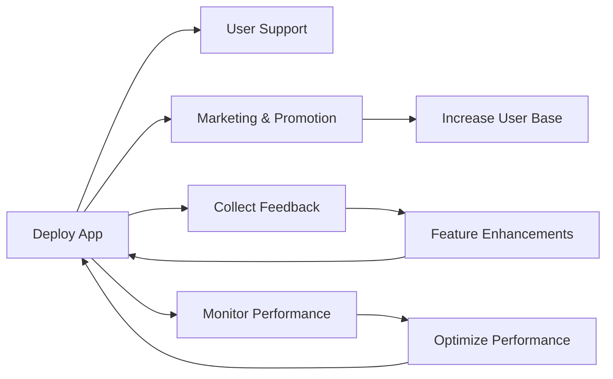

---

linkTitle: "12.4.5 Additional Post-Deployment Practices"
title: "Post-Deployment Practices for Flutter Apps: Enhancing User Experience and Engagement"
description: "Explore essential post-deployment practices for Flutter applications, including user support, marketing strategies, user onboarding improvements, feature flagging, and community building to ensure sustained success and user satisfaction."
categories:
- Flutter Development
- Mobile App Deployment
- User Engagement
tags:
- Flutter
- Post-Deployment
- User Support
- Marketing
- Community Building
- Feature Flagging
date: 2024-10-25
type: docs
nav_weight: 12500

---

## 12.4.5 Additional Post-Deployment Practices

Deploying your Flutter application is a significant milestone, but the journey doesn't end there. Post-deployment practices are crucial for ensuring your app's success, maintaining user satisfaction, and fostering growth. This section explores key strategies to implement after your app is live, focusing on user support, marketing, onboarding improvements, feature management, and community building.

### User Support and Help Desk

Providing robust user support is essential for maintaining a positive user experience and addressing any issues that arise post-deployment. Establishing effective support channels can significantly enhance user satisfaction and retention.

#### Establishing Support Channels

- **In-App Help Centers:** Integrate a help center within your app to provide users with easy access to FAQs, tutorials, and troubleshooting guides. This can be achieved using a dedicated section in your app's navigation or a floating help button.
  
- **Email Support:** Set up a dedicated support email address where users can send inquiries or report issues. Ensure timely responses to maintain user trust and satisfaction.

- **Chatbots:** Implement chatbots to provide instant responses to common queries. Tools like Dialogflow or Botpress can be integrated into your app to automate support and reduce response times.

#### Managing Support Tickets

Efficiently managing support tickets is crucial for resolving user issues promptly. Consider the following guidelines:

- **Ticketing System:** Use a ticketing system like Zendesk or Freshdesk to organize and track user inquiries. This helps prioritize issues and ensures no query goes unanswered.

- **Response Templates:** Create templates for common responses to streamline the support process and ensure consistency in communication.

- **Feedback Loop:** Encourage users to provide feedback on the support they receive. Use this feedback to improve your support processes continually.

### Marketing and Promotion

Effective marketing and promotion are vital for increasing your app's visibility and attracting new users. Post-deployment, focus on strategies that leverage your existing user base and expand your reach.

#### Strategies for Promotion

- **Social Media Marketing:** Utilize platforms like Instagram, Facebook, and Twitter to engage with your audience. Share updates, user testimonials, and behind-the-scenes content to keep users interested.

- **Influencer Partnerships:** Collaborate with influencers in your app's niche to reach a broader audience. Influencers can provide authentic endorsements that resonate with potential users.

- **App Store Optimization (ASO):** Optimize your app's listing on app stores to improve visibility. This includes using relevant keywords, high-quality screenshots, and engaging descriptions.

#### Integrating Share Functionality

Encourage user referrals by integrating share functionality within your app. This allows users to easily share your app with their network, expanding your reach organically.

```dart
import 'package:flutter/material.dart';
import 'package:share/share.dart';

class ShareButton extends StatelessWidget {
  @override
  Widget build(BuildContext context) {
    return ElevatedButton(
      onPressed: () {
        Share.share('Check out this amazing app: https://yourapp.com');
      },
      child: Text('Share'),
    );
  }
}
```

### User Onboarding Improvements

A seamless onboarding process is critical for user retention. Continuously refine your onboarding experience based on user feedback and analytics to ensure it meets user needs and expectations.

#### Enhancing Onboarding

- **User Feedback:** Collect feedback from new users about their onboarding experience. Use surveys or in-app prompts to gather insights.

- **Data-Driven Improvements:** Analyze user behavior data to identify drop-off points in the onboarding process. Use this information to make targeted improvements.

- **Personalization:** Tailor the onboarding experience to individual users by offering personalized tips or content based on their preferences or usage patterns.

### Feature Flagging

Feature flagging allows you to enable or disable features without requiring a full app update. This flexibility is invaluable for testing new features or rolling out updates gradually.

#### Implementing Feature Flags

- **Using Packages:** Utilize packages like `flutter_feature_flags` to manage feature toggles efficiently. This allows you to control which features are active for different user segments.

- **Gradual Rollouts:** Deploy new features to a small percentage of users initially. Monitor performance and user feedback before a full rollout.

- **A/B Testing:** Use feature flags to conduct A/B tests, comparing different versions of a feature to determine which performs better.

### Community Building

Building a community around your app fosters user loyalty and engagement. It provides a platform for users to connect, share experiences, and provide feedback.

#### Fostering a Community

- **Forums and Social Media Groups:** Create forums or social media groups where users can discuss your app, share tips, and provide feedback. Platforms like Reddit or Facebook Groups can be effective.

- **Regular Engagement Activities:** Host regular events such as Q&A sessions, webinars, or contests to keep the community engaged and active.

- **User-Generated Content:** Encourage users to create content related to your app, such as tutorials, reviews, or creative uses. Feature this content on your platforms to showcase user contributions.

### Diagram: Post-Deployment Ecosystem

To visualize the interconnected nature of these post-deployment practices, consider the following flowchart:



This diagram illustrates how each component of the post-deployment ecosystem feeds into and supports the others, creating a continuous loop of improvement and growth.

### Best Practices and Challenges

- **Best Practices:**
  - Maintain open communication with users through multiple channels.
  - Regularly update your app based on user feedback and performance data.
  - Engage with your community consistently to foster loyalty and advocacy.

- **Common Challenges:**
  - Balancing feature updates with stability and performance.
  - Managing user expectations and feedback effectively.
  - Ensuring marketing efforts align with user needs and app capabilities.

### References and Further Reading

- [Flutter Documentation](https://flutter.dev/docs)
- [App Store Optimization Guide](https://developer.apple.com/app-store/optimization/)
- [Zendesk Support Ticketing System](https://www.zendesk.com/)
- [Social Media Marketing Strategies](https://www.hubspot.com/social-media-marketing)

### Conclusion

Post-deployment practices are integral to the long-term success of your Flutter application. By focusing on user support, marketing, onboarding, feature management, and community building, you can ensure your app remains relevant, engaging, and valuable to users. Implement these strategies thoughtfully to maximize your app's potential and foster a loyal user base.

## Quiz Time!



### Which of the following is NOT a recommended channel for user support?

- [ ] In-app help centers
- [ ] Email support
- [ ] Chatbots
- [x] Pop-up ads

> **Explanation:** Pop-up ads are not a channel for user support; they are typically used for advertising purposes.

### What is the purpose of integrating share functionality in your app?

- [x] To encourage user referrals
- [ ] To track user activity
- [ ] To collect user feedback
- [ ] To improve app performance

> **Explanation:** Integrating share functionality encourages users to refer the app to others, expanding its reach organically.

### What is a key benefit of using feature flags?

- [x] Enabling or disabling features without a full app update
- [ ] Improving app security
- [ ] Increasing app download speed
- [ ] Enhancing user interface design

> **Explanation:** Feature flags allow developers to toggle features on or off without requiring users to download a new version of the app.

### How can user onboarding be improved?

- [x] By collecting user feedback and making data-driven improvements
- [ ] By adding more steps to the onboarding process
- [ ] By using complex language
- [ ] By ignoring user feedback

> **Explanation:** Improving onboarding involves collecting user feedback and using data to refine the process, ensuring it is user-friendly and effective.

### What is an effective strategy for community building?

- [x] Creating forums and social media groups
- [ ] Limiting user interaction
- [ ] Disabling comments on posts
- [ ] Avoiding user feedback

> **Explanation:** Building a community involves creating spaces for users to interact, share experiences, and provide feedback.

### Which tool can be used for managing support tickets?

- [x] Zendesk
- [ ] Photoshop
- [ ] Microsoft Word
- [ ] Google Maps

> **Explanation:** Zendesk is a popular tool for managing support tickets and organizing user inquiries.

### What is the role of App Store Optimization (ASO)?

- [x] Improving app visibility in app stores
- [ ] Enhancing app security
- [ ] Increasing app download speed
- [ ] Improving app design

> **Explanation:** ASO involves optimizing an app's listing to improve its visibility and ranking in app stores.

### How can marketing efforts be aligned with user needs?

- [x] By understanding user behavior and preferences
- [ ] By ignoring user feedback
- [ ] By focusing solely on paid advertising
- [ ] By avoiding social media

> **Explanation:** Aligning marketing efforts with user needs requires understanding their behavior and preferences to create relevant and engaging campaigns.

### What is a common challenge in post-deployment practices?

- [x] Balancing feature updates with stability
- [ ] Increasing app size
- [ ] Reducing app functionality
- [ ] Ignoring user feedback

> **Explanation:** A common challenge is balancing the introduction of new features with maintaining app stability and performance.

### True or False: Community building is only important during the initial app launch.

- [ ] True
- [x] False

> **Explanation:** Community building is an ongoing process that remains important throughout the app's lifecycle to maintain user engagement and loyalty.


