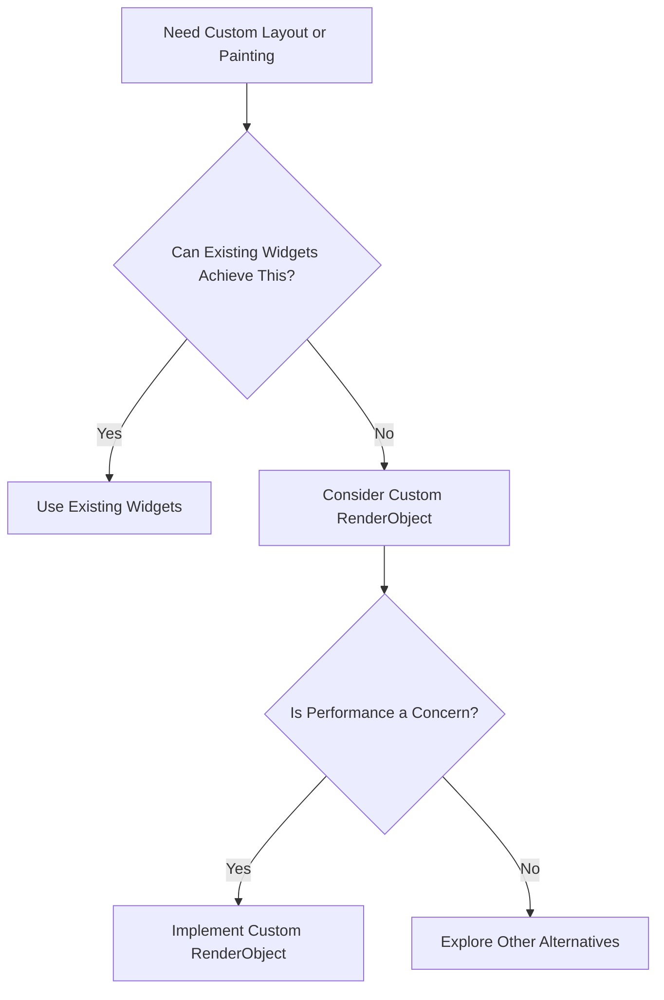

## 13.1.1 When to Use Custom RenderObjects

In the world of Flutter development, understanding when and how to use Custom RenderObjects can be a game-changer for building sophisticated, high-performance applications. This section delves into the intricacies of RenderObjects, explores scenarios where custom implementations are beneficial, and provides guidance on making informed decisions about their use.

### Introduction to RenderObjects

In Flutter, the rendering process is a sophisticated dance between widgets, elements, and RenderObjects. Each of these components plays a crucial role in how your application is displayed and interacts with users.

- **Widgets:** These are the building blocks of your UI. They are immutable and describe how the UI should look given its current configuration and state.
- **Elements:** These are the instantiations of widgets in the widget tree. They hold the state of the widget and manage the lifecycle of the widget.
- **RenderObjects:** These are responsible for the actual layout, painting, and hit-testing. They form a tree that mirrors the widget tree but is focused on rendering.

Understanding the distinction between these components is essential for grasping when a Custom RenderObject might be necessary. While widgets are the declarative part of your UI, RenderObjects are the imperative part that deals with the nitty-gritty details of rendering.

### Scenarios Requiring Custom RenderObjects

Custom RenderObjects are not needed for every application, but they shine in specific scenarios:

#### Complex Layouts

When existing layout widgets such as `Row`, `Column`, or `Stack` fall short of your design needs, a Custom RenderObject can provide the flexibility required to implement intricate layouts. For instance, if you need a layout that dynamically adjusts based on complex rules or requires precise control over child positioning, a Custom RenderObject might be the solution.

#### Performance Optimization

In performance-critical applications, minimizing widget rebuilds and reducing the complexity of the widget tree can lead to significant performance improvements. Custom RenderObjects allow you to bypass some of the overhead associated with the widget and element layers, directly manipulating the rendering layer for optimized performance.

#### Custom Painting

While `CustomPainter` provides a powerful way to draw custom graphics, there are times when you need even more control over the painting process. Custom RenderObjects allow you to implement complex painting logic that can be tightly integrated with the layout and hit-testing processes.

#### Special Interaction Models

If your application requires unique gesture handling or hit-testing logic that goes beyond the capabilities of existing widgets, a Custom RenderObject can provide the necessary control. This is particularly useful for applications that need to implement novel interaction patterns or handle complex input scenarios.

### Benefits of Using Custom RenderObjects

The primary benefits of using Custom RenderObjects include:

- **Performance:** By reducing the complexity of the widget tree and minimizing rebuilds, Custom RenderObjects can lead to improved rendering performance.
- **Flexibility:** They offer the ability to implement highly customized behaviors and layouts that are not possible with standard widgets.

### Trade-offs and Considerations

While Custom RenderObjects offer significant advantages, they also come with trade-offs:

- **Complexity:** Writing Custom RenderObjects requires a deeper understanding of Flutter's rendering pipeline and can be more complex than using standard widgets.
- **Maintenance:** Custom code can increase maintenance overhead, particularly if it is not well-documented or if the original developers are no longer available.
- **Reusability:** Custom RenderObjects may have limited reusability compared to standard widgets unless they are thoughtfully designed with flexibility in mind.

### Decision Criteria

When deciding whether to use a Custom RenderObject, consider the following:

- **Existing Widgets:** First, assess whether the desired functionality can be achieved with existing widgets and mechanisms. Often, a combination of existing widgets can achieve complex layouts or behaviors without the need for custom implementations.
- **Long-term Maintenance:** Consider the long-term maintenance and scalability of introducing Custom RenderObjects. Ensure that the benefits outweigh the potential costs in terms of complexity and maintenance.
- **Performance Needs:** If performance is a critical concern, and existing solutions do not meet your needs, a Custom RenderObject might be justified.

### Examples of Use Cases

Here are some practical examples where Custom RenderObjects can be beneficial:

- **Custom Carousel Slider:** Implementing a carousel slider with unique animation behaviors that require precise control over layout and painting.
- **Specialized Graph or Chart Widget:** Creating a graph or chart widget that requires precise control over rendering, such as custom axis scaling or interactive elements.
- **Dynamic Interaction Widget:** Developing a widget that needs to respond dynamically to user interactions in non-standard ways, such as a custom gesture recognizer or hit-testing logic.

### Diagram Suggestion

To help visualize the decision-making process for when to use a Custom RenderObject, consider the following Mermaid.js decision tree:

This decision tree guides you through the process of determining whether a Custom RenderObject is the right choice for your application, considering existing solutions and performance needs.

### Conclusion

Custom RenderObjects are a powerful tool in the Flutter developer's toolkit, offering unparalleled control over the rendering process. However, they should be used judiciously, with careful consideration of the complexity and maintenance implications. By understanding when and why to use Custom RenderObjects, you can make informed decisions that enhance your application's performance and user experience.

## Quiz Time!



### What is the primary role of a RenderObject in Flutter?

- [x] Handling layout, painting, and hit-testing
- [ ] Managing widget state
- [ ] Describing the UI configuration
- [ ] Handling user input

> **Explanation:** RenderObjects are responsible for the actual layout, painting, and hit-testing in Flutter's rendering pipeline.

### When might you consider using a Custom RenderObject?

- [x] When existing layout widgets are insufficient
- [ ] When you need to manage state more effectively
- [x] For performance optimization
- [ ] For simple UI designs

> **Explanation:** Custom RenderObjects are useful when existing widgets don't meet layout needs or when performance optimization is necessary.

### What is a potential trade-off of using Custom RenderObjects?

- [x] Increased complexity
- [ ] Improved reusability
- [ ] Simplified maintenance
- [ ] Reduced performance

> **Explanation:** Custom RenderObjects can increase complexity and require a deeper understanding of Flutter's rendering pipeline.

### Which of the following is NOT a benefit of using Custom RenderObjects?

- [ ] Performance improvements
- [ ] Flexibility in layout
- [x] Simplified codebase
- [ ] Custom interaction models

> **Explanation:** While Custom RenderObjects offer performance and flexibility, they do not simplify the codebase.

### What should you consider before implementing a Custom RenderObject?

- [x] Whether existing widgets can achieve the desired functionality
- [x] Long-term maintenance implications
- [ ] The color scheme of the application
- [x] Performance needs

> **Explanation:** It's important to evaluate existing solutions, maintenance, and performance needs before opting for a Custom RenderObject.

### Which component is responsible for managing the lifecycle of a widget in Flutter?

- [ ] RenderObject
- [x] Element
- [ ] Widget
- [ ] State

> **Explanation:** Elements manage the lifecycle of widgets and hold their state.

### What is a common use case for Custom RenderObjects?

- [x] Implementing a custom carousel slider
- [ ] Managing application state
- [x] Creating a specialized graph or chart widget
- [ ] Simplifying navigation

> **Explanation:** Custom RenderObjects are ideal for complex UI components like custom sliders and charts.

### What is a key benefit of reducing widget tree complexity with Custom RenderObjects?

- [x] Improved rendering performance
- [ ] Easier debugging
- [ ] Increased code readability
- [ ] Enhanced user input handling

> **Explanation:** Reducing widget tree complexity can lead to improved rendering performance.

### Which of the following is a challenge when using Custom RenderObjects?

- [x] Increased maintenance overhead
- [ ] Limited control over layout
- [ ] Reduced flexibility
- [ ] Simplified interaction models

> **Explanation:** Custom RenderObjects can increase maintenance overhead due to their complexity.

### True or False: Custom RenderObjects should be used for all UI components to maximize performance.

- [ ] True
- [x] False

> **Explanation:** Custom RenderObjects should be used judiciously, only when necessary, as they increase complexity and maintenance.


