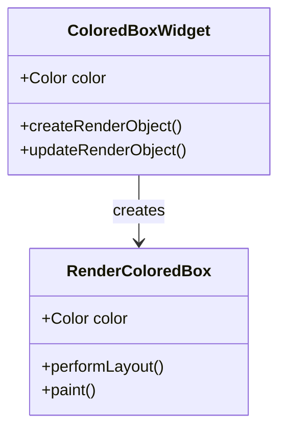

## 13.1.2 Implementing a Custom RenderObject

In the world of Flutter, the ability to create custom render objects allows developers to push the boundaries of UI design and performance. This section delves into the process of implementing a custom `RenderObject`, providing a step-by-step guide to crafting unique and efficient UI components.

### Understanding the RenderObject Class

The `RenderObject` class is a cornerstone of Flutter's rendering pipeline. It serves as the base class for all objects that participate in the rendering process. Understanding its role and how it interacts with other parts of the Flutter framework is crucial for creating custom render objects.

#### Key Responsibilities of RenderObject

- **Layout:** Determines the size and position of the render object and its children.
- **Painting:** Renders the visual representation of the object onto the screen.
- **Hit Testing:** Handles pointer events, determining whether a pointer event affects the render object.

#### Essential Methods to Override

- **`performLayout`:** This method is responsible for defining the layout logic. It calculates the size of the render object and positions its children.
- **`paint`:** This method handles the drawing of the render object onto the canvas. It uses the `PaintingContext` to render visual elements.
- **`hitTest`:** This method determines how the render object responds to pointer events, such as taps and gestures.

### Step-by-Step Guide to Creating a Custom RenderObject

Creating a custom `RenderObject` involves several key steps, each crucial for ensuring the object functions correctly within Flutter's rendering system.

#### 1. Subclass RenderObject

The first step is to create a new class that extends `RenderBox` or another relevant subclass of `RenderObject`. `RenderBox` is often used because it provides a box model layout, which is common in UI design.

```dart
class RenderColoredBox extends RenderBox {
  // Class implementation will go here
}
```

#### 2. Define Properties

Next, define any properties your `RenderObject` will need. These might include size constraints, colors, or other custom data necessary for rendering.

```dart
class RenderColoredBox extends RenderBox {
  Color color;

  RenderColoredBox({required this.color});
}
```

#### 3. Override performLayout

Implement the `performLayout` method to define how the `RenderObject` sizes and positions itself and its children. This method should set the `size` property based on the constraints provided.

```dart
@override
void performLayout() {
  size = constraints.biggest;
}
```

#### 4. Override paint

The `paint` method is where you implement the logic to render the content onto the canvas. Use the `PaintingContext` and `Canvas` to draw shapes, text, or images.

```dart
@override
void paint(PaintingContext context, Offset offset) {
  final Paint paint = Paint()..color = color;
  context.canvas.drawRect(offset & size, paint);
}
```

#### 5. Implement hitTest

Define how the `RenderObject` responds to pointer events by implementing the `hitTest` method. This method determines whether the render object should handle a particular pointer event.

```dart
@override
bool hitTest(BoxHitTestResult result, {required Offset position}) {
  return size.contains(position);
}
```

### Integrating the Custom RenderObject with Widgets

To use your custom `RenderObject` in a Flutter application, you need to create a corresponding widget. This widget acts as an interface between the widget tree and the `RenderObject`.

#### Creating a RenderObjectWidget

Create a widget that extends `LeafRenderObjectWidget` or `MultiChildRenderObjectWidget`, depending on whether your `RenderObject` has children.

```dart
class ColoredBoxWidget extends LeafRenderObjectWidget {
  final Color color;

  ColoredBoxWidget({required this.color});

  @override
  RenderObject createRenderObject(BuildContext context) {
    return RenderColoredBox(color: color);
  }

  @override
  void updateRenderObject(BuildContext context, RenderColoredBox renderObject) {
    renderObject.color = color;
  }
}
```

#### Relationship Between Widget and RenderObject

- **Widget:** Describes the configuration of the UI element and holds immutable data.
- **RenderObject:** Implements the actual rendering logic, handling layout, painting, and hit testing.

### Code Example: Custom RenderObject for a Colored Rectangle

Below is a complete example of a custom `RenderObject` that draws a colored rectangle, along with its corresponding widget.

```dart
import 'package:flutter/rendering.dart';
import 'package:flutter/widgets.dart';

// Custom RenderObject
class RenderColoredBox extends RenderBox {
  Color color;

  RenderColoredBox({required this.color});

  @override
  void performLayout() {
    size = constraints.biggest;
  }

  @override
  void paint(PaintingContext context, Offset offset) {
    final Paint paint = Paint()..color = color;
    context.canvas.drawRect(offset & size, paint);
  }

  @override
  bool hitTest(BoxHitTestResult result, {required Offset position}) {
    return size.contains(position);
  }
}

// Corresponding Widget
class ColoredBoxWidget extends LeafRenderObjectWidget {
  final Color color;

  ColoredBoxWidget({required this.color});

  @override
  RenderObject createRenderObject(BuildContext context) {
    return RenderColoredBox(color: color);
  }

  @override
  void updateRenderObject(BuildContext context, RenderColoredBox renderObject) {
    renderObject.color = color;
  }
}
```

### Best Practices

- **Maintain Clear Separation:** Keep widget logic separate from rendering logic to ensure modularity and reusability.
- **Optimize Layout and Painting:** Minimize computations within `performLayout` and `paint` to enhance performance.
- **Handle State Changes Carefully:** Ensure that state changes trigger the necessary `RenderObject` updates without causing excessive rebuilds.

### Diagram: Relationship Between Widget and RenderObject

Below is a Mermaid.js class diagram illustrating the relationship between the `ColoredBoxWidget` and its `RenderObject`.



### Conclusion

Implementing a custom `RenderObject` in Flutter opens up a world of possibilities for creating highly customized and efficient UI components. By understanding the rendering pipeline and following best practices, you can enhance your application's performance and visual appeal.

### Further Exploration

- **Official Flutter Documentation:** Explore the [Flutter Rendering](https://api.flutter.dev/flutter/rendering/rendering-library.html) library for more insights.
- **Open-Source Projects:** Examine projects on GitHub that utilize custom render objects for inspiration.
- **Online Courses:** Consider taking advanced Flutter courses on platforms like Udemy or Coursera to deepen your understanding.

---

## Quiz Time!



### What is the primary role of the `RenderObject` class in Flutter?

- [x] To handle layout, painting, and hit testing for UI components.
- [ ] To manage application state and data flow.
- [ ] To provide a high-level API for building user interfaces.
- [ ] To facilitate network communication and data fetching.

> **Explanation:** The `RenderObject` class is responsible for handling layout, painting, and hit testing, which are core aspects of rendering UI components in Flutter.

### Which method must be overridden to define how a `RenderObject` sizes and positions itself?

- [x] `performLayout`
- [ ] `paint`
- [ ] `hitTest`
- [ ] `build`

> **Explanation:** The `performLayout` method is overridden to implement the layout logic, determining the size and position of the `RenderObject`.

### In the provided code example, what does the `paint` method do?

- [x] It draws a colored rectangle onto the canvas.
- [ ] It calculates the size of the render object.
- [ ] It handles pointer events.
- [ ] It updates the widget's state.

> **Explanation:** The `paint` method uses the `PaintingContext` to draw a colored rectangle onto the canvas.

### What is the purpose of the `hitTest` method in a `RenderObject`?

- [x] To determine how the render object responds to pointer events.
- [ ] To render visual elements onto the screen.
- [ ] To manage the widget's lifecycle.
- [ ] To handle asynchronous data fetching.

> **Explanation:** The `hitTest` method is used to determine whether a pointer event affects the render object, such as a tap or gesture.

### Which class should a custom widget extend to interface with a `RenderObject` that has no children?

- [x] `LeafRenderObjectWidget`
- [ ] `MultiChildRenderObjectWidget`
- [ ] `StatelessWidget`
- [ ] `StatefulWidget`

> **Explanation:** A `LeafRenderObjectWidget` is used when the `RenderObject` has no children, providing a direct interface between the widget and the render object.

### What is a key benefit of maintaining a clear separation between widget logic and rendering logic?

- [x] It ensures modularity and reusability.
- [ ] It simplifies network communication.
- [ ] It enhances the application's color scheme.
- [ ] It reduces the need for state management.

> **Explanation:** Keeping widget logic separate from rendering logic ensures that components are modular and can be reused in different contexts.

### How can you optimize the performance of a custom `RenderObject`?

- [x] Minimize computations within `performLayout` and `paint`.
- [ ] Use a single global state for all render objects.
- [ ] Avoid using the `hitTest` method.
- [ ] Implement all logic within the widget tree.

> **Explanation:** Minimizing computations within `performLayout` and `paint` helps to enhance the performance of a custom `RenderObject`.

### What is the relationship between a widget and its `RenderObject`?

- [x] The widget describes the configuration, while the `RenderObject` handles rendering.
- [ ] The `RenderObject` manages state, and the widget handles rendering.
- [ ] The widget and `RenderObject` are identical in functionality.
- [ ] The widget handles network requests, and the `RenderObject` manages data storage.

> **Explanation:** The widget describes the configuration of the UI element, while the `RenderObject` implements the rendering logic.

### Which method is used to update a `RenderObject` when a widget's properties change?

- [x] `updateRenderObject`
- [ ] `createRenderObject`
- [ ] `performLayout`
- [ ] `paint`

> **Explanation:** The `updateRenderObject` method is used to update the `RenderObject` when the widget's properties change.

### True or False: A `RenderObject` can directly manage application state.

- [ ] True
- [x] False

> **Explanation:** A `RenderObject` is responsible for rendering and does not directly manage application state, which is typically handled by state management solutions.


