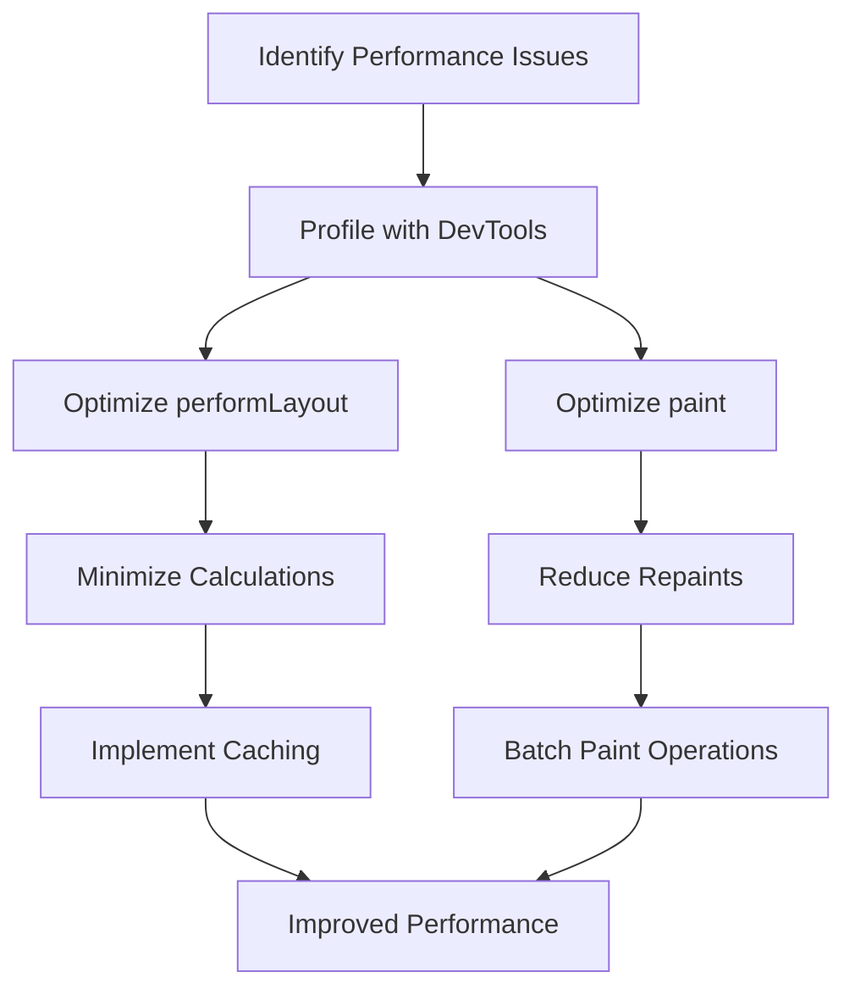

## 13.1.3 Performance Implications

In the world of Flutter development, custom RenderObjects offer a powerful tool for creating highly customized and efficient UI components. However, with great power comes the responsibility of managing performance. This section delves into the performance implications of using custom RenderObjects, exploring both the potential benefits and pitfalls, and providing strategies for optimization.

### Impact on Rendering Performance

Custom RenderObjects can significantly impact the rendering performance of a Flutter application. Understanding how to harness their power without degrading performance is crucial.

- **Improving Performance:** Custom RenderObjects allow developers to bypass the default widget system and implement highly optimized layout and painting logic tailored to specific needs. This can lead to performance improvements, especially in complex UIs where default widgets might introduce unnecessary overhead.

- **Potential for Degradation:** On the flip side, poorly implemented custom RenderObjects can degrade performance. Inefficient layout calculations, excessive repainting, and complex hit testing logic can all contribute to increased frame rendering times and a sluggish user experience.

#### Efficient Layout and Painting Logic

The key to leveraging custom RenderObjects effectively lies in implementing efficient layout and painting logic. This involves minimizing the work done during the layout and paint phases, ensuring that only necessary calculations are performed, and avoiding redundant operations.

### Optimizing Custom RenderObjects

Optimization is critical when working with custom RenderObjects. Here are some strategies to ensure your custom implementations are as efficient as possible:

#### Minimize Layout Passes

The `performLayout` method is where the layout logic of a RenderObject is defined. To optimize this process:

- **Efficient Layout Logic:** Ensure that the layout logic is straightforward and avoids unnecessary complexity. This reduces the time spent calculating positions and sizes.

- **Avoid Redundant Calculations:** Only perform calculations that are absolutely necessary for the current layout pass. Cache results of expensive computations that do not change frequently.

```dart
@override
void performLayout() {
  // Efficient layout logic
  // Example: Cache expensive calculations
  if (_cachedSize == null) {
    _cachedSize = calculateExpensiveSize();
  }
  size = _cachedSize;
}
```

#### Caching Calculations

Caching is a powerful technique to avoid repeated expensive computations. By storing the results of calculations that do not change often, you can significantly reduce the workload during layout and painting.

- **Use Fields for Cached Values:** Store cached values in fields that are updated only when necessary.

- **Invalidate Cache When Needed:** Ensure that caches are invalidated and recalculated when the underlying data changes.

#### Avoid Unnecessary Paint Calls

The `paint` method is responsible for drawing the RenderObject on the screen. To optimize painting:

- **Repaint Only When Necessary:** Use repaint boundaries to limit the areas of the screen that need to be redrawn. This reduces the workload on the GPU and improves performance.

- **Efficient Painting Logic:** Implement painting logic that is as efficient as possible, avoiding complex operations that could slow down rendering.

```dart
@override
void paint(PaintingContext context, Offset offset) {
  // Optimized painting logic
  // Example: Use simple drawing operations
  context.canvas.drawRect(offset & size, paint);
}
```

#### Use Efficient Data Structures

Choosing the right data structures can have a significant impact on performance. Use data structures that provide optimal performance for the operations you need to perform.

- **Lists for Sequential Access:** Use lists when you need to access elements sequentially.

- **Maps for Key-Value Pairs:** Use maps when you need to associate values with keys and perform frequent lookups.

### Profiling and Measuring Performance

Profiling is an essential step in identifying and resolving performance issues. Flutter provides powerful tools for profiling rendering performance.

#### Flutter DevTools

Flutter DevTools is a suite of performance and debugging tools for Flutter applications. It provides insights into the rendering performance, helping you identify bottlenecks in your custom RenderObjects.

- **Frame Rendering Times:** Use the timeline view to analyze frame rendering times and identify slow frames.

- **Layout and Paint Phases:** Examine the layout and paint phases to pinpoint inefficiencies in your custom RenderObjects.

#### Identifying Bottlenecks

When profiling, pay attention to the `performLayout` and `paint` methods. These are the areas where inefficiencies are most likely to occur.

- **Long Layout Times:** If `performLayout` is taking too long, look for redundant calculations or complex logic that can be simplified.

- **Excessive Paint Calls:** If `paint` is being called too frequently, ensure that repaint boundaries are being used effectively.

### Common Performance Pitfalls

When working with custom RenderObjects, be aware of common pitfalls that can negatively impact performance:

#### Overcomplicating Layouts

Complex layout logic can be difficult to optimize and may lead to increased rendering times. Keep layout logic as simple as possible and avoid unnecessary complexity.

#### Excessive Repaint Calls

Triggering unnecessary repaints can degrade performance. Ensure that repaint boundaries are used correctly and that state changes only trigger repaints when necessary.

#### Inefficient Hit Testing

Hit testing logic that is too complex can add latency to user interactions. Implement hit testing in a way that minimizes overhead and ensures responsive interactions.

### Strategies to Mitigate Performance Issues

To mitigate performance issues in custom RenderObjects, consider the following strategies:

#### Reuse RenderObjects

Where possible, reuse existing RenderObjects instead of creating new instances. This reduces the overhead of object creation and can improve performance.

#### Batch Operations

Group similar operations together to minimize state changes and repaints. This can reduce the workload on the rendering pipeline and improve performance.

#### Leverage Asynchronous Operations

Offload heavy computations to isolate or asynchronous methods where appropriate. This can prevent blocking the main thread and improve responsiveness.

### Diagram: Optimization Steps for a Custom RenderObject

To visualize the optimization process for a custom RenderObject, consider the following flowchart:



This flowchart illustrates the steps involved in optimizing a custom RenderObject, from identifying performance issues to implementing caching and batching operations.

### Conclusion

Custom RenderObjects offer a powerful way to create highly optimized and customized UI components in Flutter. However, with this power comes the responsibility of managing performance. By understanding the impact of custom RenderObjects on rendering performance and implementing optimization strategies, you can harness their full potential without sacrificing performance. Use the tools and techniques discussed in this section to profile, optimize, and maintain high-performance custom RenderObjects in your Flutter applications.

## Quiz Time!



### How can custom RenderObjects improve performance in Flutter applications?

- [x] By allowing developers to implement highly optimized layout and painting logic.
- [ ] By increasing the complexity of the widget tree.
- [ ] By automatically reducing the number of widgets needed.
- [ ] By simplifying the state management process.

> **Explanation:** Custom RenderObjects allow developers to bypass the default widget system and implement highly optimized layout and painting logic tailored to specific needs, which can lead to performance improvements.

### What is a key strategy for minimizing layout passes in custom RenderObjects?

- [x] Caching expensive calculations that do not change frequently.
- [ ] Increasing the number of repaint boundaries.
- [ ] Using complex data structures for layout calculations.
- [ ] Implementing hit testing logic in the layout phase.

> **Explanation:** Caching expensive calculations that do not change frequently helps minimize the work done during the layout phase, reducing the time spent calculating positions and sizes.

### Which tool is recommended for profiling rendering performance in Flutter?

- [x] Flutter DevTools
- [ ] Android Studio Profiler
- [ ] Xcode Instruments
- [ ] Chrome DevTools

> **Explanation:** Flutter DevTools is a suite of performance and debugging tools specifically designed for Flutter applications, providing insights into rendering performance.

### What is a common pitfall when implementing custom RenderObjects?

- [x] Overcomplicating layout logic.
- [ ] Using too many widgets.
- [ ] Relying on default widget properties.
- [ ] Avoiding the use of repaint boundaries.

> **Explanation:** Overcomplicating layout logic can lead to increased rendering times and make optimization difficult, which is a common pitfall when implementing custom RenderObjects.

### How can excessive repaint calls be avoided in custom RenderObjects?

- [x] By properly managing repaint boundaries.
- [ ] By increasing the number of widgets.
- [ ] By using complex painting logic.
- [ ] By avoiding caching calculations.

> **Explanation:** Properly managing repaint boundaries ensures that only necessary areas of the screen are redrawn, avoiding excessive repaint calls.

### What is the benefit of reusing RenderObjects instead of creating new instances?

- [x] It reduces the overhead of object creation and can improve performance.
- [ ] It simplifies the widget tree structure.
- [ ] It automatically optimizes layout calculations.
- [ ] It reduces the need for state management.

> **Explanation:** Reusing RenderObjects reduces the overhead of object creation, which can improve performance by minimizing the workload on the rendering pipeline.

### How can asynchronous operations improve performance in custom RenderObjects?

- [x] By offloading heavy computations to isolate or asynchronous methods.
- [ ] By increasing the complexity of layout logic.
- [ ] By reducing the number of widgets used.
- [ ] By simplifying hit testing logic.

> **Explanation:** Offloading heavy computations to isolate or asynchronous methods prevents blocking the main thread, improving responsiveness and performance.

### What is a recommended data structure for sequential access in custom RenderObjects?

- [x] Lists
- [ ] Maps
- [ ] Sets
- [ ] Trees

> **Explanation:** Lists are recommended for sequential access as they provide optimal performance for operations that require accessing elements in order.

### How can hit testing logic impact performance in custom RenderObjects?

- [x] Inefficient hit testing can add latency to user interactions.
- [ ] Efficient hit testing automatically reduces layout complexity.
- [ ] Hit testing logic does not affect performance.
- [ ] Complex hit testing logic simplifies repaint management.

> **Explanation:** Inefficient hit testing logic can add latency to user interactions by increasing the time taken to determine which widget was interacted with.

### True or False: Custom RenderObjects can only degrade performance if not implemented correctly.

- [x] True
- [ ] False

> **Explanation:** Custom RenderObjects have the potential to degrade performance if not implemented correctly, due to inefficient layout calculations, excessive repainting, and complex hit testing logic.


