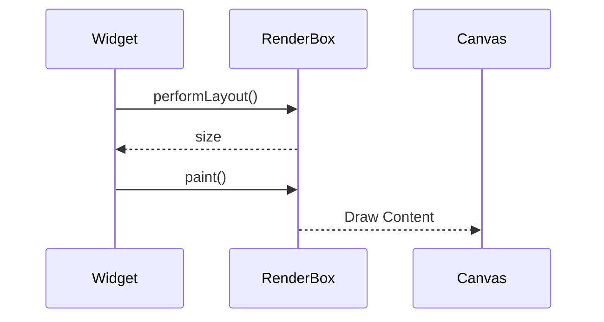

## 13.1.4 Examples and Use Cases

In the world of Flutter, the ability to create custom RenderObjects opens up a realm of possibilities for building highly specialized and performant UI components. This section delves into three advanced examples of custom RenderObjects: a carousel slider, a graph widget, and a widget with custom hit-test logic. Each example illustrates the power and flexibility of RenderObjects, providing you with the tools to create unique and responsive UI elements.

### Example 1: Custom Carousel Slider

#### Description

A carousel slider is a popular UI component that allows users to scroll through a series of items, often with smooth transitions and animations. In this example, we will implement a custom carousel slider that supports infinite scrolling and custom animation behaviors.

#### Implementation Details

To create a custom carousel slider, we will use a `MultiChildRenderObjectWidget` to manage multiple children. The `performLayout` method will be overridden to position children in a horizontal sequence, and custom animation logic will be implemented within the `paint` method.

#### Code Example

```dart
class CarouselParentData extends ContainerBoxParentData<RenderBox> {}

class CustomCarouselRenderBox extends RenderBox
    with
        ContainerRenderObjectMixin<RenderBox, CarouselParentData>,
        RenderBoxContainerDefaultsMixin<RenderBox, CarouselParentData> {

  // Custom layout and painting logic for carousel

  @override
  void performLayout() {
    double position = 0.0;
    RenderBox? child = firstChild;
    while (child != null) {
      final CarouselParentData childParentData = child.parentData as CarouselParentData;
      child.layout(constraints, parentUsesSize: true);
      childParentData.offset = Offset(position, 0.0);
      position += child.size.width;
      child = childParentData.nextSibling;
    }
    size = constraints.constrain(Size(position, constraints.maxHeight));
  }

  @override
  void paint(PaintingContext context, Offset offset) {
    RenderBox? child = firstChild;
    while (child != null) {
      final CarouselParentData childParentData = child.parentData as CarouselParentData;
      context.paintChild(child, offset + childParentData.offset);
      child = childParentData.nextSibling;
    }
  }
}

class CustomCarousel extends MultiChildRenderObjectWidget {
  CustomCarousel({required List<Widget> children}) : super(children: children);

  @override
  RenderObject createRenderObject(BuildContext context) {
    return CustomCarouselRenderBox();
  }

  @override
  void updateRenderObject(BuildContext context, CustomCarouselRenderBox renderObject) {
    // Update properties if any
  }
}
```

### Example 2: Custom Graph Widget

#### Description

Graphs with nodes and edges are essential in many applications, such as network visualizations and flow diagrams. This example demonstrates how to create a widget that draws complex graphs, allowing for dynamic updates and interactions like dragging nodes.

#### Implementation Details

We will utilize a custom `RenderBox` to handle the drawing of nodes and edges. The widget will support interactive features such as dragging nodes, which requires handling pointer events.

#### Code Example

```dart
class RenderGraph extends RenderBox {
  // Properties for nodes and edges

  @override
  void performLayout() {
    size = constraints.biggest;
  }

  @override
  void paint(PaintingContext context, Offset offset) {
    final Canvas canvas = context.canvas;
    // Draw nodes and edges
  }

  // Additional methods for interaction
}

class GraphWidget extends LeafRenderObjectWidget {
  @override
  RenderObject createRenderObject(BuildContext context) {
    return RenderGraph();
  }
}
```

### Example 3: Custom Hit-Test Logic

#### Description

In some cases, you may need widgets with non-rectangular hit-testing areas, such as circular buttons. This example shows how to implement a widget with custom hit-test logic to detect interactions within a circular area.

#### Implementation Details

We will override the `hitTest` method to define custom hit-testing boundaries, ensuring that only interactions within the circular area are detected.

#### Code Example

```dart
class CircularButtonRenderBox extends RenderBox {
  bool _isPressed = false;

  @override
  void performLayout() {
    size = constraints.constrain(Size.square(100));
  }

  @override
  void paint(PaintingContext context, Offset offset) {
    final Paint paint = Paint()..color = _isPressed ? Colors.blue : Colors.grey;
    context.canvas.drawCircle(offset + size.center(Offset.zero), size.width / 2, paint);
  }

  @override
  bool hitTest(BoxHitTestResult result, {required Offset position}) {
    final bool isInside = (position - size.center(Offset.zero)).distance <= size.width / 2;
    if (isInside) {
      result.add(BoxHitTestEntry(this, position));
    }
    return isInside;
  }

  @override
  void handleEvent(PointerEvent event, BoxHitTestEntry entry) {
    if (event is PointerDownEvent) {
      _isPressed = true;
      markNeedsPaint();
    } else if (event is PointerUpEvent || event is PointerCancelEvent) {
      _isPressed = false;
      markNeedsPaint();
    }
  }
}

class CircularButton extends LeafRenderObjectWidget {
  @override
  RenderObject createRenderObject(BuildContext context) {
    return CircularButtonRenderBox();
  }
}
```

### Case Studies from Popular Applications

Custom RenderObjects are widely used in popular applications to create unique UI components that stand out. Let's analyze how some well-known applications utilize custom RenderObjects and the lessons we can learn from them.

- **Case Study 1: Instagram's Story Carousel**
  - **Implementation:** Instagram uses a custom carousel for its stories, allowing users to swipe through stories seamlessly. This involves custom layout logic to handle infinite scrolling and smooth animations.
  - **Lessons Learned:** Efficiently managing child widgets and animations can significantly enhance user experience, especially in high-interaction components like carousels.

- **Case Study 2: Trello's Board and Card System**
  - **Implementation:** Trello's board interface uses custom RenderObjects to manage the layout of cards and lists. This allows for dynamic resizing and reordering of cards, providing a fluid drag-and-drop experience.
  - **Lessons Learned:** Custom RenderObjects can provide the flexibility needed to implement complex interactions and layouts, such as drag-and-drop functionality.

- **Case Study 3: Google Maps' Interactive Elements**
  - **Implementation:** Google Maps uses custom hit-test logic for interactive elements like markers and polygons. This allows for precise interaction handling, even when elements overlap.
  - **Lessons Learned:** Custom hit-test logic is crucial for applications with complex interactive elements, ensuring accurate detection and response to user inputs.

### Diagram Suggestion

To better understand the interaction flow between a custom widget and its RenderObject during layout and painting, consider the following Mermaid.js sequence diagram:



This diagram illustrates the sequence of interactions between a widget and its RenderObject, highlighting the key steps in the layout and painting process.

### Best Practices and Challenges

- **Best Practices:**
  - **Efficient Layout Management:** Ensure that your `performLayout` method efficiently positions children to avoid unnecessary computations.
  - **Smooth Animations:** Use the `paint` method to implement animations, ensuring they are smooth and responsive.
  - **Custom Hit-Testing:** Define precise hit-testing logic for non-standard shapes to enhance user interaction.

- **Common Challenges:**
  - **Complexity:** Custom RenderObjects can become complex, requiring careful management of state and interactions.
  - **Performance:** Ensure that custom rendering logic is optimized to prevent performance bottlenecks.
  - **Testing:** Thoroughly test custom RenderObjects to ensure they behave correctly across different devices and screen sizes.

### Further Exploration

For those interested in diving deeper into custom RenderObjects, consider exploring the following resources:

- **Official Flutter Documentation:** [Flutter RenderObject](https://api.flutter.dev/flutter/rendering/RenderObject-class.html)
- **Open-Source Projects:** Explore projects on GitHub that utilize custom RenderObjects for inspiration and learning.
- **Books and Courses:** Consider reading books like "Flutter in Action" or taking online courses on advanced Flutter development.

By mastering custom RenderObjects, you can create highly specialized and performant UI components that elevate your Flutter applications to new heights.

## Quiz Time!



### What is a key advantage of using custom RenderObjects in Flutter?

- [x] They allow for highly specialized and performant UI components.
- [ ] They simplify the widget tree.
- [ ] They eliminate the need for state management.
- [ ] They automatically handle all animations.

> **Explanation:** Custom RenderObjects provide the flexibility to create specialized UI components with optimized performance, allowing developers to implement unique features and interactions.

### In the custom carousel slider example, which method is used to position children horizontally?

- [x] performLayout
- [ ] paint
- [ ] hitTest
- [ ] createRenderObject

> **Explanation:** The `performLayout` method is responsible for positioning children in the custom carousel slider, arranging them in a horizontal sequence.

### What is the purpose of the `paint` method in a RenderObject?

- [x] To implement custom drawing and animations.
- [ ] To handle user input.
- [ ] To manage state changes.
- [ ] To define layout constraints.

> **Explanation:** The `paint` method is used to draw the visual representation of the RenderObject, including implementing custom animations.

### How does the custom graph widget handle dynamic updates?

- [x] By using a custom RenderBox to draw nodes and edges.
- [ ] By relying on a third-party library.
- [ ] By using a StatefulWidget.
- [ ] By implementing a ListView.

> **Explanation:** The custom graph widget uses a custom RenderBox to manage the drawing of nodes and edges, allowing for dynamic updates and interactions.

### What is a common use case for custom hit-test logic?

- [x] Non-rectangular interactive areas, such as circular buttons.
- [ ] Simplifying the widget tree.
- [ ] Automatically resizing widgets.
- [ ] Handling network requests.

> **Explanation:** Custom hit-test logic is often used for widgets with non-standard interactive areas, such as circular buttons, to ensure accurate detection of user interactions.

### Which method is overridden to define custom hit-testing boundaries?

- [x] hitTest
- [ ] performLayout
- [ ] paint
- [ ] createRenderObject

> **Explanation:** The `hitTest` method is overridden to define custom hit-testing boundaries, allowing for precise interaction detection.

### What is a potential challenge when working with custom RenderObjects?

- [x] Complexity and performance optimization.
- [ ] Lack of documentation.
- [ ] Incompatibility with Flutter.
- [ ] Limited customization options.

> **Explanation:** Custom RenderObjects can become complex, requiring careful management of state and interactions, as well as performance optimization to prevent bottlenecks.

### In the sequence diagram, what does the RenderObject return to the Widget after `performLayout`?

- [x] size
- [ ] paint context
- [ ] hit-test result
- [ ] animation state

> **Explanation:** After `performLayout`, the RenderObject returns the size to the Widget, indicating the dimensions it should occupy.

### What lesson can be learned from Trello's use of custom RenderObjects?

- [x] Custom RenderObjects provide flexibility for complex interactions and layouts.
- [ ] Custom RenderObjects simplify network requests.
- [ ] Custom RenderObjects eliminate the need for animations.
- [ ] Custom RenderObjects automatically handle user authentication.

> **Explanation:** Trello's use of custom RenderObjects demonstrates the flexibility they provide for implementing complex interactions and layouts, such as drag-and-drop functionality.

### True or False: Custom RenderObjects can be used to implement unique UI components that are not possible with standard widgets.

- [x] True
- [ ] False

> **Explanation:** True. Custom RenderObjects allow developers to create unique UI components with specialized behaviors and optimizations that are not possible with standard widgets.


