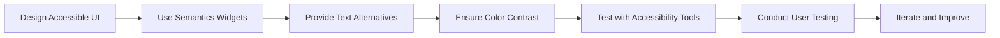

## 13.2.1 Making Apps Accessible

In today's digital landscape, accessibility is not just a feature—it's a necessity. Ensuring that your Flutter applications are accessible means that you are opening your app to a broader audience, including users with disabilities. This section will guide you through the importance of accessibility, the principles that underpin it, and how to implement these principles in your Flutter applications.

### Importance of Accessibility

Accessibility is crucial for several reasons:

- **Broader Audience Reach:** By making your app accessible, you ensure that it can be used by everyone, including people with disabilities. This inclusivity can significantly expand your user base.
- **Legal Implications:** Many countries have legal requirements mandating that digital content be accessible. Non-compliance can lead to legal challenges and fines.
- **Enhanced User Experience:** Accessible design often leads to a better overall user experience, benefiting all users, not just those with disabilities.

### Accessibility Principles

To create accessible applications, consider the following principles:

- **Perceivable:** Information and UI components must be presentable to users in ways they can perceive. This means providing text alternatives for non-text content and ensuring that content is adaptable to different formats.
- **Operable:** UI components and navigation must be usable. This includes making all functionality available from a keyboard and providing users enough time to read and use content.
- **Understandable:** Information and operation must be clear. This involves making text readable and predictable and helping users avoid and correct mistakes.
- **Robust:** Content must be compatible with current and future technologies, ensuring it can be interpreted reliably by a wide variety of user agents, including assistive technologies.

### Implementing Accessibility in Flutter

Flutter provides several tools and widgets to help developers create accessible applications. Here are some key strategies:

#### Semantic Widgets

Flutter's `Semantics` widget is a powerful tool for providing accessibility information to assistive technologies. By wrapping UI components in `Semantics`, you can specify how these components should be described to users with disabilities.

```dart
Semantics(
  label: 'Play Button',
  button: true,
  child: IconButton(
    icon: Icon(Icons.play_arrow),
    onPressed: () {},
  ),
)
```

In this example, the `Semantics` widget provides a label for the `IconButton`, making it clear to screen readers that this is a "Play Button."

#### Accessible Navigation

Ensure that the navigation order in your app is logical and intuitive. Users should be able to navigate through your app using assistive technologies without confusion. This involves setting the correct `focus` order and ensuring that all interactive elements are reachable via keyboard navigation.

#### Text Alternatives

Provide descriptive labels and hints for non-text content. For images, use the `alt` attribute or similar properties to describe the content. This ensures that users who rely on screen readers can understand the purpose of the images.

#### Color Contrast

Ensure sufficient contrast between text and background colors to make your app readable for users with visual impairments. Tools like the Web Content Accessibility Guidelines (WCAG) can help you determine the appropriate contrast ratios.

#### Dynamic Type Support

Allow users to adjust text sizes according to their preferences. Flutter's `MediaQuery` can be used to detect the user's preferred text size and adjust your app's typography accordingly.

### Testing Accessibility

Testing is a critical step in ensuring your app is accessible. Here are some methods to consider:

- **Accessibility Inspector:** Use Flutter’s built-in accessibility inspector to evaluate and improve app accessibility. This tool helps identify areas that may not be accessible and provides suggestions for improvement.
- **User Testing:** Conduct user testing with individuals who have disabilities to gather feedback and identify issues. This real-world testing is invaluable for uncovering accessibility barriers that automated tools might miss.

### Best Practices

To ensure your app is as accessible as possible, consider these best practices:

- **Consistent Layouts:** Maintain consistent UI layouts to reduce cognitive load. Users should not have to relearn navigation or functionality as they move through your app.
- **Avoid Relying Solely on Color:** Use multiple indicators (e.g., icons, text) to convey information. This is important for users with color blindness or other visual impairments.
- **Keyboard Navigation:** Ensure that all interactive elements are accessible via keyboard. This includes setting appropriate `focus` properties and providing keyboard shortcuts where applicable.
- **Responsive Touch Targets:** Design touch targets to be large enough for easy interaction, especially for users with motor impairments.

### Diagram: Implementing Accessibility Features

To visualize the process of implementing accessibility features in a Flutter app, consider the following flowchart:



### Conclusion

Making your Flutter apps accessible is not just about compliance; it's about creating an inclusive experience for all users. By following the principles and practices outlined in this section, you can ensure that your applications are usable by everyone, regardless of their abilities.

### Further Resources

- **Web Content Accessibility Guidelines (WCAG):** [WCAG Guidelines](https://www.w3.org/WAI/standards-guidelines/wcag/)
- **Flutter Accessibility Documentation:** [Flutter Accessibility](https://flutter.dev/docs/development/accessibility)
- **Inclusive Design Principles:** [Inclusive Design Principles](https://inclusivedesignprinciples.org/)

By integrating these accessibility features into your Flutter applications, you are taking a significant step towards creating a more inclusive digital world.

## Quiz Time!



### Why is accessibility important in app development?

- [x] It ensures that apps can be used by people with disabilities.
- [ ] It makes apps more colorful.
- [ ] It reduces the app's file size.
- [ ] It increases app download speed.

> **Explanation:** Accessibility ensures that apps are usable by people with disabilities, broadening the audience and enhancing user experience.

### What does the principle of "Perceivable" mean in accessibility?

- [x] Information and UI components must be presentable in ways users can perceive.
- [ ] UI components must be colorful.
- [ ] Information must be hidden from users.
- [ ] UI components must be animated.

> **Explanation:** "Perceivable" means that information and UI components should be presented in ways that can be perceived by all users, including those with disabilities.

### How can you provide text alternatives in Flutter?

- [x] By using descriptive labels and hints for non-text content.
- [ ] By using colors only.
- [ ] By using animations.
- [ ] By using complex layouts.

> **Explanation:** Text alternatives involve providing descriptive labels and hints for non-text content, ensuring accessibility for screen readers.

### What is the purpose of the Semantics widget in Flutter?

- [x] To provide accessibility information to assistive technologies.
- [ ] To change the color of widgets.
- [ ] To animate widgets.
- [ ] To resize widgets.

> **Explanation:** The Semantics widget is used to provide accessibility information, making UI components understandable to assistive technologies.

### Which tool can be used to test accessibility in Flutter apps?

- [x] Flutter's accessibility inspector.
- [ ] Flutter's color picker.
- [ ] Flutter's animation tool.
- [ ] Flutter's layout builder.

> **Explanation:** Flutter's accessibility inspector is used to evaluate and improve app accessibility.

### What should be ensured for color contrast in accessible apps?

- [x] Sufficient contrast between text and background colors.
- [ ] All elements should be the same color.
- [ ] Use only black and white colors.
- [ ] Use colors that are not visible.

> **Explanation:** Ensuring sufficient contrast between text and background colors is crucial for readability, especially for users with visual impairments.

### Why is consistent layout important in accessible design?

- [x] It reduces cognitive load for users.
- [ ] It makes the app look more colorful.
- [ ] It increases the app's file size.
- [ ] It makes the app load faster.

> **Explanation:** Consistent layouts reduce cognitive load by providing a predictable and familiar user experience.

### What is a key consideration for responsive touch targets?

- [x] They should be large enough for easy interaction.
- [ ] They should be small and colorful.
- [ ] They should be hidden.
- [ ] They should be animated.

> **Explanation:** Responsive touch targets should be large enough to accommodate users with motor impairments, ensuring ease of interaction.

### How can dynamic type support be implemented in Flutter?

- [x] By using MediaQuery to adjust text sizes.
- [ ] By using fixed text sizes.
- [ ] By using animations.
- [ ] By using only images.

> **Explanation:** MediaQuery can be used to detect user preferences for text size and adjust typography accordingly.

### True or False: Accessibility only benefits users with disabilities.

- [ ] True
- [x] False

> **Explanation:** Accessibility benefits all users by enhancing the overall user experience and usability of the app.


