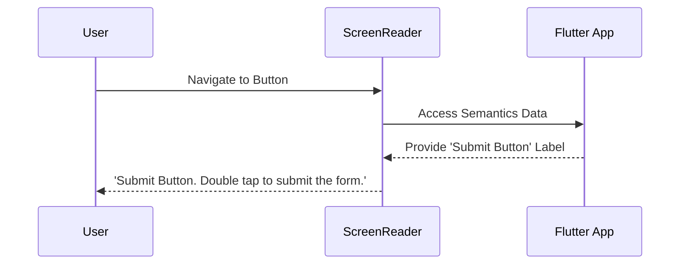

## 13.2.2 Screen Readers and Semantics

In the world of mobile app development, accessibility is not just a feature; it's a necessity. Ensuring that applications are usable by everyone, including those with disabilities, is a critical aspect of modern software design. One of the key tools in making applications accessible is the use of screen readers, which assist users with visual impairments by reading aloud the content on the screen. In this section, we'll explore how Flutter's semantics system can be leveraged to enhance accessibility through screen readers.

### Understanding Screen Readers

Screen readers are software programs that help visually impaired users interact with digital content. They convert text and other elements on the screen into speech or Braille, enabling users to navigate and understand the interface without needing to see it.

- **TalkBack (Android):** A screen reader that provides spoken feedback to help users with visual impairments use their devices. It reads out loud the text and content displayed on the screen and provides guidance on how to interact with various elements.
- **VoiceOver (iOS):** Apple's screen reader that allows users to control their devices using gestures. It provides auditory descriptions of what is on the screen, including text, buttons, and other interactive elements.

These tools are essential for making mobile applications accessible to a wider audience. They rely heavily on the semantics information provided by the application to deliver accurate and meaningful feedback to the user.

### Flutter’s Semantics System

Flutter provides a powerful semantics system that allows developers to define how their applications interact with screen readers. This is primarily achieved through the `Semantics` widget, which provides a way to describe the meaning and functionality of UI elements to assistive technologies.

#### Key Semantics Properties

The `Semantics` widget in Flutter comes with several properties that help define the accessibility information for screen readers:

- **`label`:** A descriptive text that identifies the widget. This is what the screen reader will announce to the user.
- **`hint`:** Additional instructions on how to interact with the widget. This can be useful for providing context or guidance.
- **`value`:** The current state or value of the widget. This is particularly useful for interactive elements like sliders or switches.
- **Semantic Flags:** These flags define the type of widget, such as `button`, `header`, `image`, etc., helping screen readers convey the correct context to users.

Here's an example of how to use the `Semantics` widget to enhance a button's accessibility:

```dart
Semantics(
  label: 'Submit Button',
  hint: 'Double tap to submit the form',
  button: true,
  child: ElevatedButton(
    onPressed: () {},
    child: Text('Submit'),
  ),
)
```

In this example, the `Semantics` widget wraps an `ElevatedButton`, providing a label and hint that will be read by screen readers.

### Customizing Semantics

For more complex widgets, you may need to customize the semantics to ensure that all elements are accessible. Flutter allows you to merge semantics from multiple child widgets using the `mergeSemantics` property. This is particularly useful when dealing with composite widgets that contain multiple interactive elements.

```dart
Semantics(
  container: true,
  child: Column(
    children: [
      Semantics(
        label: 'Username',
        child: Text('Username'),
      ),
      Semantics(
        label: 'Enter your username',
        child: TextField(),
      ),
    ],
  ),
)
```

In this example, the semantics of the `Text` and `TextField` widgets are combined, providing a cohesive description for screen readers.

### Testing with Screen Readers

Testing your application with actual screen readers is crucial to ensure that all interactive elements are properly labeled and accessible. Here are some steps to follow:

- **Enable Screen Reader:** Turn on TalkBack on Android or VoiceOver on iOS to test your app.
- **Navigate Through the App:** Use gestures to move through the UI and listen to the feedback provided by the screen reader.
- **Verify Labels and Hints:** Ensure that all elements have appropriate labels and hints, and that they are read correctly by the screen reader.

Testing with screen readers helps identify areas where accessibility can be improved, ensuring a better experience for all users.

### Handling Dynamic Content

Dynamic content changes, such as loading indicators or updates to the UI, should be communicated to screen readers to keep users informed. Flutter provides the `SemanticsService.announce` method to notify users of changes.

```dart
SemanticsService.announce('Loading complete', TextDirection.ltr);
```

This method sends an announcement to the screen reader, ensuring that users are aware of important updates in the application.

### Diagram: Screen Reader Interaction with Flutter’s Semantics

To better understand how screen readers interact with Flutter's semantics, let's look at a sequence diagram:



This diagram illustrates the interaction between a user, a screen reader, and a Flutter app. When the user navigates to a button, the screen reader accesses the semantics data from the app, retrieves the label, and provides the necessary feedback to the user.

### Best Practices and Common Pitfalls

- **Ensure Completeness:** Make sure that all interactive elements have appropriate semantics. Missing labels or hints can lead to confusion for screen reader users.
- **Avoid Overlapping Semantics:** Be cautious when using `mergeSemantics` to prevent conflicting information from being presented to the user.
- **Test Across Devices:** Screen reader behavior can vary between devices and platforms. Test your app on both Android and iOS to ensure consistent accessibility.
- **Keep Announcements Relevant:** Use the `announce` method judiciously to avoid overwhelming users with unnecessary information.

### Additional Resources

For further exploration of accessibility in Flutter, consider the following resources:

- [Flutter Accessibility Documentation](https://flutter.dev/docs/development/accessibility)
- [Google's Accessibility Guide](https://developers.google.com/accessibility)
- [Apple's Accessibility Guide](https://developer.apple.com/accessibility/)

These resources provide comprehensive information on making applications accessible and integrating with screen readers effectively.

### Conclusion

By leveraging Flutter's semantics system, developers can create applications that are accessible to users with visual impairments. Understanding how to use the `Semantics` widget and testing with screen readers are crucial steps in ensuring that your app is inclusive and usable by everyone. As you continue to build responsive and adaptive UIs, keep accessibility at the forefront of your design process, and strive to create experiences that are welcoming to all users.

## Quiz Time!



### What is the primary purpose of screen readers?

- [x] To assist users with visual impairments by reading aloud the content on the screen.
- [ ] To provide visual enhancements for users with low vision.
- [ ] To translate text into multiple languages.
- [ ] To improve the performance of mobile applications.

> **Explanation:** Screen readers are designed to help users with visual impairments by converting text and other elements on the screen into speech or Braille.

### Which of the following is a popular screen reader for Android devices?

- [x] TalkBack
- [ ] VoiceOver
- [ ] JAWS
- [ ] NVDA

> **Explanation:** TalkBack is the screen reader provided by Google for Android devices, while VoiceOver is used on iOS devices.

### What is the purpose of the `label` property in the `Semantics` widget?

- [x] To provide a descriptive text that identifies the widget for screen readers.
- [ ] To add a tooltip to the widget.
- [ ] To style the text within the widget.
- [ ] To set the background color of the widget.

> **Explanation:** The `label` property is used to provide a description of the widget that screen readers can announce to the user.

### How can you combine semantics from multiple child widgets in Flutter?

- [x] Using the `mergeSemantics` property.
- [ ] By nesting multiple `Semantics` widgets.
- [ ] By using the `combineSemantics` method.
- [ ] By setting the `semanticsGroup` flag.

> **Explanation:** The `mergeSemantics` property allows you to combine semantics from multiple child widgets into a single, cohesive description.

### What method is used to announce dynamic content changes to screen readers in Flutter?

- [x] `SemanticsService.announce`
- [ ] `ScreenReader.announce`
- [ ] `AccessibilityService.notify`
- [ ] `ContentChange.announce`

> **Explanation:** `SemanticsService.announce` is used to send announcements to screen readers about dynamic content changes.

### Which of the following is NOT a key property of the `Semantics` widget?

- [ ] `label`
- [ ] `hint`
- [ ] `value`
- [x] `tooltip`

> **Explanation:** `tooltip` is not a property of the `Semantics` widget. The key properties include `label`, `hint`, and `value`.

### What is the role of the `hint` property in the `Semantics` widget?

- [x] To provide additional instructions on how to interact with the widget.
- [ ] To display a pop-up message when the widget is tapped.
- [ ] To change the color of the widget.
- [ ] To set the widget's alignment.

> **Explanation:** The `hint` property offers additional guidance on how to interact with the widget, which can be read by screen readers.

### Why is it important to test your app with actual screen readers?

- [x] To ensure that all interactive elements are properly labeled and accessible.
- [ ] To verify the app's performance on different devices.
- [ ] To check the app's compatibility with various operating systems.
- [ ] To improve the app's visual design.

> **Explanation:** Testing with screen readers helps ensure that all elements are accessible and properly labeled, providing a better experience for users with visual impairments.

### What should you consider when using the `announce` method in Flutter?

- [x] Use it judiciously to avoid overwhelming users with unnecessary information.
- [ ] Use it frequently to keep users informed of all changes.
- [ ] Only use it for visual changes in the UI.
- [ ] It is not necessary to use the `announce` method.

> **Explanation:** The `announce` method should be used carefully to provide relevant information without overwhelming the user.

### True or False: The `Semantics` widget is only necessary for visually impaired users.

- [ ] True
- [x] False

> **Explanation:** While the `Semantics` widget is crucial for accessibility, it enhances the overall usability of the app for all users by providing clear and descriptive information.


