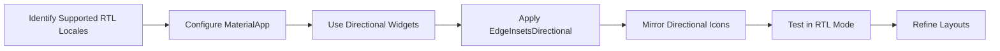

---

linkTitle: "13.2.4 Right-to-Left Layouts"
title: "Right-to-Left Layouts in Flutter: Comprehensive Guide for RTL Support"
description: "Explore how to implement Right-to-Left (RTL) layouts in Flutter applications, ensuring accessibility and internationalization for languages such as Arabic, Hebrew, and Persian. Learn about configuring locales, mirroring widgets, and best practices for seamless RTL support."
categories:
- Flutter
- Internationalization
- Accessibility
tags:
- RTL
- Flutter
- Internationalization
- Accessibility
- Localization
date: 2024-10-25
type: docs
nav_weight: 13240

---

## 13.2.4 Right-to-Left Layouts

In today's globalized world, creating applications that cater to a diverse audience is more important than ever. This includes supporting languages that read from right to left (RTL), such as Arabic, Hebrew, and Persian. Flutter, with its robust internationalization and localization capabilities, makes it relatively straightforward to implement RTL support. This section will guide you through the process of adapting your Flutter applications to support RTL layouts effectively.

### Understanding RTL (Right-to-Left) Support

Supporting RTL languages is crucial for accessibility and user experience in regions where these languages are predominant. The impact of RTL support extends beyond mere text alignment; it affects the entire layout direction, including the positioning of UI components and the flow of user interactions.

- **Importance of RTL Support:**
  - Enhances accessibility for native RTL language speakers.
  - Expands your app's reach to global markets.
  - Improves user experience by providing a natural and intuitive interface for RTL users.

- **Impact on Layout and UI Components:**
  - **Layout Direction:** The entire UI should mirror to accommodate RTL reading patterns.
  - **Text Alignment:** Text should align to the start of the container, which is the right side in RTL.
  - **UI Components:** Elements such as navigation bars, buttons, and icons need to adapt to the RTL flow.

### Configuring RTL in Flutter

Flutter provides built-in support for RTL layouts, allowing developers to create applications that automatically adjust based on the user's locale settings.

#### Locale Setup

To support RTL languages, you need to configure your Flutter app to recognize these locales. This involves setting up the `supportedLocales` in your `MaterialApp` or `CupertinoApp`.

```dart
MaterialApp(
  supportedLocales: [
    Locale('en', ''), // English
    Locale('ar', ''), // Arabic
    Locale('he', ''), // Hebrew
    // Add other locales as needed
  ],
  // Other properties...
)
```

#### Automatic Directionality

Flutter automatically adjusts the layout direction based on the device's locale. However, there might be cases where you need manual control over the text direction. The `Directionality` widget allows you to explicitly set the text direction for a subtree of widgets.

```dart
Directionality(
  textDirection: TextDirection.rtl,
  child: MyWidget(),
)
```

### Mirroring Widgets

To ensure a seamless RTL experience, it's essential to use widgets and properties that adapt to text direction.

#### Directional Widgets

Widgets like `Row` and `Column` can be configured to align children based on the text direction. Use `MainAxisAlignment.start` and `MainAxisAlignment.end` to ensure alignment adapts to RTL.

```dart
Row(
  mainAxisAlignment: MainAxisAlignment.start,
  children: <Widget>[
    Text('مرحبا'),
    Icon(Icons.arrow_forward),
  ],
)
```

#### EdgeInsets and Padding

Instead of using `EdgeInsets`, use `EdgeInsetsDirectional` to handle direction-aware padding and margins. This ensures that padding adjusts correctly when switching between LTR and RTL.

```dart
Padding(
  padding: EdgeInsetsDirectional.only(start: 16.0, end: 8.0),
  child: Text('Hello'),
)
```

#### Icons and Images

Icons that indicate direction, such as arrows, need to be mirrored in RTL layouts. The `Transform` widget can be used to flip icons horizontally.

```dart
Transform(
  alignment: Alignment.center,
  transform: Matrix4.identity()..scale(-1.0, 1.0, 1.0),
  child: Icon(Icons.arrow_back),
)
```

### Testing RTL Layouts

Testing your application in RTL mode is crucial to ensure that all elements are correctly positioned and functional. You can enable RTL mode in the Flutter inspector or change the device's language settings to an RTL language.

- **Interactive Elements:** Ensure buttons, sliders, and other interactive components are accessible and correctly aligned.
- **Visual Consistency:** Verify that the visual hierarchy and flow are maintained in RTL mode.

### Handling Text Alignment

For text alignment, use `TextAlign.start` and `TextAlign.end` instead of `TextAlign.left` and `TextAlign.right`. This ensures that text aligns correctly based on the text direction.

```dart
Text(
  'مرحبا',
  textAlign: TextAlign.start,
)
```

### Best Practices

- **Consistency:** Maintain consistent layout shifts when switching between LTR and RTL to avoid confusing the user.
- **Avoid Hardcoding Directions:** Use directional-aware widgets and properties to prevent layout issues.
- **Comprehensive Testing:** Test the app thoroughly in both LTR and RTL modes to ensure a seamless user experience.

### Diagram: Implementing RTL Support

To visualize the steps involved in implementing RTL support in a Flutter app, consider the following flowchart:



### Conclusion

Implementing RTL support in your Flutter application is a crucial step towards making your app accessible to a global audience. By following the guidelines and best practices outlined in this section, you can ensure that your app provides a seamless and intuitive experience for users of RTL languages. Remember to test thoroughly and consider the nuances of RTL layouts to deliver a polished and professional application.

## Quiz Time!



### What is the primary reason for supporting RTL languages in your app?

- [x] To enhance accessibility for native RTL language speakers
- [ ] To increase app performance
- [ ] To simplify codebase
- [ ] To reduce app size

> **Explanation:** Supporting RTL languages enhances accessibility for users who speak languages that read from right to left, such as Arabic and Hebrew.

### Which widget should you use to manually control text direction in Flutter?

- [ ] Padding
- [x] Directionality
- [ ] Align
- [ ] Container

> **Explanation:** The `Directionality` widget allows you to manually set the text direction for a subtree of widgets.

### How can you ensure padding adapts to RTL layouts?

- [ ] Use EdgeInsets
- [x] Use EdgeInsetsDirectional
- [ ] Use Padding
- [ ] Use Container

> **Explanation:** `EdgeInsetsDirectional` is used to handle direction-aware padding and margins, ensuring they adapt to RTL layouts.

### What is the correct way to align text in a direction-aware manner?

- [ ] TextAlign.left
- [ ] TextAlign.right
- [x] TextAlign.start
- [ ] TextAlign.center

> **Explanation:** `TextAlign.start` aligns text based on the text direction, ensuring correct alignment in both LTR and RTL layouts.

### Which of the following is NOT a best practice for RTL support?

- [ ] Consistency in layout shifts
- [ ] Avoid hardcoding directions
- [x] Use fixed text alignment
- [ ] Comprehensive testing

> **Explanation:** Using fixed text alignment is not a best practice; instead, use direction-aware properties like `TextAlign.start`.

### How can you mirror an icon for RTL layouts?

- [ ] Use Row widget
- [ ] Use Column widget
- [ ] Use EdgeInsetsDirectional
- [x] Use Transform widget

> **Explanation:** The `Transform` widget can be used to flip icons horizontally, ensuring they mirror correctly in RTL layouts.

### What should you include in `supportedLocales` for RTL support?

- [ ] Only English locale
- [x] RTL language locales like Arabic and Hebrew
- [ ] Only LTR language locales
- [ ] No locales

> **Explanation:** Including RTL language locales in `supportedLocales` ensures the app recognizes and supports these languages.

### How do you test RTL layouts in Flutter?

- [ ] Only on physical devices
- [x] Enable RTL mode in Flutter inspector or device settings
- [ ] Use only LTR languages
- [ ] Ignore testing

> **Explanation:** Enabling RTL mode in the Flutter inspector or device settings allows you to test RTL layouts effectively.

### What is the impact of RTL support on UI components?

- [ ] No impact
- [x] Affects layout direction and component positioning
- [ ] Only affects text color
- [ ] Only affects app performance

> **Explanation:** RTL support affects the entire layout direction and the positioning of UI components to accommodate RTL reading patterns.

### True or False: Using `TextAlign.left` is recommended for RTL support.

- [ ] True
- [x] False

> **Explanation:** Using `TextAlign.left` is not recommended for RTL support; instead, use `TextAlign.start` for direction-aware alignment.


