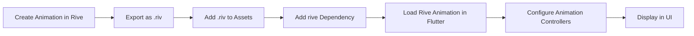

## 13.3.1 Integrating Rive Animations

Animations can significantly enhance the user experience in mobile applications by providing visual feedback, guiding users through interactions, and adding a layer of polish to the overall design. In this section, we will explore how to integrate Rive animations into Flutter applications, leveraging their power for creating interactive and real-time animations.

### Introduction to Rive

Rive is a powerful animation tool that allows designers and developers to create interactive animations that can be seamlessly integrated into applications. It stands out due to its ability to provide real-time interactivity and smooth animations, making it an excellent choice for enhancing user interfaces.

#### Advantages of Using Rive

- **Real-Time Interactivity:** Rive animations can respond to user inputs and changes in real-time, offering a dynamic user experience.
- **Smooth Animations:** The animations are optimized for performance, ensuring they run smoothly across different devices.
- **Cross-Platform Compatibility:** Rive animations can be used across various platforms, including mobile, web, and desktop.
- **Rich Animation Features:** Rive supports complex animations, including state machines, which allow for intricate animation logic.

### Setting Up Rive in Flutter

To integrate Rive animations into your Flutter project, you need to add the Rive package to your project dependencies and import it into your Dart files.

#### Add Rive Dependency

First, add the Rive package to your `pubspec.yaml` file:

```yaml
dependencies:
  rive: ^0.9.0
```

This will allow you to use Rive's features within your Flutter application.

#### Importing Rive

After adding the dependency, import the Rive package into your Dart files where you plan to use animations:

```dart
import 'package:rive/rive.dart';
```

### Creating and Exporting Animations

Rive provides an online editor and a desktop application that you can use to create animations. Once your animation is ready, export it in the `.riv` format, which is optimized for integration with Flutter.

1. **Design Your Animation:** Use Rive's editor to design your animation. You can create simple animations or complex state machines depending on your needs.
2. **Export as .riv:** Once your animation is complete, export it as a `.riv` file. This file format is specifically designed for use with Rive's runtime in applications.

### Loading and Displaying Rive Animations

With your animation exported, you can now load and display it within your Flutter application.

#### Basic Example

To display a Rive animation, use the `RiveAnimation.asset` widget. This widget loads the animation from your assets and displays it in your app:

```dart
RiveAnimation.asset(
  'assets/animation.riv',
  animations: ['idle'],
)
```

This example assumes you have an animation named 'idle' within your `.riv` file.

#### Controlling Animations

To manage the playback of animations, you can use animation controllers. These controllers allow you to start, stop, and control the progress of animations.

```dart
class MyRiveAnimation extends StatefulWidget {
  @override
  _MyRiveAnimationState createState() => _MyRiveAnimationState();
}

class _MyRiveAnimationState extends State<MyRiveAnimation> {
  late RiveAnimationController _controller;

  @override
  void initState() {
    super.initState();
    _controller = SimpleAnimation('idle');
  }

  @override
  Widget build(BuildContext context) {
    return RiveAnimation.asset(
      'assets/animation.riv',
      controllers: [_controller],
    );
  }
}
```

In this example, a `SimpleAnimation` controller is used to control the 'idle' animation.

### Interactive Animations

Rive animations can be made interactive by responding to user inputs. This is achieved by using input triggers and state machines.

```dart
class InteractiveRiveAnimation extends StatefulWidget {
  @override
  _InteractiveRiveAnimationState createState() => _InteractiveRiveAnimationState();
}

class _InteractiveRiveAnimationState extends State<InteractiveRiveAnimation> {
  late RiveAnimationController _controller;

  @override
  void initState() {
    super.initState();
    _controller = StateMachineController.fromArtboard(
      artboard,
      'State Machine 1',
    )!;
    artboard.addController(_controller);
  }

  void _onTap() {
    // Trigger animation
    _controller.isActive = !_controller.isActive;
  }

  @override
  Widget build(BuildContext context) {
    return GestureDetector(
      onTap: _onTap,
      child: Rive(
        artboard: artboard,
        fit: BoxFit.contain,
      ),
    );
  }
}
```

In this example, a `StateMachineController` is used to manage the animation's state machine, allowing for interactive animations that respond to user taps.

### Best Practices

When integrating Rive animations into your Flutter application, consider the following best practices:

- **Optimize Assets:** Ensure your `.riv` files are optimized for size to minimize the impact on your app's overall size.
- **Manage Controllers:** Always dispose of animation controllers when they are no longer needed to free up resources.
- **Consistency:** Align Rive animations with your app’s design language and user experience to maintain a cohesive look and feel.

### Diagram: Integrating Rive Animations

To visualize the process of integrating a Rive animation into a Flutter app, consider the following flowchart:



This flowchart outlines the steps from creating an animation in Rive to displaying it within a Flutter application.

### Conclusion

Integrating Rive animations into your Flutter applications can significantly enhance the user experience by providing smooth, interactive animations. By following the steps outlined in this section, you can leverage Rive's powerful animation capabilities to create engaging and dynamic user interfaces.

For further exploration, consider visiting the [Rive Documentation](https://rive.app/docs) and experimenting with different animation techniques and state machines to fully utilize Rive's capabilities.

## Quiz Time!



### What is one of the main advantages of using Rive for animations in Flutter?

- [x] Real-time interactivity
- [ ] High memory usage
- [ ] Limited animation features
- [ ] Difficult integration

> **Explanation:** Rive provides real-time interactivity, allowing animations to respond dynamically to user inputs.

### How do you add the Rive package to a Flutter project?

- [x] Add `rive: ^0.9.0` to the `pubspec.yaml` file
- [ ] Import `rive.dart` directly into the project
- [ ] Use a command-line tool to install Rive
- [ ] Download Rive manually and add it to the project

> **Explanation:** The Rive package is added by specifying it as a dependency in the `pubspec.yaml` file.

### Which file format is used to export animations from Rive for Flutter integration?

- [x] .riv
- [ ] .gif
- [ ] .mp4
- [ ] .svg

> **Explanation:** Rive animations are exported in the `.riv` format for use with Flutter.

### What widget is used to display a Rive animation in Flutter?

- [x] RiveAnimation.asset
- [ ] Image.asset
- [ ] VideoPlayer
- [ ] AnimationController

> **Explanation:** The `RiveAnimation.asset` widget is used to load and display Rive animations in Flutter.

### How can you control the playback of a Rive animation in Flutter?

- [x] Using RiveAnimationController
- [ ] By manually updating frames
- [ ] Using a Timer
- [ ] Through CSS animations

> **Explanation:** The `RiveAnimationController` is used to manage and control the playback of Rive animations.

### What is a best practice when using Rive animations in Flutter?

- [x] Dispose of animation controllers properly
- [ ] Use the largest possible `.riv` files
- [ ] Avoid using controllers
- [ ] Ignore app design consistency

> **Explanation:** Properly disposing of animation controllers is crucial to free up resources and prevent memory leaks.

### Which Rive feature allows animations to respond to user inputs?

- [x] State machines
- [ ] Static frames
- [ ] Pre-rendered videos
- [ ] Keyframe animations only

> **Explanation:** State machines in Rive allow animations to respond dynamically to user inputs and changes.

### What should you consider when optimizing Rive assets for a Flutter app?

- [x] File size and performance
- [ ] Adding as many animations as possible
- [ ] Using high-resolution images only
- [ ] Avoiding optimization for speed

> **Explanation:** Optimizing the file size and performance of `.riv` files is important to ensure smooth app operation.

### What is the purpose of the `GestureDetector` in the interactive Rive animation example?

- [x] To handle user taps and trigger animations
- [ ] To display the animation
- [ ] To load the `.riv` file
- [ ] To control animation speed

> **Explanation:** The `GestureDetector` is used to capture user taps and trigger the animation's state changes.

### True or False: Rive animations can only be used in mobile applications.

- [ ] True
- [x] False

> **Explanation:** Rive animations are cross-platform and can be used in mobile, web, and desktop applications.


