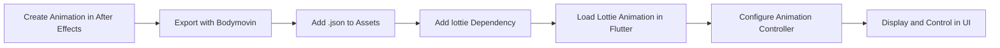

## 13.3.2 Using Lottie for Complex Animations

In the world of mobile app development, animations play a crucial role in enhancing user experience by making interfaces more engaging and interactive. Lottie, a library developed by Airbnb, has emerged as a popular tool for rendering animations created in Adobe After Effects in real time. This section will guide you through the process of integrating Lottie animations into your Flutter applications, enabling you to add rich and scalable animations with ease.

### Introduction to Lottie

Lottie is a library that renders animations and vector graphics in real time, allowing developers to add complex animations to their applications without compromising performance. These animations are created using Adobe After Effects and exported as JSON files using the Bodymovin plugin. Lottie is widely used for its ability to handle high-quality animations that are scalable and lightweight, making it an ideal choice for mobile applications.

#### Use Cases for Lottie in Flutter Apps

- **Interactive UI Elements:** Enhance buttons, loaders, and transitions with smooth animations.
- **Onboarding Screens:** Create engaging onboarding experiences with animated illustrations.
- **Data Visualization:** Use animations to represent data changes dynamically.
- **Branding and Storytelling:** Incorporate brand elements and narratives through animations.

### Setting Up Lottie in Flutter

To start using Lottie in your Flutter application, you need to add the Lottie package to your project and import it into your Dart files.

#### Add Lottie Dependency

First, add the Lottie dependency to your `pubspec.yaml` file:

```yaml
dependencies:
  lottie: ^2.2.0
```

Run `flutter pub get` to install the package.

#### Importing Lottie

Next, import the Lottie package into your Dart file:

```dart
import 'package:lottie/lottie.dart';
```

### Creating and Exporting Animations

To create animations for use with Lottie, you need Adobe After Effects and the Bodymovin plugin. Follow these steps to create and export your animations:

1. **Design Your Animation:** Use Adobe After Effects to design your animation. Ensure that your animation is optimized for mobile devices by keeping layers and effects simple.

2. **Export with Bodymovin:** Install the Bodymovin plugin in After Effects. Use it to export your animation as a `.json` file. This file will be used by Lottie to render the animation in your Flutter app.

3. **Add to Assets:** Place the exported `.json` file in your Flutter project's assets directory, and update your `pubspec.yaml` to include the asset:

   ```yaml
   flutter:
     assets:
       - assets/animation.json
   ```

### Loading and Displaying Lottie Animations

With your animation file ready, you can now load and display it in your Flutter app.

#### Basic Example

To display a Lottie animation, use the `Lottie.asset` widget:

```dart
Lottie.asset('assets/animation.json')
```

This simple line of code will render the animation in your app.

#### Controlling Playback

To have more control over the animation, such as playing, pausing, or looping, use an `AnimationController`. Here's an example of how to implement this:

```dart
class MyLottieAnimation extends StatefulWidget {
  @override
  _MyLottieAnimationState createState() => _MyLottieAnimationState();
}

class _MyLottieAnimationState extends State<MyLottieAnimation> with SingleTickerProviderStateMixin {
  late AnimationController _controller;

  @override
  void initState() {
    super.initState();
    _controller = AnimationController(vsync: this);
  }

  @override
  void dispose() {
    _controller.dispose();
    super.dispose();
  }

  @override
  Widget build(BuildContext context) {
    return Lottie.asset(
      'assets/animation.json',
      controller: _controller,
      onLoaded: (composition) {
        _controller
          ..duration = composition.duration
          ..forward();
      },
    );
  }
}
```

In this example, the `AnimationController` is used to manage the animation's playback. The `onLoaded` callback sets the duration of the controller to match the animation's duration and starts the animation.

### Interactive Animations

Lottie animations can be made interactive by responding to user gestures or state changes. For instance, you can restart an animation when a user taps on it:

```dart
GestureDetector(
  onTap: () {
    _controller.forward(from: 0.0);
  },
  child: Lottie.asset(
    'assets/animation.json',
    controller: _controller,
    onLoaded: (composition) {
      _controller
        ..duration = composition.duration
        ..forward();
    },
  ),
)
```

This example uses a `GestureDetector` to restart the animation from the beginning when tapped.

### Best Practices

When using Lottie animations in your Flutter app, consider the following best practices:

- **Optimize Animations:** Use compressed and optimized `.json` files to reduce load times and improve performance.
- **Maintain Sync with Design:** Ensure that animations accurately reflect the intended design and behavior, collaborating closely with designers.
- **Manage Memory:** Dispose of animation controllers appropriately to prevent memory leaks and ensure efficient resource usage.

### Diagram: Workflow of Integrating a Lottie Animation

To better understand the process of integrating a Lottie animation into a Flutter app, refer to the following Mermaid.js flowchart:



### Conclusion

Integrating Lottie animations into your Flutter applications can significantly enhance the user experience by adding dynamic and visually appealing elements. By following the steps outlined in this section, you can leverage Lottie to create complex animations that are both scalable and performant. Remember to adhere to best practices to ensure that your animations are optimized and maintainable.

### Further Exploration

- **Official Lottie Documentation:** [Lottie Files Documentation](https://airbnb.io/lottie/#/)
- **Adobe After Effects Tutorials:** Explore tutorials to improve your animation skills.
- **Flutter Community:** Engage with the Flutter community for tips and shared experiences.

By mastering Lottie animations, you can elevate your Flutter applications to new heights, creating engaging and memorable user experiences.

## Quiz Time!



### What is Lottie primarily used for in mobile app development?

- [x] Rendering animations created in Adobe After Effects in real time
- [ ] Creating static images for mobile apps
- [ ] Developing backend services for mobile apps
- [ ] Managing app state

> **Explanation:** Lottie is a library that renders animations created in Adobe After Effects in real time, allowing for rich and scalable animations in mobile apps.

### Which plugin is used to export animations from Adobe After Effects for use with Lottie?

- [x] Bodymovin
- [ ] Lottie Exporter
- [ ] Animation Studio
- [ ] After Effects Export

> **Explanation:** The Bodymovin plugin is used to export animations from Adobe After Effects as JSON files, which can be used with Lottie.

### How do you add the Lottie package to a Flutter project?

- [x] Add `lottie: ^2.2.0` to the dependencies in `pubspec.yaml`
- [ ] Install it via the Flutter CLI
- [ ] Download it from the Lottie website
- [ ] Include it in the main.dart file

> **Explanation:** To add the Lottie package, you include it in the dependencies section of your `pubspec.yaml` file and run `flutter pub get`.

### What widget is used to display a Lottie animation in Flutter?

- [x] Lottie.asset
- [ ] AnimationWidget
- [ ] FlutterAnimation
- [ ] Lottie.display

> **Explanation:** The `Lottie.asset` widget is used to load and display a Lottie animation from an asset file.

### How can you control the playback of a Lottie animation in Flutter?

- [x] Using an `AnimationController`
- [ ] By setting a playback speed property
- [ ] Through the main.dart file
- [ ] Using a GestureDetector only

> **Explanation:** An `AnimationController` is used to manage the playback of a Lottie animation, allowing for control over start, stop, and looping.

### What is the purpose of the `onLoaded` callback in a Lottie animation?

- [x] To set the animation's duration and start the animation
- [ ] To load the animation from the internet
- [ ] To initialize the Flutter app
- [ ] To export the animation to a file

> **Explanation:** The `onLoaded` callback is used to set the duration of the animation controller and to start the animation once it is loaded.

### How can you make a Lottie animation interactive?

- [x] By using a GestureDetector to respond to user input
- [ ] By adding a button in the main.dart file
- [ ] By setting an interactive property in Lottie.asset
- [ ] By using a special interactive JSON file

> **Explanation:** A `GestureDetector` can be used to make a Lottie animation interactive by responding to user gestures such as taps.

### What is a best practice when using Lottie animations in Flutter?

- [x] Optimize JSON files for performance
- [ ] Use as many animations as possible
- [ ] Avoid using animation controllers
- [ ] Always load animations from the internet

> **Explanation:** Optimizing JSON files helps reduce load times and improve performance, which is a best practice when using Lottie animations.

### What tool can be used to create animations for Lottie?

- [x] Adobe After Effects
- [ ] Sketch
- [ ] Figma
- [ ] Blender

> **Explanation:** Adobe After Effects is used to create animations that can be exported as JSON files for use with Lottie.

### True or False: Lottie animations can only be used for simple animations.

- [ ] True
- [x] False

> **Explanation:** False. Lottie animations can be used for complex animations, making them suitable for a wide range of applications in mobile app development.


