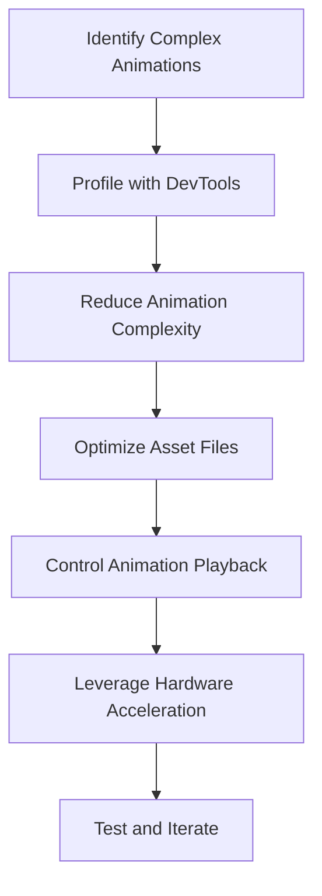

---

linkTitle: "13.3.3 Performance Considerations"
title: "Performance Considerations in Flutter Animations with Rive and Lottie"
description: "Explore the impact of animations on app performance and learn strategies to optimize Rive and Lottie animations for responsive and efficient Flutter applications."
categories:
- Flutter
- Performance Optimization
- Animation
tags:
- Flutter
- Rive
- Lottie
- Animation Performance
- Optimization
date: 2024-10-25
type: docs
nav_weight: 13330

---

## 13.3.3 Performance Considerations

In the realm of mobile app development, animations play a crucial role in enhancing user experience by providing visual feedback and improving the overall aesthetic appeal of applications. However, these animations can also become a double-edged sword, especially when not optimized for performance. This section delves into the impact of animations on app performance, particularly focusing on Rive and Lottie animations in Flutter, and provides actionable insights to optimize them effectively.

### Impact of Animations on Performance

Animations, while visually appealing, can significantly impact the performance of an application. This is especially true for complex animations that involve multiple layers and intricate movements. On lower-end devices, such animations can lead to increased CPU and GPU usage, resulting in sluggish performance, dropped frames, and a poor user experience.

#### Balancing Visual Richness with Performance Efficiency

- **Complexity vs. Performance:** The more complex an animation, the more resources it requires. It's essential to strike a balance between visual richness and performance efficiency. This means designing animations that are not only visually appealing but also optimized for smooth playback across a range of devices.
  
- **Device Capabilities:** Consider the capabilities of the target devices. High-end devices may handle complex animations with ease, but lower-end devices might struggle. Tailoring animations to suit the performance characteristics of different devices can help maintain a consistent user experience.

### Optimizing Rive and Lottie Animations

To ensure that animations do not become a bottleneck in your application, consider the following optimization strategies:

#### Reduce Animation Complexity

- **Simplify Animations:** Reduce the number of moving parts and layers in your animations. This can significantly decrease the rendering load and improve performance.
  
- **Limit Details:** Avoid overly detailed animations that require extensive processing. Instead, focus on key elements that convey the intended message or interaction.

#### Asset Optimization

- **Compress Animation Files:** Use tools to compress `.riv` and `.json` files without sacrificing quality. This reduces the file size and load time, improving performance.
  
- **Remove Unnecessary Frames:** Analyze your animation files and remove any frames or assets that do not contribute to the final output. This helps in reducing the processing required during playback.

#### Efficient Animation Playback

- **Control Playback:** Ensure that animations are only played when necessary. Use `paused` states for animations that are not visible or needed, as shown in the example below:

  ```dart
  Lottie.asset(
    'assets/animation.json',
    controller: _controller,
    onLoaded: (composition) {
      _controller
        ..duration = composition.duration
        ..pause(); // Pause the animation initially
    },
  )
  ```

- **Conditional Rendering:** Only render animations when they are in view or required by the user interaction. This reduces unnecessary processing and conserves resources.

#### Leverage Hardware Acceleration

- **Utilize GPU Rendering:** Ensure that animations take advantage of the device’s GPU for rendering. This offloads processing from the CPU, leading to smoother animations.
  
- **Avoid CPU-bound Operations:** Minimize CPU-bound operations within animation callbacks to prevent bottlenecks. Keep animation logic simple and efficient.

### Testing and Profiling

Profiling your animations is crucial to identify performance bottlenecks and optimize them accordingly. Flutter DevTools provides a comprehensive suite of tools for profiling animations.

- **Profile with Flutter DevTools:** Use the following command to run your app in profile mode, which provides detailed insights into performance:

  ```bash
  flutter run --profile
  ```

- **Identify Bottlenecks:** Analyze the performance data to identify areas where animations may be causing slowdowns. Focus on optimizing these areas to enhance overall app performance.

#### Code Example: Profiling an Animation

```dart
// Example of running a Flutter app in profile mode
void main() {
  runApp(MyApp());
}

// Use Flutter DevTools to monitor performance
```

### Best Practices

To maintain optimal performance while using animations, consider the following best practices:

- **Reuse Animation Controllers:** Avoid creating multiple controllers for the same animation. Instead, reuse controllers to manage resources efficiently.

- **Limit Simultaneous Animations:** Restrict the number of concurrent animations to prevent overwhelming the device’s processing capabilities.

- **Asynchronous Loading:** Load animations asynchronously to prevent blocking the UI thread. Use `FutureBuilder` to manage loading states effectively:

  ```dart
  FutureBuilder(
    future: precacheLottieAnimation('assets/animation.json'),
    builder: (context, snapshot) {
      if (snapshot.connectionState == ConnectionState.done) {
        return Lottie.asset('assets/animation.json');
      } else {
        return CircularProgressIndicator();
      }
    },
  )
  ```

### Diagram: Optimizing Animation Performance

Below is a flowchart outlining the steps to optimize animation performance in Flutter:



### Conclusion

Animations are a powerful tool for enhancing user experience, but they must be used judiciously to avoid performance pitfalls. By understanding the impact of animations on performance and implementing the optimization strategies discussed, you can create visually stunning applications that perform well across a wide range of devices. Remember to continually test and profile your animations to ensure they meet the desired performance standards.

---

## Quiz Time!



### How can complex animations affect app performance?

- [x] They can increase CPU and GPU usage, leading to sluggish performance.
- [ ] They always improve app performance by making it more interactive.
- [ ] They have no impact on performance if designed correctly.
- [ ] They only affect performance on high-end devices.

> **Explanation:** Complex animations can increase CPU and GPU usage, especially on lower-end devices, leading to sluggish performance and dropped frames.

### What is a recommended strategy to reduce animation complexity?

- [x] Simplify animations by reducing the number of moving parts and layers.
- [ ] Increase the number of frames for smoother transitions.
- [ ] Add more details to make animations more realistic.
- [ ] Use more colors to enhance visual appeal.

> **Explanation:** Simplifying animations by reducing the number of moving parts and layers decreases the rendering load and improves performance.

### How can asset optimization improve animation performance?

- [x] By compressing animation files and removing unnecessary frames.
- [ ] By increasing the file size for better quality.
- [ ] By adding more frames to make animations smoother.
- [ ] By using higher resolution assets.

> **Explanation:** Compressing animation files and removing unnecessary frames reduces file size and load time, improving performance.

### What is the benefit of controlling animation playback?

- [x] It prevents unnecessary frames from being rendered, conserving resources.
- [ ] It makes animations play continuously for better effect.
- [ ] It increases CPU usage for smoother animations.
- [ ] It reduces the need for GPU acceleration.

> **Explanation:** Controlling animation playback prevents unnecessary frames from being rendered, conserving resources and improving performance.

### How does leveraging hardware acceleration benefit animations?

- [x] It utilizes the device’s GPU for rendering, offloading processing from the CPU.
- [ ] It increases CPU usage for faster processing.
- [ ] It decreases the need for optimization.
- [ ] It makes animations run slower to save battery.

> **Explanation:** Leveraging hardware acceleration utilizes the device’s GPU for rendering, offloading processing from the CPU and leading to smoother animations.

### What is a best practice for using animation controllers?

- [x] Reuse animation controllers to manage resources efficiently.
- [ ] Create a new controller for each animation instance.
- [ ] Use multiple controllers for complex animations.
- [ ] Avoid using controllers for simple animations.

> **Explanation:** Reusing animation controllers helps manage resources efficiently and prevents unnecessary resource allocation.

### Why should simultaneous animations be limited?

- [x] To prevent overwhelming the device’s processing capabilities.
- [ ] To make the app more interactive.
- [ ] To increase the visual appeal of the app.
- [ ] To decrease the app’s responsiveness.

> **Explanation:** Limiting simultaneous animations prevents overwhelming the device’s processing capabilities, maintaining performance.

### How can asynchronous loading improve animation performance?

- [x] By preventing blocking of the UI thread during loading.
- [ ] By making animations load instantly.
- [ ] By increasing the complexity of animations.
- [ ] By reducing the need for asset optimization.

> **Explanation:** Asynchronous loading prevents blocking of the UI thread, allowing animations to load without affecting UI responsiveness.

### What is the purpose of profiling animations with Flutter DevTools?

- [x] To identify performance bottlenecks and optimize them.
- [ ] To increase the complexity of animations.
- [ ] To make animations run continuously.
- [ ] To reduce the need for testing.

> **Explanation:** Profiling animations with Flutter DevTools helps identify performance bottlenecks, allowing developers to optimize them for better performance.

### True or False: Complex animations have no impact on app performance if designed correctly.

- [ ] True
- [x] False

> **Explanation:** False. Even well-designed complex animations can impact app performance, especially on lower-end devices, due to increased resource usage.


