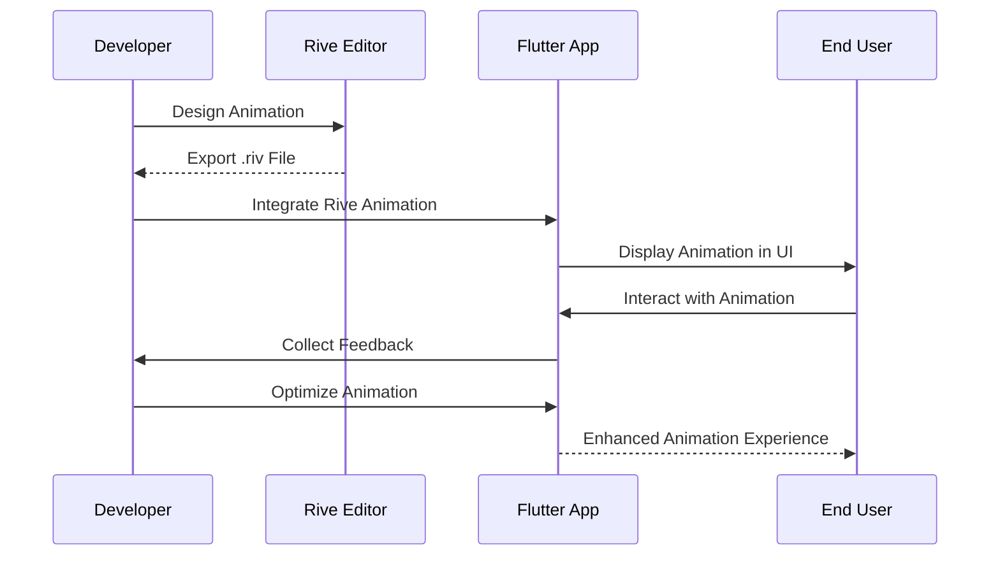

## 13.3.4 Case Studies

In the rapidly evolving world of mobile app development, creating visually appealing and interactive user interfaces is crucial for engaging users. Animations play a significant role in enhancing user experience by providing feedback, guiding users, and adding a touch of delight to interactions. This section delves into two detailed case studies that illustrate the effective use of Rive and Lottie animations in Flutter applications. These case studies highlight the implementation strategies, performance optimizations, and the resulting impact on user engagement and satisfaction.

### Case Study 1: E-Commerce App with Interactive Animations

#### Overview

In this case study, we explore an e-commerce application that leverages Rive animations for dynamic product displays and Lottie animations for onboarding experiences. The goal was to create an engaging shopping experience that captivates users from the moment they open the app.

#### Implementation Highlights

- **Rive for Dynamic Product Showcases:**
  - Rive animations were integrated into the product display pages to create interactive showcases. These animations respond to user gestures, such as swiping or tapping, to provide a more immersive experience.
  - For instance, users can rotate a 3D model of a product by swiping left or right, with smooth transitions and animations enhancing the realism of the interaction.

- **Lottie for Onboarding Screens:**
  - The onboarding process was designed using Lottie animations to introduce users to the app's features in a visually appealing manner. These animations guide users through the app's functionalities, ensuring they understand how to navigate and utilize the features effectively.
  - The use of Lottie allowed for complex animations that are lightweight and easy to implement, providing a seamless onboarding experience.

#### Performance Optimization

- **Efficient Asset Management:**
  - Both Rive and Lottie animations were optimized by reducing file sizes and using vector-based assets, which are inherently scalable and lightweight.
  - Lazy loading techniques were employed to load animations only when needed, reducing initial load times and conserving device resources.

- **Optimized Rendering:**
  - The animations were carefully crafted to minimize redraws and leverage Flutter's efficient rendering pipeline. This ensured that animations remained smooth even on lower-end devices.

#### Results

- **Improved User Engagement:**
  - The interactive product displays and engaging onboarding animations led to a significant increase in user engagement metrics. Users spent more time exploring products and provided positive feedback on the app's visual appeal.
- **Positive User Feedback:**
  - The app received numerous positive reviews highlighting the smooth and interactive animations as a standout feature, contributing to higher user satisfaction and retention rates.

### Case Study 2: Fitness App with Real-Time Animated Feedback

#### Overview

This case study examines a fitness application that uses Lottie animations to provide real-time feedback during workouts. The aim was to create a motivating and responsive experience that keeps users engaged and motivated throughout their fitness journey.

#### Implementation Highlights

- **Lottie for Progress Indicators and Motivational Messages:**
  - Lottie animations were used to create animated progress indicators that visually represent workout progress, such as time elapsed or calories burned. These animations provide immediate feedback, enhancing the user's sense of accomplishment.
  - Motivational messages were also animated using Lottie to encourage users during workouts, creating a dynamic and supportive environment.

- **Interactive Animations:**
  - The app included interactive animations that respond to user input, such as starting or pausing a workout. These animations provided visual cues that guide users through their workout routines.

#### Performance Optimization

- **Device Compatibility:**
  - To ensure smooth animations across various devices, including low-end smartphones, the animations were optimized for performance. This included reducing the complexity of animations and testing extensively on different hardware configurations.
  
- **Resource Management:**
  - Efficient use of device resources was prioritized by managing animation lifecycles and disposing of animations when not in use, preventing unnecessary memory usage.

#### Results

- **Increased User Retention:**
  - The engaging and responsive animations contributed to increased user retention, as users found the app motivating and enjoyable to use.
- **Higher User Satisfaction:**
  - User satisfaction scores improved, with many users citing the real-time feedback and motivational animations as key factors in their continued use of the app.

### Lessons Learned

- **Balancing Aesthetics and Performance:**
  - It is crucial to ensure that animations enhance the user experience without introducing lag or performance issues. This balance was achieved through careful optimization and testing.

- **User-Centric Design:**
  - Designing animations that are intuitive and add value to the user's interaction with the app is essential. User feedback was instrumental in refining animations to meet user expectations.

- **Iterative Development:**
  - Continuous refinement of animations based on user feedback and performance metrics was key to achieving the desired user experience. This iterative approach allowed for ongoing improvements and enhancements.

### Diagram Suggestion

To better understand the flow of implementing and optimizing animations in a real-world app scenario, consider the following Mermaid.js sequence diagram:

This diagram illustrates the iterative process of designing, integrating, and optimizing animations to enhance user experience in a Flutter application.

### Conclusion

These case studies demonstrate the transformative power of animations in mobile applications. By leveraging tools like Rive and Lottie, developers can create engaging and interactive user experiences that captivate users and enhance satisfaction. The lessons learned from these implementations highlight the importance of balancing aesthetics with performance, focusing on user-centric design, and embracing iterative development to continuously refine and improve animations.

## Quiz Time!



### What tool was used for interactive product displays in the e-commerce app case study?

- [x] Rive
- [ ] Lottie
- [ ] Flutter's built-in animations
- [ ] Adobe After Effects

> **Explanation:** Rive was used for creating dynamic product showcases that respond to user gestures in the e-commerce app.

### How were onboarding screens enhanced in the e-commerce app?

- [ ] By using static images
- [x] By using Lottie animations
- [ ] By using Rive animations
- [ ] By using video tutorials

> **Explanation:** Lottie animations were used to create visually appealing onboarding screens that enhance user engagement.

### What was a key performance optimization technique used in both case studies?

- [ ] Increasing animation complexity
- [x] Reducing file sizes and using vector-based assets
- [ ] Using only raster images
- [ ] Avoiding animations altogether

> **Explanation:** Reducing file sizes and using vector-based assets helped ensure smooth animations without compromising performance.

### What type of feedback did the fitness app provide using Lottie animations?

- [ ] Static feedback
- [x] Real-time feedback
- [ ] Delayed feedback
- [ ] No feedback

> **Explanation:** The fitness app used Lottie animations to provide real-time feedback during workouts, enhancing user engagement.

### What was a significant result of using animations in the fitness app?

- [ ] Decreased user retention
- [ ] Lower user satisfaction
- [x] Increased user retention
- [ ] No change in user metrics

> **Explanation:** The engaging and responsive animations contributed to increased user retention and higher levels of user satisfaction.

### What is a key lesson learned from these case studies?

- [ ] Animations should be complex and detailed
- [x] Balancing aesthetics and performance is crucial
- [ ] User feedback is not important
- [ ] Iterative development is unnecessary

> **Explanation:** Balancing aesthetics and performance is crucial to ensure animations enhance the user experience without introducing lag.

### How did the e-commerce app ensure animations were smooth on lower-end devices?

- [ ] By using high-resolution images
- [x] By optimizing rendering and using efficient asset management
- [ ] By avoiding animations
- [ ] By increasing animation duration

> **Explanation:** The e-commerce app optimized rendering and used efficient asset management to ensure smooth animations on lower-end devices.

### What was a key factor in the iterative development process?

- [ ] Ignoring user feedback
- [ ] Focusing solely on aesthetics
- [x] Refining animations based on user feedback and performance metrics
- [ ] Avoiding changes once animations are implemented

> **Explanation:** Refining animations based on user feedback and performance metrics was key to achieving the desired user experience.

### What was the primary purpose of using Rive in the e-commerce app?

- [ ] To create static images
- [x] To create interactive product displays
- [ ] To enhance onboarding screens
- [ ] To replace Lottie animations

> **Explanation:** Rive was used to create interactive product displays that respond to user gestures, enhancing the shopping experience.

### True or False: Lottie animations were used to create interactive product displays in the e-commerce app.

- [ ] True
- [x] False

> **Explanation:** Lottie animations were used for onboarding screens, while Rive was used for interactive product displays.


