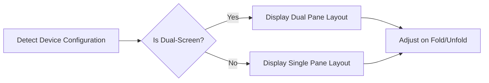

## 13.4.1 Foldable and Dual-Screen Devices

As technology continues to evolve, so do the devices we use daily. Foldable and dual-screen devices represent a significant shift in how users interact with their apps, offering new opportunities and challenges for developers. In this section, we will explore these emerging form factors, focusing on how to design responsive and adaptive UIs in Flutter that cater to these unique devices.

### Understanding Foldable and Dual-Screen Form Factors

Foldable and dual-screen devices are characterized by their ability to transform between different screen configurations. These devices can fold to provide a compact form factor or unfold to offer a larger display area, often with multiple screens. This versatility introduces both challenges and opportunities for app design:

- **Challenges:**
  - **Dynamic Layouts:** Apps must adapt to varying screen sizes and configurations seamlessly.
  - **State Management:** Maintaining consistent state across different screen modes can be complex.
  - **User Experience:** Ensuring smooth transitions and intuitive navigation is crucial.

- **Opportunities:**
  - **Enhanced Productivity:** Dual screens can support multitasking and improve productivity.
  - **Innovative UI/UX:** New form factors allow for creative and engaging user experiences.

### Design Considerations

Designing for foldable and dual-screen devices requires a thoughtful approach to ensure a seamless user experience. Here are some key considerations:

#### Flexible Layouts

Flexible layouts are essential for accommodating the dynamic nature of foldable devices. Using Flutter's `MediaQuery`, you can detect screen changes and adjust layouts accordingly. Here's a simple example:

```dart
if (MediaQuery.of(context).size.width > 600) {
  // Use a tablet layout
} else {
  // Use a phone layout
}
```

This approach allows your app to switch between different layouts based on the available screen width, ensuring that your UI remains user-friendly across various configurations.

#### Multi-Window Support

Foldable and dual-screen devices often support multi-window operations, allowing users to run multiple apps or different parts of the same app simultaneously. Flutter provides APIs to manage these scenarios effectively. Consider designing your app to function correctly across multiple windows or screens, utilizing Flutter’s multi-window support to manage different panes or views.

#### User Experience Enhancements

To leverage both screens effectively, provide intuitive navigation and ensure that animations and transitions remain smooth during device folds and unfolds. This can enhance the user experience by making interactions feel natural and responsive.

### Implementation Strategies

Implementing responsive designs for foldable and dual-screen devices involves several strategies:

#### Responsive Widgets

Use widgets that automatically adjust their size and position based on the available space. This adaptability is crucial for maintaining a consistent look and feel across different screen configurations.

#### State Management

Maintaining consistent state across different screen configurations is vital. Consider using state management solutions like Provider or Bloc to handle state changes efficiently and ensure that your app behaves predictably as the device configuration changes.

#### Testing Across Configurations

Testing is critical to ensure that your app functions correctly in various fold and unfold scenarios. Use emulators and physical devices to test different configurations and identify any layout issues that need to be addressed.

### Code Example: Implementing a Responsive Layout

Here's an example of how to implement a responsive layout that adapts to dual-screen devices using Flutter:

```dart
class DualScreenLayout extends StatelessWidget {
  @override
  Widget build(BuildContext context) {
    return LayoutBuilder(
      builder: (context, constraints) {
        if (constraints.maxWidth > 800) {
          return Row(
            children: [
              Expanded(child: MasterView()),
              VerticalDivider(),
              Expanded(child: DetailView()),
            ],
          );
        } else {
          return MasterView();
        }
      },
    );
  }
}
```

In this example, the `LayoutBuilder` widget is used to determine the available space and adjust the layout accordingly. If the screen width exceeds 800 pixels, a dual-pane layout is displayed; otherwise, a single-pane layout is used.

### Diagram: Responsive Layout Adjustments

To better understand how responsive layouts adjust for foldable and dual-screen devices, consider the following flowchart:



This diagram illustrates the decision-making process for adjusting the layout based on the device configuration. It highlights the importance of detecting the device's current state and adapting the UI accordingly.

### Best Practices and Common Pitfalls

- **Best Practices:**
  - **Use Responsive Design Patterns:** Implement design patterns that cater to different screen sizes and orientations.
  - **Optimize for Performance:** Ensure that your app performs well across all configurations, minimizing lag during transitions.
  - **Focus on User Experience:** Prioritize intuitive navigation and smooth animations to enhance the user experience.

- **Common Pitfalls:**
  - **Ignoring Edge Cases:** Failing to account for all possible screen configurations can lead to a poor user experience.
  - **Overcomplicating State Management:** Keep state management simple and efficient to avoid unnecessary complexity.

### Additional Resources

For further exploration of foldable and dual-screen devices, consider the following resources:

- **Official Documentation:** Review the [Flutter documentation](https://flutter.dev/docs) for the latest updates on multi-window support and responsive design.
- **Community Forums:** Engage with the Flutter community on platforms like [Stack Overflow](https://stackoverflow.com/) and [Reddit](https://www.reddit.com/r/flutterdev/) to exchange ideas and solutions.
- **Online Courses:** Explore courses on platforms like [Udemy](https://www.udemy.com/) and [Coursera](https://www.coursera.org/) to deepen your understanding of responsive design in Flutter.

### Conclusion

Designing for foldable and dual-screen devices presents unique challenges and opportunities. By leveraging Flutter's powerful tools and following best practices, you can create responsive and adaptive UIs that provide an exceptional user experience across these emerging form factors. Embrace the possibilities these devices offer and continue to innovate in your app designs.

## Quiz Time!



### What is a key challenge when designing for foldable and dual-screen devices?

- [x] Dynamic Layouts
- [ ] Static Content
- [ ] Limited Screen Space
- [ ] Fixed Orientation

> **Explanation:** Dynamic layouts are a key challenge because the app must adapt to varying screen sizes and configurations seamlessly.

### Which Flutter widget can be used to detect screen changes and adjust layouts?

- [x] MediaQuery
- [ ] ListView
- [ ] Container
- [ ] Scaffold

> **Explanation:** MediaQuery is used to detect screen changes and adjust layouts accordingly.

### What is an opportunity presented by foldable and dual-screen devices?

- [x] Enhanced Productivity
- [ ] Reduced Functionality
- [ ] Limited User Interaction
- [ ] Fixed Layouts

> **Explanation:** Enhanced productivity is an opportunity because dual screens can support multitasking and improve productivity.

### What is a common pitfall when designing for foldable devices?

- [x] Ignoring Edge Cases
- [ ] Overusing Widgets
- [ ] Simplifying Layouts
- [ ] Using Too Many Colors

> **Explanation:** Ignoring edge cases can lead to a poor user experience as not all screen configurations are accounted for.

### Which of the following is a best practice for designing responsive UIs?

- [x] Use Responsive Design Patterns
- [ ] Avoid Testing
- [ ] Ignore User Feedback
- [ ] Use Fixed Layouts

> **Explanation:** Using responsive design patterns is a best practice to cater to different screen sizes and orientations.

### How can state management be kept simple and efficient?

- [x] By using Provider or Bloc
- [ ] By avoiding state management
- [ ] By using only global variables
- [ ] By ignoring state changes

> **Explanation:** Using Provider or Bloc helps keep state management simple and efficient.

### Which diagramming tool is suggested for illustrating responsive layout adjustments?

- [x] Mermaid.js
- [ ] Photoshop
- [ ] Excel
- [ ] PowerPoint

> **Explanation:** Mermaid.js is suggested for creating flowcharts and diagrams to illustrate responsive layout adjustments.

### What is a key consideration for user experience on foldable devices?

- [x] Smooth Transitions
- [ ] Static Images
- [ ] Fixed Text Size
- [ ] Limited Interactions

> **Explanation:** Smooth transitions are key to enhancing user experience during device folds and unfolds.

### What is the role of LayoutBuilder in responsive design?

- [x] It helps determine available space and adjust layouts.
- [ ] It creates static layouts.
- [ ] It manages app state.
- [ ] It handles network requests.

> **Explanation:** LayoutBuilder helps determine available space and adjust layouts accordingly.

### True or False: Multi-window support is not important for foldable devices.

- [ ] True
- [x] False

> **Explanation:** False. Multi-window support is important for foldable devices to manage different panes or views effectively.


