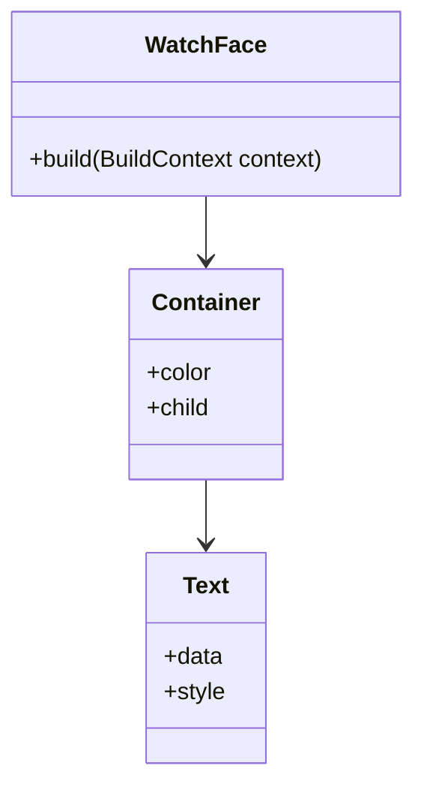

## 13.4.2 Wearables and Embedded Systems

As technology continues to evolve, the landscape of devices expands beyond traditional smartphones and tablets to include wearables and embedded systems. These devices present unique challenges and opportunities for developers, particularly in the realm of responsive and adaptive design. In this section, we will explore how to effectively design and implement user interfaces for wearables and embedded systems using Flutter.

### Overview of Wearable and Embedded Form Factors

Wearables, such as smartwatches and fitness trackers, and embedded systems, like IoT devices, represent a growing segment of the technology market. These devices are characterized by their compact form factors, specialized hardware, and unique interaction models.

- **Wearables:** Typically include smartwatches, fitness bands, and other devices worn on the body. They often feature small screens, limited input methods, and are designed for quick interactions.
- **Embedded Systems:** Encompass a wide range of devices, from home automation systems to industrial controllers. These systems often have specific functions and may include custom input methods such as buttons, sensors, or voice commands.

Both wearables and embedded systems require thoughtful design to ensure usability and efficiency, given their constraints and usage contexts.

### Designing for Wearables

Designing for wearables involves creating interfaces that are both functional and aesthetically pleasing, while accommodating the limited screen real estate and interaction capabilities.

#### Simplified Interfaces

Wearables demand minimalistic UIs that convey essential information efficiently. Here are some key considerations:

- **Larger Touch Targets:** Ensure that interactive elements are large enough to be easily tapped on small screens.
- **Concise Text:** Use brief, clear text to convey information quickly.
- **High Contrast:** Employ high-contrast color schemes to enhance readability.

#### Glances and Notifications

Wearables are often used for quick-glance interactions, such as checking the time or viewing notifications. Design interfaces that allow users to access information with minimal effort:

- **Quick-Glance Interfaces:** Provide essential information at a glance, such as time, date, and notifications.
- **Interactive Notifications:** Allow users to respond to notifications directly from the wearable.

#### Continuity and Syncing

Seamless synchronization between the wearable and the primary device (e.g., smartphone) is crucial for a cohesive user experience:

- **Data Syncing:** Use packages like `wear` for Flutter to manage data synchronization and interactions between devices.
- **Cross-Device Continuity:** Ensure that actions taken on the wearable reflect on the paired device and vice versa.

### Designing for Embedded Systems

Embedded systems often operate under constraints such as limited processing power and memory. Designing for these systems requires a focus on efficiency and adaptability.

#### Resource Constraints

Optimize applications for devices with limited resources:

- **Lightweight Widgets:** Use simple, efficient widgets to minimize resource consumption.
- **Efficient Algorithms:** Implement algorithms that are optimized for performance and memory usage.

#### Custom Input Methods

Adapt to unique input methods that may be present on embedded systems:

- **Gesture Detectors:** Implement gesture detectors for touch-based interactions.
- **Voice Commands:** Utilize voice recognition for hands-free control.
- **Button Inputs:** Design interfaces that can be navigated using physical buttons.

#### Real-Time Performance

Ensure that applications respond promptly to user interactions and sensor data:

- **Low Latency:** Minimize latency to provide a smooth user experience.
- **Sensor Integration:** Efficiently handle data from sensors and other input sources.

### Implementation Strategies

When developing for wearables and embedded systems, consider the following strategies to enhance usability and performance:

#### Adaptive Layouts

Use responsive design principles to adjust the UI based on the device's screen size and capabilities:

- **Flexible Layouts:** Implement layouts that adapt to different screen sizes and orientations.
- **Scalable Elements:** Ensure that UI elements scale appropriately across devices.

#### Power Efficiency

Optimize applications to conserve battery life, a critical consideration for wearables:

- **Efficient Animations:** Use animations sparingly and ensure they are optimized for performance.
- **Background Processes:** Minimize background activity to reduce power consumption.

#### Accessibility Considerations

Ensure that applications are accessible to individuals with varying abilities, especially in smaller or constrained interfaces:

- **Screen Readers:** Support screen readers and other accessibility tools.
- **Adjustable Text Sizes:** Allow users to adjust text sizes for better readability.

### Code Example: Implementing a Simple Watch Face

Below is a simple example of a watch face implementation for a smartwatch using Flutter:

```dart
import 'package:flutter/material.dart';

class WatchFace extends StatelessWidget {
  @override
  Widget build(BuildContext context) {
    return Container(
      color: Colors.black,
      child: Center(
        child: Text(
          '${DateTime.now().hour}:${DateTime.now().minute}',
          style: TextStyle(
            color: Colors.white,
            fontSize: 40,
          ),
        ),
      ),
    );
  }
}
```

This code snippet demonstrates a basic watch face that displays the current time. The use of high contrast (white text on a black background) ensures readability, and the large font size makes the time easily visible on a small screen.

### Diagram Suggestion: Mermaid.js Class Diagram

To better understand the relationship between wearable-specific widgets and standard Flutter widgets, consider the following class diagram:



This diagram illustrates how the `WatchFace` widget is composed of a `Container` and `Text`, showcasing the hierarchical relationship typical in Flutter applications.

### Conclusion

Designing for wearables and embedded systems requires a nuanced approach that balances functionality, efficiency, and user experience. By leveraging Flutter's capabilities and adhering to best practices in responsive design, developers can create applications that are both innovative and accessible across a wide range of emerging devices.

For further exploration, consider delving into official Flutter documentation, open-source projects, and additional resources focused on wearable and embedded system development. Engaging with the developer community can also provide valuable insights and support as you continue to innovate in this exciting field.

## Quiz Time!



### What are wearables typically characterized by?

- [x] Small screens and limited input methods
- [ ] Large screens and extensive input methods
- [ ] High processing power and memory
- [ ] Complex user interfaces

> **Explanation:** Wearables, such as smartwatches, are typically characterized by small screens and limited input methods, requiring simplified interfaces for quick interactions.

### What is a key consideration when designing interfaces for wearables?

- [x] Larger touch targets
- [ ] Smaller touch targets
- [ ] Extensive text
- [ ] Complex animations

> **Explanation:** Larger touch targets are essential for wearables to ensure that users can easily interact with the device's small screen.

### Which package can be used in Flutter to manage interactions between a wearable and a smartphone?

- [x] wear
- [ ] http
- [ ] provider
- [ ] bloc

> **Explanation:** The `wear` package in Flutter is used to manage interactions and data synchronization between wearables and smartphones.

### What is a common input method for embedded systems?

- [x] Buttons and voice commands
- [ ] Touchscreens only
- [ ] Gesture-based input only
- [ ] None of the above

> **Explanation:** Embedded systems often use custom input methods such as buttons and voice commands, in addition to touchscreens.

### Why is power efficiency important in wearable design?

- [x] To conserve battery life
- [ ] To increase processing power
- [ ] To enhance graphics
- [ ] To reduce device size

> **Explanation:** Power efficiency is crucial in wearable design to conserve battery life, as these devices often have limited power resources.

### What is a strategy for optimizing applications for devices with limited resources?

- [x] Use lightweight widgets
- [ ] Use complex algorithms
- [ ] Increase memory usage
- [ ] Add more animations

> **Explanation:** Using lightweight widgets helps optimize applications for devices with limited resources, ensuring efficient performance.

### How can you ensure that applications are accessible on wearables?

- [x] Support screen readers and adjustable text sizes
- [ ] Use only visual cues
- [ ] Ignore accessibility features
- [ ] Focus solely on aesthetics

> **Explanation:** Supporting screen readers and adjustable text sizes ensures that applications are accessible to users with varying abilities.

### What is a benefit of using responsive design principles in wearable and embedded systems?

- [x] Adjusting the UI based on screen size and capabilities
- [ ] Creating static layouts
- [ ] Ignoring device constraints
- [ ] Focusing on desktop interfaces

> **Explanation:** Responsive design principles allow the UI to adjust based on the device's screen size and capabilities, enhancing usability.

### What is a key feature of quick-glance interfaces on wearables?

- [x] Providing essential information at a glance
- [ ] Displaying detailed reports
- [ ] Offering extensive interaction options
- [ ] Including complex navigation

> **Explanation:** Quick-glance interfaces on wearables provide essential information at a glance, allowing users to access data quickly and efficiently.

### True or False: Embedded systems typically have high processing power and extensive memory.

- [ ] True
- [x] False

> **Explanation:** Embedded systems often operate under constraints with limited processing power and memory, requiring efficient design and implementation.


