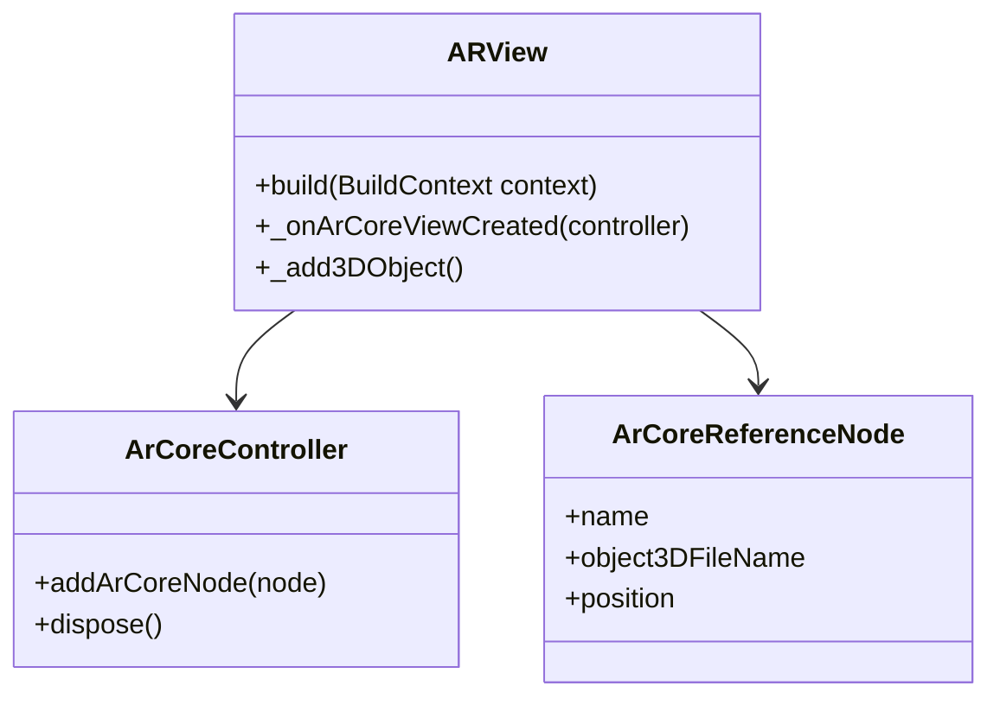

## 13.4.3 Augmented and Virtual Reality

### Introduction to AR and VR in Flutter

Augmented Reality (AR) and Virtual Reality (VR) have revolutionized the way users interact with digital content, offering immersive experiences that blend the physical and virtual worlds. AR overlays digital information onto the real world, enhancing the user's perception of their environment. Applications of AR include interactive gaming, navigation, and educational tools. VR, on the other hand, creates a completely virtual environment that users can explore, often using headsets for a fully immersive experience. VR is widely used in gaming, training simulations, and virtual tours.

The integration of AR and VR into mobile applications is a growing trend, driven by advancements in hardware and software capabilities. Flutter, with its cross-platform nature, provides a unique opportunity to build AR and VR experiences that can reach a wide audience across different devices.

### Flutter’s AR and VR Capabilities

Flutter's ecosystem supports AR and VR through various plugins and packages, enabling developers to create rich, interactive experiences.

#### ARCore and ARKit Integration

To integrate AR functionalities in Flutter, developers can use packages like `arcore_flutter_plugin` for Android and `arkit_flutter_plugin` for iOS. These packages provide access to ARCore and ARKit, the respective AR frameworks for Android and iOS, allowing for the placement of 3D objects in the real world, motion tracking, and environmental understanding.

**Example: Integrating ARCore with Flutter**

Here's a simple example of using ARCore in a Flutter application to place a 3D model in the real world:

```dart
import 'package:arcore_flutter_plugin/arcore_flutter_plugin.dart';
import 'package:flutter/material.dart';

class ARView extends StatefulWidget {
  @override
  _ARViewState createState() => _ARViewState();
}

class _ARViewState extends State<ARView> {
  late ArCoreController arCoreController;

  @override
  void dispose() {
    arCoreController.dispose();
    super.dispose();
  }

  void _onArCoreViewCreated(ArCoreController controller) {
    arCoreController = controller;
    _add3DObject();
  }

  void _add3DObject() {
    final node = ArCoreReferenceNode(
      name: "3DModel",
      object3DFileName: "model.sfb",
      position: Vector3(0, 0, -1),
    );
    arCoreController.addArCoreNode(node);
  }

  @override
  Widget build(BuildContext context) {
    return Scaffold(
      appBar: AppBar(title: Text('AR View')),
      body: ArCoreView(
        onArCoreViewCreated: _onArCoreViewCreated,
      ),
    );
  }
}
```

This code snippet demonstrates how to set up an AR view in Flutter, create an ARCore controller, and add a 3D object to the scene.

#### 3D Rendering

For 3D graphics and interactions, Flutter developers can use packages like `flutter_cube` or `three_dart`. These packages enable rendering of 3D models and handling user interactions with them, providing a solid foundation for building AR and VR applications.

#### VR Support

While Flutter does not natively support VR, developers can explore VR implementation with plugins like `flutter_vr` or by integrating with VR platforms such as Oculus. This allows for the creation of immersive VR experiences, although it may require additional setup and configuration.

### Design Considerations for AR and VR

When designing AR and VR applications, several key considerations must be taken into account to ensure a seamless and enjoyable user experience.

#### User Experience

- **Intuitive Interactions:** Design interactions that are natural and intuitive, minimizing the learning curve for users.
- **Minimize Discomfort:** In VR, it's crucial to minimize user discomfort, such as motion sickness, by maintaining a stable frame rate and avoiding abrupt movements.

#### Performance Optimization

- **3D Rendering:** Optimize 3D rendering to maintain high frame rates, ensuring smooth visuals and interactions.
- **Sensor Data Processing:** Efficiently process sensor data to provide accurate and responsive AR experiences.

#### Spatial Awareness

- **UI Elements:** Design UI elements that interact seamlessly with the physical environment in AR, ensuring they are contextually relevant and easy to access.

#### Accessibility

- **Auditory Cues:** Incorporate auditory cues to assist users in navigating AR and VR environments.
- **Adjustable Interfaces:** Provide adjustable interface elements to accommodate different user needs and preferences.

### Implementation Strategies

#### Scene Management

Efficient scene management is crucial for handling dynamic elements and user interactions in AR and VR applications. Organize scenes to optimize performance and ensure smooth transitions between different states.

#### Gesture Recognition

Implement gestures that align with AR/VR interaction paradigms, such as pinch-to-zoom, swipe, and tap. These gestures should feel natural and enhance the user's ability to interact with the virtual environment.

#### Sensor Integration

Utilize device sensors, such as the camera and gyroscope, to enhance AR experiences. These sensors provide crucial data for tracking user movements and positioning virtual objects accurately in the real world.

### Code Example: Integrating ARCore with Flutter

The following code example demonstrates how to integrate ARCore with Flutter to place a 3D model in the real world. This example builds upon the previous snippet, providing additional context and explanations.

```dart
import 'package:arcore_flutter_plugin/arcore_flutter_plugin.dart';
import 'package:flutter/material.dart';

class ARView extends StatefulWidget {
  @override
  _ARViewState createState() => _ARViewState();
}

class _ARViewState extends State<ARView> {
  late ArCoreController arCoreController;

  @override
  void dispose() {
    arCoreController.dispose();
    super.dispose();
  }

  void _onArCoreViewCreated(ArCoreController controller) {
    arCoreController = controller;
    _add3DObject();
  }

  void _add3DObject() {
    final node = ArCoreReferenceNode(
      name: "3DModel",
      object3DFileName: "model.sfb",
      position: Vector3(0, 0, -1),
    );
    arCoreController.addArCoreNode(node);
  }

  @override
  Widget build(BuildContext context) {
    return Scaffold(
      appBar: AppBar(title: Text('AR View')),
      body: ArCoreView(
        onArCoreViewCreated: _onArCoreViewCreated,
      ),
    );
  }
}
```

In this example, the `ArCoreController` is used to manage the AR session, and a 3D model is added to the scene using an `ArCoreReferenceNode`. The model is positioned one meter in front of the user, providing a simple yet effective demonstration of AR capabilities in Flutter.

### Diagram: Components Involved in Integrating AR with Flutter

To better understand the components involved in integrating AR with Flutter, the following Mermaid.js class diagram illustrates the relationships between the key classes used in the code example.



This diagram shows the `ARView` class interacting with the `ArCoreController` to manage the AR session and the `ArCoreReferenceNode` to represent the 3D model in the scene.

### Best Practices and Challenges

#### Best Practices

- **Optimize Performance:** Ensure that the application maintains a high frame rate by optimizing 3D rendering and sensor data processing.
- **Design for Accessibility:** Incorporate features that enhance accessibility, such as auditory cues and adjustable interface elements.
- **Test on Multiple Devices:** Test the application on a range of devices to ensure compatibility and performance across different hardware configurations.

#### Common Challenges

- **Handling Device Limitations:** Some devices may have limited AR capabilities, requiring fallback solutions or alternative experiences.
- **Ensuring User Comfort:** In VR, it's essential to design experiences that minimize discomfort, such as motion sickness, by maintaining a stable frame rate and avoiding abrupt movements.

### Further Exploration

For developers interested in exploring AR and VR in Flutter further, the following resources provide additional insights and examples:

- **Official Flutter Documentation:** [Flutter.dev](https://flutter.dev)
- **ARCore and ARKit Documentation:** [ARCore](https://developers.google.com/ar), [ARKit](https://developer.apple.com/arkit/)
- **Community Tutorials and Courses:** Platforms like Udemy and Coursera offer courses on AR and VR development with Flutter.
- **Open-Source Projects:** Explore GitHub repositories for real-world examples and community-contributed plugins.

By leveraging Flutter's capabilities and following best practices, developers can create engaging AR and VR experiences that captivate users and push the boundaries of mobile applications.

## Quiz Time!



### What is the primary difference between AR and VR?

- [x] AR overlays digital content onto the real world, while VR creates a completely virtual environment.
- [ ] AR and VR are the same, just used in different contexts.
- [ ] VR overlays digital content onto the real world, while AR creates a completely virtual environment.
- [ ] AR and VR both require headsets to function.

> **Explanation:** AR (Augmented Reality) overlays digital information onto the real world, enhancing the user's perception of their environment. VR (Virtual Reality) creates a completely virtual environment that users can explore, often using headsets for a fully immersive experience.

### Which package is used for integrating ARCore in Flutter?

- [x] arcore_flutter_plugin
- [ ] arkit_flutter_plugin
- [ ] flutter_vr
- [ ] three_dart

> **Explanation:** The `arcore_flutter_plugin` is used for integrating ARCore functionalities in Flutter applications, specifically for Android devices.

### What is a key consideration when designing VR experiences?

- [x] Minimizing user discomfort, such as motion sickness.
- [ ] Ensuring the app works offline.
- [ ] Using only 2D graphics.
- [ ] Limiting user interaction to touch inputs.

> **Explanation:** In VR, it's crucial to minimize user discomfort, such as motion sickness, by maintaining a stable frame rate and avoiding abrupt movements.

### Which Flutter package can be used for 3D rendering?

- [x] flutter_cube
- [ ] arcore_flutter_plugin
- [ ] arkit_flutter_plugin
- [ ] flutter_vr

> **Explanation:** The `flutter_cube` package is used for 3D rendering and interactions in Flutter applications.

### What is the role of the `ArCoreController` in the provided code example?

- [x] It manages the AR session and adds 3D nodes to the scene.
- [ ] It handles user input and gestures.
- [ ] It renders 2D graphics.
- [ ] It provides network connectivity.

> **Explanation:** The `ArCoreController` is responsible for managing the AR session and adding 3D nodes to the scene, as demonstrated in the code example.

### What is a common challenge when developing AR applications?

- [x] Handling device limitations and ensuring compatibility.
- [ ] Ensuring the app runs offline.
- [ ] Using only 2D graphics.
- [ ] Limiting user interaction to touch inputs.

> **Explanation:** A common challenge in AR development is handling device limitations and ensuring compatibility across different hardware configurations.

### How can accessibility be enhanced in AR/VR applications?

- [x] By incorporating auditory cues and adjustable interface elements.
- [ ] By reducing the app's file size.
- [ ] By using only text-based interfaces.
- [ ] By limiting user interaction to touch inputs.

> **Explanation:** Accessibility in AR/VR applications can be enhanced by incorporating auditory cues and providing adjustable interface elements to accommodate different user needs.

### What is a key feature of AR applications?

- [x] Overlaying digital content onto the real world.
- [ ] Creating a completely virtual environment.
- [ ] Requiring a VR headset.
- [ ] Limiting user interaction to touch inputs.

> **Explanation:** A key feature of AR applications is the ability to overlay digital content onto the real world, enhancing the user's perception of their environment.

### Which sensor is commonly used in AR applications to track user movements?

- [x] Gyroscope
- [ ] Thermometer
- [ ] Barometer
- [ ] Altimeter

> **Explanation:** The gyroscope is commonly used in AR applications to track user movements and provide accurate positioning of virtual objects in the real world.

### True or False: Flutter natively supports VR without any additional plugins.

- [ ] True
- [x] False

> **Explanation:** Flutter does not natively support VR. Developers need to use additional plugins or integrate with VR platforms to implement VR functionalities.


