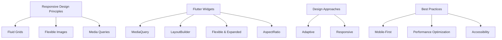

## 14.1.1 Summarizing Responsive Techniques

Responsive design is a cornerstone of modern mobile application development, ensuring that applications provide a seamless user experience across a wide range of devices and screen sizes. In this section, we will revisit the core principles of responsive design, explore the key Flutter widgets and tools that facilitate responsive layouts, and distinguish between adaptive and responsive design approaches. We will also review significant code snippets and best practices that have been highlighted throughout this book.

### Overview of Responsive Design Principles

Responsive design is about creating web and mobile applications that look and function well on any device, from small smartphones to large desktop monitors. The primary principles of responsive design include:

- **Fluid Grids:** These are grid systems that use relative units like percentages instead of fixed units like pixels. This allows the layout to adjust dynamically to the screen size.
  
- **Flexible Images:** Images that scale with the layout, ensuring they do not overflow their containers or become pixelated on larger screens. Techniques such as setting maximum widths and using vector graphics can help achieve this.

- **Media Queries:** CSS techniques that apply different styles based on the device's characteristics, such as screen width, height, and orientation. In Flutter, similar functionality is achieved through widgets like `MediaQuery`.

The importance of responsive design lies in its ability to provide a consistent user experience. Users expect applications to work smoothly regardless of the device they are using, and responsive design ensures that layouts adapt seamlessly to different screen sizes and orientations.

### Key Flutter Widgets and Tools

Flutter provides a rich set of widgets and tools that make it easier to implement responsive designs. Here are some of the essential widgets and tools:

- **`MediaQuery`:** This widget provides information about the size and orientation of the current device, allowing you to adjust your layout accordingly. It is often used to retrieve screen dimensions and adapt the UI dynamically.

- **`LayoutBuilder`:** A powerful widget that allows you to build layouts that depend on the size of the parent widget. It is particularly useful for creating adaptive designs that respond to changes in available space.

- **`Flexible` and `Expanded`:** These widgets are used within a `Row` or `Column` to control how a child widget should fill the available space. `Flexible` allows a widget to take up a portion of the available space, while `Expanded` forces a widget to fill all remaining space.

- **`AspectRatio`:** This widget helps maintain a specific aspect ratio for a child widget, ensuring that it scales proportionally within its parent.

In addition to these widgets, several packages and tools can simplify responsive design in Flutter:

- **`flutter_screenutil`:** A popular package that provides a set of utilities for responsive design, including functions to scale dimensions, fonts, and more based on the screen size.

- **`responsive_builder`:** A package that helps create responsive layouts by providing a simple API to define breakpoints and build different layouts for different screen sizes.

### Adaptive vs. Responsive Design

While responsive design focuses on creating flexible layouts that adapt to different screen sizes, adaptive design involves creating distinct layouts for specific devices or screen sizes. Here are the key distinctions:

- **Responsive Design:** Uses fluid grids, flexible images, and media queries to create a single layout that adjusts to various screen sizes. It is ideal for applications that need to work across a wide range of devices without requiring separate designs for each.

- **Adaptive Design:** Involves creating multiple fixed layouts for different screen sizes, often using breakpoints to switch between them. It is useful when you want to provide a tailored experience for specific devices, such as a mobile phone, tablet, or desktop.

Each approach has its strengths, and the choice between them depends on the specific requirements of your application. In many cases, a combination of both responsive and adaptive techniques can provide the best user experience.

### Code Snippets Review

Throughout this book, we have explored numerous code examples that demonstrate how to build responsive UIs in Flutter. Here is a brief overview of some significant examples:

- **Using `MediaQuery`:** We've seen how to use `MediaQuery` to retrieve screen dimensions and adjust widget sizes accordingly. For example, setting padding or margins based on screen width to ensure consistent spacing across devices.

- **Implementing `LayoutBuilder`:** Examples have shown how to use `LayoutBuilder` to create adaptive layouts that respond to changes in available space. This is particularly useful for building complex UIs that need to adjust based on the parent widget's size.

- **Leveraging `Flexible` and `Expanded`:** We've demonstrated how to use these widgets to control the distribution of space within a `Row` or `Column`, ensuring that your layout remains balanced and visually appealing.

- **Maintaining Aspect Ratios:** Code snippets have illustrated how to use the `AspectRatio` widget to ensure that images and other elements maintain their intended proportions, regardless of screen size.

### Best Practices Recap

To conclude, let's revisit some best practices for building responsive applications in Flutter:

- **Mobile-First Approach:** Start by designing for the smallest screen size and progressively enhance the layout for larger screens. This ensures that your application is optimized for mobile devices, which often have more constraints.

- **Performance Optimization:** Keep performance in mind when designing responsive layouts. Avoid unnecessary rebuilds and use efficient state management techniques to ensure smooth interactions.

- **Accessibility:** Ensure that your application is accessible to all users, including those with disabilities. Use semantic widgets and provide alternative text for images to improve accessibility.

- **Testing Across Devices:** Test your application on a variety of devices and screen sizes to ensure that it behaves as expected. Use emulators and physical devices to identify and address any issues.

- **Consistent Design Language:** Maintain a consistent design language across different screen sizes and platforms. Use themes and styles to ensure that your application looks cohesive and professional.

### Diagram Suggestion

To visually summarize the key responsive techniques discussed, here is a mind map created using Mermaid.js:

This diagram provides a high-level overview of the responsive techniques covered in this book, highlighting the interconnections between design principles, Flutter widgets, and best practices.

### Conclusion

Responsive design is a critical aspect of modern application development, enabling developers to create applications that provide a seamless user experience across a wide range of devices. By leveraging Flutter's powerful widgets and tools, you can build responsive UIs that adapt to different screen sizes and orientations. Remember to apply the best practices discussed in this book to ensure that your applications are not only responsive but also performant and accessible.

As you continue your journey in Flutter development, keep experimenting with different responsive techniques and stay updated with the latest advancements in the field. The knowledge and skills you've gained from this book will serve as a strong foundation for building exceptional applications that delight users.

---

## Quiz Time!



### What is the primary goal of responsive design?

- [x] To create layouts that adapt seamlessly to different screen sizes and orientations.
- [ ] To create multiple fixed layouts for specific devices.
- [ ] To focus solely on mobile devices.
- [ ] To enhance the performance of applications.

> **Explanation:** Responsive design aims to create layouts that adapt seamlessly to different screen sizes and orientations, ensuring a consistent user experience across devices.

### Which Flutter widget provides information about the size and orientation of the current device?

- [x] MediaQuery
- [ ] LayoutBuilder
- [ ] Flexible
- [ ] AspectRatio

> **Explanation:** `MediaQuery` provides information about the size and orientation of the current device, allowing developers to adjust layouts accordingly.

### What is the difference between adaptive and responsive design?

- [x] Adaptive design involves creating distinct layouts for specific devices, while responsive design uses a single layout that adjusts to various screen sizes.
- [ ] Adaptive design uses fluid grids, while responsive design uses fixed grids.
- [ ] Adaptive design is for web applications, while responsive design is for mobile applications.
- [ ] There is no difference; they are the same.

> **Explanation:** Adaptive design involves creating distinct layouts for specific devices, while responsive design uses a single layout that adjusts to various screen sizes.

### Which package is commonly used in Flutter for responsive design utilities?

- [x] flutter_screenutil
- [ ] provider
- [ ] bloc
- [ ] sqflite

> **Explanation:** `flutter_screenutil` is a popular package that provides utilities for responsive design, including functions to scale dimensions and fonts based on screen size.

### What is a best practice for starting responsive design?

- [x] Mobile-First Approach
- [ ] Desktop-First Approach
- [ ] Tablet-First Approach
- [ ] Performance-First Approach

> **Explanation:** A mobile-first approach is a best practice for starting responsive design, ensuring that applications are optimized for mobile devices first.

### Which widget helps maintain a specific aspect ratio for a child widget?

- [x] AspectRatio
- [ ] Flexible
- [ ] Expanded
- [ ] MediaQuery

> **Explanation:** The `AspectRatio` widget helps maintain a specific aspect ratio for a child widget, ensuring it scales proportionally within its parent.

### How does `LayoutBuilder` contribute to responsive design?

- [x] It allows building layouts that depend on the size of the parent widget.
- [ ] It provides information about the device's orientation.
- [ ] It maintains aspect ratios for widgets.
- [ ] It scales images based on screen size.

> **Explanation:** `LayoutBuilder` allows building layouts that depend on the size of the parent widget, making it useful for creating adaptive designs.

### Why is performance optimization important in responsive design?

- [x] To ensure smooth interactions and avoid unnecessary rebuilds.
- [ ] To create multiple fixed layouts for specific devices.
- [ ] To focus solely on mobile devices.
- [ ] To enhance the visual appeal of applications.

> **Explanation:** Performance optimization is important in responsive design to ensure smooth interactions and avoid unnecessary rebuilds, improving the user experience.

### What is the role of `Flexible` and `Expanded` widgets in Flutter?

- [x] They control how a child widget should fill the available space within a `Row` or `Column`.
- [ ] They provide information about the device's size and orientation.
- [ ] They maintain aspect ratios for widgets.
- [ ] They scale images based on screen size.

> **Explanation:** `Flexible` and `Expanded` widgets control how a child widget should fill the available space within a `Row` or `Column`, ensuring balanced layouts.

### True or False: Responsive design only applies to mobile applications.

- [ ] True
- [x] False

> **Explanation:** False. Responsive design applies to both web and mobile applications, ensuring a consistent user experience across all devices.


