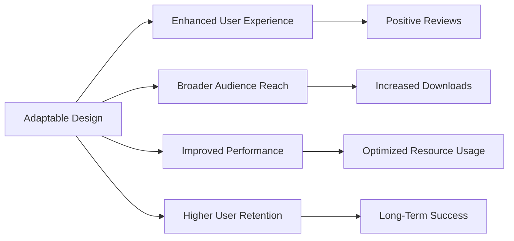

## 14.1.2 The Importance of Adaptability

In the dynamic world of app development, adaptability has emerged as a cornerstone of successful user interface (UI) design. As the landscape of devices and screen sizes continues to evolve, developers are tasked with creating applications that not only function across a myriad of platforms but also deliver a seamless and engaging user experience. This section delves into the significance of adaptability in modern app development, exploring its benefits, user expectations, business advantages, and the role it plays in future-proofing applications.

### Adaptability in Modern App Development

The proliferation of devices with varying screen sizes and capabilities has fundamentally changed how applications are developed and consumed. From smartphones and tablets to wearables and smart TVs, each device presents unique challenges and opportunities for developers. Adaptable UIs are designed to meet these challenges head-on, ensuring that applications are accessible and functional across all platforms.

**Benefits of Adaptability:**

- **Enhanced User Experience:** Adaptable UIs provide a consistent and intuitive experience, regardless of the device being used. This consistency is crucial for user satisfaction and engagement.
  
- **Increased Reach:** By supporting a wide range of devices, adaptable apps can reach a broader audience, maximizing potential user acquisition.

- **Better Performance:** Adaptable designs optimize resource usage, ensuring that applications run smoothly on both high-end and low-end devices.

- **Future-Proofing:** As new devices and form factors emerge, adaptable apps are better positioned to integrate these changes without extensive redesigns.

### User Expectations

Today's users demand seamless experiences that transcend the boundaries of individual devices. Whether switching from a smartphone to a tablet or accessing an app on a desktop, users expect the interface to adapt fluidly to their needs. This expectation places a premium on adaptability, as it directly correlates with user satisfaction and loyalty.

- **Seamless Transitions:** Users expect applications to maintain functionality and aesthetic appeal across different devices, ensuring a consistent experience.

- **Personalization:** Adaptable apps can offer personalized experiences by adjusting layouts and features based on user preferences and device capabilities.

### Business Advantages

Adaptability is not just a technical requirement; it is a strategic business advantage. Applications that effectively implement adaptable designs can enjoy several benefits:

- **Broader Audience:** By catering to a diverse range of devices, adaptable apps can attract and retain a larger user base.

- **Higher App Store Rankings:** Apps that deliver consistent performance and user satisfaction are more likely to receive positive reviews and higher rankings in app stores.

- **Increased User Retention:** Adaptable apps that meet user expectations are more likely to retain users, reducing churn rates and increasing lifetime value.

- **Competitive Edge:** In a crowded marketplace, adaptability can differentiate an app from its competitors, offering unique value propositions to users.

### Case Studies

Several popular applications have successfully implemented adaptable UIs, setting benchmarks for the industry:

- **Spotify:** Known for its seamless cross-platform experience, Spotify adapts its interface to suit different devices, ensuring a consistent user experience whether on mobile, desktop, or web.

- **Netflix:** With its adaptable UI, Netflix provides a tailored viewing experience across a wide range of devices, from smartphones to smart TVs, maintaining consistent functionality and aesthetics.

- **Airbnb:** By prioritizing adaptability, Airbnb ensures that users can easily navigate and book accommodations on any device, enhancing user satisfaction and engagement.

### Future-Proofing Applications

As technology continues to advance, new devices and form factors will undoubtedly emerge. Adaptability plays a crucial role in future-proofing applications, allowing them to evolve alongside technological advancements without requiring complete overhauls.

- **Scalability:** Adaptable designs enable applications to scale efficiently, accommodating new features and functionalities as they become necessary.

- **Flexibility:** By building with adaptability in mind, developers can more easily integrate new technologies and platforms, ensuring long-term viability.

- **Sustainability:** Adaptable apps are more sustainable, as they require fewer resources to maintain and update, reducing long-term development costs.

### Conclusion

Adaptability is a fundamental aspect of modern app development, offering significant benefits to both users and businesses. By prioritizing adaptable design, developers can create applications that not only meet current user expectations but also anticipate future needs. This approach not only enhances user experience and business success but also ensures that applications remain relevant and competitive in an ever-changing technological landscape.

## Quiz Time!



### How does adaptability benefit modern app development?

- [x] It enhances user experience across devices.
- [x] It increases the app's reach to a broader audience.
- [ ] It limits the app to specific devices.
- [x] It improves performance across different platforms.

> **Explanation:** Adaptability enhances user experience, increases reach, and improves performance by ensuring the app functions well across various devices.

### Why is adaptability crucial for user expectations?

- [x] Users expect seamless experiences across devices.
- [ ] Users prefer apps that only work on one type of device.
- [x] Users demand consistent functionality and aesthetics.
- [ ] Users do not care about device compatibility.

> **Explanation:** Users expect apps to deliver seamless and consistent experiences across different devices, making adaptability crucial.

### What business advantage does adaptability offer?

- [x] It attracts a broader audience.
- [ ] It reduces the app's user base.
- [x] It leads to higher app store rankings.
- [ ] It decreases user retention.

> **Explanation:** Adaptability attracts a broader audience and can lead to higher app store rankings due to improved user satisfaction.

### How does adaptability future-proof applications?

- [x] It allows apps to evolve with new technologies.
- [ ] It makes apps obsolete faster.
- [x] It reduces the need for complete redesigns.
- [ ] It limits the app's scalability.

> **Explanation:** Adaptability allows apps to integrate new technologies and reduces the need for extensive redesigns, future-proofing them.

### Which of the following is a case study of successful adaptable UI implementation?

- [x] Spotify
- [x] Netflix
- [ ] A small local app with no cross-platform support
- [x] Airbnb

> **Explanation:** Spotify, Netflix, and Airbnb are examples of apps with successful adaptable UI implementations.

### What is a key factor in user retention related to adaptability?

- [x] Meeting user expectations across devices
- [ ] Offering a single-device experience
- [x] Providing a consistent user interface
- [ ] Ignoring user feedback

> **Explanation:** Meeting user expectations and providing a consistent interface across devices are key factors in user retention.

### How does adaptability impact app store rankings?

- [x] Positive user reviews due to adaptability can improve rankings.
- [ ] Adaptability has no effect on rankings.
- [x] Consistent performance across devices can lead to higher rankings.
- [ ] Adaptability decreases app store visibility.

> **Explanation:** Positive reviews and consistent performance across devices, resulting from adaptability, can improve app store rankings.

### What is a benefit of adaptable design in terms of resource usage?

- [x] Optimized resource usage across devices
- [ ] Increased resource consumption
- [ ] Limited to high-end devices
- [x] Efficient performance on low-end devices

> **Explanation:** Adaptable design optimizes resource usage, ensuring efficient performance on both high-end and low-end devices.

### How does adaptability contribute to long-term app success?

- [x] By ensuring the app remains relevant with technological advancements
- [ ] By making the app obsolete quickly
- [x] By reducing long-term development costs
- [ ] By limiting the app's scalability

> **Explanation:** Adaptability ensures the app remains relevant and reduces development costs, contributing to long-term success.

### True or False: Adaptability limits an app's reach to specific devices.

- [ ] True
- [x] False

> **Explanation:** False. Adaptability expands an app's reach by ensuring it functions well across a wide range of devices.


