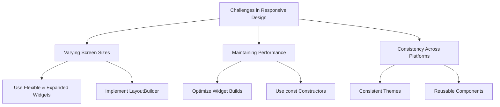

## 14.1.3 Common Challenges and Solutions

Building responsive and adaptive user interfaces (UIs) in Flutter can be both rewarding and challenging. As developers strive to create applications that provide seamless experiences across a wide range of devices, they often encounter several common challenges. This section delves into these challenges, offering strategies and solutions to overcome them effectively. By understanding these obstacles and applying best practices, developers can enhance their Flutter applications' responsiveness, performance, and consistency.

### Identifying Common Challenges

When developing responsive and adaptive UIs in Flutter, developers frequently face the following obstacles:

- **Varying Screen Sizes:** Ensuring that applications look and function well on devices with different screen sizes and resolutions is a primary challenge.
- **Maintaining Performance:** As applications become more complex, maintaining optimal performance across devices becomes increasingly difficult.
- **Consistency Across Platforms:** Ensuring a consistent design and user experience across different platforms, such as iOS, Android, and web, can be challenging due to varying design guidelines and capabilities.

### Strategies to Overcome Challenges

To address these challenges, developers can employ several strategies:

#### Flexible Layouts

Flutter provides a rich set of widgets that facilitate the creation of flexible layouts. By leveraging these widgets, developers can ensure that their applications adapt gracefully to different screen sizes.

- **Flexible and Expanded Widgets:** These widgets allow developers to create layouts that adjust dynamically to available space. The `Flexible` widget lets a child of a `Row`, `Column`, or `Flex` expand to fill the available space, while the `Expanded` widget ensures that the child occupies all remaining space.

  ```dart
  Row(
    children: [
      Flexible(
        flex: 1,
        child: Container(color: Colors.red),
      ),
      Expanded(
        child: Container(color: Colors.blue),
      ),
    ],
  )
  ```

- **LayoutBuilder:** This widget helps developers build layouts that depend on the size of their parent widget. By using `LayoutBuilder`, developers can create adaptive designs that respond to changes in screen size.

  ```dart
  LayoutBuilder(
    builder: (context, constraints) {
      if (constraints.maxWidth > 600) {
        return _buildWideLayout();
      } else {
        return _buildNarrowLayout();
      }
    },
  )
  ```

#### Performance Optimization

Performance is a critical aspect of responsive design. To maintain smooth and responsive applications, developers should focus on optimizing widget builds and minimizing unnecessary rebuilds.

- **Optimize Widget Builds:** Avoid rebuilding widgets unnecessarily by using `const` constructors and ensuring that widgets are only rebuilt when necessary.

  ```dart
  const Text('Hello, World!'); // Using const to prevent unnecessary rebuilds
  ```

- **Use const Constructors:** Wherever possible, use `const` constructors to reduce the overhead of widget rebuilding and improve performance.

  ```dart
  const MyWidget(); // Const constructor for improved performance
  ```

#### Consistent Design Language

Maintaining a consistent design language across platforms is essential for providing a uniform user experience. Flutter's theming capabilities and reusable components can help achieve this goal.

- **Consistent Themes:** Use Flutter's `ThemeData` to define a global theme for your application. This ensures that colors, fonts, and other design elements remain consistent across different screens and platforms.

  ```dart
  ThemeData(
    primaryColor: Colors.blue,
    accentColor: Colors.orange,
    textTheme: TextTheme(
      bodyText1: TextStyle(fontSize: 16.0, fontFamily: 'Hind'),
    ),
  )
  ```

- **Reusable Components:** Create reusable widgets and components to maintain consistency and reduce code duplication. This approach not only ensures uniformity but also simplifies maintenance and updates.

  ```dart
  class CustomButton extends StatelessWidget {
    final String label;
    final VoidCallback onPressed;

    const CustomButton({required this.label, required this.onPressed});

    @override
    Widget build(BuildContext context) {
      return ElevatedButton(
        onPressed: onPressed,
        child: Text(label),
      );
    }
  }
  ```

### Troubleshooting Tips

When facing layout issues or performance bottlenecks, consider the following troubleshooting tips:

- **Flutter’s Debugging Tools:** Utilize Flutter's built-in debugging tools, such as the Flutter Inspector, to analyze widget trees and identify layout issues.

- **DebugPaintSizeEnabled:** Enable `debugPaintSizeEnabled` to visualize layout constraints and identify problems with widget sizing.

  ```dart
  void main() {
    debugPaintSizeEnabled = true;
    runApp(MyApp());
  }
  ```

- **Thorough Testing Across Devices:** Conduct comprehensive testing on a variety of devices to ensure that your application performs well across different screen sizes and resolutions.

### Best Practices

To build robust and responsive Flutter applications, consider adopting the following best practices:

- **Mobile-First Approach:** Design your application with a mobile-first mindset, ensuring that it works well on smaller screens before scaling up to larger devices.

- **Responsive Design Patterns:** Utilize established responsive design patterns, such as fluid grids and breakpoints, to create adaptable layouts.

- **Stay Updated:** Keep abreast of Flutter's latest features and best practices by following official documentation, community forums, and developer blogs.

### Diagram: Challenges and Solutions

To better visualize the challenges and their corresponding solutions, consider the following Mermaid.js diagram:



This diagram illustrates the relationship between common challenges and the strategies to address them, providing a clear roadmap for developers to follow.

### Conclusion

By understanding and addressing these common challenges, developers can create responsive and adaptive Flutter applications that provide exceptional user experiences across a wide range of devices. By employing flexible layouts, optimizing performance, and maintaining a consistent design language, developers can overcome obstacles and build applications that stand out in the competitive app market. As you continue your Flutter journey, remember to stay curious, keep learning, and embrace the evolving landscape of mobile UI design.

## Quiz Time!



### What is a primary challenge when developing responsive UIs in Flutter?

- [x] Varying screen sizes
- [ ] Limited widget options
- [ ] Lack of documentation
- [ ] Inconsistent API support

> **Explanation:** Varying screen sizes are a primary challenge because developers must ensure their applications look and function well on devices with different dimensions.

### Which widget helps create layouts that adjust dynamically to available space?

- [x] Flexible
- [ ] Container
- [ ] Stack
- [ ] SizedBox

> **Explanation:** The `Flexible` widget allows a child of a `Row`, `Column`, or `Flex` to expand and fill available space dynamically.

### What is a recommended strategy for optimizing widget builds?

- [x] Use const constructors
- [ ] Avoid using widgets
- [ ] Increase widget tree depth
- [ ] Use only stateful widgets

> **Explanation:** Using `const` constructors helps reduce the overhead of widget rebuilding, improving performance.

### How can developers ensure a consistent design language across platforms?

- [x] Use consistent themes and reusable components
- [ ] Avoid using themes
- [ ] Use platform-specific widgets only
- [ ] Change design language frequently

> **Explanation:** Consistent themes and reusable components help maintain uniformity across different screens and platforms.

### What tool can be used to visualize layout constraints and identify sizing issues?

- [x] debugPaintSizeEnabled
- [ ] Flutter CLI
- [ ] Dart Analyzer
- [ ] Code Formatter

> **Explanation:** Enabling `debugPaintSizeEnabled` helps visualize layout constraints, aiding in identifying sizing issues.

### Which approach is recommended for designing applications?

- [x] Mobile-first approach
- [ ] Desktop-first approach
- [ ] Web-first approach
- [ ] Tablet-first approach

> **Explanation:** A mobile-first approach ensures that applications work well on smaller screens before scaling up to larger devices.

### What is a benefit of creating reusable components?

- [x] Ensures uniformity and simplifies maintenance
- [ ] Increases code duplication
- [ ] Limits application scalability
- [ ] Reduces code readability

> **Explanation:** Reusable components ensure uniformity and simplify maintenance, reducing code duplication.

### What is the role of the LayoutBuilder widget?

- [x] Build layouts that depend on the size of their parent widget
- [ ] Create animations
- [ ] Manage state
- [ ] Handle user input

> **Explanation:** `LayoutBuilder` helps build layouts that adapt to changes in screen size by depending on the parent widget's size.

### Which of the following is NOT a common challenge in responsive design?

- [ ] Varying screen sizes
- [ ] Maintaining performance
- [ ] Consistency across platforms
- [x] Lack of color options

> **Explanation:** Lack of color options is not a common challenge in responsive design, as Flutter provides extensive theming capabilities.

### True or False: Using const constructors can help improve performance in Flutter applications.

- [x] True
- [ ] False

> **Explanation:** True. Using `const` constructors can reduce the overhead of widget rebuilding, thus improving performance.


