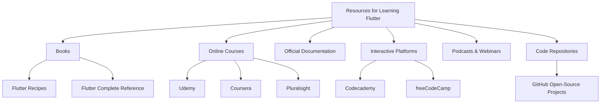

## 14.2.1 Resources for Further Learning

As you continue your journey in mastering Flutter, it's essential to leverage a variety of resources to deepen your understanding and stay updated with the latest trends and best practices. This section provides a comprehensive guide to books, online courses, official documentation, interactive platforms, podcasts, webinars, and code repositories that will aid in your learning process.

### Books and E-Books

Books are a timeless resource for gaining in-depth knowledge and understanding complex concepts. Here are some recommended reads for advancing your Flutter skills:

- **"Flutter Recipes" by Fu Cheng**: This book offers practical solutions to common problems faced by Flutter developers. It's a great resource for learning how to implement specific features and functionalities in your apps. Each recipe is designed to be self-contained, allowing you to pick and choose the topics most relevant to your needs.

- **"Flutter Complete Reference" by Alberto Miola**: A comprehensive guide that covers everything from the basics to advanced topics in Flutter development. This book is ideal for developers who want a thorough understanding of Flutter's capabilities and how to leverage them effectively in building responsive and adaptive UIs.

### Online Courses and Tutorials

Online courses provide structured learning paths and the opportunity to learn from experienced instructors. Here are some platforms offering quality Flutter courses:

- **Udemy**: Known for its extensive library of courses, Udemy offers several Flutter courses ranging from beginner to advanced levels. Look for courses with high ratings and positive reviews to ensure quality content.

- **Coursera**: Partnering with universities and organizations, Coursera provides courses that often include peer-reviewed assignments and a certificate upon completion. Courses like "Build Native Mobile Apps with Flutter" offer a comprehensive learning experience.

- **Pluralsight**: This platform offers expert-led courses with a focus on practical skills. Pluralsight's Flutter courses are designed to help you build real-world applications and understand best practices in Flutter development.

- **Free Resources**: Don't overlook free resources such as Flutter’s official documentation, YouTube tutorials, and community-driven blogs. These can be invaluable for learning new techniques and staying updated with the latest developments in Flutter.

### Official Documentation and Guides

Flutter's official documentation is a treasure trove of information. Regularly consulting these resources will ensure you are following the latest best practices and utilizing the most recent features:

- **Flutter Documentation**: The official Flutter documentation is comprehensive and regularly updated. It includes guides, API references, and tutorials that cover a wide range of topics from basic setup to advanced features.

- **Specific Guides**: Look for guides that delve into advanced topics such as state management, animations, and performance optimization. These guides can provide deeper insights into areas not extensively covered in this book.

### Interactive Platforms

Interactive learning platforms offer hands-on coding exercises that can reinforce your understanding of Flutter:

- **Codecademy**: While primarily known for web development courses, Codecademy offers interactive coding exercises that can help you practice Flutter concepts in a hands-on manner.

- **freeCodeCamp**: This platform provides free coding tutorials and exercises, including some focused on mobile app development. It's a great way to practice coding in a structured environment.

### Podcasts and Webinars

Staying updated with industry trends and expert insights is crucial for any developer. Here are some recommended podcasts and webinars:

- **Flutter Podcasts**: Podcasts like "Flutter Dev Podcast" and "It's All Widgets!" feature interviews with Flutter developers and discussions on the latest trends and best practices in Flutter development.

- **Live Webinars**: Keep an eye out for live webinars hosted by Flutter experts and community leaders. These events often cover new features, best practices, and case studies of successful Flutter projects.

### Code Repositories

Studying open-source projects can provide valuable insights into real-world application development:

- **GitHub**: Explore open-source Flutter projects on GitHub to see how other developers structure their code, implement features, and solve common problems. Contributing to these projects can also be a great way to improve your skills and collaborate with other developers.

### Best Practices and Tips for Continuous Learning

- **Stay Curious**: Always be open to learning new things. The tech industry evolves rapidly, and keeping up with new developments is crucial.

- **Practice Regularly**: Consistent practice is key to mastering any skill. Set aside time each day or week to work on Flutter projects or exercises.

- **Join the Community**: Engage with the Flutter community through forums, social media, and local meetups. Sharing knowledge and experiences with others can enhance your learning journey.

- **Experiment and Innovate**: Don't be afraid to experiment with new ideas and approaches in your projects. Innovation often comes from trying something new and learning from the results.

### Conclusion

By utilizing these resources, you can continue to grow as a Flutter developer and build more sophisticated, responsive, and adaptive applications. Remember, the journey of learning is ongoing, and the more you explore, the more proficient you will become.

## Quiz Time!



### Which book offers practical solutions to common Flutter development problems?

- [x] "Flutter Recipes" by Fu Cheng
- [ ] "Flutter for Beginners" by John Doe
- [ ] "Advanced Flutter" by Jane Smith
- [ ] "Mastering Flutter" by Alex Johnson

> **Explanation:** "Flutter Recipes" by Fu Cheng is known for providing practical solutions to common problems faced by Flutter developers.

### Which platform is known for its extensive library of courses, including Flutter?

- [x] Udemy
- [ ] LinkedIn Learning
- [ ] Skillshare
- [ ] Khan Academy

> **Explanation:** Udemy offers a wide range of courses, including several on Flutter development, making it a popular choice for learners.

### What is a key benefit of consulting Flutter's official documentation?

- [x] It provides the latest updates and best practices.
- [ ] It offers personalized learning paths.
- [ ] It includes offline tutorials.
- [ ] It provides certification upon completion.

> **Explanation:** Flutter's official documentation is regularly updated to reflect the latest features and best practices, making it an essential resource for developers.

### Which interactive platform offers hands-on coding exercises for practicing Flutter concepts?

- [x] Codecademy
- [ ] edX
- [ ] Coursera
- [ ] LinkedIn Learning

> **Explanation:** Codecademy provides interactive coding exercises that help learners practice and reinforce their understanding of Flutter concepts.

### What type of content do Flutter-focused podcasts typically feature?

- [x] Interviews with developers and discussions on trends
- [ ] Step-by-step coding tutorials
- [ ] Recorded lectures from university courses
- [ ] Live coding sessions

> **Explanation:** Flutter-focused podcasts often feature interviews with developers and discussions on the latest trends and best practices in Flutter development.

### What is a benefit of studying open-source Flutter projects on GitHub?

- [x] Gaining insights into real-world application development
- [ ] Receiving direct mentorship from project maintainers
- [ ] Earning a certificate of completion
- [ ] Accessing exclusive content not available elsewhere

> **Explanation:** Studying open-source projects on GitHub allows developers to see how others structure their code and implement features, providing valuable insights into real-world application development.

### Which of the following is a recommended book for a comprehensive understanding of Flutter?

- [x] "Flutter Complete Reference" by Alberto Miola
- [ ] "Flutter Basics" by Emily White
- [ ] "Introduction to Flutter" by Michael Brown
- [ ] "Flutter Essentials" by Sarah Green

> **Explanation:** "Flutter Complete Reference" by Alberto Miola is recommended for those seeking a comprehensive understanding of Flutter, covering both basic and advanced topics.

### What is a common feature of online courses on platforms like Coursera?

- [x] Peer-reviewed assignments and certificates upon completion
- [ ] Free access to all course materials
- [ ] One-on-one tutoring sessions
- [ ] Lifetime access to course content

> **Explanation:** Coursera courses often include peer-reviewed assignments and offer certificates upon completion, providing a structured learning experience.

### Which resource is particularly useful for staying updated with industry trends and expert insights?

- [x] Podcasts and webinars
- [ ] Textbooks
- [ ] Offline workshops
- [ ] Recorded lectures

> **Explanation:** Podcasts and webinars are excellent resources for staying updated with industry trends and gaining insights from experts in the field.

### True or False: Engaging with the Flutter community can enhance your learning journey.

- [x] True
- [ ] False

> **Explanation:** Engaging with the Flutter community through forums, social media, and meetups can provide valuable insights, support, and networking opportunities, enhancing your learning journey.


