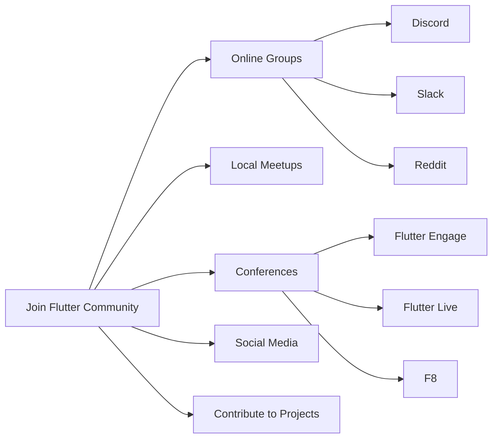

## 14.2.2 Joining the Flutter Community

Engaging with the Flutter community is a pivotal step in your journey as a Flutter developer. It not only accelerates your learning but also provides a platform for support, collaboration, and growth. In this section, we will explore the various avenues through which you can become an active member of the Flutter community, the benefits of doing so, and how it can significantly enhance your development skills and career opportunities.

### Importance of Community Engagement

Joining a community can be a transformative experience. It connects you with like-minded individuals who share your passion for Flutter development. Here are some key benefits of community engagement:

- **Accelerated Learning:** Engaging with the community allows you to learn from others' experiences, access a wealth of shared resources, and gain insights into best practices.
- **Support Network:** Whether you're troubleshooting a bug or exploring new features, having a community to turn to can be invaluable.
- **Collaboration Opportunities:** Collaborating on projects with other developers can lead to innovative solutions and broaden your understanding of Flutter.
- **Career Growth:** Networking with industry professionals can open doors to job opportunities, mentorship, and partnerships.

### Official Flutter Channels

#### Flutter Community Groups

The official Flutter community groups are vibrant hubs of activity where developers from around the world come together to share knowledge, solve problems, and celebrate successes. Here are some platforms where you can join these groups:

- **Discord:** The Flutter Discord server is a bustling place with channels dedicated to various aspects of Flutter development. It's a great place to ask questions, share your projects, and get real-time feedback.
- **Slack:** Many Flutter enthusiasts and professionals use Slack to communicate and collaborate. Joining a Flutter Slack group can help you stay updated with the latest developments and trends.
- **Reddit:** The Flutter Community on Reddit is a forum for discussions, news, and updates related to Flutter. It's a place where you can engage in conversations with other developers and share your insights.

#### Forums and Discussion Boards

- **Flutter GitHub Repository:** The GitHub repository is not just for code. It's a place where you can engage in discussions, report issues, and contribute to the Flutter framework.
- **Flutter Dev Google Group:** This is an official channel where you can participate in discussions about Flutter development, ask questions, and share your knowledge.
- **Stack Overflow:** A go-to resource for developers, Stack Overflow has a dedicated Flutter tag where you can ask questions and find answers to common issues.

### Local Meetups and Conferences

Attending local meetups and conferences is an excellent way to network with other developers and learn from industry leaders. These events provide opportunities to engage in hands-on workshops, listen to expert talks, and participate in hackathons.

- **Local Meetups:** Search for Flutter meetups in your area using platforms like Meetup.com. These gatherings are often informal and provide a great opportunity to connect with local developers.
- **Hackathons:** Participating in hackathons can be a fun way to apply your skills, learn new ones, and collaborate with others on exciting projects.
- **Prominent Conferences:**
  - **Flutter Engage:** A global event that showcases the latest in Flutter development, featuring talks from Flutter team members and community leaders.
  - **Flutter Live:** An event focused on new releases and updates in the Flutter ecosystem.
  - **F8:** While primarily a Facebook event, F8 often includes sessions on Flutter and related technologies.

### Contributing to Community Projects

Contributing to open-source projects is a rewarding way to give back to the community and enhance your own learning. Here are some ways to get involved:

- **Community-Driven Projects:** Look for projects on GitHub that welcome contributions. This could be anything from fixing bugs to adding new features.
- **Writing Blog Posts:** Share your experiences and insights by writing blog posts or tutorials. This not only helps others but also solidifies your own understanding.
- **Creating Tutorials:** Develop tutorials or video content to teach others about Flutter. Platforms like YouTube and Medium are great places to share your work.

### Social Media and Networking

Social media platforms are powerful tools for staying updated with the latest in Flutter and engaging with the community.

- **Twitter:** Follow Flutter influencers and the official Flutter account to get news, tips, and updates.
- **LinkedIn:** Connect with other Flutter developers and industry professionals to expand your network.
- **Other Platforms:** Engage in discussions on platforms like Facebook groups and Telegram channels dedicated to Flutter.

### Mentorship and Collaboration

Finding a mentor or collaborating with peers can provide new perspectives and significantly improve your skills.

- **Mentorship:** Seek out experienced developers who can guide you through your learning journey. This can be done through formal mentorship programs or by reaching out to individuals in the community.
- **Collaboration:** Work on projects with other developers. This not only enhances your skills but also teaches you how to work effectively in a team.

### Diagram: Pathways to Engage with the Flutter Community

To visualize the various pathways to engage with the Flutter community, refer to the following Mermaid.js flowchart:

This diagram illustrates the different avenues available for engaging with the Flutter community, from online groups and local meetups to conferences and social media platforms.

### Best Practices and Tips

- **Be Active:** Regular participation in community discussions and events will help you stay informed and connected.
- **Be Respectful:** Always maintain a respectful and inclusive attitude towards others in the community.
- **Be Open to Learning:** Embrace new ideas and be willing to learn from others, regardless of their experience level.
- **Give Back:** Share your knowledge and experiences with others, whether through code contributions, writing, or speaking at events.

### References and Further Reading

- [Flutter Official Website](https://flutter.dev/)
- [Flutter Community on Reddit](https://www.reddit.com/r/FlutterDev/)
- [Flutter GitHub Repository](https://github.com/flutter/flutter)
- [Flutter Dev Google Group](https://groups.google.com/g/flutter-dev)
- [Stack Overflow Flutter Tag](https://stackoverflow.com/questions/tagged/flutter)

By actively engaging with the Flutter community, you can accelerate your learning, gain valuable insights, and contribute to the growth of the Flutter ecosystem. Whether you're a beginner or an experienced developer, there's always something new to learn and share. Embrace the opportunities that community engagement offers and watch your skills and network grow.

## Quiz Time!



### What are some benefits of joining the Flutter community?

- [x] Accelerated learning and support
- [x] Collaboration opportunities
- [ ] Guaranteed job placement
- [x] Career growth and networking

> **Explanation:** Joining the Flutter community accelerates learning, provides support, offers collaboration opportunities, and aids in career growth through networking.

### Which platforms are mentioned for joining official Flutter community groups?

- [x] Discord
- [x] Slack
- [ ] Instagram
- [x] Reddit

> **Explanation:** Discord, Slack, and Reddit are mentioned as platforms for joining official Flutter community groups.

### What are some events where you can network with other Flutter developers?

- [x] Local meetups
- [x] Hackathons
- [ ] Private parties
- [x] Conferences like Flutter Engage

> **Explanation:** Local meetups, hackathons, and conferences like Flutter Engage are events where you can network with other Flutter developers.

### How can you contribute to the Flutter community?

- [x] Contributing to open-source projects
- [x] Writing blog posts
- [ ] Only using Flutter for personal projects
- [x] Creating tutorials

> **Explanation:** You can contribute to the Flutter community by contributing to open-source projects, writing blog posts, and creating tutorials.

### What is a benefit of finding a mentor in the Flutter community?

- [x] Gaining new perspectives
- [ ] Free access to all Flutter events
- [x] Improving skills
- [ ] Guaranteed project funding

> **Explanation:** Finding a mentor helps you gain new perspectives and improve your skills.

### Which social media platforms are recommended for staying updated with Flutter?

- [x] Twitter
- [x] LinkedIn
- [ ] Snapchat
- [x] Facebook groups

> **Explanation:** Twitter, LinkedIn, and Facebook groups are recommended for staying updated with Flutter.

### What is a key practice when engaging with the Flutter community?

- [x] Being active and respectful
- [ ] Only asking questions
- [x] Being open to learning
- [ ] Ignoring others' contributions

> **Explanation:** Being active, respectful, and open to learning are key practices when engaging with the Flutter community.

### What should you do to give back to the Flutter community?

- [x] Share knowledge and experiences
- [ ] Keep all your projects private
- [x] Contribute to discussions
- [ ] Avoid attending events

> **Explanation:** Sharing knowledge, contributing to discussions, and attending events are ways to give back to the Flutter community.

### What is the benefit of attending local meetups?

- [x] Networking with local developers
- [ ] Guaranteed job offers
- [x] Learning from others
- [ ] Free merchandise

> **Explanation:** Attending local meetups allows you to network with local developers and learn from others.

### True or False: Engaging with the Flutter community can open doors to job opportunities.

- [x] True
- [ ] False

> **Explanation:** Engaging with the Flutter community can indeed open doors to job opportunities through networking and collaboration.


