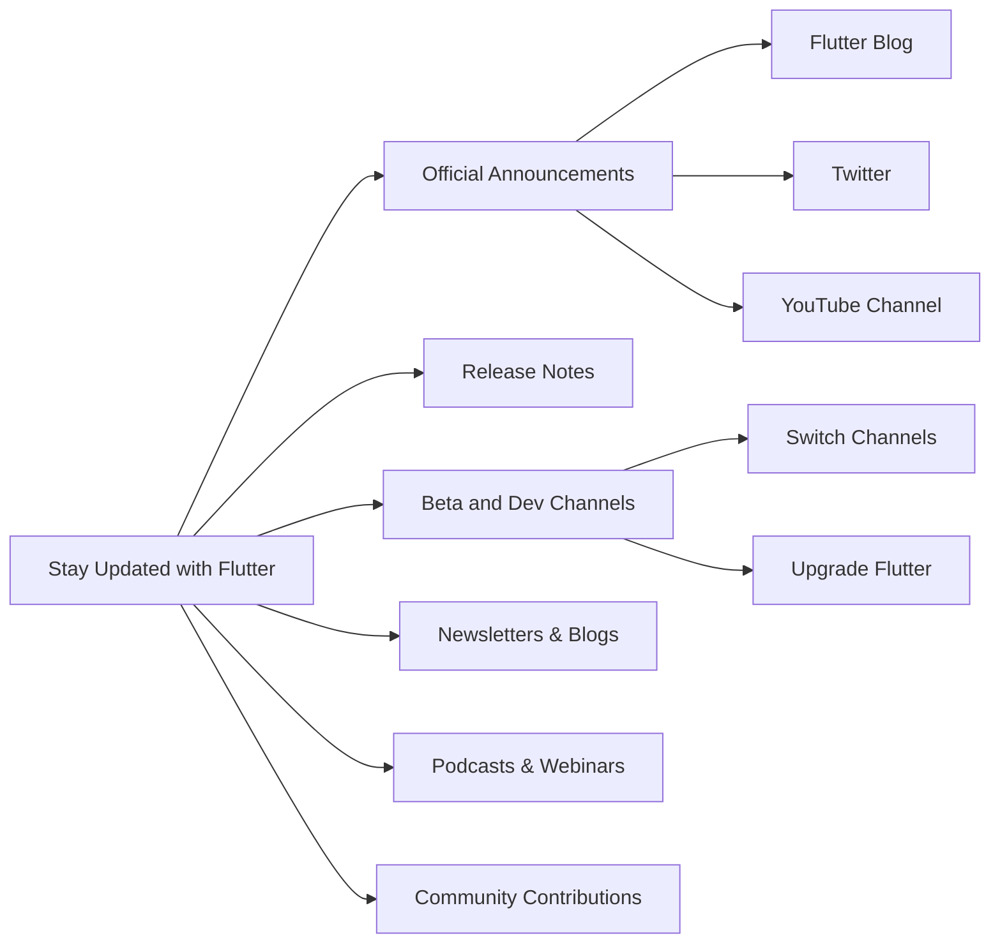

## 14.2.4 Staying Updated with Flutter

In the fast-paced world of mobile development, staying updated with the latest advancements in Flutter is crucial for maintaining a competitive edge and ensuring your applications leverage the best practices and features available. Flutter is a dynamic framework that continuously evolves with new releases, enhancements, and community contributions. This section will guide you through effective strategies to keep abreast of these changes, ensuring you remain at the forefront of Flutter development.

### Importance of Staying Updated

Flutter's rapid evolution means that new features, improvements, and best practices are regularly introduced. Staying informed about these changes is vital for several reasons:

- **Enhanced Features:** New releases often include powerful features that can simplify development and improve app performance.
- **Security and Stability:** Updates frequently address security vulnerabilities and stability issues, ensuring your applications are robust and secure.
- **Deprecations and Breaking Changes:** Understanding deprecated features and breaking changes helps maintain compatibility and avoid potential pitfalls.
- **Community and Ecosystem Growth:** Engaging with the latest trends and tools fosters innovation and collaboration within the Flutter community.

### Official Release Channels

Flutter's official channels are primary sources for accurate and timely information about updates and releases.

#### Flutter Announcements

- **Flutter Blog:** The official Flutter blog is a comprehensive resource for release notes, feature announcements, and in-depth articles about new developments.
- **Twitter:** Follow the [Flutter Twitter account](https://twitter.com/flutterdev) for real-time updates and community highlights.
- **YouTube Channel:** Subscribe to the [Flutter Dev YouTube channel](https://www.youtube.com/c/flutterdev) for video content, including release overviews, tutorials, and conference talks.

#### Release Notes

Reading release notes is essential for understanding the specifics of each new version. They provide detailed insights into:

- **New Features:** Learn about the latest additions to the framework and how they can enhance your projects.
- **Deprecations:** Identify features that are being phased out and plan for necessary code adjustments.
- **Bug Fixes and Improvements:** Stay informed about resolved issues and performance enhancements.

### Beta and Dev Channels

Using Flutter's beta and dev channels allows you to test upcoming features and contribute to the framework's development.

- **Benefits:** Access to cutting-edge features and the opportunity to provide feedback that shapes future releases.
- **Command Example:** Switching to a different Flutter channel is straightforward. Use the following commands to switch to the beta channel and upgrade:

  ```bash
  flutter channel beta
  flutter upgrade
  ```

This approach is ideal for developers who enjoy experimenting with new features and contributing to the testing process.

### Newsletters and Blogs

Subscribing to newsletters and following blogs keeps you informed about the latest trends, tutorials, and community insights.

- **Flutter Weekly:** A popular newsletter that curates the best Flutter content from around the web.
- **Prominent Blogs:** Follow blogs by experienced Flutter developers for in-depth articles and tutorials. Some notable ones include [Medium Flutter Community](https://medium.com/flutter) and [Flutter by Example](https://flutterbyexample.com).

### Podcasts and Webinars

Podcasts and webinars offer a convenient way to learn about Flutter while on the go or during downtime.

- **Podcasts:** Listen to Flutter-focused podcasts such as "Flutter 101" and "It's All Widgets!" for discussions on the latest developments and best practices.
- **Webinars:** Attend webinars hosted by Flutter experts to gain insights into advanced topics and real-world applications.

### Community Contributions

Engaging with the Flutter community is invaluable for learning and growth.

- **GitHub Discussions:** Participate in discussions on Flutter's GitHub repository to share ideas and solutions.
- **Stack Overflow:** Ask and answer questions on Stack Overflow to solve problems and help others.
- **Peer-to-Peer Learning:** Join local Flutter meetups or online forums to connect with other developers and exchange knowledge.

### Continuous Learning

Adopting a mindset of continuous learning is essential for adapting to Flutter's rapid evolution.

- **Experimentation:** Regularly experiment with new features and tools to expand your skill set.
- **Online Courses:** Enroll in online courses and workshops to deepen your understanding of Flutter.
- **Documentation:** Regularly review Flutter's official documentation to stay informed about best practices and new APIs.

### Diagram: Staying Updated with Flutter

To visualize the various channels and methods for staying updated with Flutter, consider the following Mermaid.js flowchart:



This diagram illustrates the interconnected pathways for staying informed about Flutter's developments, emphasizing the importance of a multi-faceted approach.

### Best Practices and Common Pitfalls

- **Stay Proactive:** Regularly check for updates and engage with the community to anticipate changes.
- **Balance Stability and Innovation:** Use stable channels for production apps and experiment with beta/dev channels for learning and testing.
- **Avoid Overwhelm:** Focus on a few reliable sources to prevent information overload.

### References and Additional Resources

- **Official Flutter Documentation:** [Flutter Docs](https://flutter.dev/docs)
- **Flutter GitHub Repository:** [GitHub - Flutter](https://github.com/flutter/flutter)
- **Books and Courses:** Consider resources like "Flutter in Action" by Eric Windmill and online courses on platforms like Udemy and Coursera.

By following these strategies, you'll be well-equipped to navigate Flutter's evolving landscape, ensuring your skills and applications remain cutting-edge.

## Quiz Time!



### What is the primary benefit of staying updated with Flutter?

- [x] Access to new features and improvements
- [ ] Avoiding the need for continuous learning
- [ ] Ensuring backward compatibility with older versions
- [ ] Reducing the need for testing

> **Explanation:** Staying updated provides access to new features, improvements, and best practices, which can enhance your development process and application performance.

### Which official channel provides real-time updates about Flutter?

- [ ] Flutter Blog
- [x] Twitter
- [ ] YouTube Channel
- [ ] GitHub

> **Explanation:** The Flutter Twitter account offers real-time updates and community highlights, making it a valuable resource for staying informed.

### What is the purpose of reading Flutter's release notes?

- [x] Understanding new features and deprecations
- [ ] Learning about community events
- [ ] Finding job opportunities
- [ ] Networking with other developers

> **Explanation:** Release notes provide detailed insights into new features, deprecations, and bug fixes, helping developers understand changes in each version.

### How can you switch to Flutter's beta channel?

- [x] Use the command `flutter channel beta`
- [ ] Modify the pubspec.yaml file
- [ ] Change the Flutter version in the IDE
- [ ] Download a separate beta SDK

> **Explanation:** Switching to the beta channel is done using the command `flutter channel beta`, followed by `flutter upgrade` to update to the latest beta version.

### Which newsletter is recommended for staying updated with Flutter?

- [x] Flutter Weekly
- [ ] JavaScript Weekly
- [ ] Python Weekly
- [ ] TechCrunch

> **Explanation:** Flutter Weekly is a curated newsletter that collects the best Flutter content from around the web, making it a valuable resource for developers.

### What is a benefit of engaging with the Flutter community?

- [x] Learning from peer-to-peer interactions
- [ ] Avoiding the need for official documentation
- [ ] Reducing the need for testing
- [ ] Ensuring backward compatibility

> **Explanation:** Engaging with the community allows developers to learn from each other, share solutions, and stay informed about the latest trends and tools.

### Which platform is NOT mentioned as a source for Flutter podcasts?

- [ ] Spotify
- [ ] Apple Podcasts
- [x] LinkedIn
- [ ] Google Podcasts

> **Explanation:** LinkedIn is not mentioned as a platform for Flutter podcasts. Spotify, Apple Podcasts, and Google Podcasts are more common sources.

### What should you focus on to avoid information overload when staying updated?

- [x] A few reliable sources
- [ ] Every available resource
- [ ] Only official channels
- [ ] Community discussions only

> **Explanation:** Focusing on a few reliable sources helps prevent information overload and ensures you receive accurate and relevant updates.

### What mindset is essential for adapting to Flutter's rapid evolution?

- [x] Continuous learning
- [ ] Static knowledge
- [ ] Avoiding new features
- [ ] Focusing only on stable releases

> **Explanation:** A mindset of continuous learning is crucial for adapting to Flutter's rapid evolution, allowing developers to stay informed and innovative.

### True or False: Using Flutter's beta channel is recommended for production apps.

- [ ] True
- [x] False

> **Explanation:** The beta channel is not recommended for production apps due to potential instability. It is better suited for testing and experimentation.


