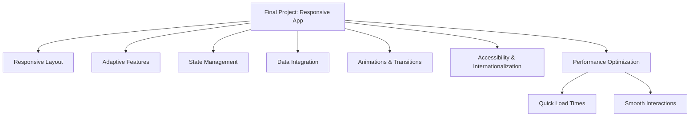

## 14.3.1 Project Overview and Requirements

As we approach the culmination of our journey through "Flutter in Motion: Building Responsive and Adaptive UIs," it's time to synthesize the knowledge and skills you've acquired into a final project. This capstone project is not only an opportunity to apply the responsive and adaptive design principles discussed throughout the book but also a chance to create a portfolio-worthy application that showcases your proficiency in Flutter development.

### Purpose of the Final Project

The final project serves as a comprehensive exercise to consolidate your understanding of responsive and adaptive design in Flutter. It allows you to demonstrate your ability to build a multi-platform application that is both functional and aesthetically pleasing. By completing this project, you will:

- **Apply Learned Skills:** Utilize the techniques and concepts covered in the book, from responsive layouts to state management and performance optimization.
- **Showcase Your Abilities:** Create a tangible application that can be included in your portfolio, demonstrating your expertise to potential employers or clients.
- **Explore Creativity:** While adhering to core requirements, you have the freedom to inject your creativity into the design and functionality of the app.

### Project Description

For this final project, you will build a multi-platform application that can serve as an e-commerce app, a social media platform, or a personal finance manager. This project will require you to integrate various features and functionalities that cater to different user needs and preferences.

- **E-commerce App:** Develop a platform where users can browse products, add items to their cart, and complete purchases. Implement features like product search, user reviews, and order tracking.
- **Social Media Platform:** Create a space for users to connect, share content, and engage with each other. Include features such as user profiles, news feeds, and messaging.
- **Personal Finance Manager:** Design an app that helps users manage their finances by tracking expenses, setting budgets, and analyzing spending habits.

### Core Requirements

To ensure the project meets the standards of a responsive and adaptive application, the following core requirements must be fulfilled:

#### Responsive Layout

- **Seamless Adaptation:** The app should adapt to various screen sizes, orientations, and platforms (mobile, web, desktop) without compromising user experience.
- **Flexible Layouts:** Utilize Flutter's layout widgets, such as `Flexible`, `Expanded`, and `LayoutBuilder`, to create dynamic and responsive UIs.
- **Orientation Handling:** Implement logic to adjust the layout when the device orientation changes, ensuring content remains accessible and visually appealing.

#### Adaptive Features

- **Platform-Specific Design:** Incorporate Material Design for Android and Cupertino widgets for iOS to provide a native look and feel on each platform.
- **Conditional Rendering:** Use platform checks to render different widgets or styles based on the operating system.

#### State Management

- **Efficient State Handling:** Choose an appropriate state management solution, such as Provider or BLoC, to manage the app's state efficiently.
- **Reactive Updates:** Ensure that the UI responds to state changes promptly, providing a smooth user experience.

#### Data Integration

- **API Integration:** Connect the app to external APIs or local databases to fetch, store, and synchronize data.
- **Data Persistence:** Implement mechanisms to persist data locally, ensuring users can access their information offline.

#### Animations and Transitions

- **User Experience Enhancement:** Use animations and transitions to create a fluid and engaging user experience.
- **Smooth Interactions:** Implement implicit and explicit animations to enhance the app's visual appeal.

#### Accessibility and Internationalization

- **Inclusive Design:** Ensure the app is accessible to users with disabilities by implementing accessibility features like screen reader support and semantic labels.
- **Multi-Language Support:** Use the `intl` package to localize the app, supporting multiple languages and regional settings.

#### Performance Optimization

- **Quick Load Times:** Optimize the app's performance to ensure fast loading and responsiveness.
- **Resource Management:** Efficiently manage resources, such as images and assets, to minimize memory usage and improve performance.

### Additional Features (Optional)

To further enhance the app's functionality and user engagement, consider implementing the following optional features:

- **User Authentication:** Integrate secure user login and registration, allowing users to create accounts and manage their profiles.
- **Offline Support:** Enable the app to function without an active internet connection, providing a seamless experience even when offline.
- **Push Notifications:** Use push notifications to keep users informed and engaged with timely updates and alerts.
- **Advanced Animations:** Incorporate complex animations using packages like Rive or Lottie to create visually stunning effects.

### Diagram Suggestion

To better visualize the structure and components of the final project, consider the following Mermaid.js diagram:

This diagram outlines the main components and features of the final project, providing a clear overview of the areas you will focus on during development.

### Conclusion

Embarking on this final project is an exciting opportunity to apply everything you've learned about Flutter's responsive and adaptive capabilities. By meeting the core requirements and exploring optional features, you'll create a robust and versatile application that demonstrates your skills and creativity. Remember to leverage the resources and techniques covered in this book, and don't hesitate to experiment and innovate as you bring your project to life.

## Quiz Time!



### What is the primary purpose of the final project in this book?

- [x] To apply all the responsive and adaptive design principles learned throughout the book.
- [ ] To create a simple static website.
- [ ] To focus solely on state management techniques.
- [ ] To explore advanced Flutter animations exclusively.

> **Explanation:** The final project is designed to consolidate and apply the responsive and adaptive design principles covered in the book, allowing readers to showcase their skills in a comprehensive application.

### Which of the following is NOT a core requirement for the final project?

- [ ] Responsive Layout
- [ ] Adaptive Features
- [ ] State Management
- [x] Blockchain Integration

> **Explanation:** Blockchain Integration is not listed as a core requirement for the final project. The focus is on responsive layouts, adaptive features, state management, and other essential app functionalities.

### What is the role of state management in the final project?

- [x] To manage the app’s state efficiently and ensure reactive updates.
- [ ] To handle network requests and API integration.
- [ ] To design the app's UI components.
- [ ] To implement complex animations.

> **Explanation:** State management is crucial for efficiently managing the app’s state and ensuring that the UI responds promptly to state changes, providing a smooth user experience.

### What is the significance of implementing platform-specific features in the final project?

- [x] To provide a native look and feel on each platform.
- [ ] To reduce the app's overall performance.
- [ ] To limit the app's functionality to a single platform.
- [ ] To increase the complexity of the codebase unnecessarily.

> **Explanation:** Implementing platform-specific features ensures that the app provides a native look and feel on each platform, enhancing user experience by adhering to platform conventions.

### Which package is recommended for supporting multiple languages in the final project?

- [ ] provider
- [ ] bloc
- [x] intl
- [ ] rive

> **Explanation:** The `intl` package is recommended for supporting multiple languages and regional settings, facilitating the internationalization of the app.

### What optional feature can enhance user engagement through timely updates and alerts?

- [ ] Offline Support
- [x] Push Notifications
- [ ] Advanced Animations
- [ ] User Authentication

> **Explanation:** Push Notifications can enhance user engagement by providing timely updates and alerts, keeping users informed and connected with the app.

### Which of the following is a suggested optional feature for the final project?

- [x] User Authentication
- [ ] Blockchain Integration
- [ ] Virtual Reality Support
- [ ] Quantum Computing Algorithms

> **Explanation:** User Authentication is a suggested optional feature that can enhance the app's functionality by allowing secure user login and registration.

### What is the purpose of using animations and transitions in the final project?

- [x] To enhance user experience with smooth and engaging interactions.
- [ ] To increase the app's loading time.
- [ ] To complicate the app's codebase unnecessarily.
- [ ] To replace all static UI components.

> **Explanation:** Animations and transitions are used to enhance user experience by providing smooth and engaging interactions, making the app more visually appealing.

### How can you ensure the app remains accessible to users with disabilities?

- [x] By implementing accessibility features like screen reader support and semantic labels.
- [ ] By focusing solely on performance optimization.
- [ ] By using complex animations without consideration for accessibility.
- [ ] By limiting the app's functionality to a single language.

> **Explanation:** Ensuring accessibility involves implementing features like screen reader support and semantic labels, making the app usable for users with disabilities.

### True or False: The final project should only focus on mobile platforms and ignore web and desktop adaptations.

- [ ] True
- [x] False

> **Explanation:** False. The final project should adapt seamlessly to various screen sizes, orientations, and platforms, including mobile, web, and desktop, to ensure a comprehensive responsive and adaptive application.


