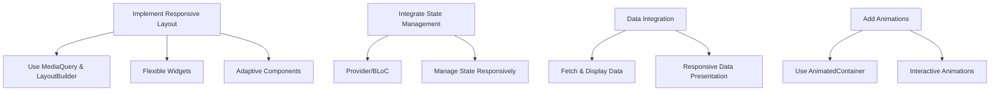

## 14.3.3 Implementing Responsive Features

As you embark on building a responsive app in Flutter, it is crucial to understand the various techniques and tools available to create an adaptable and user-friendly interface. This section will guide you through implementing responsive features using Flutter's powerful layout widgets, adaptive components, state management solutions, data integration strategies, and animations. By the end of this guide, you'll have a comprehensive understanding of how to create a responsive app that provides a seamless experience across different devices and screen sizes.

### Responsive Layout Implementation

Responsive design is the cornerstone of modern app development. It ensures that your application looks and functions well on a wide range of devices, from small phones to large tablets and desktops. Flutter provides several widgets and tools to help you achieve this.

#### Using MediaQuery and LayoutBuilder

`MediaQuery` and `LayoutBuilder` are essential tools for building responsive layouts in Flutter. `MediaQuery` provides information about the size and orientation of the current screen, while `LayoutBuilder` allows you to build widgets based on the constraints provided by the parent widget.

**Example: Creating a Responsive Grid**

```dart
class ResponsiveGrid extends StatelessWidget {
  @override
  Widget build(BuildContext context) {
    var screenWidth = MediaQuery.of(context).size.width;
    int crossAxisCount = screenWidth < 600 ? 2 : 4;
    return GridView.builder(
      gridDelegate: SliverGridDelegateWithFixedCrossAxisCount(
        crossAxisCount: crossAxisCount,
        crossAxisSpacing: 10,
        mainAxisSpacing: 10,
      ),
      itemBuilder: (context, index) {
        return Container(
          color: Colors.blue,
          child: Center(child: Text('Item $index')),
        );
      },
      itemCount: 20,
    );
  }
}
```

In this example, the `ResponsiveGrid` widget uses `MediaQuery` to determine the screen width and adjusts the number of columns in the grid accordingly. This ensures that the grid adapts to different screen sizes.

#### Flexible and Expanded Widgets

`Flexible` and `Expanded` widgets are used to create flexible layouts that can adjust to the available space. They are particularly useful when you want to distribute space among children of a `Row` or `Column`.

**Example: Using Flexible and Expanded**

```dart
class FlexibleExample extends StatelessWidget {
  @override
  Widget build(BuildContext context) {
    return Row(
      children: [
        Expanded(
          child: Container(color: Colors.red, height: 100),
        ),
        Flexible(
          flex: 2,
          child: Container(color: Colors.green, height: 100),
        ),
        Flexible(
          flex: 1,
          child: Container(color: Colors.blue, height: 100),
        ),
      ],
    );
  }
}
```

In this example, the `Expanded` widget takes up all available space, while the `Flexible` widgets share the remaining space based on their `flex` values.

### Adaptive Widgets and Components

Adaptive design involves creating components that change their appearance or behavior based on the platform or device. Flutter provides a rich set of widgets that can be adapted for different platforms, such as Material widgets for Android and Cupertino widgets for iOS.

#### Switching Between Material and Cupertino Widgets

You can dynamically switch between Material and Cupertino widgets based on the platform using the `Theme.of(context).platform` property.

**Example: Adaptive Button**

```dart
Widget adaptiveButton(BuildContext context) {
  if (Theme.of(context).platform == TargetPlatform.iOS) {
    return CupertinoButton(
      child: Text('Press Me'),
      onPressed: () {},
    );
  } else {
    return ElevatedButton(
      child: Text('Press Me'),
      onPressed: () {},
    );
  }
}
```

In this example, the `adaptiveButton` function returns a `CupertinoButton` for iOS platforms and an `ElevatedButton` for other platforms, ensuring a native look and feel.

### State Management Integration

State management is a critical aspect of building responsive apps, as it allows you to manage and react to changes in your application's state efficiently. Flutter offers several state management solutions, such as Provider, BLoC, and Riverpod.

#### Using Provider for State Management

Provider is a popular state management solution in Flutter that makes it easy to manage and share state across your application.

**Example: State Management with Provider**

```dart
class Counter with ChangeNotifier {
  int _count = 0;

  int get count => _count;

  void increment() {
    _count++;
    notifyListeners();
  }
}

// In main.dart
ChangeNotifierProvider(
  create: (context) => Counter(),
  child: MyApp(),
);

// In a widget
Consumer<Counter>(
  builder: (context, counter, child) {
    return Text('Count: ${counter.count}');
  },
);
```

In this example, the `Counter` class uses `ChangeNotifier` to notify listeners of state changes. The `Consumer` widget listens for changes and rebuilds the UI accordingly.

### Data Integration and Management

Handling data efficiently is crucial for responsive apps, especially when dealing with different screen sizes and orientations. You can use responsive lists or tables that adjust based on the available space.

#### Fetching and Displaying Data Responsively

You can use `LayoutBuilder` to create responsive data presentations that adapt to different screen sizes.

**Example: Responsive List**

```dart
class ResponsiveList extends StatelessWidget {
  final List<String> items;

  ResponsiveList({required this.items});

  @override
  Widget build(BuildContext context) {
    return LayoutBuilder(
      builder: (context, constraints) {
        if (constraints.maxWidth < 600) {
          return ListView.builder(
            itemCount: items.length,
            itemBuilder: (context, index) {
              return ListTile(title: Text(items[index]));
            },
          );
        } else {
          return GridView.builder(
            gridDelegate: SliverGridDelegateWithFixedCrossAxisCount(crossAxisCount: 3),
            itemCount: items.length,
            itemBuilder: (context, index) {
              return Card(child: Center(child: Text(items[index])));
            },
          );
        }
      },
    );
  }
}
```

In this example, the `ResponsiveList` widget switches between a `ListView` and a `GridView` based on the available width, ensuring optimal data presentation.

### Implementing Animations and Transitions

Animations can enhance the responsiveness and interactivity of your app by providing visual feedback and transitions. Flutter offers a variety of animation widgets and tools to create smooth and engaging animations.

#### Responsive Animations

You can use `AnimatedContainer` to create responsive animations that adapt based on user interactions or device capabilities.

**Example: Animated Responsive Box**

```dart
class AnimatedResponsiveBox extends StatefulWidget {
  @override
  _AnimatedResponsiveBoxState createState() => _AnimatedResponsiveBoxState();
}

class _AnimatedResponsiveBoxState extends State<AnimatedResponsiveBox> {
  bool _isExpanded = false;

  @override
  Widget build(BuildContext context) {
    return GestureDetector(
      onTap: () {
        setState(() {
          _isExpanded = !_isExpanded;
        });
      },
      child: AnimatedContainer(
        duration: Duration(milliseconds: 300),
        width: _isExpanded ? 200 : 100,
        height: _isExpanded ? 200 : 100,
        color: _isExpanded ? Colors.red : Colors.blue,
        child: Center(child: Text('Tap Me')),
      ),
    );
  }
}
```

In this example, the `AnimatedResponsiveBox` widget uses `AnimatedContainer` to smoothly transition between two states when tapped, providing a responsive and interactive experience.

### Diagram: Implementing Responsive Features

To visualize the process of implementing responsive features in your final project, consider the following flowchart:



This flowchart outlines the key steps in implementing responsive features, from using layout widgets and adaptive components to integrating state management and animations.

### Conclusion

Implementing responsive features in Flutter involves a combination of layout management, adaptive components, state management, data handling, and animations. By leveraging these tools and techniques, you can create a responsive app that provides a seamless experience across different devices and screen sizes. As you continue to build and refine your app, remember to test on various devices and orientations to ensure optimal performance and usability.

## Quiz Time!



### What is the primary purpose of using `MediaQuery` in Flutter?

- [x] To access screen dimensions and orientation
- [ ] To manage state across the application
- [ ] To create animations and transitions
- [ ] To fetch data from APIs

> **Explanation:** `MediaQuery` is used to access information about the size and orientation of the current screen, which is essential for building responsive layouts.

### How does `LayoutBuilder` help in creating responsive designs?

- [x] It allows building widgets based on parent constraints
- [ ] It provides access to device-specific features
- [ ] It manages animations and transitions
- [ ] It fetches and displays data

> **Explanation:** `LayoutBuilder` helps in creating responsive designs by allowing you to build widgets based on the constraints provided by the parent widget.

### Which widget is used to create flexible layouts that adjust to available space?

- [x] Flexible
- [ ] MediaQuery
- [ ] ListView
- [ ] AnimatedContainer

> **Explanation:** The `Flexible` widget is used to create layouts that can adjust to the available space, especially within a `Row` or `Column`.

### What is the purpose of using adaptive widgets in Flutter?

- [x] To change appearance or behavior based on the platform
- [ ] To manage state changes
- [ ] To fetch and display data
- [ ] To create animations

> **Explanation:** Adaptive widgets are used to change their appearance or behavior based on the platform, ensuring a native look and feel.

### How does the `Provider` package help in state management?

- [x] It allows sharing and managing state across the application
- [ ] It provides access to device-specific features
- [ ] It creates animations and transitions
- [ ] It fetches data from APIs

> **Explanation:** The `Provider` package helps in state management by allowing you to share and manage state across your application efficiently.

### What is the benefit of using `AnimatedContainer` in Flutter?

- [x] It allows smooth transitions between states
- [ ] It fetches and displays data
- [ ] It manages state changes
- [ ] It provides access to screen dimensions

> **Explanation:** `AnimatedContainer` is used to create smooth transitions between different states, enhancing the responsiveness and interactivity of the app.

### Which widget is used to switch between Material and Cupertino styles dynamically?

- [x] Adaptive widgets
- [ ] MediaQuery
- [ ] LayoutBuilder
- [ ] Provider

> **Explanation:** Adaptive widgets are used to switch between Material and Cupertino styles dynamically, ensuring a native look and feel on different platforms.

### How can `LayoutBuilder` be used to create responsive data presentations?

- [x] By switching between different layouts based on constraints
- [ ] By managing state changes
- [ ] By creating animations and transitions
- [ ] By fetching data from APIs

> **Explanation:** `LayoutBuilder` can be used to create responsive data presentations by switching between different layouts, such as `ListView` and `GridView`, based on the available constraints.

### What is the role of `ChangeNotifier` in the `Provider` package?

- [x] To notify listeners of state changes
- [ ] To fetch and display data
- [ ] To create animations and transitions
- [ ] To access screen dimensions

> **Explanation:** `ChangeNotifier` is used in the `Provider` package to notify listeners of state changes, allowing the UI to react accordingly.

### True or False: `Flexible` and `Expanded` widgets can be used interchangeably in all scenarios.

- [ ] True
- [x] False

> **Explanation:** `Flexible` and `Expanded` widgets are not interchangeable in all scenarios. `Expanded` takes up all available space, while `Flexible` allows for more control over space distribution based on `flex` values.


