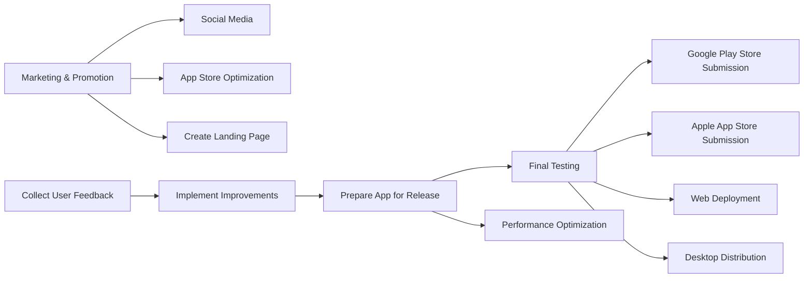

## 14.3.4 Sharing and Publishing Your Work

Congratulations on reaching the final stages of your Flutter app development journey! Sharing and publishing your app is a crucial step that transforms your project from a personal achievement into a tool that can reach and impact users worldwide. This section will guide you through the essential steps to prepare, publish, and promote your app across various platforms, ensuring it reaches its full potential.

### Preparing the App for Release

Before you can share your app with the world, it's essential to ensure that it is polished and performs optimally across all intended platforms. This involves thorough testing, performance optimization, and final adjustments to ensure all features work as intended.

#### Final Testing and Performance Optimization

- **Comprehensive Testing:** Conduct rigorous testing on multiple devices and screen sizes to ensure your app's responsiveness and adaptability. Utilize both emulators and physical devices to cover a wide range of scenarios.
- **Performance Optimization:** Focus on optimizing your app's performance by minimizing unnecessary widget rebuilds, managing memory effectively, and ensuring smooth animations. Use tools like Flutter DevTools to profile and identify performance bottlenecks.

#### Ensuring Feature Completeness

- **Feature Verification:** Double-check that all features are implemented correctly and function as expected. This includes verifying user flows, data handling, and UI interactions.
- **Bug Fixing:** Address any known bugs or issues that could affect user experience. Prioritize critical bugs that could lead to crashes or data loss.

### Publishing to App Stores

Publishing your app to major app stores like Google Play Store and Apple App Store involves several steps, from creating developer accounts to adhering to specific guidelines. Let's explore these processes in detail.

#### Google Play Store Submission

- **Developer Account:** Start by creating a Google Play Developer account if you haven't already. This account allows you to manage your app listings and track performance metrics.
- **App Bundle or APK:** Prepare your app for submission by generating an Android App Bundle (AAB) or APK using Flutter's build commands. The App Bundle is recommended for its ability to optimize delivery for different device configurations.
- **Store Listing:** Create a compelling store listing that includes your app's title, description, screenshots, and promotional graphics. Optimize your listing for searchability and user engagement.
- **Submission:** Upload your app bundle or APK to the Google Play Console, complete the necessary forms, and submit your app for review.

#### Apple App Store Submission

- **Apple Developer Account:** Register for an Apple Developer account to access the tools and resources needed for app submission.
- **Adhering to Guidelines:** Familiarize yourself with Apple's App Store Guidelines to ensure your app complies with all requirements, including content, functionality, and design standards.
- **Using Xcode:** Use Xcode to archive your app and submit it to the App Store. Ensure your app is signed with the appropriate certificates and provisioning profiles.
- **App Store Connect:** Manage your app's metadata, pricing, and availability through App Store Connect. Submit your app for review and monitor its status.

#### Flutter Web Deployment

Deploying your Flutter app as a web application opens up new opportunities for accessibility and reach.

- **Hosting Platforms:** Consider hosting your web app on platforms like Firebase Hosting, Netlify, or GitHub Pages. These services offer easy deployment and management options.
- **Build and Deploy:** Use Flutter's web build commands to generate the necessary files for deployment. Follow the hosting platform's instructions to upload and configure your app.

#### Desktop Application Distribution

Flutter's support for desktop applications allows you to reach users on Windows, macOS, and Linux.

- **Building for Desktop:** Use Flutter's build commands to generate executables for each desktop platform. Ensure your app is optimized for desktop interactions, such as mouse and keyboard support.
- **Platform-Specific Installers:** Create installers or packages for each platform using tools like Inno Setup for Windows or DMG files for macOS. These installers make it easy for users to download and install your app.

### Marketing and Promotion

Once your app is published, effective marketing and promotion strategies are essential to reach a wider audience and maximize downloads.

#### Social Media and Blogging

- **Social Media:** Leverage platforms like Twitter, Facebook, and LinkedIn to share updates, engage with users, and build a community around your app.
- **Blogging:** Write blog posts about your app's development journey, features, and use cases. Share these posts on platforms like Medium or your personal blog to attract potential users.

#### App Store Optimization (ASO)

- **Keyword Research:** Identify relevant keywords that potential users might search for and incorporate them into your app's title and description.
- **User Reviews:** Encourage satisfied users to leave positive reviews and ratings, which can improve your app's visibility and credibility.

#### Creating a Landing Page

- **Showcase Your App:** Develop a dedicated website or landing page to highlight your app's features, benefits, and user testimonials. Include download links and contact information for support.
- **SEO Optimization:** Optimize your landing page for search engines to increase organic traffic and visibility.

### Collecting User Feedback

User feedback is invaluable for improving your app and ensuring it meets user needs. Integrate feedback mechanisms within your app to gather insights post-launch.

#### Implementing a Feedback Form

A simple feedback form allows users to share their thoughts and suggestions directly from the app. Here's a basic implementation in Flutter:

```dart
class FeedbackForm extends StatefulWidget {
  @override
  _FeedbackFormState createState() => _FeedbackFormState();
}

class _FeedbackFormState extends State<FeedbackForm> {
  final _formKey = GlobalKey<FormState>();
  String _feedback = '';

  @override
  Widget build(BuildContext context) {
    return Form(
      key: _formKey,
      child: Column(
        children: [
          TextFormField(
            decoration: InputDecoration(labelText: 'Your Feedback'),
            onSaved: (value) => _feedback = value ?? '',
            validator: (value) {
              if (value == null || value.isEmpty) {
                return 'Please enter some feedback';
              }
              return null;
            },
          ),
          ElevatedButton(
            onPressed: () {
              if (_formKey.currentState!.validate()) {
                _formKey.currentState!.save();
                // Handle feedback submission
              }
            },
            child: Text('Submit'),
          ),
        ],
      ),
    );
  }
}
```

### Showcasing Your App

Showcasing your app effectively can lead to increased visibility and opportunities for collaboration.

#### Sharing on GitHub

- **Open Source Contribution:** Consider making your app open source by sharing it on GitHub. This can attract contributions from other developers and increase your app's reach.
- **Portfolio Showcase:** Include your app in your professional portfolio to demonstrate your skills and attract potential employers or clients.

#### Creating Demo Videos

- **Video Demonstrations:** Produce demo videos that highlight your app's features and user experience. Share these videos on platforms like YouTube or Vimeo.
- **Interactive Previews:** Use tools like Figma or Adobe XD to create interactive prototypes that potential users can explore.

### Diagram: Sharing and Publishing Workflow

To visualize the steps involved in sharing and publishing your app, refer to the following Mermaid.js flowchart:



### Conclusion

By following these steps, you can successfully share and publish your Flutter app across multiple platforms, reaching a diverse audience and maximizing your app's impact. Remember, the journey doesn't end with the initial release. Continuously gather feedback, iterate on your app, and explore new opportunities for growth and improvement.

## Quiz Time!



### What is the first step in preparing your app for release?

- [x] Conducting comprehensive testing
- [ ] Creating a developer account
- [ ] Submitting to app stores
- [ ] Marketing and promotion

> **Explanation:** Comprehensive testing ensures your app functions correctly across devices and screen sizes before release.

### Which hosting platforms are suggested for deploying Flutter web apps?

- [x] Firebase Hosting
- [x] Netlify
- [x] GitHub Pages
- [ ] AWS Lambda

> **Explanation:** Firebase Hosting, Netlify, and GitHub Pages are popular platforms for hosting web applications.

### What is the recommended format for submitting Android apps to the Google Play Store?

- [ ] APK
- [x] Android App Bundle (AAB)
- [ ] ZIP
- [ ] JAR

> **Explanation:** The Android App Bundle (AAB) is recommended for optimizing delivery for different device configurations.

### What tool is used to submit apps to the Apple App Store?

- [ ] Android Studio
- [x] Xcode
- [ ] Visual Studio Code
- [ ] IntelliJ IDEA

> **Explanation:** Xcode is used to archive and submit apps to the Apple App Store.

### What is a key strategy for App Store Optimization (ASO)?

- [x] Keyword Research
- [ ] Code Refactoring
- [ ] Debugging
- [ ] UI Redesign

> **Explanation:** Keyword research helps improve your app's visibility and searchability in app stores.

### How can you collect user feedback post-launch?

- [x] Integrate a feedback form within the app
- [ ] Disable user reviews
- [ ] Ignore user feedback
- [ ] Remove contact information

> **Explanation:** Integrating a feedback form allows users to share their thoughts and suggestions directly from the app.

### What is a benefit of making your app open source on GitHub?

- [x] Attracting contributions from other developers
- [ ] Increasing app size
- [ ] Limiting user access
- [ ] Reducing app functionality

> **Explanation:** Open sourcing your app can attract contributions and increase its reach.

### What should be included in a compelling store listing?

- [x] App's title and description
- [x] Screenshots and promotional graphics
- [ ] Source code
- [ ] Debug logs

> **Explanation:** A compelling store listing includes the app's title, description, screenshots, and promotional graphics.

### What is the purpose of creating a landing page for your app?

- [x] To showcase the app's features and provide download links
- [ ] To hide the app from users
- [ ] To increase app size
- [ ] To reduce app functionality

> **Explanation:** A landing page highlights the app's features and provides download links, increasing visibility.

### True or False: The journey ends with the initial release of your app.

- [ ] True
- [x] False

> **Explanation:** The journey doesn't end with the initial release; continuous feedback and iteration are crucial for growth.


