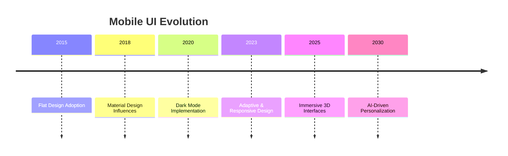

## 14.4.1 Embracing the Evolution of Mobile UI

As we stand on the cusp of a new era in mobile user interface (UI) design, it's essential to look forward and embrace the trends and technologies that will shape the future of mobile applications. This section delves into the future trends in mobile UI/UX design, the importance of continuous learning, and how developers can adapt to new technologies to create innovative and engaging user experiences.

### Future Trends in Mobile UI

The landscape of mobile UI is constantly evolving, driven by technological advancements and changing user expectations. Here are some of the key trends that are set to redefine mobile UI/UX design:

- **Immersive 3D Interfaces:** With the advent of more powerful mobile devices and advancements in graphics processing, 3D interfaces are becoming increasingly feasible. These interfaces offer a more engaging and interactive user experience, allowing users to interact with applications in a more natural and intuitive way. Developers can leverage 3D graphics libraries and frameworks to create stunning visual effects and animations that captivate users.

- **Voice-Activated Controls:** As voice recognition technology continues to improve, voice-activated controls are becoming a standard feature in mobile applications. This trend is driven by the growing popularity of virtual assistants like Siri, Google Assistant, and Alexa. Voice-activated controls provide a hands-free way for users to interact with applications, making them more accessible and convenient.

- **AI-Driven Personalization:** Artificial intelligence (AI) is playing an increasingly important role in personalizing user experiences. By analyzing user behavior and preferences, AI can tailor content and features to individual users, enhancing engagement and satisfaction. This trend is particularly relevant for e-commerce, social media, and content delivery applications, where personalized recommendations can significantly impact user retention and conversion rates.

These trends not only enhance the user experience but also influence the development of responsive and adaptive UIs. As developers, it's crucial to stay abreast of these trends and incorporate them into your design and development processes.

### Continuous Learning

In the fast-paced world of mobile development, continuous learning is not just beneficial—it's essential. The technologies and tools we use today may become obsolete tomorrow, and new innovations are constantly emerging. Here are some strategies to ensure you stay ahead of the curve:

- **Stay Curious:** Cultivate a mindset of curiosity and exploration. Regularly explore new technologies, frameworks, and design patterns. Attend conferences, webinars, and workshops to learn from industry experts and peers.

- **Engage with the Community:** Join online forums, social media groups, and developer communities to share knowledge and learn from others. Platforms like GitHub, Stack Overflow, and Reddit are excellent resources for staying updated on the latest trends and best practices.

- **Invest in Education:** Consider enrolling in online courses or pursuing certifications in emerging technologies. Websites like Coursera, Udemy, and edX offer a wide range of courses on mobile development, UI/UX design, and related topics.

By committing to continuous learning, you'll be better equipped to adapt to changes in the industry and deliver cutting-edge solutions to your users.

### Adapting to New Technologies

The integration of emerging technologies like augmented reality (AR), virtual reality (VR), and machine learning (ML) is opening up new possibilities for mobile app development. Here's how you can embrace these technologies in your projects:

- **Augmented Reality (AR):** AR overlays digital content onto the real world, creating immersive experiences that blend the physical and digital realms. Applications of AR in mobile apps include gaming, navigation, education, and retail. Tools like ARKit (iOS) and ARCore (Android) provide the necessary frameworks to develop AR experiences.

- **Virtual Reality (VR):** VR creates fully immersive digital environments, offering users a sense of presence and interaction. While VR is more commonly associated with gaming and entertainment, it has potential applications in training, education, and virtual tourism. Developers can use platforms like Unity and Unreal Engine to create VR experiences.

- **Machine Learning (ML):** ML enables applications to learn from data and improve over time. It can be used for tasks such as image recognition, natural language processing, and predictive analytics. Integrating ML into mobile apps can enhance functionality and provide users with more intelligent and responsive experiences.

By embracing these technologies, you can create innovative applications that stand out in the competitive mobile app market.

### Innovation and Creativity

Innovation and creativity are at the heart of exceptional UI/UX design. As developers, it's important to push the boundaries of traditional design and explore new possibilities. Here are some ways to foster innovation and creativity in your projects:

- **Experiment with Layouts and Interactions:** Don't be afraid to try new layouts and interaction patterns. Use prototyping tools to quickly test and iterate on your ideas. Consider how you can leverage animations and transitions to create a more dynamic and engaging user experience.

- **Solve Complex Design Challenges:** Approach design challenges with a creative mindset. Consider how you can use design to address user pain points and enhance usability. Collaborate with designers and stakeholders to brainstorm and refine solutions.

- **Deliver Unique User Experiences:** Strive to create applications that offer unique and memorable experiences. Consider how you can differentiate your app from competitors by offering features or interactions that are not commonly found in similar applications.

By embracing innovation and creativity, you can deliver applications that not only meet user needs but also delight and inspire them.

### Staying Agile

In the rapidly changing world of mobile development, agility is key to success. Agile methodologies enable teams to adapt quickly to changes and incorporate new ideas into the development process. Here are some benefits of adopting agile practices:

- **Flexibility:** Agile methodologies allow teams to respond to changes in requirements and priorities, ensuring that the final product meets user needs and expectations.

- **Collaboration:** Agile promotes collaboration between developers, designers, and stakeholders, fostering a shared understanding of project goals and objectives.

- **Continuous Improvement:** Agile encourages continuous feedback and iteration, enabling teams to refine and improve their processes and deliverables over time.

By staying agile, you can ensure that your development process is responsive to change and capable of delivering high-quality applications that meet the needs of your users.

### Diagram: Mobile UI Evolution

To visualize the evolution of mobile UI trends and future forecasts, consider the following Mermaid.js timeline diagram:

This timeline illustrates the progression of mobile UI trends over the years, highlighting key milestones and future forecasts. As we move forward, it's important to keep these trends in mind and consider how they can influence your design and development processes.

### Conclusion

Embracing the evolution of mobile UI requires a commitment to continuous learning, innovation, and adaptability. By staying informed about future trends, exploring new technologies, and fostering creativity, you can create applications that not only meet user needs but also exceed their expectations. As you continue your journey in mobile development, remember to stay curious, embrace change, and push the boundaries of what's possible.

## Quiz Time!



### What is a key trend in mobile UI/UX design that involves overlaying digital content onto the real world?

- [x] Augmented Reality (AR)
- [ ] Virtual Reality (VR)
- [ ] Machine Learning (ML)
- [ ] Voice-Activated Controls

> **Explanation:** Augmented Reality (AR) overlays digital content onto the real world, creating immersive experiences that blend the physical and digital realms.

### Which technology is primarily used for creating fully immersive digital environments?

- [ ] Augmented Reality (AR)
- [x] Virtual Reality (VR)
- [ ] Machine Learning (ML)
- [ ] AI-Driven Personalization

> **Explanation:** Virtual Reality (VR) creates fully immersive digital environments, offering users a sense of presence and interaction.

### What is the benefit of AI-driven personalization in mobile applications?

- [x] Tailoring content and features to individual users
- [ ] Creating fully immersive digital environments
- [ ] Overlaying digital content onto the real world
- [ ] Enabling hands-free interaction with applications

> **Explanation:** AI-driven personalization tailors content and features to individual users, enhancing engagement and satisfaction.

### Why is continuous learning important in mobile development?

- [x] To keep up with the ever-evolving mobile development landscape
- [ ] To create fully immersive digital environments
- [ ] To overlay digital content onto the real world
- [ ] To enable hands-free interaction with applications

> **Explanation:** Continuous learning is important to keep up with the ever-evolving mobile development landscape and to deliver cutting-edge solutions.

### What is a key benefit of adopting agile methodologies in mobile development?

- [x] Flexibility to respond to changes in requirements and priorities
- [ ] Creating fully immersive digital environments
- [ ] Overlaying digital content onto the real world
- [ ] Enabling hands-free interaction with applications

> **Explanation:** Agile methodologies provide flexibility to respond to changes in requirements and priorities, ensuring that the final product meets user needs and expectations.

### Which tool is commonly used for developing augmented reality experiences on iOS?

- [x] ARKit
- [ ] ARCore
- [ ] Unity
- [ ] Unreal Engine

> **Explanation:** ARKit is a framework provided by Apple for developing augmented reality experiences on iOS devices.

### What is one way to foster innovation and creativity in mobile app development?

- [x] Experimenting with layouts and interactions
- [ ] Creating fully immersive digital environments
- [ ] Overlaying digital content onto the real world
- [ ] Enabling hands-free interaction with applications

> **Explanation:** Experimenting with layouts and interactions can foster innovation and creativity in mobile app development.

### What is a common application of machine learning in mobile apps?

- [x] Image recognition
- [ ] Creating fully immersive digital environments
- [ ] Overlaying digital content onto the real world
- [ ] Enabling hands-free interaction with applications

> **Explanation:** Machine learning is commonly used for tasks such as image recognition, enhancing functionality and providing intelligent experiences.

### Which of the following is a strategy for continuous learning in mobile development?

- [x] Engaging with the community
- [ ] Creating fully immersive digital environments
- [ ] Overlaying digital content onto the real world
- [ ] Enabling hands-free interaction with applications

> **Explanation:** Engaging with the community is a strategy for continuous learning, allowing developers to share knowledge and learn from others.

### True or False: AI-driven personalization can significantly impact user retention and conversion rates.

- [x] True
- [ ] False

> **Explanation:** True. AI-driven personalization can significantly impact user retention and conversion rates by tailoring content and features to individual users.


