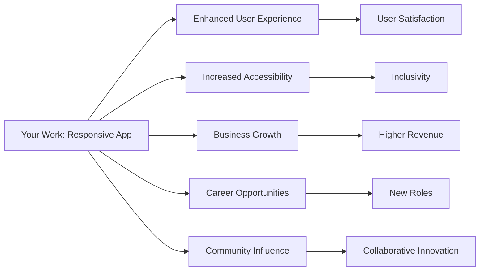

## 14.4.2 The Impact of Your Work

In the rapidly evolving world of mobile and web applications, the significance of creating responsive and adaptive user interfaces (UIs) cannot be overstated. As developers, the work you do in crafting these interfaces has far-reaching implications, not only for the users who interact with your applications but also for your personal and professional growth. This section delves into the multifaceted impact of your work, emphasizing the positive outcomes that arise from mastering responsive design with Flutter.

### Positive User Experiences

At the heart of any successful application is a positive user experience. Well-designed responsive and adaptive UIs are pivotal in achieving this goal. By ensuring that your application seamlessly adapts to various screen sizes and orientations, you enhance user satisfaction and engagement. 

- **User Satisfaction and Engagement:**
  - Responsive design ensures that users have a consistent and enjoyable experience, regardless of the device they use. This consistency fosters trust and encourages users to spend more time engaging with your application.
  - Adaptive UIs that cater to user preferences and contexts can significantly enhance the perceived value of your app, leading to higher user retention rates.

Consider a scenario where a user switches from a smartphone to a tablet while using your app. A responsive design ensures that the transition is smooth, with the interface adjusting to take advantage of the larger screen real estate. This adaptability not only meets user expectations but also delights them, creating a memorable experience.

### Inclusivity and Accessibility

Creating inclusive designs that cater to diverse user needs is not just a best practice; it's a responsibility. Accessibility in app design ensures that everyone, including those with disabilities, can access and benefit from your application.

- **Equitable Digital Experience:**
  - By implementing accessibility features such as screen reader support, adjustable text sizes, and high-contrast modes, you make your app usable for a broader audience.
  - An accessible app is more likely to comply with legal standards and regulations, reducing the risk of potential lawsuits and enhancing your brand's reputation.

Consider the impact of an app that supports voice navigation for visually impaired users. Such features not only make the app accessible but also demonstrate a commitment to inclusivity, fostering goodwill and loyalty among users.

### Business and Personal Growth

Mastering responsive design with Flutter opens up a plethora of opportunities for both business and personal growth. As the demand for skilled Flutter developers continues to rise, so do the career prospects.

- **Career Opportunities:**
  - Proficiency in creating responsive and adaptive UIs can lead to higher-paying roles, freelance projects, and leadership positions within development teams.
  - The ability to build sophisticated UIs is a highly sought-after skill, making you a valuable asset to any organization.

- **Personal Growth:**
  - The challenges and triumphs of building complex UIs contribute to personal development. You gain problem-solving skills, a deeper understanding of user needs, and the satisfaction of creating impactful work.
  - Engaging in continuous learning and staying updated with the latest Flutter advancements further enhances your expertise and confidence as a developer.

### Community and Collaboration

The Flutter community is vibrant and collaborative, offering numerous opportunities for developers to contribute, learn, and grow together.

- **Inspiring Others:**
  - By sharing your knowledge and experiences, you can inspire other developers to embrace responsive design principles, fostering a culture of innovation and excellence.
  - Contributing to open-source projects or writing tutorials can establish you as a thought leader within the community.

- **Fostering Collaboration:**
  - Collaboration within the community leads to the development of better tools, libraries, and practices, benefiting all developers.
  - Engaging with the community provides access to a network of like-minded professionals, opening doors to new opportunities and collaborations.

### Long-Term Sustainability

Designing apps with sustainability in mind ensures they remain relevant and functional as technologies and user expectations evolve.

- **Future-Proofing Your Apps:**
  - By adhering to best practices in responsive design, you create applications that can easily adapt to new devices and platforms, extending their lifespan and relevance.
  - Sustainable design practices also contribute to reduced maintenance costs and easier updates, benefiting both developers and users.

- **Environmental Considerations:**
  - Efficient app design can reduce resource consumption, contributing to a more sustainable digital ecosystem.
  - By optimizing performance and minimizing unnecessary data usage, you create apps that are not only user-friendly but also environmentally conscious.

### Visualizing the Impact

To better understand the ripple effect of creating impactful responsive apps, consider the following Mermaid.js diagram:

This diagram illustrates how your work as a developer extends beyond the immediate task of building an app. It impacts user satisfaction, inclusivity, business growth, career opportunities, and community collaboration, creating a cycle of positive influence.

### Conclusion

The impact of your work in creating responsive and adaptive UIs with Flutter is profound. By enhancing user experiences, promoting inclusivity, and fostering personal and professional growth, you contribute to a more equitable and innovative digital landscape. As you continue your journey in Flutter development, remember that your efforts have the power to inspire change, drive progress, and create a lasting legacy in the world of technology.

---

## Quiz Time!



### How can well-designed responsive UIs enhance user experience?

- [x] By ensuring a consistent experience across devices
- [ ] By making the app more complex
- [ ] By increasing the app's loading time
- [ ] By limiting the app's functionality

> **Explanation:** Responsive UIs ensure a consistent and enjoyable experience across different devices, enhancing user satisfaction and engagement.

### Why is accessibility important in app design?

- [x] It ensures that everyone, including those with disabilities, can use the app
- [ ] It makes the app more expensive to develop
- [ ] It limits the app's audience
- [ ] It is only necessary for government apps

> **Explanation:** Accessibility ensures that apps are usable by everyone, including those with disabilities, promoting inclusivity and compliance with legal standards.

### What career opportunities can mastering responsive design with Flutter lead to?

- [x] Higher-paying roles and leadership positions
- [ ] Limited job prospects
- [ ] Reduced freelance opportunities
- [ ] Fewer chances for career advancement

> **Explanation:** Mastering responsive design with Flutter opens up opportunities for higher-paying roles, freelance projects, and leadership positions.

### How can contributing to the Flutter community benefit you?

- [x] By inspiring others and fostering collaboration
- [ ] By isolating you from other developers
- [ ] By limiting your access to resources
- [ ] By reducing your influence in the community

> **Explanation:** Contributing to the Flutter community can inspire others, foster collaboration, and establish you as a thought leader.

### What is a benefit of designing apps with sustainability in mind?

- [x] Reduced maintenance costs and easier updates
- [ ] Increased resource consumption
- [ ] Shorter app lifespan
- [ ] Higher environmental impact

> **Explanation:** Sustainable design practices lead to reduced maintenance costs, easier updates, and a longer app lifespan.

### How does a responsive design contribute to business growth?

- [x] By increasing user satisfaction and retention
- [ ] By making the app more expensive
- [ ] By complicating the user interface
- [ ] By reducing the app's functionality

> **Explanation:** Responsive design enhances user satisfaction and retention, contributing to business growth and higher revenue.

### What role does inclusivity play in app design?

- [x] It ensures a more equitable digital experience
- [ ] It limits the app's audience
- [ ] It increases development complexity
- [ ] It is only relevant for specific apps

> **Explanation:** Inclusivity ensures that apps provide an equitable digital experience for all users, regardless of their abilities.

### How can mastering responsive design lead to personal growth?

- [x] By developing problem-solving skills and understanding user needs
- [ ] By reducing your skill set
- [ ] By limiting your learning opportunities
- [ ] By decreasing your confidence as a developer

> **Explanation:** Building complex UIs develops problem-solving skills and a deeper understanding of user needs, contributing to personal growth.

### What is the impact of creating accessible apps?

- [x] A more equitable digital experience for all users
- [ ] A limited app audience
- [ ] Increased development costs
- [ ] Reduced app functionality

> **Explanation:** Accessible apps provide a more equitable digital experience for all users, including those with disabilities.

### True or False: Designing apps with sustainability in mind can reduce resource consumption.

- [x] True
- [ ] False

> **Explanation:** Sustainable app design can reduce resource consumption, contributing to a more environmentally friendly digital ecosystem.


