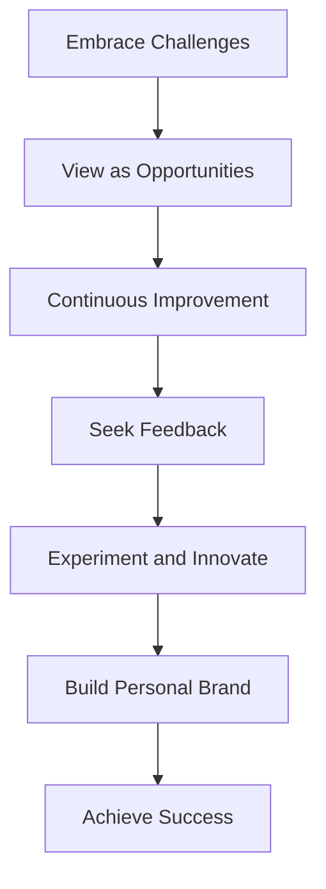

---

linkTitle: "14.4.3 Encouragement for the Road Ahead"
title: "Encouragement for the Road Ahead: Embrace Challenges and Foster Innovation in Flutter Development"
description: "Explore how embracing challenges, continuous improvement, and innovation can lead to success in Flutter development. Learn about building a personal brand, maintaining work-life balance, and celebrating milestones."
categories:
- Flutter Development
- Personal Growth
- Software Engineering
tags:
- Flutter
- Responsive Design
- Adaptive UIs
- Personal Development
- Innovation
date: 2024-10-25
type: docs
nav_weight: 1443000
canonical: "https://fluttermasterylibrary.com/6/14/4/3"
license: "© 2023 Tokenizer Inc. CC BY-NC-SA 4.0"
---

## 14.4.3 Encouragement for the Road Ahead

As you reach the end of this journey through "Flutter in Motion: Building Responsive and Adaptive UIs," it's essential to reflect on the path ahead. The world of software development, particularly in a dynamic field like Flutter, is ever-evolving. This section aims to inspire and equip you with the mindset and tools necessary to continue growing as a developer. Let's explore how embracing challenges, fostering continuous improvement, and maintaining a balanced approach can lead to a fulfilling and successful career.

### Embracing Challenges

In the realm of software development, challenges are inevitable. Whether it's debugging a stubborn piece of code, adapting to new technologies, or designing a complex UI, each challenge presents an opportunity for growth and learning. Embracing these challenges with a positive mindset is crucial.

- **View Challenges as Opportunities:** Every obstacle you encounter is a chance to learn something new. When faced with a problem, ask yourself, "What can I learn from this?" This perspective transforms challenges into valuable learning experiences.

- **Persistence and Resilience:** The key to overcoming development hurdles lies in persistence and resilience. Remember that every expert was once a beginner who refused to give up. Keep pushing forward, and you'll find solutions to even the most daunting problems.

### Continuous Improvement

The tech industry is characterized by rapid change and innovation. To stay relevant, adopting a mindset of continuous improvement is essential.

- **Always Seek to Enhance Skills:** Whether it's learning a new programming language, mastering a design pattern, or understanding a new framework, there's always room for improvement. Set aside time regularly to learn and grow.

- **Optimize Code and Refine Designs:** Strive for efficiency and elegance in your code and designs. Regularly review your work to identify areas for optimization and refinement. This practice not only improves your current projects but also hones your skills for future endeavors.

### Experimentation and Innovation

Innovation is the lifeblood of technology. By experimenting with new ideas and technologies, you can drive innovation in your projects.

- **Motivate Experimentation:** Don't be afraid to try new things. Experiment with different design patterns, explore new libraries, and test unconventional solutions. Innovation often comes from stepping outside your comfort zone.

- **Foster a Culture of Innovation:** Encourage collaboration and idea-sharing within your team or community. Diverse perspectives can lead to creative solutions and breakthroughs.

### Building a Personal Brand

In today's digital age, building a personal brand is more important than ever. It helps establish your credibility and opens doors to new opportunities.

- **Develop a Personal Brand:** Share your knowledge and projects through blogging, contributing to forums, or creating tutorials. This not only showcases your expertise but also helps others in the community.

- **Engage with the Flutter Community:** Participate in community events, contribute to open-source projects, and network with other developers. Building relationships within the community can lead to collaborations and career growth.

### Work-Life Balance

While dedication to your craft is important, maintaining a healthy work-life balance is crucial for long-term productivity and creativity.

- **Prioritize Well-being:** Ensure you allocate time for rest, hobbies, and social activities. A balanced lifestyle prevents burnout and keeps your mind fresh and creative.

- **Set Boundaries:** Establish clear boundaries between work and personal time. This separation helps maintain focus and efficiency during work hours while allowing you to recharge during downtime.

### Celebrating Milestones

Celebrating achievements, no matter how small, is vital for maintaining motivation and a sense of accomplishment.

- **Acknowledge Achievements:** Take time to recognize your progress and celebrate milestones. Whether it's completing a challenging project or mastering a new skill, each achievement is a step forward.

- **Reflect on Your Journey:** Regularly reflect on your journey as a developer. This practice helps you appreciate how far you've come and sets the stage for future goals.

### Quotes and Inspiration

Drawing inspiration from industry leaders and successful developers can provide motivation and guidance on your journey.

- **Motivational Quotes:**
  - "Success is not the key to happiness. Happiness is the key to success. If you love what you are doing, you will be successful." – Albert Schweitzer
  - "The only way to do great work is to love what you do." – Steve Jobs
  - "Don't watch the clock; do what it does. Keep going." – Sam Levenson

### Diagram: Motivation Pathway

To visualize the journey towards growth and success, consider the following Mermaid.js diagram:

This diagram illustrates the pathway from embracing challenges to achieving success, highlighting the importance of continuous improvement, experimentation, and personal branding.

### Conclusion

As you continue your journey in Flutter development, remember that the road ahead is filled with opportunities for growth and innovation. Embrace challenges, strive for continuous improvement, and maintain a balanced approach to your work and life. Celebrate your achievements and draw inspiration from those who have walked the path before you. With persistence, resilience, and a passion for learning, you can achieve great success in your career.

## Quiz Time!



### What is a key mindset to adopt when facing challenges in software development?

- [x] View challenges as opportunities for growth and learning.
- [ ] Avoid challenges to maintain productivity.
- [ ] Delegate challenges to others.
- [ ] Ignore challenges and focus on easier tasks.

> **Explanation:** Viewing challenges as opportunities allows developers to learn and grow, turning obstacles into valuable experiences.

### Why is continuous improvement important in the tech industry?

- [x] To stay relevant and adapt to rapid changes and innovations.
- [ ] To maintain the status quo in projects.
- [ ] To avoid learning new skills.
- [ ] To focus solely on current technologies.

> **Explanation:** Continuous improvement is crucial for adapting to the fast-paced changes in the tech industry and staying competitive.

### How can experimentation lead to innovation in projects?

- [x] By trying new ideas and technologies, developers can discover creative solutions.
- [ ] By sticking to traditional methods and avoiding risks.
- [ ] By following strict guidelines without deviation.
- [ ] By avoiding collaboration with others.

> **Explanation:** Experimentation encourages creativity and can lead to innovative solutions by exploring new possibilities.

### What is a benefit of building a personal brand in the Flutter community?

- [x] Establishing credibility and opening doors to new opportunities.
- [ ] Isolating oneself from the community.
- [ ] Focusing solely on personal projects.
- [ ] Avoiding engagement with other developers.

> **Explanation:** Building a personal brand helps establish credibility and can lead to collaborations and career growth.

### How can maintaining a work-life balance benefit developers?

- [x] It prevents burnout and keeps the mind fresh and creative.
- [ ] It reduces productivity and focus.
- [ ] It encourages working long hours without breaks.
- [ ] It separates personal and professional growth.

> **Explanation:** A healthy work-life balance is essential for long-term productivity, creativity, and well-being.

### Why is celebrating milestones important for developers?

- [x] It maintains motivation and a sense of accomplishment.
- [ ] It distracts from future goals.
- [ ] It encourages complacency.
- [ ] It focuses on past achievements only.

> **Explanation:** Celebrating milestones helps maintain motivation and acknowledges progress, encouraging continued growth.

### Which of the following is a motivational quote by Steve Jobs?

- [x] "The only way to do great work is to love what you do."
- [ ] "Success is not the key to happiness. Happiness is the key to success."
- [ ] "Don't watch the clock; do what it does. Keep going."
- [ ] "Failure is not an option."

> **Explanation:** Steve Jobs emphasized the importance of passion in achieving great work.

### What is the first step in the Motivation Pathway diagram?

- [x] Embrace Challenges
- [ ] Achieve Success
- [ ] Build Personal Brand
- [ ] Experiment and Innovate

> **Explanation:** Embracing challenges is the foundational step in the pathway to growth and success.

### How can developers foster a culture of innovation?

- [x] Encourage collaboration and idea-sharing within teams or communities.
- [ ] Focus solely on individual achievements.
- [ ] Avoid trying new technologies.
- [ ] Stick to established methods without deviation.

> **Explanation:** Collaboration and idea-sharing can lead to creative solutions and foster a culture of innovation.

### True or False: Persistence and resilience are key to overcoming development hurdles.

- [x] True
- [ ] False

> **Explanation:** Persistence and resilience are essential qualities for overcoming challenges and achieving success in development.



