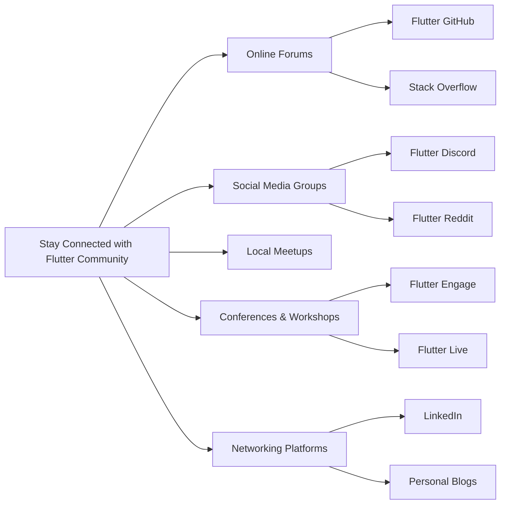

## 14.4.4 Staying Connected

In the ever-evolving world of technology, staying connected with the community is not just beneficial—it's essential. As you continue your journey with Flutter, maintaining strong ties with the community can open doors to new opportunities, foster personal growth, and keep you at the forefront of industry trends. This section explores various strategies to help you stay engaged, network effectively, and contribute meaningfully to the Flutter ecosystem.

### Maintaining Community Connections

Being part of a community provides a support system where you can share experiences, seek advice, and celebrate achievements. Here are some ways to maintain these vital connections:

- **Online Forums:** Platforms like the Flutter GitHub repository and Stack Overflow are invaluable resources for troubleshooting and learning from others. Engaging in discussions, asking questions, and providing answers can enhance your understanding and visibility within the community.
  
- **Social Media Groups:** Join groups on platforms like Discord and Reddit where Flutter enthusiasts gather to share insights, news, and resources. These groups often host live discussions, Q&A sessions, and collaborative problem-solving activities.

- **Local Meetups:** Participating in local Flutter meetups can provide face-to-face interactions with fellow developers. These gatherings are excellent for building relationships, sharing knowledge, and collaborating on projects.

### Networking Opportunities

Networking is a powerful tool for professional growth. It allows you to exchange ideas, collaborate on projects, and learn from others' experiences. Here are some ways to expand your network:

- **Conferences and Workshops:** Attending events like Flutter Engage and Flutter Live can connect you with industry leaders and peers. These events offer workshops, keynote speeches, and networking sessions that can inspire and educate.

- **Networking Platforms:** Utilize platforms like LinkedIn to connect with other professionals in the tech industry. Regularly update your profile to reflect your skills, projects, and achievements.

- **Personal Blogs:** Sharing your experiences and insights through a personal blog can establish you as a thought leader in the Flutter community. Write about your projects, challenges, and solutions to engage with a broader audience.

### Mentorship and Peer Learning

Mentorship is a two-way street that benefits both the mentor and the mentee. Whether you're seeking guidance or offering it, mentorship can accelerate learning and foster a culture of knowledge sharing.

- **Finding a Mentor:** Look for experienced developers who can provide guidance and feedback. A mentor can help you navigate challenges, set goals, and expand your professional network.

- **Becoming a Mentor:** Share your knowledge and experiences with others who are new to Flutter. Mentoring can reinforce your understanding of concepts and improve your communication skills.

- **Peer Learning:** Collaborate with peers to solve problems and build projects. Peer learning encourages diverse perspectives and collective problem-solving.

### Participating in Events

Staying informed about the latest trends and technologies is crucial in the fast-paced tech industry. Participating in events can keep you updated and connected.

- **Conferences and Webinars:** Attend industry conferences and webinars to learn about the latest developments in Flutter and related technologies. These events often feature sessions from experts and opportunities for networking.

- **Workshops:** Participate in hands-on workshops to gain practical experience and deepen your understanding of specific topics. Workshops are a great way to learn new skills and apply them in real-world scenarios.

### Online Presence

Maintaining an active online presence can showcase your skills and attract opportunities. Here are some tips for building your online brand:

- **GitHub:** Regularly contribute to open-source projects on GitHub. This not only improves your coding skills but also demonstrates your commitment to the community.

- **LinkedIn:** Keep your LinkedIn profile updated with your latest projects, skills, and achievements. Engage with posts from others in your network to increase your visibility.

- **Personal Blogs:** Write about your experiences, projects, and insights on a personal blog. This can help you connect with like-minded individuals and establish your expertise.

### Collaborative Projects

Engaging in collaborative projects can enhance your skills and expand your portfolio. Here are some ways to get involved:

- **Hackathons:** Participate in hackathons to work on projects with others under time constraints. Hackathons are a great way to learn new skills, meet new people, and create innovative solutions.

- **Open-Source Contributions:** Contribute to open-source projects to gain experience and give back to the community. Open-source contributions can improve your coding skills and increase your visibility in the tech industry.

- **Collaborative Platforms:** Use platforms like GitHub and GitLab to collaborate on projects with others. These platforms provide tools for version control, issue tracking, and code review.

### Resources for Staying Connected

To help you stay connected with the Flutter community, here are some resources:

- **Flutter GitHub:** [Flutter GitHub Repository](https://github.com/flutter/flutter)
- **Stack Overflow:** [Flutter Tag on Stack Overflow](https://stackoverflow.com/questions/tagged/flutter)
- **Flutter Discord:** [Flutter Community on Discord](https://discord.com/invite/flutter)
- **Flutter Reddit:** [Flutter Subreddit](https://www.reddit.com/r/flutterdev/)
- **Flutter Engage:** [Flutter Engage Event](https://events.flutter.dev/)
- **Flutter Live:** [Flutter Live Event](https://events.flutter.dev/flutter-live)

### Diagram: Staying Connected within the Flutter Community

Below is a Mermaid.js diagram illustrating various ways to stay connected within the Flutter community:

This diagram maps out the various avenues available for staying connected with the Flutter community, highlighting the importance of diverse engagement methods.

### Conclusion

Staying connected with the Flutter community is a continuous journey that offers numerous benefits. By engaging with others, participating in events, and maintaining an active online presence, you can enhance your skills, expand your network, and contribute meaningfully to the tech industry. Embrace these opportunities to grow both personally and professionally, and remember that the community is here to support you every step of the way.

## Quiz Time!



### Which platform is recommended for contributing to open-source projects?

- [x] GitHub
- [ ] LinkedIn
- [ ] Twitter
- [ ] Facebook

> **Explanation:** GitHub is a popular platform for hosting and contributing to open-source projects, providing tools for version control and collaboration.

### What is a benefit of attending local meetups?

- [x] Building relationships with fellow developers
- [ ] Learning about non-technical topics
- [ ] Avoiding networking opportunities
- [ ] Reducing your online presence

> **Explanation:** Local meetups provide face-to-face interactions that help build relationships and foster collaboration among developers.

### How can you establish yourself as a thought leader in the Flutter community?

- [x] Writing a personal blog
- [ ] Avoiding social media
- [ ] Only attending conferences
- [ ] Not sharing your work

> **Explanation:** Writing a personal blog allows you to share insights and experiences, establishing your expertise and engaging with a broader audience.

### What is a key benefit of mentorship?

- [x] Accelerating learning and growth
- [ ] Limiting knowledge sharing
- [ ] Focusing solely on individual work
- [ ] Avoiding community engagement

> **Explanation:** Mentorship accelerates learning by providing guidance, feedback, and support, fostering a culture of knowledge sharing.

### Which event is mentioned as a networking opportunity?

- [x] Flutter Engage
- [ ] Stack Overflow
- [ ] Reddit
- [ ] Discord

> **Explanation:** Flutter Engage is an event that provides networking opportunities, workshops, and sessions from industry leaders.

### What is a benefit of participating in hackathons?

- [x] Learning new skills and meeting new people
- [ ] Working alone without collaboration
- [ ] Avoiding time constraints
- [ ] Reducing your portfolio

> **Explanation:** Hackathons encourage collaboration, innovation, and skill development under time constraints, enhancing your portfolio.

### What should you do to maintain an active online presence?

- [x] Regularly update your LinkedIn profile
- [ ] Avoid using social media
- [ ] Only focus on offline activities
- [ ] Limit your online interactions

> **Explanation:** Regularly updating your LinkedIn profile and engaging with others online helps maintain an active presence and attract opportunities.

### How can you contribute to the Flutter community?

- [x] Participating in open-source projects
- [ ] Avoiding community events
- [ ] Not sharing your knowledge
- [ ] Focusing solely on personal projects

> **Explanation:** Contributing to open-source projects allows you to give back to the community, improve your skills, and increase your visibility.

### Which platform is suggested for professional networking?

- [x] LinkedIn
- [ ] Instagram
- [ ] Snapchat
- [ ] TikTok

> **Explanation:** LinkedIn is a professional networking platform where you can connect with other industry professionals and showcase your skills.

### True or False: Mentorship is only beneficial for the mentee.

- [ ] True
- [x] False

> **Explanation:** Mentorship benefits both the mentor and the mentee by fostering knowledge sharing, reinforcing understanding, and enhancing communication skills.


